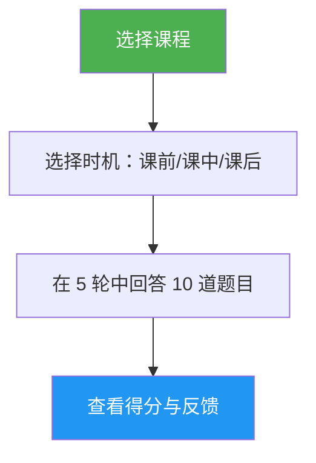

# 课程测验

> 互动式测验，通过 10 道题目、逐题反馈和针对性复习建议，检验你对特定 Claude Code 课程内容的掌握程度。

## 亮点

- 每节课 10 道题目，混合概念理解与实操应用
- 覆盖全部 10 课（01-斜杠命令 至 10-命令行界面）
- 三种时机模式：预测试、进度检查或掌握程度验证
- 逐题反馈，含正确答案和详细解释
- 针对性复习建议，精确指向具体课程章节
- 共 100 道题目，分布在各课中，见 `references/question-bank.zh-CN.md`

## 何时使用

| 这样说... | 技能将... |
|---|---|
| "测试一下我对 hooks 的了解" | 对第 06 课：钩子 运行 10 题测验 |
| "lesson quiz 03" | 检验你对第 03 课：技能（Skills）的知识 |
| "我懂不懂 MCP" | 评估你对第 05 课：MCP 的理解程度 |
| "练习测验" | 让你选择课程，然后开始测验 |

## 工作原理



## 使用方法

```
/lesson-quiz [课程名称或编号]
```

示例：
```
/lesson-quiz hooks
/lesson-quiz 03
/lesson-quiz advanced-features
/lesson-quiz           # （显示课程选择菜单）
```

## 输出

### 成绩报告
- 满分 10 分，附带等级（掌握 / 熟练 / 发展中 / 初级）
- 按题目类别（概念型 vs. 实操型）的分数细分

### 逐题反馈
对于每道错题：
- 你的回答与正确答案的对比
- 解释正确答案为何正确
- 指出应复习的具体课程章节

### 时机感知引导
- **预测试**：建立基线，突出学习过程中应重点关注的领域
- **课中**：识别已掌握和需回顾的内容
- **课后**：确认掌握程度或指出残留盲点

## 资源

| 路径 | 描述 |
|---|---|
| `references/question-bank.zh-CN.md` | 100 道预写题目（每课 10 道），含答案、解释和复习指引 |
