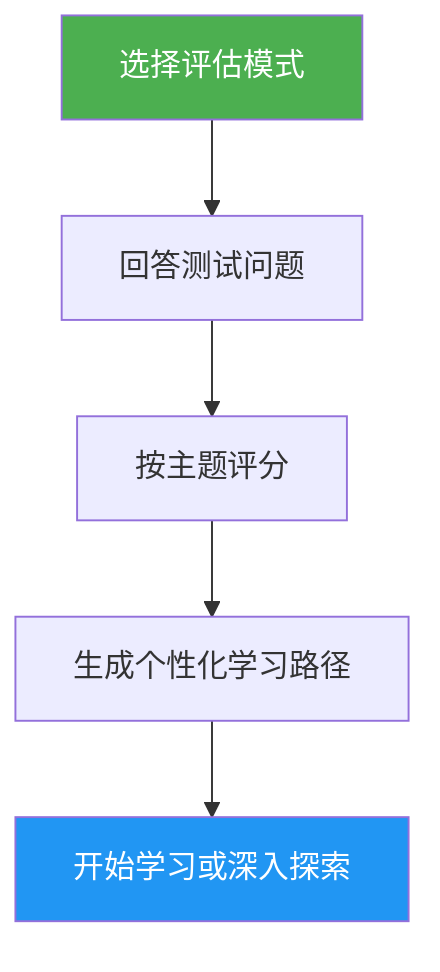

# 自我评估与学习路径顾问

> 全面的 Claude Code 熟练度评估，涵盖 10 个功能领域，识别技能差距，并生成个性化的学习路径以提升水平。

## 亮点

- 两种评估模式：快速（8 题，约 2 分钟）和深度（5 轮，约 5 分钟）
- 评估 10 个功能领域：斜杠命令、记忆、技能、钩子、MCP、子智能体、检查点、高级功能、插件、CLI
- 每个主题评分及掌握级别（无 / 基础 / 熟练）
- 依赖感知的差距分析与优先级排序
- 个性化学习路径，包含具体练习和成功标准
- 后续行动：开始学习、深入探索、实践项目或重新评估

## 何时使用

| 这样说... | 技能将... |
|---|---|
| "评估我的水平" | 运行评估测试并确定你的水平 |
| "我应该从哪里开始" | 评估你的经验并建议起点 |
| "检查我的技能" | 生成跨 10 个领域的详细技能档案 |
| "我接下来应该学什么" | 识别差距并构建优先级学习路径 |

## 工作原理



## 评估模式

### 快速评估（约 2 分钟）
- 2 轮共 8 个是/否体验问题
- 确定总体水平：初学者 / 中级 / 高级
- 列出具体差距及教程链接
- 适合：首次使用者、快速检查

### 深度评估（约 5 分钟）
- 5 轮问题，涵盖 10 个功能领域（每轮 2 个主题）
- 每个主题评分（0-2 分，满分 20 分）
- 掌握度表格：优势领域、优先级差距、需复习项
- 依赖感知的学习路径，包含阶段和时间估算
- 推荐的综合差距主题的实践项目
- 适合：希望提升水平的经验用户、定期技能回顾

## 使用方法

```
/self-assessment
```

## 输出

### 技能档案表
显示每个主题的分数、掌握级别和状态（学习 / 复习 / 已掌握）。

### 个性化学习路径
- 按依赖关系排序组织为多个阶段
- 每个主题包括：教程链接、重点关注、核心练习、成功标准
- 根据已掌握的主题调整时间估算
- 结合多个差距领域的实践项目

### 后续行动
结果呈现后，可选择：
- 开始第一个差距主题的引导练习
- 深入探索特定差距领域
- 设置覆盖差距领域的实践项目
- 以不同评估模式重新评估
