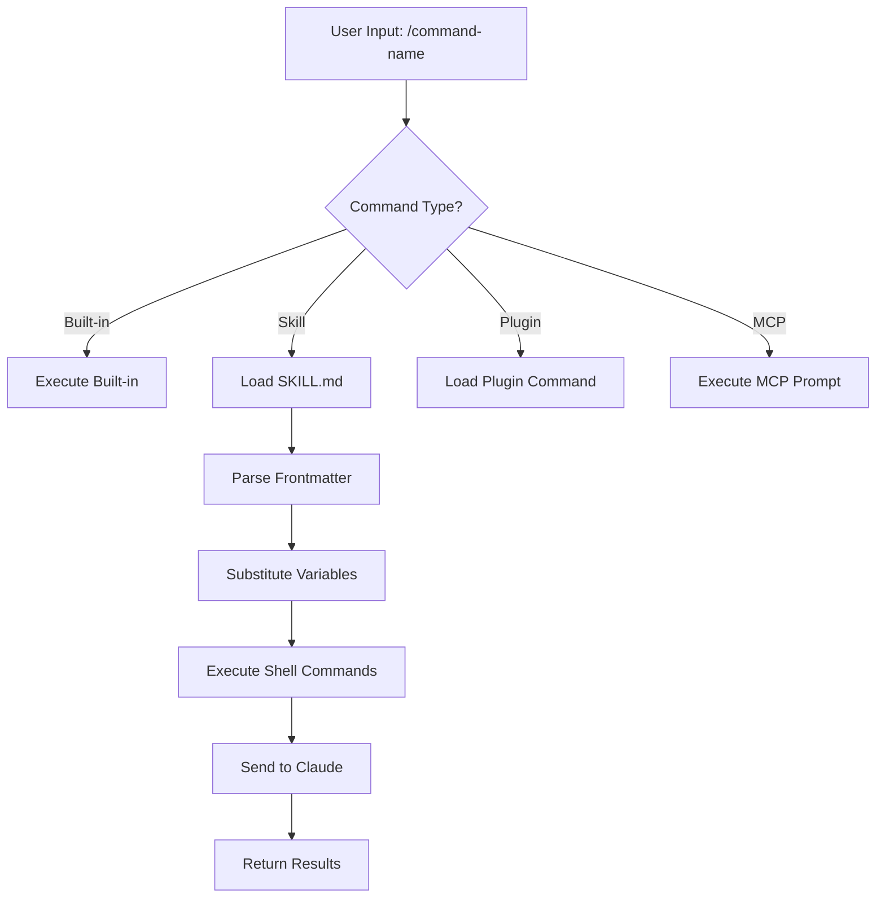
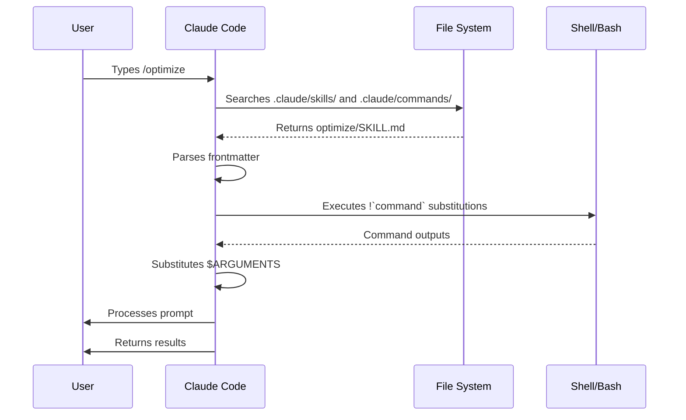

<picture>
  <source media="(prefers-color-scheme: dark)" srcset="../resources/logos/claude-howto-logo-dark.svg">
  
</picture>

# Slash Commands

## Overview

Slash commands are shortcuts that control Claude's behavior during an interactive session. They come in several types:

- **Built-in commands**: Provided by Claude Code (`/help`, `/clear`, `/model`)
- **Skills**: User-defined commands created as `SKILL.md` files (`/optimize`, `/pr`)
- **Plugin commands**: Commands from installed plugins (`/frontend-design:frontend-design`)
- **MCP prompts**: Commands from MCP servers (`/mcp__github__list_prs`)

> **Note**: Custom slash commands have been merged into skills. Files in `.claude/commands/` still work, but skills (`.claude/skills/`) are now the recommended approach. Both create `/command-name` shortcuts. See the [Skills Guide](../03-skills/) for the full reference.

## Built-in Commands Reference

Built-in commands are shortcuts for common actions. There are **60+ built-in commands** and **5 bundled skills** available. Type `/` in Claude Code to see the full list, or type `/` followed by any letters to filter.

| Command | Purpose |
|---------|---------|
| `/add-dir <path>` | Add working directory |
| `/agents` | Manage agent configurations |
| `/branch [name]` | Branch conversation into a new session (alias: `/fork`). Note: `/fork` renamed to `/branch` in v2.1.77 |
| `/btw <question>` | Ask an ephemeral side question while Claude is working on the main task; doesn't pollute the main conversation context |
| `/chrome` | Configure Chrome browser integration |
| `/clear` | Clear conversation (aliases: `/reset`, `/new`) |
| `/color [color\|default]` | Set prompt bar color. Bare `/color` (no args) picks a random session color (v2.1.128+); pass a color name or hex to set explicitly. |
| `/compact [instructions]` | Compact conversation with optional focus instructions |
| `/config` | Open Settings (alias: `/settings`) |
| `/context` | Visualize context usage as colored grid |
| `/copy [N]` | Copy assistant response to clipboard; `w` writes to file |
| `/cost` | Typing-shortcut alias for `/usage` — opens the cost tab (v2.1.118+) |
| `/desktop` | Continue in Desktop app (alias: `/app`) |
| `/diff` | Interactive diff viewer for uncommitted changes |
| `/doctor` | Diagnose installation health — openable while Claude is responding; shows status icons; press `f` to auto-fix issues (enhanced in v2.1.116) |
| `/effort [low\|medium\|high\|xhigh\|max\|auto]` | Set effort level via interactive arrow-key slider. Levels: `low` → `medium` → `high` → `xhigh` (new in v2.1.111) → `max`. Default is `xhigh` on Opus 4.7; `max` requires Opus 4.7 |
| `/exit` | Exit the REPL (alias: `/quit`) |
| `/export [filename]` | Export the current conversation to a file or clipboard |
| `/extra-usage` | Configure extra usage for rate limits |
| `/fast [on\|off]` | Toggle fast mode |
| `/feedback` | Submit feedback (alias: `/bug`) |
| `/focus` | Toggle focus view (added v2.1.110; replaces `Ctrl+O` for focus toggle) |
| `/help` | Show help |
| `/hooks` | View hook configurations |
| `/ide` | Manage IDE integrations |
| `/init` | Initialize `CLAUDE.md`. Set `CLAUDE_CODE_NEW_INIT=1` for interactive flow |
| `/insights` | Generate session analysis report |
| `/install-github-app` | Set up GitHub Actions app |
| `/install-slack-app` | Install Slack app |
| `/keybindings` | Open keybindings configuration |
| `/less-permission-prompts` | Analyze recent Bash/MCP tool calls and add a prioritized allowlist to `.claude/settings.json` to reduce permission prompts (added v2.1.111) |
| `/login` | Switch Anthropic accounts |
| `/logout` | Sign out from your Anthropic account |
| `/mcp` | Manage MCP servers and OAuth |
| `/memory` | Edit `CLAUDE.md`, toggle auto-memory |
| `/mobile` | QR code for mobile app (aliases: `/ios`, `/android`) |
| `/model [model]` | Select model with left/right arrows for effort |
| `/passes` | Share free week of Claude Code |
| `/permissions` | View/update permissions (alias: `/allowed-tools`) |
| `/plan [description]` | Enter plan mode |
| `/plugin` | Manage plugins |
| `/proactive` | Alias for `/loop` (added v2.1.105) |
| `/powerup` | Discover features through interactive lessons with animated demos |
| `/privacy-settings` | Privacy settings (Pro/Max only) |
| `/release-notes` | View changelog |
| `/recap` | Show session recap / summary when returning to a session (added v2.1.108) |
| `/reload-plugins` | Reload active plugins |
| `/remote-control` | Remote control from claude.ai (alias: `/rc`) |
| `/remote-env` | Configure default remote environment |
| `/rename [name]` | Rename session |
| `/resume [session]` | Resume conversation (alias: `/continue`) |
| `/review` | **Deprecated** — install the `code-review` plugin instead |
| `/rewind` | Rewind conversation and/or code (alias: `/checkpoint`) |
| `/sandbox` | Toggle sandbox mode |
| `/schedule [description]` | Create/manage Cloud scheduled tasks |
| `/security-review` | Analyze branch for security vulnerabilities |
| `/skills` | List available skills |
| `/stats` | Typing-shortcut alias for `/usage` — opens the stats tab (daily usage, sessions, streaks) (v2.1.118+) |
| `/stickers` | Order Claude Code stickers |
| `/status` | Show version, model, account |
| `/statusline` | Configure status line |
| `/tasks` | List/manage background tasks |
| `/team-onboarding` | Generate a teammate ramp-up guide from the project's Claude Code setup (new in v2.1.101) |
| `/terminal-setup` | Configure terminal keybindings |
| `/theme` | Open theme picker / manage custom themes (v2.1.118). Define custom themes via JSON in `~/.claude/themes/<name>.json` |
| `/tui` | Toggle fullscreen TUI (text user interface) mode with flicker-free rendering (added v2.1.110) |
| `/ultraplan <prompt>` | Draft plan in ultraplan session, review in browser |
| `/ultrareview` | Comprehensive cloud-based code review with multi-agent analysis (added v2.1.111) |
| `/undo` | Alias for `/rewind` (added v2.1.108) |
| `/upgrade` | Open upgrade page for higher plan tier |
| `/usage` | Canonical usage dashboard (v2.1.118) — combines plan usage limits, rate limits, cost, and daily session stats. `/cost` and `/stats` are typing-shortcut aliases that open specific tabs |
| `/voice` | Toggle push-to-talk voice dictation |

### Bundled Skills

These skills ship with Claude Code and are invoked like slash commands:

| Skill | Purpose |
|-------|---------|
| `/batch <instruction>` | Orchestrate large-scale parallel changes using worktrees |
| `/claude-api` | Load Claude API reference for project language |
| `/debug [description]` | Enable debug logging |
| `/loop [interval] <prompt>` | Run prompt repeatedly on interval |
| `/simplify [focus]` | Review changed files for code quality |

### Deprecated Commands

| Command | Status |
|---------|--------|
| `/review` | Deprecated — replaced by `code-review` plugin |
| `/output-style` | Deprecated since v2.1.73 |
| `/fork` | Renamed to `/branch` (alias still works, v2.1.77) |
| `/pr-comments` | Removed in v2.1.91 — ask Claude directly to view PR comments |
| `/vim` | Removed in v2.1.92 — use /config → Editor mode |

### Recent Changes

- `/fork` renamed to `/branch` with `/fork` kept as alias (v2.1.77)
- `/output-style` deprecated (v2.1.73)
- `/review` deprecated in favor of the `code-review` plugin
- `/effort` command added with `max` level requiring Opus 4.7 (originally Opus 4.6-only)
- `/voice` command added for push-to-talk voice dictation
- `/schedule` command added for creating/managing scheduled tasks
- `/color` command added for prompt bar customization
- /pr-comments removed in v2.1.91 — ask Claude directly to view PR comments
- /vim removed in v2.1.92 — use /config → Editor mode instead
- /ultraplan added for browser-based plan review and execution
- /powerup added for interactive feature lessons
- /sandbox added for toggling sandbox mode
- `/model` picker now shows human-readable labels (e.g., "Sonnet 4.6") instead of raw model IDs
- `/resume` supports `/continue` alias
- MCP prompts are available as `/mcp__<server>__<prompt>` commands (see [MCP Prompts as Commands](#mcp-prompts-as-commands))
- `/team-onboarding` added for auto-generating teammate ramp-up guides (v2.1.101)
- `/tui` command added for flicker-free fullscreen TUI rendering (v2.1.110)
- `/focus` command added for focus view toggle; `Ctrl+O` now only toggles verbose transcript (v2.1.110)
- `/recap` command added to manually trigger session context recap (v2.1.108)
- `/undo` added as alias for `/rewind` (v2.1.108)
- `/proactive` added as alias for `/loop` (v2.1.105)
- `/effort` gained interactive arrow-key slider and new `xhigh` level between `high` and `max`; default effort raised to `xhigh` for Opus 4.7 plans (v2.1.111)
- `/ultrareview` added for comprehensive cloud-based multi-agent code review (v2.1.111)
- `/less-permission-prompts` added to analyze Bash/MCP tool calls and reduce permission prompts via an allowlist in `.claude/settings.json` (v2.1.111)
- Auto mode no longer requires the `--enable-auto-mode` flag for Max subscribers on Opus 4.7 (v2.1.112)

### `/team-onboarding` — Teammate Ramp-Up Guide

> **New in v2.1.101**

Use `/team-onboarding` to generate a teammate ramp-up guide from your project's local Claude Code usage. The command inspects your `CLAUDE.md`, installed skills, subagents, hooks, and recent workflows, then produces an onboarding document that helps new developers become productive quickly.

It's a built-in command — nothing to install.

**Usage:**

```bash
claude /team-onboarding
```

The generated guide summarizes:

- Project purpose and key conventions from [`CLAUDE.md`](../02-memory/README.md)
- Available [skills](../03-skills/README.md) and when they are auto-invoked
- Configured [subagents](../04-subagents/README.md) and their responsibilities
- [Hooks](../06-hooks/README.md) that run on common events
- Common workflows newcomers should know about

**Availability:** Shipped in Claude Code v2.1.101 (April 11, 2026).

## Custom Commands (Now Skills)

Custom slash commands have been **merged into skills**. Both approaches create commands you can invoke with `/command-name`:

| Approach | Location | Status |
|----------|----------|--------|
| **Skills (Recommended)** | `.claude/skills/<name>/SKILL.md` | Current standard |
| **Legacy Commands** | `.claude/commands/<name>.md` | Still works |

If a skill and a command share the same name, the **skill takes precedence**. For example, when both `.claude/commands/review.md` and `.claude/skills/review/SKILL.md` exist, the skill version is used.

### Migration Path

Your existing `.claude/commands/` files continue to work without changes. To migrate to skills:

**Before (Command):**
```
.claude/commands/optimize.md
```

**After (Skill):**
```
.claude/skills/optimize/SKILL.md
```

### Why Skills?

Skills offer additional features over legacy commands:

- **Directory structure**: Bundle scripts, templates, and reference files
- **Auto-invocation**: Claude can trigger skills automatically when relevant
- **Invocation control**: Choose whether users, Claude, or both can invoke
- **Subagent execution**: Run skills in isolated contexts with `context: fork`
- **Progressive disclosure**: Load additional files only when needed

### Creating a Custom Command as a Skill

Create a directory with a `SKILL.md` file:

```bash
mkdir -p .claude/skills/my-command
```

**File:** `.claude/skills/my-command/SKILL.md`

```yaml
---
name: my-command
description: What this command does and when to use it
---

# My Command

Instructions for Claude to follow when this command is invoked.

1. First step
2. Second step
3. Third step
```

### Frontmatter Reference

| Field | Purpose | Default |
|-------|---------|---------|
| `name` | Command name (becomes `/name`) | Directory name |
| `description` | Brief description (helps Claude know when to use it) | First paragraph |
| `argument-hint` | Expected arguments for auto-completion | None |
| `allowed-tools` | Tools the command can use without permission | Inherits |
| `model` | Specific model to use | Inherits |
| `disable-model-invocation` | If `true`, only user can invoke (not Claude) | `false` |
| `user-invocable` | If `false`, hide from `/` menu | `true` |
| `context` | Set to `fork` to run in isolated subagent | None |
| `agent` | Agent type when using `context: fork` | `general-purpose` |
| `hooks` | Skill-scoped hooks (PreToolUse, PostToolUse, Stop) | None |

### Arguments

Commands can receive arguments:

**All arguments with `$ARGUMENTS`:**

```yaml
---
name: fix-issue
description: Fix a GitHub issue by number
---

Fix issue #$ARGUMENTS following our coding standards
```

Usage: `/fix-issue 123` → `$ARGUMENTS` becomes "123"

**Individual arguments with `$0`, `$1`, etc.:**

```yaml
---
name: review-pr
description: Review a PR with priority
---

Review PR #$0 with priority $1
```

Usage: `/review-pr 456 high` → `$0`="456", `$1`="high"

### Dynamic Context with Shell Commands

Execute bash commands before the prompt using `` !`command` ``:

```yaml
---
name: commit
description: Create a git commit with context
allowed-tools: Bash(git *)
---

## Context

- Current git status: !`git status`
- Current git diff: !`git diff HEAD`
- Current branch: !`git branch --show-current`
- Recent commits: !`git log --oneline -5`

## Your task

Based on the above changes, create a single git commit.
```

### File References

Include file contents using `@`:

```markdown
Review the implementation in @src/utils/helpers.js
Compare @src/old-version.js with @src/new-version.js
```

## Plugin Commands

Plugins can provide custom commands:

```
/plugin-name:command-name
```

Or simply `/command-name` when there are no naming conflicts.

**Examples:**
```bash
/frontend-design:frontend-design
/commit-commands:commit
```

## MCP Prompts as Commands

MCP servers can expose prompts as slash commands:

```
/mcp__<server-name>__<prompt-name> [arguments]
```

**Examples:**
```bash
/mcp__github__list_prs
/mcp__github__pr_review 456
/mcp__jira__create_issue "Bug title" high
```

### MCP Permission Syntax

Control MCP server access in permissions:

- `mcp__github` - Access entire GitHub MCP server
- `mcp__github__*` - Wildcard access to all tools
- `mcp__github__get_issue` - Specific tool access

## Command Architecture



## Command Lifecycle



## Available Commands in This Folder

These example commands can be installed as skills or legacy commands.

### 1. `/optimize` - Code Optimization

Analyzes code for performance issues, memory leaks, and optimization opportunities.

**Usage:**
```
/optimize
[Paste your code]
```

### 2. `/pr` - Pull Request Preparation

Guides through PR preparation checklist including linting, testing, and commit formatting.

**Usage:**
```
/pr
```

**Screenshot:**


### 3. `/generate-api-docs` - API Documentation Generator

Generates comprehensive API documentation from source code.

**Usage:**
```
/generate-api-docs
```

### 4. `/commit` - Git Commit with Context

Creates a git commit with dynamic context from your repository.

**Usage:**
```
/commit [optional message]
```

### 5. `/push-all` - Stage, Commit, and Push

Stages all changes, creates a commit, and pushes to remote with safety checks.

**Usage:**
```
/push-all
```

**Safety Checks:**
- Secrets: `.env*`, `*.key`, `*.pem`, `credentials.json`
- API Keys: Detects real keys vs. placeholders
- Large files: `>10MB` without Git LFS
- Build artifacts: `node_modules/`, `dist/`, `__pycache__/`

### 6. `/doc-refactor` - Documentation Restructuring

Restructures project documentation for clarity and accessibility.

**Usage:**
```
/doc-refactor
```

### 7. `/setup-ci-cd` - CI/CD Pipeline Setup

Implements pre-commit hooks and GitHub Actions for quality assurance.

**Usage:**
```
/setup-ci-cd
```

### 8. `/unit-test-expand` - Test Coverage Expansion

Increases test coverage by targeting untested branches and edge cases.

**Usage:**
```
/unit-test-expand
```

## Installation

### As Skills (Recommended)

Copy to your skills directory:

```bash
# Create skills directory
mkdir -p .claude/skills

# For each command file, create a skill directory
for cmd in optimize pr commit; do
  mkdir -p .claude/skills/$cmd
  cp 01-slash-commands/$cmd.md .claude/skills/$cmd/SKILL.md
done
```

### As Legacy Commands

Copy to your commands directory:

```bash
# Project-wide (team)
mkdir -p .claude/commands
cp 01-slash-commands/*.md .claude/commands/

# Personal use
mkdir -p ~/.claude/commands
cp 01-slash-commands/*.md ~/.claude/commands/
```

## Creating Your Own Commands

### Skill Template (Recommended)

Create `.claude/skills/my-command/SKILL.md`:

```yaml
---
name: my-command
description: What this command does. Use when [trigger conditions].
argument-hint: [optional-args]
allowed-tools: Bash(npm *), Read, Grep
---

# Command Title

## Context

- Current branch: !`git branch --show-current`
- Related files: @package.json

## Instructions

1. First step
2. Second step with argument: $ARGUMENTS
3. Third step

## Output Format

- How to format the response
- What to include
```

### User-Only Command (No Auto-Invocation)

For commands with side effects that Claude shouldn't trigger automatically:

```yaml
---
name: deploy
description: Deploy to production
disable-model-invocation: true
allowed-tools: Bash(npm *), Bash(git *)
---

Deploy the application to production:

1. Run tests
2. Build application
3. Push to deployment target
4. Verify deployment
```

## Best Practices

| Do | Don't |
|------|---------|
| Use clear, action-oriented names | Create commands for one-time tasks |
| Include `description` with trigger conditions | Build complex logic in commands |
| Keep commands focused on single task | Hardcode sensitive information |
| Use `disable-model-invocation` for side effects | Skip the description field |
| Use `!` prefix for dynamic context | Assume Claude knows current state |
| Organize related files in skill directories | Put everything in one file |

## Troubleshooting

### Command Not Found

**Solutions:**
- Check file is in `.claude/skills/<name>/SKILL.md` or `.claude/commands/<name>.md`
- Verify the `name` field in frontmatter matches expected command name
- Restart Claude Code session
- Run `/help` to see available commands

### Command Not Executing as Expected

**Solutions:**
- Add more specific instructions
- Include examples in the skill file
- Check `allowed-tools` if using bash commands
- Test with simple inputs first

### Skill vs Command Conflict

If both exist with the same name, the **skill takes precedence**. Remove one or rename it.

## Related Guides

- **[Skills](../03-skills/)** - Full reference for skills (auto-invoked capabilities)
- **[Memory](../02-memory/)** - Persistent context with CLAUDE.md
- **[Subagents](../04-subagents/)** - Delegated AI agents
- **[Plugins](../07-plugins/)** - Bundled command collections
- **[Hooks](../06-hooks/)** - Event-driven automation

## Additional Resources

- [Official Interactive Mode Documentation](https://code.claude.com/docs/en/interactive-mode) - Built-in commands reference
- [Official Skills Documentation](https://code.claude.com/docs/en/skills) - Complete skills reference
- [CLI Reference](https://code.claude.com/docs/en/cli-reference) - Command-line options

---

**Last Updated**: May 9, 2026
**Claude Code Version**: 2.1.138
**Sources**:
- https://code.claude.com/docs/en/slash-commands
- https://code.claude.com/docs/en/interactive-mode
- https://code.claude.com/docs/en/changelog
- https://github.com/anthropics/claude-code/releases/tag/v2.1.118
- https://github.com/anthropics/claude-code/releases/tag/v2.1.116
**Compatible Models**: Claude Sonnet 4.6, Claude Opus 4.7, Claude Haiku 4.5

*Part of the [Claude How To](../) guide series*
