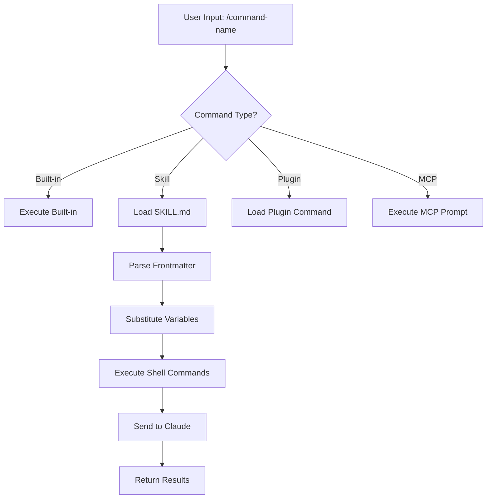
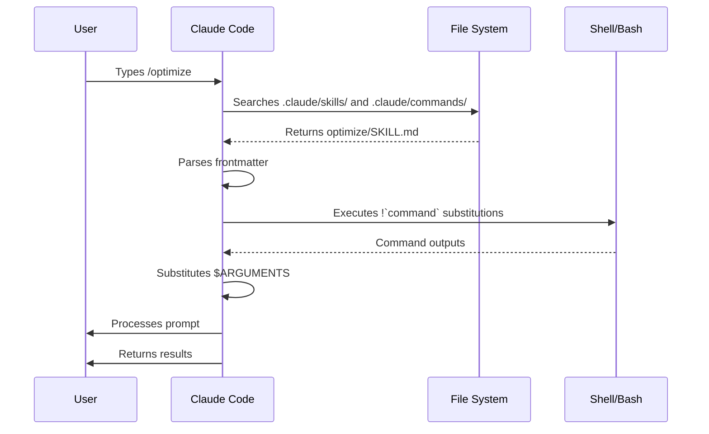

<picture>
  <source media="(prefers-color-scheme: dark)" srcset="../resources/logos/claude-howto-logo-dark.svg">
  
</picture>

# Slash Commands

## Overview

Slash commands are shortcuts that control Claude's behavior during an interactive session. They come in several types:

- **Built-in commands**: Provided by Claude Code (`/help`, `/clear`, `/model`)
- **Skills**: User-defined commands created as `SKILL.md` files (`/optimize`, `/pr`)
- **Plugin commands**: Commands from installed plugins (`/frontend-design:frontend-design`)
- **MCP prompts**: Commands from MCP servers (`/mcp__github__list_prs`)

> **Note**: Custom slash commands have been merged into skills. Files in `.claude/commands/` still work, but skills (`.claude/skills/`) are now the recommended approach. Both create `/command-name` shortcuts. See the [Skills Guide](../03-skills/) for the full reference.

## Built-in Commands Reference

Built-in commands are shortcuts for common actions. Type `/` in Claude Code to see the full list, or type `/` followed by any letters to filter.

| Command | Purpose |
|---------|---------|
| `/add-dir` | Add additional working directories |
| `/agents` | Manage custom AI subagents for specialized tasks |
| `/clear` | Clear conversation history |
| `/compact [instructions]` | Compact conversation with optional focus instructions |
| `/config` | Open the Settings interface (Config tab) |
| `/context` | Visualize current context usage as a colored grid |
| `/copy` | Copy the last assistant response to clipboard |
| `/cost` | Show token usage statistics |
| `/desktop` | Hand off CLI session to Desktop app (macOS/Windows) |
| `/doctor` | Checks the health of your Claude Code installation |
| `/exit` | Exit the REPL |
| `/export [filename]` | Export the current conversation to a file or clipboard |
| `/fast` | Toggle fast mode (same model, faster output) |
| `/fork` | Fork the current session into a new conversation |
| `/help` | Get usage help |
| `/hooks` | Manage hook configurations for tool events |
| `/ide` | Manage IDE integrations and show status |
| `/init` | Initialize project with `CLAUDE.md` guide |
| `/install-github-app` | Set up Claude GitHub Actions for a repository |
| `/login` | Switch Anthropic accounts |
| `/logout` | Sign out from your Anthropic account |
| `/mcp` | Manage MCP server connections and OAuth authentication |
| `/memory` | Edit `CLAUDE.md` memory files |
| `/model` | Select or change the AI model |
| `/permissions` | View or update permissions |
| `/plan` | Enter plan mode directly from the prompt |
| `/plugin` | Manage Claude Code plugins |
| `/pr-comments` | View pull request comments |
| `/privacy-settings` | View and update your privacy settings |
| `/release-notes` | View release notes |
| `/remote-env` | Configure remote session environment (claude.ai subscribers) |
| `/rename <name>` | Rename the current session |
| `/resume [session]` | Resume a conversation by ID or name |
| `/review` | **Deprecated** — install the [`code-review` plugin](https://github.com/anthropics/claude-code-marketplace/blob/main/code-review/README.md) instead: `claude plugin install code-review@claude-code-marketplace` |
| `/rewind` | Rewind the conversation and/or code |
| `/sandbox` | Enable sandboxed bash tool with filesystem and network isolation |
| `/security-review` | Complete a security review of pending changes |
| `/stats` | Visualize daily usage, session history, streaks, and model preferences |
| `/status` | Open the Settings interface (Status tab) |
| `/statusline` | Set up Claude Code's status line UI |
| `/tasks` | List and manage background tasks |
| `/teleport` | Resume remote session from claude.ai by session ID |
| `/terminal-setup` | Install Shift+Enter key binding for newlines |
| `/theme` | Change the color theme |
| `/usage` | Show plan usage limits and rate limit status |
| `/vim` | Enter vim mode for alternating insert and command modes |

### Recent Changes

- `/model` picker now shows human-readable labels (e.g., "Sonnet 4.6") instead of raw model IDs
- `/rename` auto-generates a session name from conversation context when called without arguments
- `/rename` now updates the terminal tab title by default
- `/resume` picker increased initial session count from 10 to 50
- MCP prompts are available as `/mcp__<server>__<prompt>` commands (see [MCP Prompts as Commands](#mcp-prompts-as-commands))

## Custom Commands (Now Skills)

Custom slash commands have been **merged into skills**. Both approaches create commands you can invoke with `/command-name`:

| Approach | Location | Status |
|----------|----------|--------|
| **Skills (Recommended)** | `.claude/skills/<name>/SKILL.md` | Current standard |
| **Legacy Commands** | `.claude/commands/<name>.md` | Still works |

If a skill and a command share the same name, the **skill takes precedence**. For example, when both `.claude/commands/review.md` and `.claude/skills/review/SKILL.md` exist, the skill version is used.

### Migration Path

Your existing `.claude/commands/` files continue to work without changes. To migrate to skills:

**Before (Command):**
```
.claude/commands/optimize.md
```

**After (Skill):**
```
.claude/skills/optimize/SKILL.md
```

### Why Skills?

Skills offer additional features over legacy commands:

- **Directory structure**: Bundle scripts, templates, and reference files
- **Auto-invocation**: Claude can trigger skills automatically when relevant
- **Invocation control**: Choose whether users, Claude, or both can invoke
- **Subagent execution**: Run skills in isolated contexts with `context: fork`
- **Progressive disclosure**: Load additional files only when needed

### Creating a Custom Command as a Skill

Create a directory with a `SKILL.md` file:

```bash
mkdir -p .claude/skills/my-command
```

**File:** `.claude/skills/my-command/SKILL.md`

```yaml
---
name: my-command
description: What this command does and when to use it
---

# My Command

Instructions for Claude to follow when this command is invoked.

1. First step
2. Second step
3. Third step
```

### Frontmatter Reference

| Field | Purpose | Default |
|-------|---------|---------|
| `name` | Command name (becomes `/name`) | Directory name |
| `description` | Brief description (helps Claude know when to use it) | First paragraph |
| `argument-hint` | Expected arguments for auto-completion | None |
| `allowed-tools` | Tools the command can use without permission | Inherits |
| `model` | Specific model to use | Inherits |
| `disable-model-invocation` | If `true`, only user can invoke (not Claude) | `false` |
| `user-invocable` | If `false`, hide from `/` menu | `true` |
| `context` | Set to `fork` to run in isolated subagent | None |
| `agent` | Agent type when using `context: fork` | `general-purpose` |
| `hooks` | Skill-scoped hooks (PreToolUse, PostToolUse, Stop) | None |

### Arguments

Commands can receive arguments:

**All arguments with `$ARGUMENTS`:**

```yaml
---
name: fix-issue
description: Fix a GitHub issue by number
---

Fix issue #$ARGUMENTS following our coding standards
```

Usage: `/fix-issue 123` → `$ARGUMENTS` becomes "123"

**Individual arguments with `$0`, `$1`, etc.:**

```yaml
---
name: review-pr
description: Review a PR with priority
---

Review PR #$0 with priority $1
```

Usage: `/review-pr 456 high` → `$0`="456", `$1`="high"

### Dynamic Context with Shell Commands

Execute bash commands before the prompt using `!`command``:

```yaml
---
name: commit
description: Create a git commit with context
allowed-tools: Bash(git *)
---

## Context

- Current git status: !`git status`
- Current git diff: !`git diff HEAD`
- Current branch: !`git branch --show-current`
- Recent commits: !`git log --oneline -5`

## Your task

Based on the above changes, create a single git commit.
```

### File References

Include file contents using `@`:

```markdown
Review the implementation in @src/utils/helpers.js
Compare @src/old-version.js with @src/new-version.js
```

## Plugin Commands

Plugins can provide custom commands:

```
/plugin-name:command-name
```

Or simply `/command-name` when there are no naming conflicts.

**Examples:**
```bash
/frontend-design:frontend-design
/commit-commands:commit
```

## MCP Prompts as Commands

MCP servers can expose prompts as slash commands:

```
/mcp__<server-name>__<prompt-name> [arguments]
```

**Examples:**
```bash
/mcp__github__list_prs
/mcp__github__pr_review 456
/mcp__jira__create_issue "Bug title" high
```

### MCP Permission Syntax

Control MCP server access in permissions:

- `mcp__github` - Access entire GitHub MCP server
- `mcp__github__*` - Wildcard access to all tools
- `mcp__github__get_issue` - Specific tool access

## Command Architecture



## Command Lifecycle



## Available Commands in This Folder

These example commands can be installed as skills or legacy commands.

### 1. `/optimize` - Code Optimization

Analyzes code for performance issues, memory leaks, and optimization opportunities.

**Usage:**
```
/optimize
[Paste your code]
```

### 2. `/pr` - Pull Request Preparation

Guides through PR preparation checklist including linting, testing, and commit formatting.

**Usage:**
```
/pr
```

**Screenshot:**


### 3. `/generate-api-docs` - API Documentation Generator

Generates comprehensive API documentation from source code.

**Usage:**
```
/generate-api-docs
```

### 4. `/commit` - Git Commit with Context

Creates a git commit with dynamic context from your repository.

**Usage:**
```
/commit [optional message]
```

### 5. `/push-all` - Stage, Commit, and Push

Stages all changes, creates a commit, and pushes to remote with safety checks.

**Usage:**
```
/push-all
```

**Safety Checks:**
- Secrets: `.env*`, `*.key`, `*.pem`, `credentials.json`
- API Keys: Detects real keys vs. placeholders
- Large files: `>10MB` without Git LFS
- Build artifacts: `node_modules/`, `dist/`, `__pycache__/`

### 6. `/doc-refactor` - Documentation Restructuring

Restructures project documentation for clarity and accessibility.

**Usage:**
```
/doc-refactor
```

### 7. `/setup-ci-cd` - CI/CD Pipeline Setup

Implements pre-commit hooks and GitHub Actions for quality assurance.

**Usage:**
```
/setup-ci-cd
```

### 8. `/unit-test-expand` - Test Coverage Expansion

Increases test coverage by targeting untested branches and edge cases.

**Usage:**
```
/unit-test-expand
```

## Installation

### As Skills (Recommended)

Copy to your skills directory:

```bash
# Create skills directory
mkdir -p .claude/skills

# For each command file, create a skill directory
for cmd in optimize pr commit; do
  mkdir -p .claude/skills/$cmd
  cp 01-slash-commands/$cmd.md .claude/skills/$cmd/SKILL.md
done
```

### As Legacy Commands

Copy to your commands directory:

```bash
# Project-wide (team)
mkdir -p .claude/commands
cp 01-slash-commands/*.md .claude/commands/

# Personal use
mkdir -p ~/.claude/commands
cp 01-slash-commands/*.md ~/.claude/commands/
```

## Creating Your Own Commands

### Skill Template (Recommended)

Create `.claude/skills/my-command/SKILL.md`:

```yaml
---
name: my-command
description: What this command does. Use when [trigger conditions].
argument-hint: [optional-args]
allowed-tools: Bash(npm *), Read, Grep
---

# Command Title

## Context

- Current branch: !`git branch --show-current`
- Related files: @package.json

## Instructions

1. First step
2. Second step with argument: $ARGUMENTS
3. Third step

## Output Format

- How to format the response
- What to include
```

### User-Only Command (No Auto-Invocation)

For commands with side effects that Claude shouldn't trigger automatically:

```yaml
---
name: deploy
description: Deploy to production
disable-model-invocation: true
allowed-tools: Bash(npm *), Bash(git *)
---

Deploy the application to production:

1. Run tests
2. Build application
3. Push to deployment target
4. Verify deployment
```

## Best Practices

| Do | Don't |
|------|---------|
| Use clear, action-oriented names | Create commands for one-time tasks |
| Include `description` with trigger conditions | Build complex logic in commands |
| Keep commands focused on single task | Hardcode sensitive information |
| Use `disable-model-invocation` for side effects | Skip the description field |
| Use `!` prefix for dynamic context | Assume Claude knows current state |
| Organize related files in skill directories | Put everything in one file |

## Troubleshooting

### Command Not Found

**Solutions:**
- Check file is in `.claude/skills/<name>/SKILL.md` or `.claude/commands/<name>.md`
- Verify the `name` field in frontmatter matches expected command name
- Restart Claude Code session
- Run `/help` to see available commands

### Command Not Executing as Expected

**Solutions:**
- Add more specific instructions
- Include examples in the skill file
- Check `allowed-tools` if using bash commands
- Test with simple inputs first

### Skill vs Command Conflict

If both exist with the same name, the **skill takes precedence**. Remove one or rename it.

## Related Guides

- **[Skills](../03-skills/)** - Full reference for skills (auto-invoked capabilities)
- **[Memory](../02-memory/)** - Persistent context with CLAUDE.md
- **[Subagents](../04-subagents/)** - Delegated AI agents
- **[Plugins](../07-plugins/)** - Bundled command collections
- **[Hooks](../06-hooks/)** - Event-driven automation

## Additional Resources

- [Official Interactive Mode Documentation](https://code.claude.com/docs/en/interactive-mode) - Built-in commands reference
- [Official Skills Documentation](https://code.claude.com/docs/en/skills) - Complete skills reference
- [CLI Reference](https://code.claude.com/docs/en/cli-reference) - Command-line options

---

*Part of the [Claude How To](../) guide series*
