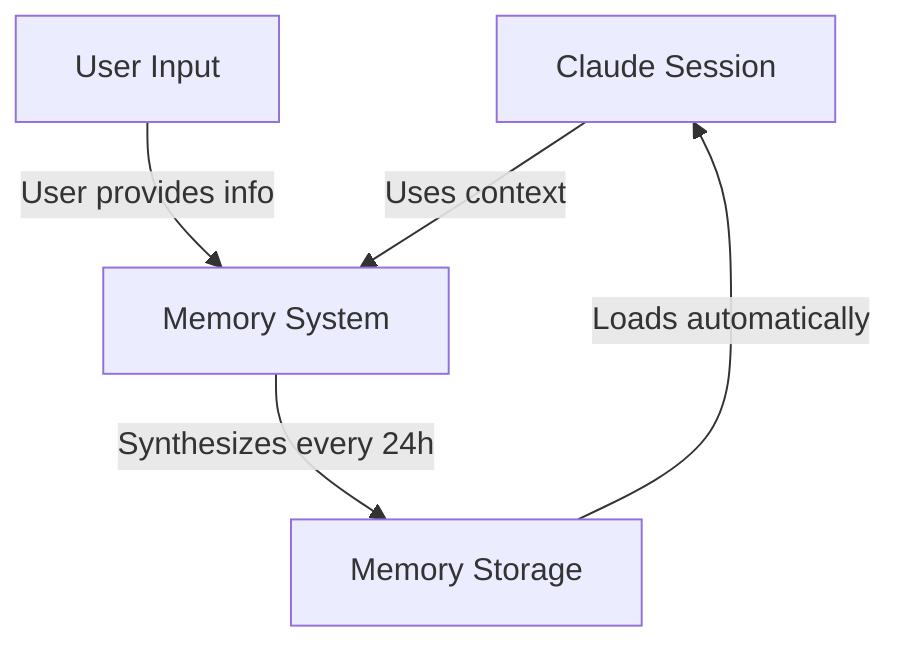
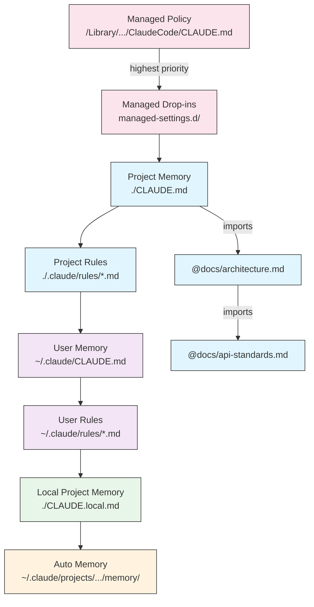
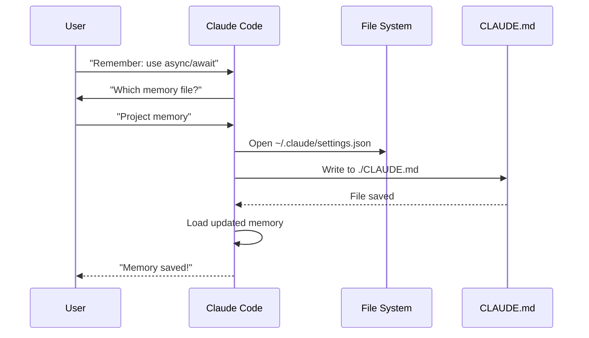
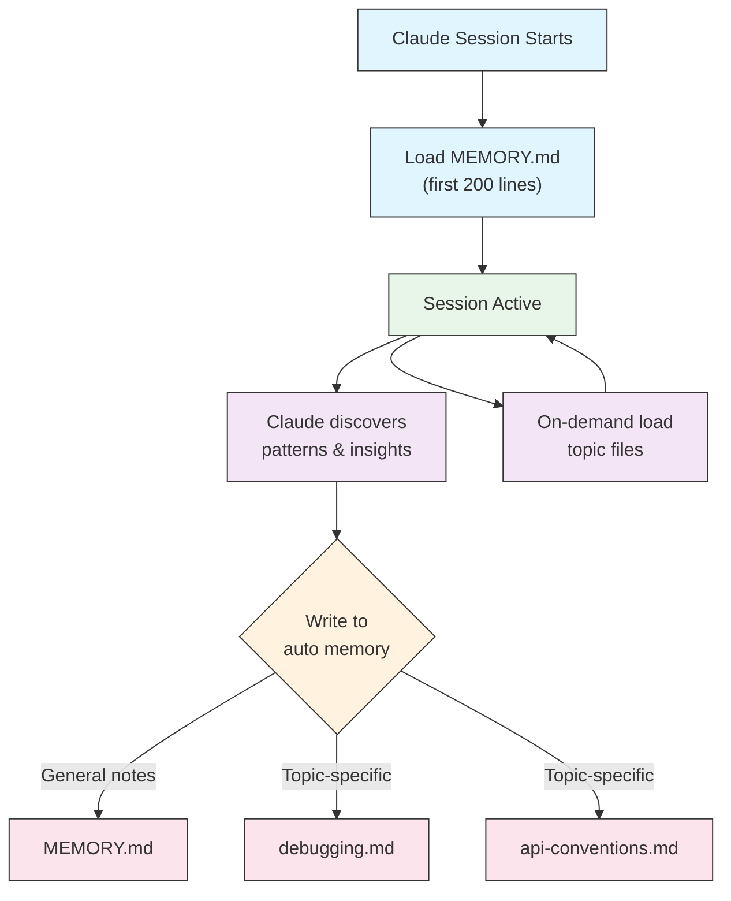

<picture>
  <source media="(prefers-color-scheme: dark)" srcset="../resources/logos/claude-howto-logo-dark.svg">
  
</picture>

# 记忆指南 (Memory)

记忆使 Claude 能够跨会话和对话保留上下文。它有两种形式：claude.ai 中的自动综合，以及 Claude Code 中基于文件系统的 CLAUDE.md。

## 概述

Claude Code 中的记忆提供跨多个会话和对话的持久化上下文。与临时上下文窗口不同，记忆文件允许你：

- 在团队中共享项目标准
- 存储个人开发偏好
- 维护特定目录的规则和配置
- 导入外部文档
- 将记忆作为项目的一部分进行版本控制

记忆系统在多个层级运行，从全局个人偏好到特定子目录，使你能够精细控制 Claude 记住什么以及如何应用这些知识。

## 记忆命令快速参考

| 命令 | 用途 | 用法 | 何时使用 |
|---------|---------|-------|-------------|
| `/init` | 初始化项目记忆 | `/init` | 启动新项目、首次设置 CLAUDE.md |
| `/memory` | 在编辑器中编辑记忆文件 | `/memory` | 大量更新、重组、查看内容 |
| `#` 前缀 | 快速添加单行记忆 | `# 你的规则` | 在对话中快速添加规则 |
| `# new rule into memory` | 明确的记忆添加 | `# new rule into memory<br/>你的详细规则` | 添加复杂的多行规则 |
| `# remember this` | 自然语言记忆更新 | `# remember this<br/>你的指令` | 对话式记忆更新 |
| `@path/to/file` | 导入外部内容 | `@README.md` 或 `@docs/api.md` | 在 CLAUDE.md 中引用现有文档 |

## 快速入门：初始化记忆

### `/init` 命令

`/init` 命令是 Claude Code 中设置项目记忆最快的方式。它使用基础项目文档初始化 CLAUDE.md 文件。

**用法：**

```bash
/init
```

**它做什么：**

- 在项目中创建新的 CLAUDE.md 文件（通常在 `./CLAUDE.md` 或 `./.claude/CLAUDE.md`）
- 建立项目约定和指南
- 为跨会话上下文持久化奠定基础结构
- 提供记录项目标准的模板结构

**增强交互模式：** 设置 `CLAUDE_CODE_NEW_INIT=true` 启用多阶段交互式流程，逐步引导项目设置：

```bash
CLAUDE_CODE_NEW_INIT=true claude
/init
```

**何时使用 `/init`：**

- 在 Claude Code 中启动新项目
- 建立团队编码标准和约定
- 创建关于代码库结构的文档
- 为协作开发设置记忆层级

**示例工作流：**

```markdown
# In your project directory
/init

# Claude creates CLAUDE.md with structure like:
# Project Configuration
## Project Overview
- Name: Your Project
- Tech Stack: [Your technologies]
- Team Size: [Number of developers]

## Development Standards
- Code style preferences
- Testing requirements
- Git workflow conventions
```

### 使用 `#` 快速更新记忆

你可以在任何对话中通过以 `#` 开头的消息快速向记忆添加信息：

**语法：**

```markdown
# 你的记忆规则或指令
```

**示例：**

```markdown
# Always use TypeScript strict mode in this project

# Prefer async/await over promise chains

# Run npm test before every commit

# Use kebab-case for file names
```

**工作原理：**

1. 以 `#` 开头你的消息后跟规则
2. Claude 识别这是记忆更新请求
3. Claude 询问更新哪个记忆文件（项目或个人）
4. 规则被添加到相应的 CLAUDE.md 文件
5. 未来会话会自动加载此上下文

**替代模式：**

```markdown
# new rule into memory
Always validate user input with Zod schemas

# remember this
Use semantic versioning for all releases

# add to memory
Database migrations must be reversible
```

### `/memory` 命令

`/memory` 命令提供直接访问编辑 CLAUDE.md 记忆文件的入口。它会在你的系统编辑器中打开记忆文件以进行全面编辑。

**用法：**

```bash
/memory
```

**它做什么：**

- 在系统默认编辑器中打开记忆文件
- 允许进行大量添加、修改和重组
- 提供对层级中所有记忆文件的直接访问
- 支持跨会话管理持久化上下文

**何时使用 `/memory`：**

- 查看现有记忆内容
- 对项目标准进行大量更新
- 重组记忆结构
- 添加详细的文档或指南
- 随着项目发展维护和更新记忆

**对比：`/memory` 与 `/init`**

| 方面 | `/memory` | `/init` |
|--------|-----------|---------|
| **用途** | 编辑现有记忆文件 | 初始化新的 CLAUDE.md |
| **何时使用** | 更新/修改项目上下文 | 开始新项目 |
| **操作** | 打开编辑器进行更改 | 生成起始模板 |
| **工作流** | 持续维护 | 一次性设置 |

**示例工作流：**

```markdown
# Open memory for editing
/memory

# Claude presents options:
# 1. Managed Policy Memory
# 2. Project Memory (./CLAUDE.md)
# 3. User Memory (~/.claude/CLAUDE.md)
# 4. Local Project Memory

# Choose option 2 (Project Memory)
# Your default editor opens with ./CLAUDE.md content

# Make changes, save, and close editor
# Claude automatically reloads the updated memory
```

**使用记忆导入：**

CLAUDE.md 文件支持 `@path/to/file` 语法来包含外部内容：

```markdown
# Project Documentation
See @README.md for project overview
See @package.json for available npm commands
See @docs/architecture.md for system design

# Import from home directory using absolute path
@~/.claude/my-project-instructions.md
```

**导入功能特性：**

- 支持相对路径和绝对路径（如 `@docs/api.md` 或 `@~/.claude/my-project-instructions.md`）
- 支持递归导入，最大深度为 5 层
- 首次从外部位置导入时会触发安全审批对话框
- 导入指令不会在 Markdown 代码片段或代码块内执行（因此在示例中记录它们是安全的）
- 通过引用现有文档避免重复
- 自动将引用的内容包含在 Claude 的上下文中

## 记忆架构

Claude Code 中的记忆遵循系统层级，不同范围服务于不同目的：



## Claude Code 中的记忆层级

Claude Code 使用多层分级记忆系统，记忆文件在 Claude Code 启动时自动加载，高层级文件优先。

**完整记忆层级（按优先级顺序）：**

1. **管理策略** - 组织范围的指令
   - macOS：`/Library/Application Support/ClaudeCode/CLAUDE.md`
   - Linux/WSL：`/etc/claude-code/CLAUDE.md`
   - Windows：`C:\Program Files\ClaudeCode\CLAUDE.md`

2. **管理附加** - 按字母顺序合并的策略文件（v2.1.83+）
   - `managed-settings.d/` 目录位于管理策略 CLAUDE.md 旁边
   - 文件按字母顺序合并以进行模块化策略管理

3. **项目记忆** - 团队共享上下文（版本控制）
   - `./.claude/CLAUDE.md` 或 `./CLAUDE.md`（在仓库根目录）

4. **项目规则** - 模块化、主题特定的项目指令
   - `./.claude/rules/*.md`

5. **用户记忆** - 个人偏好（所有项目）
   - `~/.claude/CLAUDE.md`

6. **用户级规则** - 个人规则（所有项目）
   - `~/.claude/rules/*.md`

7. **本地项目记忆** - 个人项目偏好
   - `./CLAUDE.local.md`

> **注意**：截至 2026 年 3 月，[官方文档](https://code.claude.com/docs/en/memory)中未提及 `CLAUDE.local.md`。它可能仍作为遗留功能工作。对于新项目，建议使用 `~/.claude/CLAUDE.md`（用户级）或 `.claude/rules/`（项目级、路径范围）。

8. **自动记忆** - Claude 的自动记录和学习
   - `~/.claude/projects/<project>/memory/`

**记忆发现行为：**

Claude 按以下顺序搜索记忆文件，较早的位置优先：



## 使用 `claudeMdExcludes` 排除 CLAUDE.md 文件

在大型单体仓库中，某些 CLAUDE.md 文件可能与当前工作无关。`claudeMdExcludes` 设置允许你跳过特定的 CLAUDE.md 文件，使其不被加载到上下文中：

```jsonc
// In ~/.claude/settings.json or .claude/settings.json
{
  "claudeMdExcludes": [
    "packages/legacy-app/CLAUDE.md",
    "vendors/**/CLAUDE.md"
  ]
}
```

模式与项目根目录的相对路径匹配。这在以下场景中特别有用：

- 拥有许多子项目的单体仓库，其中只有部分相关
- 包含供应商或第三方 CLAUDE.md 文件的仓库
- 通过排除过时或不相关的指令来减少 Claude 上下文窗口中的噪声

## 设置文件层级

Claude Code 设置（包括 `autoMemoryDirectory`、`claudeMdExcludes` 和其他配置）从五级层级解析，较高级别优先：

| 层级 | 位置 | 范围 |
|-------|----------|-------|
| 1（最高） | 管理策略（系统级） | 组织范围强制执行 |
| 2 | `managed-settings.d/`（v2.1.83+） | 模块化策略附加，按字母顺序合并 |
| 3 | `~/.claude/settings.json` | 用户偏好 |
| 4 | `.claude/settings.json` | 项目级（提交到 git） |
| 5（最低） | `.claude/settings.local.json` | 本地覆盖（git 忽略） |

**平台特定配置（v2.1.51+）：**

设置还可以通过以下方式配置：
- **macOS**：属性列表（plist）文件
- **Windows**：Windows 注册表

这些平台原生机制与 JSON 设置文件一起读取并遵循相同的优先级规则。

## 模块化规则系统

使用 `.claude/rules/` 目录结构创建有组织的、路径特定的规则。规则可以在项目级和用户级定义：

```
your-project/
├── .claude/
│   ├── CLAUDE.md
│   └── rules/
│       ├── code-style.md
│       ├── testing.md
│       ├── security.md
│       └── api/                  # 支持子目录
│           └── conventions.md
│           └── validation.md

~/.claude/
├── CLAUDE.md
└── rules/                        # 用户级规则（所有项目）
    ├── personal-style.md
    └── preferred-patterns.md
```

规则在 `rules/` 目录内递归发现，包括任何子目录。`~/.claude/rules/` 的用户级规则在项目级规则之前加载，允许项目可覆盖的个人默认值。

### 使用 YAML Frontmatter 的路径特定规则

定义仅适用于特定文件路径的规则：

```markdown
---
paths: src/api/**/*.ts
---

# API Development Rules

- All API endpoints must include input validation
- Use Zod for schema validation
- Document all parameters and response types
- Include error handling for all operations
```

**Glob 模式示例：**

- `**/*.ts` - 所有 TypeScript 文件
- `src/**/*` - src/ 下的所有文件
- `src/**/*.{ts,tsx}` - 多扩展名
- `{src,lib}/**/*.ts, tests/**/*.test.ts` - 多模式

### 子目录和符号链接

`.claude/rules/` 中的规则支持两个组织功能：

- **子目录**：规则被递归发现，因此你可以将它们组织为基于主题的文件夹（如 `rules/api/`、`rules/testing/`、`rules/security/`）
- **符号链接**：支持符号链接，便于跨多个项目共享规则。例如，你可以将共享规则文件从中心位置符号链接到每个项目的 `.claude/rules/` 目录

## 记忆位置表

| 位置 | 范围 | 优先级 | 共享 | 访问 | 最佳适用场景 |
|----------|-------|----------|--------|--------|----------|
| `/Library/Application Support/ClaudeCode/CLAUDE.md` (macOS) | 管理策略 | 1（最高） | 组织 | 系统 | 公司级策略 |
| `/etc/claude-code/CLAUDE.md` (Linux/WSL) | 管理策略 | 1（最高） | 组织 | 系统 | 组织标准 |
| `C:\Program Files\ClaudeCode\CLAUDE.md` (Windows) | 管理策略 | 1（最高） | 组织 | 系统 | 企业指南 |
| `managed-settings.d/*.md`（策略旁边） | 管理附加 | 1.5 | 组织 | 系统 | 模块化策略文件（v2.1.83+） |
| `./CLAUDE.md` 或 `./.claude/CLAUDE.md` | 项目记忆 | 2 | 团队 | Git | 团队标准、共享架构 |
| `./.claude/rules/*.md` | 项目规则 | 3 | 团队 | Git | 路径特定、模块化规则 |
| `~/.claude/CLAUDE.md` | 用户记忆 | 4 | 个人 | 文件系统 | 个人偏好（所有项目） |
| `~/.claude/rules/*.md` | 用户规则 | 5 | 个人 | 文件系统 | 个人规则（所有项目） |
| `./CLAUDE.local.md` | 项目本地 | 6 | 个人 | Git（忽略） | 个人项目偏好 |
| `~/.claude/projects/<project>/memory/` | 自动记忆 | 7（最低） | 个人 | 文件系统 | Claude 的自动记录和学习 |

## 记忆更新生命周期

以下为记忆更新在 Claude Code 会话中的流转过程：



## 自动记忆

自动记忆是一个持久目录，Claude 在处理你的项目时自动记录学习、模式和洞见。与 CLAUDE.md 文件（你手动编写和维护）不同，自动记忆由 Claude 在会话期间自行写入。

### 自动记忆工作原理

- **位置**：`~/.claude/projects/<project>/memory/`
- **入口文件**：`MEMORY.md` 作为自动记忆目录中的主文件
- **主题文件**：可选的附加文件用于特定主题（如 `debugging.md`、`api-conventions.md`）
- **加载行为**：会话开始时，`MEMORY.md` 的前 200 行被加载到系统提示中。主题文件按需加载，不在启动时加载。
- **读/写**：Claude 在会话期间读写记忆文件，以发现模式和项目特定知识

### 自动记忆架构



### 自动记忆目录结构

```
~/.claude/projects/<project>/memory/
├── MEMORY.md              # 入口文件（启动时加载前 200 行）
├── debugging.md           # 主题文件（按需加载）
├── api-conventions.md     # 主题文件（按需加载）
└── testing-patterns.md    # 主题文件（按需加载）
```

### 版本要求

自动记忆需要 **Claude Code v2.1.59 或更高版本**。如果你使用的是旧版本，请先升级：

```bash
npm install -g @anthropic-ai/claude-code@latest
```

### 自定义自动记忆目录

默认情况下，自动记忆存储在 `~/.claude/projects/<project>/memory/`。你可以使用 `autoMemoryDirectory` 设置（自 **v2.1.74** 起可用）更改此位置：

```jsonc
// In ~/.claude/settings.json or .claude/settings.local.json（仅限用户/本地设置）
{
  "autoMemoryDirectory": "/path/to/custom/memory/directory"
}
```

> **注意**：`autoMemoryDirectory` 只能在用户级（`~/.claude/settings.json`）或本地设置（`.claude/settings.local.json`）中设置，不能在项目或管理策略设置中设置。

这在以下场景中很有用：

- 将自动记忆存储在共享或同步的位置
- 将自动记忆与默认的 Claude 配置目录分离
- 在默认层级外使用项目特定路径

### Worktree 和仓库共享

同一 Git 仓库中的所有 worktree 和子目录共享一个自动记忆目录。这意味着在 worktree 之间切换或在同一仓库的不同子目录中工作都将读写相同的记忆文件。

### 子智能体记忆

子智能体（通过 Task 或并行执行工具生成）可以拥有自己的记忆上下文。在子智能体定义中使用 `memory` frontmatter 字段来指定要加载的记忆范围：

```yaml
memory: user      # 仅加载用户级记忆
memory: project   # 仅加载项目级记忆
memory: local     # 仅加载本地记忆
```

这使子智能体能够在聚焦的上下文中运行，而非继承完整的记忆层级。

### 控制自动记忆

自动记忆可以通过 `CLAUDE_CODE_DISABLE_AUTO_MEMORY` 环境变量控制：

| 值 | 行为 |
|-------|----------|
| `0` | 强制开启自动记忆 |
| `1` | 强制关闭自动记忆 |
| *(未设置)* | 默认行为（启用自动记忆） |

```bash
# 为会话禁用自动记忆
CLAUDE_CODE_DISABLE_AUTO_MEMORY=1 claude

# 明确强制开启自动记忆
CLAUDE_CODE_DISABLE_AUTO_MEMORY=0 claude
```

## 使用 `--add-dir` 添加额外目录

`--add-dir` 标志允许 Claude Code 从当前工作目录之外的额外目录加载 CLAUDE.md 文件。这对于上下文从其他目录相关的单体仓库或多项目设置非常有用。

要启用此功能，请设置环境变量：

```bash
CLAUDE_CODE_ADDITIONAL_DIRECTORIES_CLAUDE_MD=1
```

然后使用标志启动 Claude Code：

```bash
claude --add-dir /path/to/other/project
```

Claude 将从指定的额外目录加载 CLAUDE.md，与当前工作目录的记忆文件一起加载。

## 实际示例

### 示例 1：项目记忆结构

**文件：** `./CLAUDE.md`

```markdown
# Project Configuration

## Project Overview
- **Name**: 电商平台
- **Tech Stack**: Node.js, PostgreSQL, React 18, Docker
- **Team Size**: 5 位开发者
- **Deadline**: Q4 2025

## Architecture
@docs/architecture.md
@docs/api-standards.md
@docs/database-schema.md

## Development Standards

### Code Style
- 使用 Prettier 进行格式化
- 使用 ESLint 配合 airbnb 配置
- 最大行长度：100 字符
- 使用 2 空格缩进

### Naming Conventions
- **Files**: kebab-case (user-controller.js)
- **Classes**: PascalCase (UserService)
- **Functions/Variables**: camelCase (getUserById)
- **Constants**: UPPER_SNAKE_CASE (API_BASE_URL)
- **Database Tables**: snake_case (user_accounts)

### Git Workflow
- 分支名称：`feature/description` 或 `fix/description`
- 提交信息：遵循 convention commits
- 合并前需要 PR
- 所有 CI/CD 检查必须通过
- 最少需要 1 个审批

### Testing Requirements
- 最低 80% 代码覆盖率
- 所有关键路径必须有测试
- 使用 Jest 进行单元测试
- 使用 Cypress 进行端到端测试
- 测试文件名：`*.test.ts` 或 `*.spec.ts`

### API Standards
- 仅 RESTful 端点
- JSON 请求/响应
- 正确使用 HTTP 状态码
- API 端点版本化：`/api/v1/`
- 所有端点附带示例文档

### Database
- 使用迁移进行模式变更
- 永远不要硬编码凭据
- 使用连接池
- 在开发中启用查询日志
- 需要定期备份

### Deployment
- 基于 Docker 的部署
- Kubernetes 编排
- 蓝绿部署策略
- 失败自动回滚
- 数据库迁移在部署前运行

## Common Commands

| Command | Purpose |
|---------|---------|
| `npm run dev` | 启动开发服务器 |
| `npm test` | 运行测试套件 |
| `npm run lint` | 检查代码样式 |
| `npm run build` | 构建生产版本 |
| `npm run migrate` | 运行数据库迁移 |

## Team Contacts
- Tech Lead: Sarah Chen (@sarah.chen)
- Product Manager: Mike Johnson (@mike.j)
- DevOps: Alex Kim (@alex.k)

## Known Issues & Workarounds
- PostgreSQL 连接池在高峰时段限制为 20
- Workaround: 实现查询排队
- Safari 14 与 async generators 的兼容性问题
- Workaround: 使用 Babel 编译

## Related Projects
- Analytics Dashboard: `/projects/analytics`
- Mobile App: `/projects/mobile`
- Admin Panel: `/projects/admin`
```

### 示例 2：目录特定记忆

**文件：** `./src/api/CLAUDE.md`

```markdown
# API Module Standards

This file overrides root CLAUDE.md for everything in /src/api/

## API-Specific Standards

### Request Validation
- Use Zod for schema validation
- Always validate input
- Return 400 with validation errors
- Include field-level error details

### Authentication
- All endpoints require JWT token
- Token in Authorization header
- Token expires after 24 hours
- Implement refresh token mechanism

### Response Format

All responses must follow this structure:

...（保持原文 JSON 示例不变）...

### Pagination
- Use cursor-based pagination (not offset)
- Include `hasMore` boolean
- Limit max page size to 100
- Default page size: 20

...
```

### 示例 3：个人记忆

**文件：** `~/.claude/CLAUDE.md`

*(保持原文结构，翻译注释和说明部分)*

## 记忆特性比较

| 特性 | Claude Web/桌面 | Claude Code (CLAUDE.md) |
|---------|-------------------|------------------------|
| 自动综合 | ✅ 每 24 小时 | ❌ 手动 |
| 跨项目 | ✅ 共享 | ❌ 项目特定 |
| 团队访问 | ✅ 共享项目 | ✅ Git 跟踪 |
| 可搜索 | ✅ 内置 | ✅ 通过 `/memory` |
| 可编辑 | ✅ 在聊天中 | ✅ 直接文件编辑 |
| 导入/导出 | ✅ 是 | ✅ 粘贴复制 |
| 持久化 | ✅ 24h+ | ✅ 无限期 |

## 最佳实践

### 应该做的（Do's）

- **具体且详细**：使用清晰、详细的指令，而非模糊的指导
  - ✅ 好："所有 JavaScript 文件使用 2 空格缩进"
  - ❌ 避免："遵循最佳实践"

- **保持条理**：使用清晰的 markdown 部分和标题结构记忆文件

- **使用适当的层级**：
  - **管理策略**：公司级策略、安全标准、合规要求
  - **项目记忆**：团队标准、架构、编码约定（提交到 git）
  - **用户记忆**：个人偏好、沟通方式、工具选择
  - **目录记忆**：模块特定的规则和覆盖

- **利用导入**：使用 `@path/to/file` 语法引用现有文档
  - 支持最多 5 层递归嵌套
  - 避免记忆文件间重复
  - 示例：`See @README.md for project overview`

### 不应该做的（Don'ts）

- **不要存储密钥**：永远不要在文件包含 API 密钥、密码、Token 或凭据
- **不要包含敏感数据**：不含个人身份信息、私人信息或商业机密
- **不要重复内容**：使用导入 (`@path`) 引用现有文档
- **不要模糊**：避免"遵循最佳实践"或"写好代码"之类的泛泛之谈
- **不要过长**：单个记忆文件保持在 500 行以下
- **不要过度组织**：策略性使用层级，避免过多子目录覆盖
- **不要忘记更新**：老旧记忆会导致混淆和过时做法
- **不要超过嵌套限制**：记忆导入最多支持 5 层嵌套

## 安装指南

### 设置项目记忆

**方法 1：使用 `/init` 命令（推荐）**

设置项目记忆最快的方式：

```bash
cd /path/to/your/project
/init
# Claude 创建并填充 CLAUDE.md 模板结构
```

**方法 2：手动创建**

```bash
cd /path/to/your/project
touch CLAUDE.md
# 手动编辑内容
```

**方法 3：使用 `#` 快速更新**

```markdown
# Use semantic versioning for all releases
# Always run tests before committing
# Prefer composition over inheritance
```

### 设置个人记忆

```bash
mkdir -p ~/.claude
touch ~/.claude/CLAUDE.md
# 编辑添加你的偏好
```

## 官方文档

有关最新信息，请参阅 Claude Code 官方文档：

- **[记忆文档](https://code.claude.com/docs/en/memory)** — 完整的记忆系统参考
- **[斜杠命令参考](https://code.claude.com/docs/en/interactive-mode)** — 所有内置命令，包括 `/init` 和 `/memory`
- **[CLI 参考](https://code.claude.com/docs/en/cli-reference)** — 命令行界面文档

*属于 [Claude How To](../) 指南系列*
