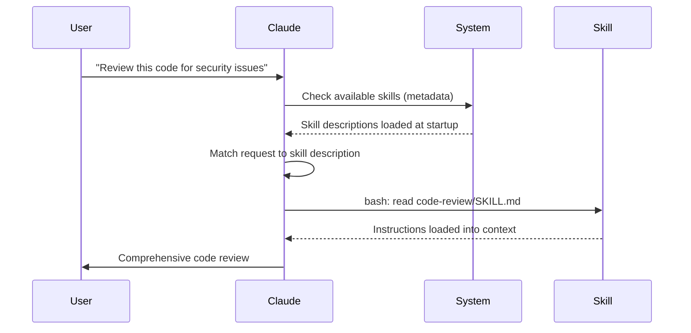

<picture>
  <source media="(prefers-color-scheme: dark)" srcset="../resources/logos/claude-howto-logo-dark.svg">
  
</picture>

# 技能 (Skills) 指南

代理技能是可重复的、基于文件系统的能力，用于扩展 Claude 的功能。它们将特定领域的专业知识、工作流程和最佳实践打包为可发现的组件，Claude 在相关时会自动使用。

## 概述

**代理技能**是将通用代理转变为专家的可模块化能力。与提示（针对一次性任务的对话级指令）不同，技能按需加载，消除了跨多个对话重复提供相同指导的需求。

### 核心优势

- **专业化 Claude**：为特定领域任务定制能力
- **减少重复**：创建一次，跨对话自动使用
- **组合能力**：组合技能以构建复杂工作流
- **扩展工作流**：跨多个项目和团队复用技能
- **保持质量**：将最佳实践直接嵌入工作流

技能遵循 [Agent Skills](https://agentskills.io) 开放标准，适用于多种 AI 工具。Claude Code 在此基础上进行了扩展，增加了调用控制、子智能体执行和动态上下文注入等功能。

> **注意**：自定义斜杠命令现已合并至技能。`.claude/commands/` 文件仍然有效且支持相同的 frontmatter 字段。新开发推荐使用技能。当同一路径下两者都存在时（如 `.claude/commands/review.md` 和 `.claude/skills/review/SKILL.md`），技能优先。

## 技能的工作原理：渐进式披露

技能采用**渐进式披露**架构——Claude 根据需要分阶段加载信息，而非预先消费上下文。这实现了高效的上下文管理，同时保持无限的可扩展性。

### 三级加载

| 级别 | 何时加载 | Token 消耗 | 内容 |
|-------|------------|------------|---------|
| **级别 1：元数据** | 始终（启动时） | 每技能 ~100 Token | YAML frontmatter 中的 `name` 和 `description` |
| **级别 2：指令** | 技能触发时 | 5000 Token 以下 | SKILL.md 正文的指令和指南 |
| **级别 3+：资源** | 按需 | 实际上无限 | 捆绑文件，通过 bash 执行而不将内容加载到上下文中 |

这意味着你可以安装多个技能而无需承担上下文开销——Claude 仅知道每个技能的存在和何时使用它，直到实际触发。

## 技能加载过程



## 技能类型和位置

| 类型 | 位置 | 范围 | 共享 | 最佳适用场景 |
|------|----------|-------|--------|----------|
| **企业级** | 管理设置 | 组织内所有用户 | 是 | 组织范围标准 |
| **个人** | `~/.claude/skills/<skill-name>/SKILL.md` | 个人 | 否 | 个人工作流 |
| **项目** | `.claude/skills/<skill-name>/SKILL.md` | 团队 | 是（通过 git） | 团队标准 |
| **插件** | `<plugin>/skills/<skill-name>/SKILL.md` | 已启用的地方 | 取决于 | 随插件捆绑 |

当技能在不同层级共享名称时，高优先级位置胜出：**企业 > 个人 > 项目**。插件技能使用 `plugin-name:skill-name` 命名空间，因此不会冲突。

## 创建自定义技能

### 基本目录结构

```
my-skill/
├── SKILL.md           # 主指令（必需）
├── template.md        # Claude 填写的模板
├── examples/
│   └── sample.md      # 预期格式示例输出
└── scripts/
    └── validate.sh    # Claude 可执行的脚本
```

### SKILL.md 格式

```yaml
---
name: your-skill-name
description: Brief description of what this Skill does and when to use it
---

# Your Skill Name

## Instructions
Provide clear, step-by-step guidance for Claude.
```

### 必填字段

- **name**：仅小写字母、数字、连字符（最多 64 字符）。不能包含 "anthropic" 或 "claude"。
- **description**：技能的功能以及何时使用它（最多 1024 字符）。这对 Claude 知道何时激活技能至关重要。

### 可选 Frontmatter 字段

| 字段 | 描述 |
|-------|-------------|
| `name` | 小写字母、数字、连字符（最多 64 字符）。不能包含 "anthropic" 或 "claude"。 |
| `description` | 技能的功能及何时使用（最多 1024 字符）。对自动调用匹配至关重要。 |
| `argument-hint` | `/` 自动补全菜单中显示的提示（如 `"[filename] [format]"`）。 |
| `disable-model-invocation` | `true` = 仅用户可通过 `/name` 调用。Claude 永远不会自动调用。 |
| `user-invocable` | `false` = 从 `/` 菜单隐藏。仅 Claude 可自动调用。 |
| `allowed-tools` | 技能无需权限提示即可使用的工具逗号分隔列表。 |
| `model` | 技能活跃期间的模型覆盖（如 `opus`、`sonnet`）。 |
| `effort` | 技能活跃期间的推理级别：`low`、`medium`、`high` 或 `max`。 |
| `context` | `fork` 在分叉的子智能体上下文中运行技能，拥有自己的上下文窗口。 |
| `agent` | 使用 `context: fork` 时的子智能体类型（如 `Explore`、`Plan`、`general-purpose`）。 |
| `shell` | 用于 `!`command`` 替换的 Shell：`bash`（默认）或 `powershell`。 |
| `hooks` | 此技能生命周期范围内的钩子（格式与全局钩子）。 |

## 技能内容类型

### 参考内容

Claude 应用于当前工作的知识——约定、模式、风格指南、领域知识。与对话上下文内联运行。

### 任务内容

特定操作的分步指令。通常直接通过 `/skill-name` 调用。

```yaml
---
name: deploy
description: Deploy the application to production
context: fork
disable-model-invocation: true
---

Deploy the application:
1. Run the test suite
2. Build the application
3. Push to the deployment target
```

## 控制技能调用

默认情况下，你和 Claude 都可以调用任何技能。两个 frontmatter 字段控制三种调用模式：

| Frontmatter | 你可以调用 | Claude 可以调用 |
|---|---|---|
| （默认） | 是 | 是 |
| `disable-model-invocation: true` | 是 | 否 |
| `user-invocable: false` | 否 | 是 |

**使用 `disable-model-invocation: true`** 用于有副作用的工作流：`/commit`、`/deploy`、`/send-slack-message`。你不希望 Claude 因为代码看起来就绪就决定部署。

**使用 `user-invocable: false`** 用于不可作为命令执行的背景知识。如 `legacy-system-context` 技能解释旧系统的工作原理——对 Claude 有用，但对用户不是有意义的操作。

## 字符串替换

技能支持动态值，在技能内容发送给 Claude 之前解析：

| 变量 | 描述 |
|----------|-------------|
| `$ARGUMENTS` | 调用时传递的所有参数 |
| `$ARGUMENTS[N]` 或 `$N` | 按索引访问特定参数（从 0 开始） |
| `${CLAUDE_SESSION_ID}` | 当前会话 ID |
| `${CLAUDE_SKILL_DIR}` | 包含技能 SKILL.md 文件的目录 |
| `` !`command` `` | 动态上下文注入——执行 shell 命令并内联输出 |

## 注入动态上下文

`!`command`` 语法在技能内容发送给 Claude 之前运行 shell 命令：

```yaml
---
name: pr-summary
description: Summarize changes in a pull request
context: fork
agent: Explore
---

## Pull request context
- PR diff: !`gh pr diff`
- PR comments: !`gh pr view --comments`
- Changed files: !`gh pr diff --name-only`
```

## 在子智能体中运行技能

添加 `context: fork` 在隔离子智能体上下文中运行技能。技能内容成为专用子智能体的任务，拥有自己的上下文窗口，保持主对话整洁。

## 管理技能

### 查看可用技能

直接问 Claude：
```
What Skills are available?
```

或检查文件系统：
```bash
# 列出个人技能
ls ~/.claude/skills/

# 列出项目技能
ls .claude/skills/
```

### 测试技能

两种方式测试：

**让 Claude 自动调用**，询问与描述匹配的内容：
```
Can you help me review this code for security issues?
```

**或直接用技能名调用**：
```
/code-review src/auth/login.ts
```

### 更新技能

直接编辑 `SKILL.md` 文件。更改在下次 Claude Code 启动时生效。

## 最佳实践

### 1. 使描述具体

- **坏（模糊）**："帮助处理文档"
- **好（具体）**："从 PDF 文件中提取文本和表格、填写表单、合并文档。在处理 PDF 文件或用户提及 PDF、表单或文档提取时使用。"

### 2. 保持技能专注

- 一个技能 = 一种能力

### 3. 包含触发词

在描述中添加匹配用户请求的关键词。

### 4. SKILL.md 保持在 500 行以下

将详细的参考资料移到单独的文件中，Claude 按需加载。

### 安全须知

**仅使用受信任来源的技能。** 技能通过指令和代码授予 Claude 能力——恶意技能可以指示 Claude 以有害的方式调用工具或执行代码。

## 技能与其他特性比较

| 特性 | 调用方式 | 最佳适用场景 |
|---------|------------|----------|
| **技能** | 自动或 `/name` | 可复用专业知识、工作流 |
| **斜杠命令** | 用户发起 `/name` | 快速快捷方式（已合并到技能） |
| **子智能体** | 自动委托 | 隔离的任务执行 |
| **记忆 (CLAUDE.md)** | 始终加载 | 持久项目上下文 |
| **MCP** | 实时 | 外部数据/服务访问 |
| **钩子** | 事件驱动 | 自动化副作用 |

## 附带的技能

Claude Code 自带几个内置技能，无需安装即可使用：

| 技能 | 描述 |
|-------|-------------|
| `/simplify` | 审查变更文件以提高复用性、质量和效率；生成 3 个并行审查智能体 |
| `/batch <instruction>` | 使用 git worktree 在代码库上协调大规模并行变更 |
| `/debug [description]` | 通过读取调试日志排查当前会话问题 |
| `/loop [interval] <prompt>` | 按间隔重复运行提示（如 `/loop 5m check the deploy`） |
| `/claude-api` | 加载 Claude API/SDK 参考；遇到 `anthropic`/`@anthropic-ai/sdk` 导入时自动激活 |

## 共享技能

### 项目技能（团队共享）

```bash
# 在 .claude/skills/ 中创建技能
# 提交到 Git
# 团队成员拉取更改——技能立即可用
```

### 个人技能

```bash
# 拷贝到个人目录
cp -r my-skill ~/.claude/skills/

# 使脚本可执行
chmod +x ~/.claude/skills/my-skill/scripts/*.py
```

## 额外资源

- [官方技能文档](https://code.claude.com/docs/en/skills)
- [Agent Skills 架构博客](https://claude.com/blog/equipping-agents-for-the-real-world-with-agent-skills)
- [技能仓库](https://github.com/luongnv89/skills) - 即用型技能集合
- [斜杠命令指南](../01-slash-commands/) - 用户发起的快捷方式
- [子智能体指南](../04-subagents/) - 委托的 AI 智能体
