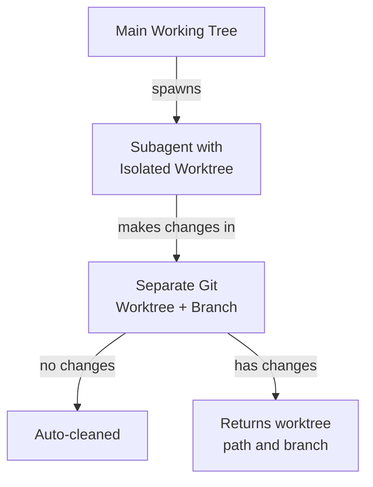
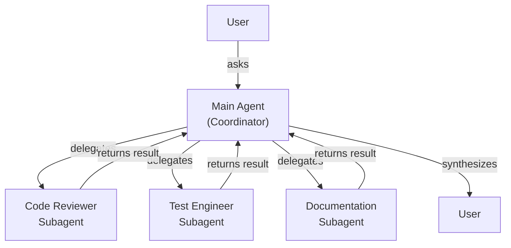
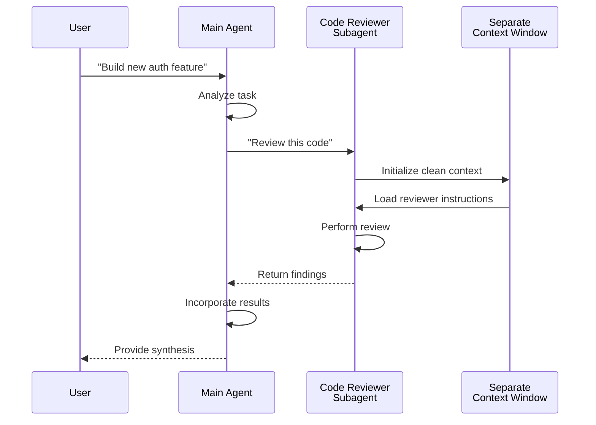

<picture>
  <source media="(prefers-color-scheme: dark)" srcset="../resources/logos/claude-howto-logo-dark.svg">
  
</picture>

# 子智能体 - 完整参考指南

子智能体是 Claude Code 可以委托任务给的专业化 AI 助手。每个子智能体都有特定用途、使用与主对话分离的独立上下文窗口，并可以配置特定的工具和自定义系统提示。

## 目录

1. [概述](#概述)
2. [核心优势](#核心优势)
3. [文件位置](#文件位置)
4. [配置](#配置)
5. [内置子智能体](#内置子智能体)
6. [管理子智能体](#管理子智能体)
7. [使用子智能体](#使用子智能体)
8. [可恢复的智能体](#可恢复的智能体)
9. [链式子智能体](#链式子智能体)
10. [子智能体的持久记忆](#子智能体的持久记忆)
11. [后台子智能体](#后台子智能体)
12. [Worktree 隔离](#worktree-隔离)
13. [限制可生成的子智能体](#限制可生成的子智能体)
14. [`claude agents` CLI 命令](#claude-agents-cli-命令)
15. [智能体团队（实验性）](#智能体团队实验性)
16. [插件子智能体安全性](#插件子智能体安全性)
17. [架构](#架构)
18. [上下文管理](#上下文管理)
19. [何时使用子智能体](#何时使用子智能体)
20. [最佳实践](#最佳实践)
21. [本文件夹中的示例子智能体](#本文件夹中的示例子智能体)
22. [安装说明](#安装说明)
23. [相关概念](#相关概念)

---

## 概述

子智能体通过以下方式在 Claude Code 中启用委托任务执行：

- 创建**隔离的 AI 助手**，拥有独立的上下文窗口
- 提供**自定义系统提示**以实现专业化专长
- 执行**工具访问控制**以限制能力
- 防止**上下文污染**来自复杂任务
- 启用**并行执行**多个专业化任务

每个子智能体独立运行，拥有干净的起点，仅接收执行其特定任务所需的特定上下文，然后将结果返回给主智能体进行综合。

**快速开始**：使用 `/agents` 命令交互式地创建、查看、编辑和管理你的子智能体。

---

## 核心优势

| 优势 | 描述 |
|---------|-------------|
| **上下文保持** | 在独立上下文中运行，防止主对话污染 |
| **专业化知识** | 针对特定领域进行微调，提高成功率 |
| **可重用性** | 跨不同项目使用，与团队共享 |
| **灵活权限** | 不同子智能体类型的工具访问级别 |
| **可扩展性** | 多个智能体同时处理不同方面 |

---

## 文件位置

子智能体文件可以存储在具有不同作用域的多个位置：

| 优先级 | 类型 | 位置 | 作用域 |
|----------|------|----------|-------|
| 1（最高） | **CLI 定义的** | 通过 `--agents` 标志（JSON） | 仅会话 |
| 2 | **项目子智能体** | `.claude/agents/` | 当前项目 |
| 3 | **用户子智能体** | `~/.claude/agents/` | 所有项目 |
| 4（最低） | **插件智能体** | 插件 `agents/` 目录 | 通过插件启用 |

当同名时，较高级别的来源优先：**CLI > 项目 > 用户 > 插件**。

---

## 配置

### 文件格式

子智能体在 YAML frontmatter 后跟着 markdown 中的系统提示进行定义：

```yaml
---
name: your-sub-agent-name
description: Description of when this subagent should be invoked
tools: tool1, tool2, tool3  # 可选 - 省略则继承所有工具
disallowedTools: tool4  # 可选 - 明确禁止的工具
model: sonnet  # 可选 - sonnet, opus, haiku, 或继承
permissionMode: default  # 可选 - 权限模式
maxTurns: 20  # 可选 - 智能体回合数限制
skills: skill1, skill2  # 可选 - 预加载到上下文的技能
mcpServers: server1  # 可选 - 可用的 MCP 服务器
memory: user  # 可选 - 持久记忆作用域（user, project, local）
background: false  # 可选 - 作为后台任务运行
effort: high  # 可选 - 推理努力级别（low, medium, high, max）
isolation: worktree  # 可选 - git worktree 隔离
initialPrompt: "Start by analyzing the codebase"  # 可选 - 自动提交的首轮提示
hooks:  # 可选 - 组件作用域的钩子
  PreToolUse:
    - matcher: "Bash"
      hooks:
        - type: command
          command: "./scripts/security-check.sh"
---

Your subagent's system prompt goes here. This can be multiple paragraphs
and should clearly define the subagent's role, capabilities, and approach
to solving problems.
```

### 配置字段

| 字段 | 必需 | 描述 |
|-------|----------|-------------|
| `name` | 是 | 唯一标识符（小写字母和连字符） |
| `description` | 是 | 自然语言描述何时应调用此子智能体 |
| `tools` | 否 | 具体工具逗号分隔列表。省略则继承所有工具 |
| `disallowedTools` | 否 | 子智能体禁止使用的逗号分隔工具列表 |
| `model` | 否 | 要使用的模型：`sonnet`、`opus`、`haiku`、完整模型 ID 或 `inherit` |
| `permissionMode` | 否 | `default`、`acceptEdits`、`dontAsk`、`bypassPermissions`、`plan` |
| `maxTurns` | 否 | 子智能体可以进行的最大推理回合数 |
| `skills` | 否 | 要预加载的逗号分隔技能列表 |
| `mcpServers` | 否 | 使子智能体可用的 MCP 服务器 |
| `memory` | 否 | 持久记忆目录作用域：`user`、`project`、`local` |
| `background` | 否 | 设为 `true` 使子智能体始终作为后台任务运行 |
| `effort` | 否 | 推理努力级别：`low`、`medium`、`high`、`max` |
| `isolation` | 否 | 设为 `worktree` 给子智能体自己的 git worktree |
| `initialPrompt` | 否 | 当子智能体作为主智能体运行时自动提交的首轮提示 |
| `hooks` | 否 | 组件作用域的钩子（PreToolUse、PostToolUse、Stop） |

### 工具配置选项

**选项 1：继承所有工具（省略该字段）**
```yaml
---
name: full-access-agent
description: Agent with all available tools
---
```

**选项 2：指定具体工具**
```yaml
---
name: limited-agent
description: Agent with specific tools only
tools: Read, Grep, Glob, Bash
---
```

### CLI 配置

使用 `--agents` 标志通过 JSON 格式为会话定义子智能体：

```bash
claude --agents '{
  "code-reviewer": {
    "description": "Expert code reviewer. Use proactively after code changes.",
    "prompt": "You are a senior code reviewer. Focus on code quality, security, and best practices.",
    "tools": ["Read", "Grep", "Glob", "Bash"],
    "model": "sonnet"
  }
}'
```

**`--agents` 标志的 JSON 格式：**

```json
{
  "agent-name": {
    "description": "Required: when to invoke this agent",
    "prompt": "Required: system prompt for the agent",
    "tools": ["Optional", "array", "of", "tools"],
    "model": "optional: sonnet|opus|haiku"
  }
}
```

**智能体定义的优先级：**

智能体定义按此优先顺序加载：
1. **CLI 定义的** - `--agents` 标志（仅会话，JSON）
2. **项目级** - `.claude/agents/`（当前项目）
3. **用户级** - `~/.claude/agents/`（所有项目）
4. **插件级** - 插件 `agents/` 目录

这允许 CLI 定义为单个会话覆盖所有其他来源。

---

## 内置子智能体

Claude Code 包含几个始终可用的内置子智能体，无需安装：

| 智能体 | 模型 | 用途 |
|-------|-------|---------|
| **general-purpose** | 继承 | 复杂的多步骤任务 |
| **Plan** | 继承 | 计划模式的调研 |
| **Explore** | Haiku | 仅读代码库探索（快速/中等/非常彻底） |
| **Bash** | 继承 | 独立上下文中的终端命令 |

### 探索子智能体

| 属性 | 值 |
|----------|-------|
| **模型** | Haiku（快速、低延迟） |
| **模式** | 严格只读 |
| **工具** | Glob, Grep, Read, Bash（仅只读命令） |
| **用途** | 快速代码库搜索和分析 |

**彻底性级别** - 指定探索深度：
- **"quick"** - 快速搜索，最小探索，适合查找特定模式
- **"medium"** - 中等探索，平衡速度和彻底性，默认方法
- **"very thorough"** - 在多个位置和命名约定上的综合分析，可能需要更长时间

---

## 管理子智能体

### 使用 `/agents` 命令（推荐）

```bash
/agents
```

这提供了交互式菜单来：
- 查看所有可用的子智能体（内置、用户和项目）
- 创建新的子智能体并进行引导设置
- 编辑现有的自定义子智能体和工具访问
- 删除自定义子智能体
- 当重复存在时查看哪些子智能体处于活动状态

### 直接文件管理

```bash
# 创建项目子智能体
mkdir -p .claude/agents
cat > .claude/agents/test-runner.md << 'EOF'
---
name: test-runner
description: Use proactively to run tests and fix failures
---

You are a test automation expert. When you see code changes, proactively
run the appropriate tests. If tests fail, analyze the failures and fix
them while preserving the original test intent.
EOF

# 创建用户子智能体（所有项目可用）
mkdir -p ~/.claude/agents
```

---

## 使用子智能体

### 自动委托

Claude 基于以下条件主动委托任务：
- 请求中的任务描述
- 子智能体配置中的 `description` 字段
- 当前上下文和可用工具

要鼓励主动使用，在 `description` 字段中包含 "use PROACTIVELY" 或 "MUST BE USED"：

```yaml
---
name: code-reviewer
description: Expert code review specialist. Use PROACTIVELY after writing or modifying code.
---
```

### 显式调用

你可以明确请求特定的子智能体：

```
> Use the test-runner subagent to fix failing tests
> Have the code-reviewer subagent look at my recent changes
> Ask the debugger subagent to investigate this error
```

### @ 提及调用

使用 `@` 前缀保证调用特定的子智能体（绕过自动委托启发式）：

```
> @"code-reviewer (agent)" review the auth module
```

### 会话范围智能体

使用特定智能体作为主智能体运行整个会话：

```bash
# 通过 CLI 标志
claude --agent code-reviewer

# 通过 settings.json
{
  "agent": "code-reviewer"
}
```

### 列出可用智能体

使用 `claude agents` 命令列出所有来源的配置智能体：

```bash
claude agents
```

---

## 可恢复的智能体

子智能体可以继续之前的对话，完整保留上下文：

```bash
# 初始调用
> Use the code-analyzer agent to start reviewing the authentication module
# 返回 agentId: "abc123"

# 稍后恢复智能体
> Resume agent abc123 and now analyze the authorization logic as well
```

**使用场景**：
- 跨多个会话的长期调研
- 迭代式改进而不丢失上下文
- 维护上下文的多步工作流

---

## 链式子智能体

按顺序执行多个子智能体：

```bash
> First use the code-analyzer subagent to find performance issues,
  then use the optimizer subagent to fix them
```

这允许复杂的工作流，其中一个子智能体的输出馈送到另一个子智能体。

---

## 子智能体的持久记忆

`memory` 字段给予子智能体一个能够跨对话幸存的持久目录。这使子智能体能够随时间建立知识，存储笔记、发现和上下文，这些都能在会话间保留。

### 记忆作用域

| 作用域 | 目录 | 使用场景 |
|-------|-----------|----------|
| `user` | `~/.claude/agent-memory/<name>/` | 跨所有项目的个人笔记和偏好 |
| `project` | `.claude/agent-memory/<name>/` | 团队共享的项目特定知识 |
| `local` | `.claude/agent-memory-local/<name>/` | 不提交到版本控制的本项目知识 |

### 工作原理

- 记忆目录中 `MEMORY.md` 的前 200 行在启动时自动加载到子智能体的系统提示中
- 自动启用 `Read`、`Write` 和 `Edit` 工具供子智能体管理其记忆文件
- 子智能体可以根据需要在其记忆目录中创建其他文件

---

## 后台子智能体

子智能体可以在后台运行，使主对话可处理其他任务。

### 配置

在 frontmatter 中设置 `background: true` 使子智能体始终作为后台任务运行：

```yaml
---
name: long-runner
background: true
description: Performs long-running analysis tasks in the background
---
```

### 键盘快捷键

| 快捷键 | 操作 |
|----------|--------|
| `Ctrl+B` | 将正在运行的子智能体任务置于后台 |
| `Ctrl+F` | 杀死所有后台智能体（按两次确认） |

### 禁用后台任务

通过环境变量禁用后台任务支持：

```bash
export CLAUDE_CODE_DISABLE_BACKGROUND_TASKS=1
```

---

## Worktree 隔离

`isolation: worktree` 设置给子智能体自己的 git worktree，使其能够独立进行更改而不影响主工作树。

### 配置

```yaml
---
name: feature-builder
isolation: worktree
description: Implements features in an isolated git worktree
tools: Read, Write, Edit, Bash, Grep, Glob
---
```

### 工作原理



- 子智能体在单独的 git worktree 中运行，在独立的分支上
- 如果子智能体未进行更改，worktree 会自动清理
- 如果存在更改，worktree 路径和分支名称将返回给主智能体进行审查或合并

---

## 限制可生成的子智能体

你可以通过在 `tools` 字段中使用 `Agent(agent_type)` 语法控制哪些子智能体特定子智能体可以生成。这提供了一种允许列表，专门用于委托的子智能体。

> **注意**：在 v2.1.63 中，`Task` 工具被重命名为 `Agent`。现有的 `Task(...)` 引用仍然作为别名工作。

### 示例

```yaml
---
name: coordinator
description: Coordinates work between specialized agents
tools: Agent(worker, researcher), Read, Bash
---

You are a coordinator agent. You can delegate work to the "worker" and
"researcher" subagents only. Use Read and Bash for your own exploration.
```

在此示例中，`coordinator` 子智能体只能生成 `worker` 和 `researcher` 子智能体。它不能生成任何其他子智能体，即使它们在其他地方定义。

---

## `claude agents` CLI 命令

`claude agents` 命令按来源分组列出所有配置的智能体：

```bash
claude agents
```

此命令：
- 显示所有来源的所有可用智能体
- 按来源位置分组智能体
- 当较高级别的智能体遮蔽较低级别的同名智能体时显示**覆盖**

---

## 插件子智能体安全性

插件提供的子智能体具有受限的前台功能以保证安全性。以下字段在插件子智能体定义中**不允许**：

- `hooks` - 不能定义生命周期钩子
- `mcpServers` - 不能配置 MCP 服务器
- `permissionMode` - 不能覆盖权限设置

这可以防止插件通过子智能体钩子升级权限或执行任意命令。

---

## 架构

### 高级架构



### 子智能体生命周期



---

## 上下文管理

### 关键要点

- 每个子智能体获得**独立的上下文窗口**，没有主对话历史
- 仅将**相关上下文**传递给子智能体进行特定任务
- 结果**提炼**回主智能体
- 这防止了长项目上的**上下文 token 耗尽**

### 性能考虑

- **上下文效率** - 智能体保留主上下文，支持更长会话
- **延迟** - 子智能体以干净状态开始，收集初始上下文时可能增加延迟

---

## 何时使用子智能体

| 场景 | 使用子智能体 | 原因 |
|----------|--------------|-----|
| 复杂功能，多步骤 | 是 | 分离关注点，防止上下文污染 |
| 快速代码审查 | 否 | 不必要的开销 |
| 并行任务执行 | 是 | 每个智能体有自己的上下文 |
| 需要专业知识 | 是 | 自定义系统提示 |
| 长时间分析 | 是 | 防止主上下文耗尽 |
| 单一任务 | 否 | 不必要地增加延迟 |

---

## 最佳实践

### 设计原则

**要做：**
- 从 Claude 生成的智能体开始 - 生成初始子智能体，然后迭代自定义
- 设计专注的智能体 - 单一、清晰的责任，而非什么都做
- 编写详细的提示 - 包含具体指令、示例和约束
- 限制工具访问 - 仅授予子智能体目的必需的工具
- 版本控制 - 将项目子智能体检查到 git 以实现团队协作

**不要做：**
- 创建相同角色的重叠子智能体
- 给子智能体不必要的工具访问
- 用子智能体做简单、单步任务
- 在一个子智能体的提示中混合关注点
- 忘记传递必要上下文

---

## 本文件夹中的示例子智能体

本文件夹包含即用型示例子智能体：

### 1. 代码审查器

**用途**：全面的代码质量和可维护性分析

**工具**：Read, Grep, Glob, Bash

**专业化**：
- 安全漏洞检测
- 性能优化识别
- 可维护性评估
- 测试覆盖率分析

---

## 安装说明

### 方法 1：使用 `/agents` 命令（推荐）

```bash
/agents
```

然后：
1. 选择 'Create New Agent'
2. 选择项目级或用户级
3. 详细描述你的子智能体
4. 选择授予访问的工具（或留空继承所有）
5. 保存并使用

### 方法 2：拷贝到项目

```bash
# Copy to project
cd /path/to/your/project
mkdir -p .claude/agents
cp /path/to/04-subagents/*.md .claude/agents/
```

## 验证安装

```bash
/agents
```

你应该看到安装的智能体与内置智能体一起列出。

---

## 相关概念

### 相关功能

- **[斜杠命令](../01-slash-commands/)** - 用户发起的快捷方式
- **[记忆](../02-memory/)** - 持久化跨会话上下文
- **[技能](../03-skills/)** - 可复用的自主能力
- **[MCP 协议](../05-mcp/)** - 实时外部数据访问
- **[钩子](../06-hooks/)** - 事件驱动的自动化

### 与其他功能的比较

| 功能 | 用户发起 | 自动发起 | 持久 | 外部访问 | 隔离上下文 |
|---------|--------------|--------------|-----------|------------------|------------------|
| **斜杠命令** | 是 | 否 | 否 | 否 | 否 |
| **子智能体** | 是 | 是 | 否 | 否 | 是 |
| **记忆** | 自动 | 自动 | 是 | 否 | 否 |
| **MCP** | 自动 | 是 | 否 | 是 | 否 |
| **技能** | 是 | 是 | 否 | 否 | 否 |

---

## 额外资源

- [官方子智能体文档](https://code.claude.com/docs/en/sub-agents)
- [CLI 参考](https://code.claude.com/docs/en/cli-reference)
- [技能指南](../03-skills/) - 捆绑智能体与其他功能
- [记忆指南](../02-memory/) - 持久上下文
- [钩子指南](../06-hooks/) - 事件驱动自动化

*最后更新：2026 年 3 月*

*本指南涵盖 Claude Code 的完整子智能体配置、委托模式和最佳实践。*
