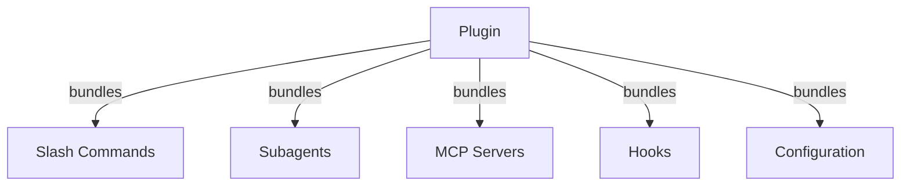
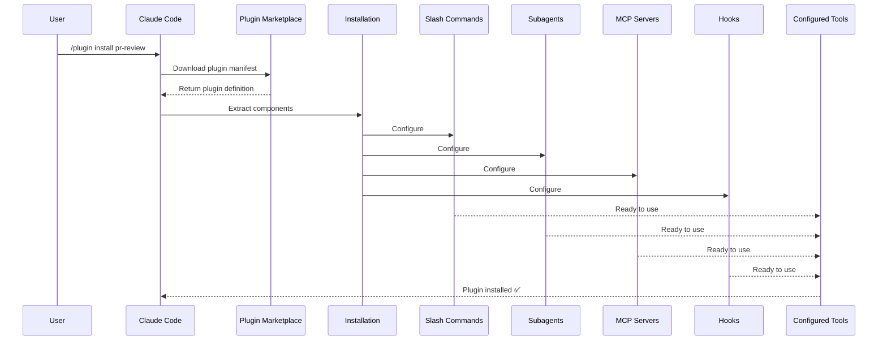
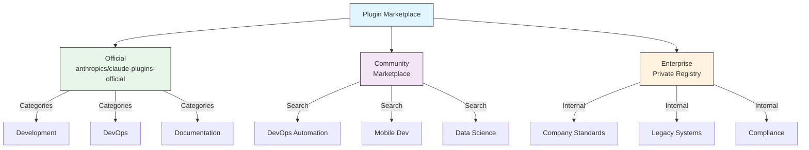
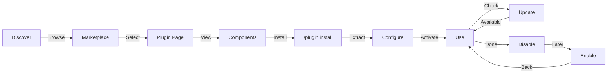
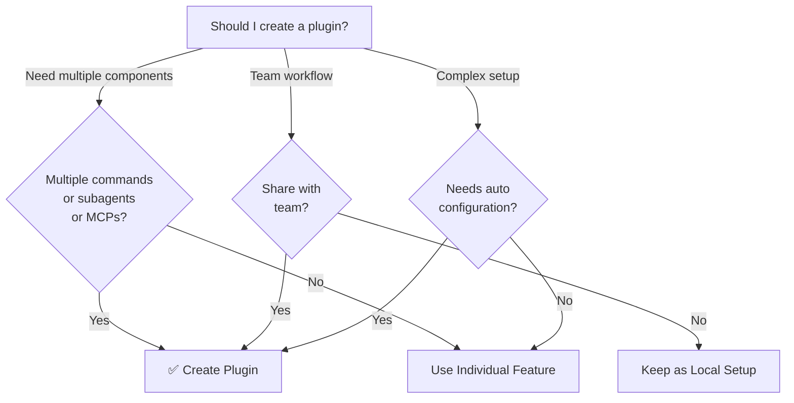

<picture>
  <source media="(prefers-color-scheme: dark)" srcset="../resources/logos/claude-howto-logo-dark.svg">
  
</picture>

# Claude Code 插件（Plugins）

本文件夹包含完整的插件示例，将多个 Claude Code 功能打包为内聚的、可安装的包。

## 概述

Claude Code 插件（Plugins）是自定义功能（斜杠命令、子智能体、MCP 服务器和钩子）的打包集合，只需一条命令即可安装。它们代表了最高层级的扩展机制——将多个功能组合成内聚的、可共享的包。

## 插件架构



## 插件加载流程



## 插件类型与分发

| 类型 | 范围 | 共享 | 权限 | 示例 |
|------|-------|--------|-----------|----------|
| 官方（Official） | 全局 | 所有用户 | Anthropic | PR Review、Security Guidance |
| 社区（Community） | 公开 | 所有用户 | 社区 | DevOps、Data Science |
| 组织（Organization） | 内部 | 团队成员 | 公司 | 内部标准、工具 |
| 个人（Personal） | 个人 | 单一用户 | 开发者 | 自定义工作流 |

## 插件定义结构

插件清单使用 `.claude-plugin/plugin.json` 中的 JSON 格式：

```json
{
  "name": "my-first-plugin",
  "description": "A greeting plugin",
  "version": "1.0.0",
  "author": {
    "name": "Your Name"
  },
  "homepage": "https://example.com",
  "repository": "https://github.com/user/repo",
  "license": "MIT"
}
```

## 插件结构示例

```
my-plugin/
├── .claude-plugin/
│   └── plugin.json       # Manifest (name, description, version, author)
├── commands/             # Skills as Markdown files
│   ├── task-1.md
│   ├── task-2.md
│   └── workflows/
├── agents/               # Custom agent definitions
│   ├── specialist-1.md
│   ├── specialist-2.md
│   └── configs/
├── skills/               # Agent Skills with SKILL.md files
│   ├── skill-1.md
│   └── skill-2.md
├── hooks/                # Event handlers in hooks.json
│   └── hooks.json
├── .mcp.json             # MCP server configurations
├── .lsp.json             # LSP server configurations
├── settings.json         # Default settings
├── templates/
│   └── issue-template.md
├── scripts/
│   ├── helper-1.sh
│   └── helper-2.py
├── docs/
│   ├── README.md
│   └── USAGE.md
└── tests/
    └── plugin.test.js
```

### LSP 服务器配置

插件可以包含语言服务器协议（LSP）支持，以提供实时的代码智能。LSP 服务器在你工作时提供诊断、代码导航和符号信息。

**配置位置**：
- 插件根目录下的 `.lsp.json` 文件
- `plugin.json` 中的内联 `lsp` 键

#### 字段参考

| 字段 | 必需 | 描述 |
|-------|----------|-------------|
| `command` | 是 | LSP 服务器可执行文件（必须在 PATH 中） |
| `extensionToLanguage` | 是 | 将文件扩展名映射到语言 ID |
| `args` | 否 | 服务器的命令行参数 |
| `transport` | 否 | 通信方式：`stdio`（默认）或 `socket` |
| `env` | 否 | 服务器进程的环境变量 |
| `initializationOptions` | 否 | LSP 初始化期间发送的选项 |
| `settings` | 否 | 传递给服务器的工作区配置 |
| `workspaceFolder` | 否 | 覆盖工作区文件夹路径 |
| `startupTimeout` | 否 | 等待服务器启动的最长时间（毫秒） |
| `shutdownTimeout` | 否 | 优雅关闭的最长时间（毫秒） |
| `restartOnCrash` | 否 | 服务器崩溃时自动重启 |
| `maxRestarts` | 否 | 放弃前的最大重启次数 |

#### 配置示例

**Go (gopls)**：

```json
{
  "go": {
    "command": "gopls",
    "args": ["serve"],
    "extensionToLanguage": {
      ".go": "go"
    }
  }
}
```

**Python (pyright)**：

```json
{
  "python": {
    "command": "pyright-langserver",
    "args": ["--stdio"],
    "extensionToLanguage": {
      ".py": "python",
      ".pyi": "python"
    }
  }
}
```

**TypeScript**：

```json
{
  "typescript": {
    "command": "typescript-language-server",
    "args": ["--stdio"],
    "extensionToLanguage": {
      ".ts": "typescript",
      ".tsx": "typescriptreact",
      ".js": "javascript",
      ".jsx": "javascriptreact"
    }
  }
}
```

#### 可用的 LSP 插件

官方市场包含预配置的 LSP 插件：

| 插件 | 语言 | 服务器可执行文件 | 安装命令 |
|--------|----------|---------------|----------------|
| `pyright-lsp` | Python | `pyright-langserver` | `pip install pyright` |
| `typescript-lsp` | TypeScript/JavaScript | `typescript-language-server` | `npm install -g typescript-language-server typescript` |
| `rust-lsp` | Rust | `rust-analyzer` | 通过 `rustup component add rust-analyzer` 安装 |

#### LSP 功能

配置完成后，LSP 服务器提供以下功能：

- **即时诊断** — 编辑后立即显示错误和警告
- **代码导航** — 跳转到定义、查找引用、查看实现
- **悬停信息** — 悬停时显示类型签名和文档
- **符号列表** — 浏览当前文件或工作区中的符号

## 插件选项（v2.1.83+）

插件可以通过清单中的 `userConfig` 声明用户可配置的选项。标记为 `sensitive: true` 的值会存储到系统密钥链中，而非明文设置文件：

```json
{
  "name": "my-plugin",
  "version": "1.0.0",
  "userConfig": {
    "apiKey": {
      "description": "API key for the service",
      "sensitive": true
    },
    "region": {
      "description": "Deployment region",
      "default": "us-east-1"
    }
  }
}
```

## 持久化插件数据（`${CLAUDE_PLUGIN_DATA}`）（v2.1.78+）

插件可以通过 `${CLAUDE_PLUGIN_DATA}` 环境变量访问持久化状态目录。此目录对每个插件是唯一的，并且在会话之间保持不变，适用于缓存、数据库和其他持久化状态：

```json
{
  "hooks": {
    "PostToolUse": [
      {
        "command": "node ${CLAUDE_PLUGIN_DATA}/track-usage.js"
      }
    ]
  }
}
```

该目录在安装插件时自动创建。存储在这里的文件会一直保留，直到插件被卸载。

## 通过设置进行内联插件定义（`source: 'settings'`）（v2.1.80+）

插件可以在设置文件中作为市场条目使用 `source: 'settings'` 字段进行内联定义。这允许直接嵌入插件定义，而无需单独的仓库或市场：

```json
{
  "pluginMarketplaces": [
    {
      "name": "inline-tools",
      "source": "settings",
      "plugins": [
        {
          "name": "quick-lint",
          "source": "./local-plugins/quick-lint"
        }
      ]
    }
  ]
}
```

## 插件设置

插件可以附带一个 `settings.json` 文件来提供默认配置。目前支持 `agent` 键，用于设置插件的主线程智能体：

```json
{
  "agent": "agents/specialist-1.md"
}
```

当插件包含 `settings.json` 时，其默认值会在安装时应用。用户可以在自己的项目或用户配置中覆盖这些设置。

## 独立方式 vs 插件方式

| 方式 | 命令名称 | 配置 | 最佳用途 |
|----------|---------------|---|---|
| **独立方式** | `/hello` | 在 CLAUDE.md 中手动设置 | 个人、项目特定 |
| **插件方式** | `/plugin-name:hello` | 通过 plugin.json 自动配置 | 共享、分发、团队使用 |

对于快速的个人工作流，使用**独立斜杠命令**。当你想将多个功能打包、与团队分享或发布分发时，使用**插件**。

## 实际示例

### 示例 1：PR 审查插件

**文件：** `.claude-plugin/plugin.json`

```json
{
  "name": "pr-review",
  "version": "1.0.0",
  "description": "Complete PR review workflow with security, testing, and docs",
  "author": {
    "name": "Anthropic"
  },
  "repository": "https://github.com/your-org/pr-review",
  "license": "MIT"
}
```

**文件：** `commands/review-pr.md`

```markdown
---
name: Review PR
description: Start comprehensive PR review with security and testing checks
---

# PR Review

This command initiates a complete pull request review including:

1. Security analysis
2. Test coverage verification
3. Documentation updates
4. Code quality checks
5. Performance impact assessment
```

**文件：** `agents/security-reviewer.md`

```yaml
---
name: security-reviewer
description: Security-focused code review
tools: read, grep, diff
---

# Security Reviewer

Specializes in finding security vulnerabilities:
- Authentication/authorization issues
- Data exposure
- Injection attacks
- Secure configuration
```

**安装：**

```bash
/plugin install pr-review

# Result:
# ✅ 3 slash commands installed
# ✅ 3 subagents configured
# ✅ 2 MCP servers connected
# ✅ 4 hooks registered
# ✅ Ready to use!
```

### 示例 2：DevOps 插件

**组件：**

```
devops-automation/
├── commands/
│   ├── deploy.md
│   ├── rollback.md
│   ├── status.md
│   └── incident.md
├── agents/
│   ├── deployment-specialist.md
│   ├── incident-commander.md
│   └── alert-analyzer.md
├── mcp/
│   ├── github-config.json
│   ├── kubernetes-config.json
│   └── prometheus-config.json
├── hooks/
│   ├── pre-deploy.js
│   ├── post-deploy.js
│   └── on-error.js
└── scripts/
    ├── deploy.sh
    ├── rollback.sh
    └── health-check.sh
```

### 示例 3：文档插件

**打包的组件：**

```
documentation/
├── commands/
│   ├── generate-api-docs.md
│   ├── generate-readme.md
│   ├── sync-docs.md
│   └── validate-docs.md
├── agents/
│   ├── api-documenter.md
│   ├── code-commentator.md
│   └── example-generator.md
├── mcp/
│   ├── github-docs-config.json
│   └── slack-announce-config.json
└── templates/
    ├── api-endpoint.md
    ├── function-docs.md
    └── adr-template.md
```

## 插件市场

官方由 Anthropic 管理的插件目录是 `anthropics/claude-plugins-official`。企业管理员还可以创建私有插件市场用于内部分发。



### 市场配置

企业和高阶用户可以通过设置控制市场行为：

| 设置 | 描述 |
|---------|-------------|
| `extraKnownMarketplaces` | 添加默认值之外的额外市场源 |
| `strictKnownMarketplaces` | 控制允许用户添加哪些市场 |
| `deniedPlugins` | 管理员管理的阻止列表，防止安装特定插件 |

### 其他市场功能

- **默认 git 超时**：从 30 秒增加到 120 秒，适用于大型插件仓库
- **自定义 npm 注册表**：插件可以指定自定义 npm 注册表 URL 用于依赖解析
- **版本锁定**：将插件锁定到特定版本以实现可复现的环境

### 市场定义模式

插件市场在 `.claude-plugin/marketplace.json` 中定义：

```json
{
  "name": "my-team-plugins",
  "owner": "my-org",
  "plugins": [
    {
      "name": "code-standards",
      "source": "./plugins/code-standards",
      "description": "Enforce team coding standards",
      "version": "1.2.0",
      "author": "platform-team"
    },
    {
      "name": "deploy-helper",
      "source": {
        "source": "github",
        "repo": "my-org/deploy-helper",
        "ref": "v2.0.0"
      },
      "description": "Deployment automation workflows"
    }
  ]
}
```

| 字段 | 必需 | 描述 |
|-------|----------|-------------|
| `name` | 是 | 市场名称（kebab-case） |
| `owner` | 是 | 维护该市场的组织或用户 |
| `plugins` | 是 | 插件条目数组 |
| `plugins[].name` | 是 | 插件名称（kebab-case） |
| `plugins[].source` | 是 | 插件源（路径字符串或源对象） |
| `plugins[].description` | 否 | 插件简要描述 |
| `plugins[].version` | 否 | 语义化版本字符串 |
| `plugins[].author` | 否 | 插件作者名称 |

### 插件源类型

插件可以来自多个位置：

| 来源 | 语法 | 示例 |
|--------|--------|---------|
| **相对路径** | 字符串路径 | `"./plugins/my-plugin"` |
| **GitHub** | `{ "source": "github", "repo": "owner/repo" }` | `{ "source": "github", "repo": "acme/lint-plugin", "ref": "v1.0" }` |
| **Git URL** | `{ "source": "url", "url": "..." }` | `{ "source": "url", "url": "https://git.internal/plugin.git" }` |
| **Git 子目录** | `{ "source": "git-subdir", "url": "...", "path": "..." }` | `{ "source": "git-subdir", "url": "https://github.com/org/monorepo.git", "path": "packages/plugin" }` |
| **npm** | `{ "source": "npm", "package": "..." }` | `{ "source": "npm", "package": "@acme/claude-plugin", "version": "^2.0" }` |
| **pip** | `{ "source": "pip", "package": "..." }` | `{ "source": "pip", "package": "claude-data-plugin", "version": ">=1.0" }` |

GitHub 和 git 源支持可选的 `ref`（分支/标签）和 `sha`（提交哈希）字段，用于版本锁定。

### 分发方式

**GitHub（推荐）**：
```bash
# 用户添加你的市场
/plugin marketplace add owner/repo-name
```

**其他 git 服务**（需要完整 URL）：
```bash
/plugin marketplace add https://gitlab.com/org/marketplace-repo.git
```

**私有仓库**：支持通过 git 凭据助手或环境变量令牌。用户必须对仓库拥有读取权限。

**官方市场提交**：将插件提交到 Anthropic 策展的官方市场，以获得更广泛的分发。

### 严格模式

控制市场定义与本地 `plugin.json` 文件的交互方式：

| 设置 | 行为 |
|---------|----------|
| `strict: true`（默认） | 本地 `plugin.json` 是权威来源；市场条目作为补充 |
| `strict: false` | 市场条目是完整的插件定义 |

**组织限制**（`strictKnownMarketplaces`）：

| 值 | 效果 |
|-------|--------|
| 未设置 | 无限制 — 用户可以添加任何市场 |
| 空数组 `[]` | 锁定 — 不允许任何市场 |
| 模式数组 | 白名单 — 只允许匹配的市场添加 |

```json
{
  "strictKnownMarketplaces": [
    "my-org/*",
    "github.com/trusted-vendor/*"
  ]
}
```

> **警告**：在使用 `strictKnownMarketplaces` 的严格模式下，用户只能从白名单市场安装插件。这适用于需要受控插件分发的企业环境。

## 插件安装与生命周期



## 插件功能对比

| 功能 | 斜杠命令 | 技能（Skill） | 子智能体 | 插件 |
|---------|---------------|-------|----------|--------|
| **安装** | 手动复制 | 手动复制 | 手动配置 | 一条命令 |
| **设置时间** | 5 分钟 | 10 分钟 | 15 分钟 | 2 分钟 |
| **打包** | 单文件 | 单文件 | 单文件 | 多组件 |
| **版本管理** | 手动 | 手动 | 手动 | 自动 |
| **团队共享** | 复制文件 | 复制文件 | 复制文件 | 安装 ID |
| **更新** | 手动 | 手动 | 手动 | 自动可用 |
| **依赖** | 无 | 无 | 无 | 可能包含 |
| **市场** | 否 | 否 | 否 | 是 |
| **分发** | 仓库 | 仓库 | 仓库 | 市场 |

## 插件 CLI 命令

所有插件操作均可通过 CLI 命令完成：

```bash
claude plugin install <name>@<marketplace>   # 从市场安装
claude plugin uninstall <name>               # 移除插件
claude plugin list                           # 列出已安装的插件
claude plugin enable <name>                  # 启用已禁用的插件
claude plugin disable <name>                 # 禁用插件
claude plugin validate                       # 验证插件结构
```

## 安装方式

### 从市场安装
```bash
/plugin install plugin-name
# 或使用 CLI：
claude plugin install plugin-name@marketplace-name
```

### 启用 / 禁用（自动检测范围）
```bash
/plugin enable plugin-name
/plugin disable plugin-name
```

### 本地插件（用于开发）
```bash
# CLI 标志用于本地测试（可重复使用以加载多个插件）
claude --plugin-dir ./path/to/plugin
claude --plugin-dir ./plugin-a --plugin-dir ./plugin-b
```

### 从 Git 仓库安装
```bash
/plugin install github:username/repo
```

## 何时创建插件



### 插件使用场景

| 使用场景 | 推荐 | 原因 |
|----------|-----------------|-----|
| **团队入职** | ✅ 使用插件 | 即时设置，完整配置 |
| **框架搭建** | ✅ 使用插件 | 打包框架特定命令 |
| **企业标准** | ✅ 使用插件 | 集中分发，版本控制 |
| **快速任务自动化** | ❌ 使用命令 | 复杂度太大 |
| **单一领域专业知识** | ❌ 使用技能（Skill） | 过于沉重，改用技能 |
| **专业分析** | ❌ 使用子智能体 | 手动创建或使用技能 |
| **实时数据访问** | ❌ 使用 MCP | 独立运行，无需打包 |

## 测试插件

在发布之前，使用 `--plugin-dir` CLI 标志（可重复使用以加载多个插件）在本地测试你的插件：

```bash
claude --plugin-dir ./my-plugin
claude --plugin-dir ./my-plugin --plugin-dir ./another-plugin
```

这将启动 Claude Code 并加载你的插件，使你可以：
- 验证所有斜杠命令是否可用
- 测试子智能体和智能体是否正常运行
- 确认 MCP 服务器正确连接
- 验证钩子执行
- 检查 LSP 服务器配置
- 检查是否有任何配置错误

## 热重载

插件在开发期间支持热重载。当你修改插件文件时，Claude Code 可以自动检测更改。你也可以手动强制重载：

```bash
/reload-plugins
```

这将重新读取所有插件清单、命令、智能体、技能、钩子以及 MCP/LSP 配置，无需重新启动会话。

## 插件的管理设置

管理员可以使用管理设置在整个组织范围内控制插件行为：

| 设置 | 描述 |
|---------|-------------|
| `enabledPlugins` | 默认启用的插件白名单 |
| `deniedPlugins` | 不能安装的插件黑名单 |
| `extraKnownMarketplaces` | 添加默认值之外的额外市场源 |
| `strictKnownMarketplaces` | 限制允许用户添加哪些市场 |
| `allowedChannelPlugins` | 控制每个发布渠道允许哪些插件 |

这些设置可以通过管理配置文件在组织级别应用，并优先于用户级别设置。

## 插件安全

插件子智能体在受限沙箱中运行。以下 frontmatter 键在插件子智能体定义中**不被允许**：

- `hooks` -- 子智能体不能注册事件处理器
- `mcpServers` -- 子智能体不能配置 MCP 服务器
- `permissionMode` -- 子智能体不能覆盖权限模型

这确保了插件无法提升权限或修改宿主环境，超出其声明的范围。

## 发布插件

**发布步骤：**

1. 创建包含所有组件的插件结构
2. 编写 `.claude-plugin/plugin.json` 清单
3. 创建包含文档的 `README.md`
4. 使用 `claude --plugin-dir ./my-plugin` 在本地测试
5. 提交到插件市场
6. 等待审核和批准
7. 在市场发布
8. 用户可通过一条命令安装

**提交示例：**

```markdown
# PR Review Plugin

## Description
Complete PR review workflow with security, testing, and documentation checks.

## What's Included
- 3 slash commands for different review types
- 3 specialized subagents
- GitHub and CodeQL MCP integration
- Automated security scanning hooks

## Installation
```bash
/plugin install pr-review
```

## Features
✅ Security analysis
✅ Test coverage checking
✅ Documentation verification
✅ Code quality assessment
✅ Performance impact analysis

## Usage
```bash
/review-pr
/check-security
/check-tests
```

## Requirements
- Claude Code 1.0+
- GitHub access
- CodeQL (optional)
```

## 插件 vs 手动配置

**手动设置（2 小时以上）：**
- 逐个安装斜杠命令
- 分别创建子智能体
- 单独配置 MCP
- 手动设置钩子
- 记录一切
- 与团队分享（希望他们配置正确）

**使用插件（2 分钟）：**
```bash
/plugin install pr-review
# ✅ 所有内容均已安装和配置
# ✅ 立即可用
# ✅ 团队可以复现完全相同的设置
```

## 最佳实践

### 建议 ✅
- 使用清晰、描述性的插件名称
- 包含全面的 README
- 正确进行版本管理（语义化版本）
- 一起测试所有组件
- 清晰记录依赖和要求
- 提供使用示例
- 包含错误处理
- 添加适当的标签以便发现
- 维护向后兼容性
- 保持插件聚焦且内聚
- 包含全面的测试
- 记录所有依赖关系

### 避免 ❌
- 不要打包不相关的功能
- 不要硬编码凭据
- 不要跳过测试
- 不要忘记文档
- 不要创建冗余插件
- 不要忽视版本管理
- 不要过度复杂化组件依赖
- 不要忘记优雅地处理错误

## 安装说明

### 从市场安装

1. **浏览可用插件：**
   ```bash
   /plugin list
   ```

2. **查看插件详情：**
   ```bash
   /plugin info plugin-name
   ```

3. **安装插件：**
   ```bash
   /plugin install plugin-name
   ```

### 从本地路径安装

```bash
/plugin install ./path/to/plugin-directory
```

### 从 GitHub 安装

```bash
/plugin install github:username/repo
```

### 列出已安装的插件

```bash
/plugin list --installed
```

### 更新插件

```bash
/plugin update plugin-name
```

### 禁用/启用插件

```bash
# 临时禁用
/plugin disable plugin-name

# 重新启用
/plugin enable plugin-name
```

### 卸载插件

```bash
/plugin uninstall plugin-name
```

## 相关概念

以下 Claude Code 功能与插件协同工作：

- **[斜杠命令（Slash Commands）](../01-slash-commands/)** — 打包在插件中的独立命令
- **[记忆（Memory）](../02-memory/)** — 插件的持久化上下文
- **[技能（Skills）](../03-skills/)** — 可打包为插件的领域专业知识
- **[子智能体（Subagents）](../04-subagents/)** — 作为插件组件包含的专业智能体
- **[MCP 服务器（MCP Servers）](../05-mcp/)** — 打包在插件中的模型上下文协议集成
- **[钩子（Hooks）](../06-hooks/)** — 触发插件工作流的事件处理器

## 完整示例工作流

### PR 审查插件完整工作流

```
1. User: /review-pr

2. Plugin executes:
   ├── pre-review.js hook validates git repo
   ├── GitHub MCP fetches PR data
   ├── security-reviewer subagent analyzes security
   ├── test-checker subagent verifies coverage
   └── performance-analyzer subagent checks performance

3. Results synthesized and presented:
   ✅ Security: No critical issues
   ⚠️  Testing: Coverage 65% (recommend 80%+)
   ✅ Performance: No significant impact
   📝 12 recommendations provided
```

## 故障排除

### 插件无法安装
- 检查 Claude Code 版本兼容性：`/version`
- 使用 JSON 验证器验证 `plugin.json` 语法
- 检查网络连接（远程插件）
- 检查权限：`ls -la plugin/`

### 组件未加载
- 验证 `plugin.json` 中的路径与实际目录结构匹配
- 检查文件权限：`chmod +x scripts/`
- 检查组件文件语法
- 查看日志：`/plugin debug plugin-name`

### MCP 连接失败
- 验证环境变量是否正确设置
- 检查 MCP 服务器的安装和运行状态
- 使用 `/mcp test` 独立测试 MCP 连接
- 检查 `mcp/` 目录中的 MCP 配置

### 安装后命令不可用
- 确认插件已成功安装：`/plugin list --installed`
- 检查插件是否已启用：`/plugin status plugin-name`
- 重启 Claude Code：`exit` 并重新打开
- 检查是否与现有命令存在命名冲突

### 钩子执行问题
- 验证钩子文件具有正确的权限
- 检查钩子语法和事件名称
- 查看钩子日志以获取错误详情
- 如果可能，手动测试钩子

## 其他资源

- [官方插件文档](https://code.claude.com/docs/en/plugins)
- [发现插件](https://code.claude.com/docs/en/discover-plugins)
- [插件市场](https://code.claude.com/docs/en/plugin-marketplaces)
- [插件参考](https://code.claude.com/docs/en/plugins-reference)
- [MCP 服务器参考](https://modelcontextprotocol.io/)
- [子智能体配置指南](../04-subagents/README.zh-CN.md)
- [钩子系统参考](../06-hooks/README.zh-CN.md)
