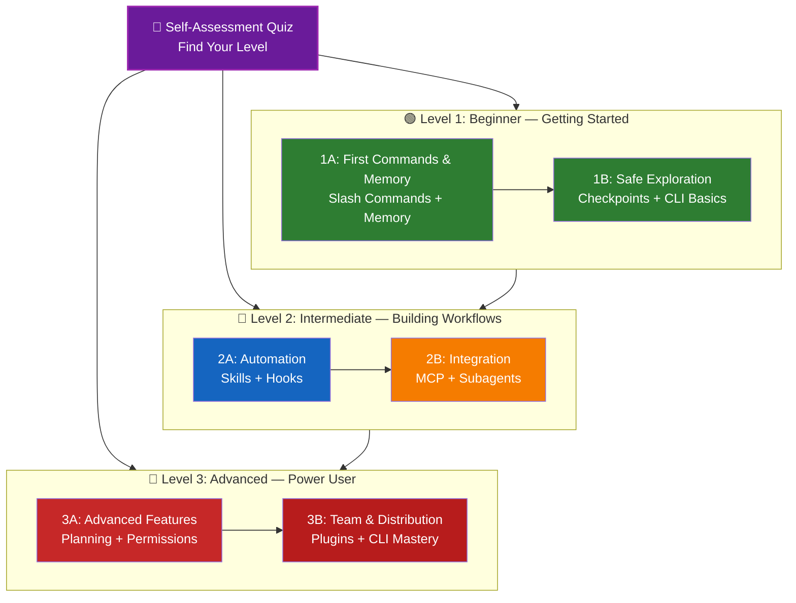

<picture>
  <source media="(prefers-color-scheme: dark)" srcset="resources/logos/claude-howto-logo-dark.svg">
  
</picture>

# 📚 Claude Code 学习路线图

**刚接触 Claude Code？** 这份指南将帮助你按照自己的节奏掌握 Claude Code 的各项功能。无论你是完全的新手还是有经验的开发者，都可以通过下面的自测问卷找到适合自己的学习路径。

---

## 🧭 确定你的起点

每个人的起点不同。通过以下快速自测找到适合你的入口。

**诚实地回答这些问题：**

- [ ] 我能启动 Claude Code 并进行对话（`claude`）
- [ ] 我创建或编辑过 CLAUDE.md 文件
- [ ] 我至少使用过 3 个内置斜杠命令（如 /help、/compact、/model）
- [ ] 我创建过自定义斜杠命令或技能（SKILL.md）
- [ ] 我配置过 MCP 服务器（如 GitHub、数据库）
- [ ] 我在 ~/.claude/settings.json 中设置过钩子
- [ ] 我创建或使用过自定义子智能体（.claude/agents/）
- [ ] 我使用过打印模式（`claude -p`）进行脚本编写或 CI/CD

**你的级别：**

| 勾选数 | 级别 | 从这里开始 | 预计完成时间 |
|--------|-------|----------|------------------|
| 0-2 | **级别 1：新手** —— 入门指南 | [里程碑 1A](#milestone-1a-first-commands--memory) | 约 3 小时 |
| 3-5 | **级别 2：中级** —— 构建工作流 | [里程碑 2A](#milestone-2a-automation-skills--hooks) | 约 5 小时 |
| 6-8 | **级别 3：高级** —— 高级用户和团队领导者 | [里程碑 3A](#milestone-3a-advanced-features) | 约 5 小时 |

> **提示**：如果不确定，从低一级开始。快速回顾熟悉的内容比遗漏基础概念要好。

> **互动版本**：在 Claude Code 中运行 `/self-assessment`，获取互动式测验，它可以为 10 个功能领域评分并生成个性化学习路径。

---

## 🎯 学习理念

本仓库中的文件夹编号代表了**推荐学习顺序**，基于三个关键原则：

1. **依赖关系** —— 基础概念优先
2. **复杂度** —— 简单的功能在高级功能之前
3. **使用频率** —— 最常用的功能最早学习

这种方法确保你打下坚实基础的同时获得即时生产力。

---

## 🗺️ 你的学习路径



**图例说明：**
- 💜 紫色：自测问卷
- 🟢 绿色：级别 1 —— 新手路径
- 🔵 蓝色 / 🟡 金色：级别 2 —— 中级路径
- 🔴 红色：级别 3 —— 高级路径

---

## 📊 完整路线图表格

| 步骤 | 功能 | 复杂度 | 时间 | 级别 | 依赖项 | 学习理由 | 核心收益 |
|------|---------|-----------|------|-------|--------------|----------------|--------------|
| **1** | [斜杠命令](01-slash-commands/) | ⭐ 新手 | 30 分钟 | 级别 1 | 无 | 快速提升效率（55+ 内置斜杠命令 + 5 个捆绑技能） | 即时自动化、团队规范 |
| **2** | [记忆](02-memory/) | ⭐⭐ 新手+ | 45 分钟 | 级别 1 | 无 | 所有功能的基础 | 持久上下文、偏好设置 |
| **3** | [检查点](08-checkpoints/) | ⭐⭐ 中级 | 45 分钟 | 级别 1 | 会话管理 | 安全探索 | 实验、恢复 |
| **4** | [CLI 基础](10-cli/) | ⭐⭐ 新手+ | 30 分钟 | 级别 1 | 无 | 核心 CLI 使用 | 交互模式和打印模式 |
| **5** | [技能](03-skills/) | ⭐⭐ 中级 | 1 小时 | 级别 2 | 斜杠命令 | 自动触发专业能力 | 可复用功能、一致性 |
| **6** | [钩子](06-hooks/) | ⭐⭐ 中级 | 1 小时 | 级别 2 | 工具、命令 | 工作流自动化（25 个事件，4 种类型） | 验证、质量检查 |
| **7** | [MCP](05-mcp/) | ⭐⭐⭐ 中级+ | 1 小时 | 级别 2 | 配置 | 实时数据访问 | 实时集成、API |
| **8** | [子智能体](04-subagents/) | ⭐⭐⭐ 中级+ | 1.5 小时 | 级别 2 | 记忆、命令 | 复杂任务处理（6 个内置，包括 Bash） | 委派、专业领域知识 |
| **9** | [高级功能](09-advanced-features/) | ⭐⭐⭐⭐⭐ 高级 | 2-3 小时 | 级别 3 | 前面所有内容 | 高级用户工具 | 规划、自动模式、频道、语音输入、权限 |
| **10** | [插件](07-plugins/) | ⭐⭐⭐⭐ 高级 | 2 小时 | 级别 3 | 前面所有内容 | 完整解决方案 | 团队入职、发布分发 |
| **11** | [CLI 精通](10-cli/) | ⭐⭐⭐ 高级 | 1 小时 | 级别 3 | 推荐：全部 | 掌握命令行使用 | 脚本、CI/CD、自动化 |

**总学习时间**：约 11-13 小时（或跳至你的级别以节省时间）

---

## 🟢 级别 1：新手 —— 入门指南

**适合**：自测勾选数为 0-2 项的用户
**时间**：约 3 小时
**重点**：即时效率、理解基础知识
**目标**：成为日常使用户，准备好进入级别 2

### Milestone 1A: First Commands & Memory

**主题**：斜杠命令 + 记忆
**时间**：1-2 小时
**复杂度**：⭐ 新手
**目标**：通过自定义命令和持久上下文实现即时生产力提升

#### 你将实现的目标
✅ 为重复性任务创建自定义斜杠命令
✅ 为团队标准设置项目记忆
✅ 配置个人偏好
✅ 理解 Claude 如何自动加载上下文

#### 动手练习

```bash
# Exercise 1: Install your first slash command
mkdir -p .claude/commands
cp 01-slash-commands/optimize.md .claude/commands/

# Exercise 2: Create project memory
cp 02-memory/project-CLAUDE.md ./CLAUDE.md

# Exercise 3: Try it out
# In Claude Code, type: /optimize
```

#### 成功标准
- [ ] 成功调用 `/optimize` 命令
- [ ] Claude 能从 CLAUDE.md 记住你的项目标准
- [ ] 你理解何时使用斜杠命令与记忆

#### 下一步
熟悉之后，阅读：
- [01-slash-commands/README.md](01-slash-commands/README.md)
- [02-memory/README.md](02-memory/README.md)

> **检验你的理解**：在 Claude Code 中运行 `/lesson-quiz slash-commands` 或 `/lesson-quiz memory` 来测试你学到了什么。

---

### Milestone 1B: Safe Exploration

**主题**：检查点 + CLI 基础
**时间**：1 小时
**复杂度**：⭐⭐ 新手+
**目标**：学习安全地实验和使用核心 CLI 命令

#### 你将实现的目标
✅ 创建和恢复检查点以安全地进行实验
✅ 理解交互模式与打印模式的区别
✅ 使用基本的 CLI 标志和选项
✅ 通过管道处理文件

#### 动手练习

```bash
# Exercise 1: Try checkpoint workflow
# In Claude Code:
# Make some experimental changes, then press Esc+Esc or use /rewind
# Select the checkpoint before your experiment
# Choose "Restore code and conversation" to go back

# Exercise 2: Interactive vs Print mode
claude "explain this project"           # Interactive mode
claude -p "explain this function"       # Print mode (non-interactive)

# Exercise 3: Process file content via piping
cat error.log | claude -p "explain this error"
```

#### 成功标准
- [ ] 创建并回退到一个检查点
- [ ] 使用过交互模式和打印模式
- [ ] 将文件通过管道传递给 Claude 进行分析
- [ ] 理解何时使用检查点进行安全实验

#### 下一步
- 阅读：[08-checkpoints/README.md](08-checkpoints/README.md)
- 阅读：[10-cli/README.md](10-cli/README.md)
- **准备好进入级别 2！** 继续前往 [里程碑 2A](#milestone-2a-automation-skills--hooks)

> **检验你的理解**：运行 `/lesson-quiz checkpoints` 或 `/lesson-quiz cli` 来确认你已准备好进入级别 2。

---

## 🔵 级别 2：中级 —— 构建工作流

**适合**：自测勾选数为 3-5 项的用户
**时间**：约 5 小时
**重点**：自动化、集成、任务委派
**目标**：自动化工作流、外部集成、准备好进入级别 3

### 前置条件检查

开始级别 2 之前，请确认你已掌握以下级别 1 的概念：

- [ ] 会创建和使用斜杠命令（[01-slash-commands/](01-slash-commands/)）
- [ ] 已通过 CLAUDE.md 设置了项目记忆（[02-memory/](02-memory/)）
- [ ] 知道如何创建和恢复检查点（[08-checkpoints/](08-checkpoints/)）
- [ ] 能在命令行使用 `claude` 和 `claude -p`（[10-cli/](10-cli/)）

> **有遗漏？** 在继续之前复习上面链接的教程。

---

### Milestone 2A: Automation (Skills + Hooks)

**主题**：技能 + 钩子
**时间**：2-3 小时
**复杂度**：⭐⭐ 中级
**目标**：自动化常见工作流和质量检查

#### 你将实现的目标
✅ 通过 YAML frontmatter（包括 `effort` 和 `shell` 字段）自动触发专业能力
✅ 在 25 个钩子事件上设置事件驱动自动化
✅ 使用全部 4 种钩子类型（command、http、prompt、agent）
✅ 执行代码质量标准
✅ 为你的工作流创建自定义钩子

#### 动手练习

```bash
# Exercise 1: Install a skill
cp -r 03-skills/code-review ~/.claude/skills/

# Exercise 2: Set up hooks
mkdir -p ~/.claude/hooks
cp 06-hooks/pre-tool-check.sh ~/.claude/hooks/
chmod +x ~/.claude/hooks/pre-tool-check.sh

# Exercise 3: Configure hooks in settings
# Add to ~/.claude/settings.json:
{
  "hooks": {
    "PreToolUse": [
      {
        "matcher": "Bash",
        "hooks": [
          {
            "type": "command",
            "command": "~/.claude/hooks/pre-tool-check.sh"
          }
        ]
      }
    ]
  }
}
```

#### 成功标准
- [ ] 代码审查技能在相关时自动被调用
- [ ] PreToolUse 钩子在工具执行前运行
- [ ] 你理解技能自动触发与钩子事件触发的区别

#### 下一步
- 创建你自己的自定义技能
- 为你的工作流设置额外的钩子
- 阅读：[03-skills/README.md](03-skills/README.md)
- 阅读：[06-hooks/README.md](06-hooks/README.md)

> **检验你的理解**：运行 `/lesson-quiz skills` 或 `/lesson-quiz hooks` 来测试你的知识再继续。

---

### Milestone 2B: Integration (MCP + Subagents)

**主题**：MCP + 子智能体
**时间**：2-3 小时
**复杂度**：⭐⭐⭐ 中级+
**目标**：集成外部服务和委派复杂任务

#### 你将实现的目标
✅ 从 GitHub、数据库等获取实时数据
✅ 将工作委派给专业化的 AI 智能体
✅ 理解何时使用 MCP 与子智能体
✅ 构建集成工作流

#### 动手练习

```bash
# Exercise 1: Set up GitHub MCP
export GITHUB_TOKEN="your_github_token"
claude mcp add github -- npx -y @modelcontextprotocol/server-github

# Exercise 2: Test MCP integration
# In Claude Code: /mcp__github__list_prs

# Exercise 3: Install subagents
mkdir -p .claude/agents
cp 04-subagents/*.md .claude/agents/
```

#### 集成练习
尝试这个完整的工作流：
1. 使用 MCP 获取 GitHub PR
2. 让 Claude 将审查任务委派给 code-reviewer 子智能体
3. 使用钩子自动运行测试

#### 成功标准
- [ ] 通过 MCP 成功查询 GitHub 数据
- [ ] Claude 将复杂任务委派给子智能体
- [ ] 你理解 MCP 和子智能体之间的区别
- [ ] 在工作流中组合使用 MCP + 子智能体 + 钩子

#### 下一步
- 设置更多 MCP 服务器（数据库、Slack 等）
- 为你的领域创建自定义子智能体
- 阅读：[05-mcp/README.md](05-mcp/README.md)
- 阅读：[04-subagents/README.md](04-subagents/README.md)
- **准备好进入级别 3！** 继续前往 [里程碑 3A](#milestone-3a-advanced-features)

> **检验你的理解**：运行 `/lesson-quiz mcp` 或 `/lesson-quiz subagents` 来确认你已准备好进入级别 3。

---

## 🔴 级别 3：高级 —— 高级用户和团队领导者

**适合**：自测勾选数为 6-8 项的用户
**时间**：约 5 小时
**重点**：团队工具、CI/CD、企业级功能、插件开发
**目标**：高级用户，能设置团队工作流和 CI/CD

### 前置条件检查

开始级别 3 之前，请确认你已掌握以下级别 2 的概念：

- [ ] 会创建和使用带自动触发的技能（[03-skills/](03-skills/)）
- [ ] 已为事件驱动自动化设置过钩子（[06-hooks/](06-hooks/)）
- [ ] 能为外部数据配置 MCP 服务器（[05-mcp/](05-mcp/)）
- [ ] 知道如何运用子智能体进行任务委派（[04-subagents/](04-subagents/)）

> **有遗漏？** 在继续之前复习上面链接的教程。

---

### Milestone 3A: Advanced Features

**主题**：高级功能（规划、权限、扩展思考、自动模式、频道、语音输入、远程/桌面/Web）
**时间**：2-3 小时
**复杂度**：⭐⭐⭐⭐⭐ 高级
**目标**：掌握高级工作流和高级用户工具

#### 你将实现的目标
✅ 规划模式处理复杂功能
✅ 精细的权限控制，支持 6 种模式（default、acceptEdits、plan、auto、dontAsk、bypassPermissions）
✅ 通过 Alt+T / Option+T 切换扩展思考
✅ 后台任务管理
✅ 自动学习偏好的记忆功能
✅ 带有后台安全分类器的自动模式
✅ 频道——结构化多会话工作流
✅ 语音输入——免手操作交互
✅ 远程控制、桌面应用和 Web 会话
✅ Agent Teams 多智能体协作

#### 动手练习

```bash
# Exercise 1: Use planning mode
/plan Implement user authentication system

# Exercise 2: Try permission modes (6 available: default, acceptEdits, plan, auto, dontAsk, bypassPermissions)
claude --permission-mode plan "analyze this codebase"
claude --permission-mode acceptEdits "refactor the auth module"
claude --permission-mode auto "implement the feature"

# Exercise 3: Enable extended thinking
# Press Alt+T (Option+T on macOS) during a session to toggle

# Exercise 4: Advanced checkpoint workflow
# 1. Create checkpoint "Clean state"
# 2. Use planning mode to design a feature
# 3. Implement with subagent delegation
# 4. Run tests in background
# 5. If tests fail, rewind to checkpoint
# 6. Try alternative approach

# Exercise 5: Try auto mode (background safety classifier)
claude --permission-mode auto "implement user settings page"

# Exercise 6: Enable agent teams
export CLAUDE_AGENT_TEAMS=1
# Ask Claude: "Implement feature X using a team approach"

# Exercise 7: Scheduled tasks
/loop 5m /check-status
# Or use CronCreate for persistent scheduled tasks

# Exercise 8: Channels for multi-session workflows
# Use channels to organize work across sessions

# Exercise 9: Voice Dictation
# Use voice input for hands-free interaction with Claude Code
```

#### 成功标准
- [ ] 对复杂功能使用过规划模式
- [ ] 配置过权限模式（plan、acceptEdits、auto、dontAsk）
- [ ] 能用 Alt+T / Option+T 切换扩展思考
- [ ] 使用过带后台安全检查分类器的自动模式
- [ ] 对长时使用后台任务
- [ ] 探索过用于多会话工作流的频道
- [ ] 尝试过免手输入的语音输入
- [ ] 理解远程控制、桌面应用和 Web 会话
- [ ] 为协作任务启用并使用了 Agent Teams
- [ ] 能使用 `/loop` 重复任务或定时监控

---

### Milestone 3B: Team & Distribution (Plugins + CLI Mastery)

**主题**：插件 + CLI 精通 + CI/CD
**时间**：2-3 小时
**复杂度**：⭐⭐⭐⭐ 高级
**目标**：构建团队工具、创建插件、掌握 CI/CD 集成

#### 你将实现的目标
✅ 安装和创建完整的捆绑插件
✅ 掌握 CLI 用于脚本和自动化
✅ 通过 `claude -p` 设置 CI/CD 集成
✅ 为自动化管道输出 JSON
✅ 会话管理和批处理

#### 动手练习

```bash
# Exercise 1: Install a complete plugin
# In Claude Code: /plugin install pr-review

# Exercise 2: Print mode for CI/CD
claude -p "Run all tests and generate report"

# Exercise 3: JSON output for scripts
claude -p --output-format json "list all functions"

# Exercise 4: Session management and resumption
claude -r "feature-auth" "continue implementation"

# Exercise 5: CI/CD integration with constraints
claude -p --max-turns 3 --output-format json "review code"

# Exercise 6: Batch processing
for file in *.md; do
  claude -p --output-format json "summarize this: $(cat $file)" > ${file%.md}.summary.json
done
```

#### CI/CD 集成练习
创建一个简单的 CI/CD 脚本：
1. 使用 `claude -p` 审查已变更的文件
2. 以 JSON 输出结果
3. 用 `jq` 处理特定问题
4. 集成到 GitHub Actions 工作流中

#### 成功标准
- [ ] 安装过并使用过插件
- [ ] 为团队构建或修改过插件
- [ ] 在 CI/CD 中使用过打印模式（`claude -p`）
- [ ] 生成过用于脚本编写的 JSON 输出
- [ ] 成功恢复过之前的会话
- [ ] 创建过批处理脚本
- [ ] 将 Claude 集成到 CI/CD 工作流中

#### CLI 的真实使用场景
- **代码审查自动化**：在 CI/CD 流水线中运行代码审查
- **日志分析**：分析错误日志和系统输出
- **文档生成**：批量生成文档
- **测试洞察**：分析测试失败
- **性能分析**：审查性能指标
- **数据处理**：转换和分析数据文件

#### 下一步
- 阅读：[07-plugins/README.md](07-plugins/README.md)
- 阅读：[10-cli/README.md](10-cli/README.md)
- 创建团队范围的 CLI 快捷方式和插件
- 设置批处理脚本

> **检验你的理解**：运行 `/lesson-quiz plugins` 或 `/lesson-quiz cli` 来确认你已熟练掌握。

---

## 🧪 测试你的知识

本仓库包含两个互动技能，你可以在 Claude Code 中随时用来评估你的理解：

| 技能 | 命令 | 用途 |
|-------|---------|---------|
| **自测问卷** | `/self-assessment` | 评估你在所有 10 个功能领域的整体熟练度。选择快速（2 分钟）或深入（5 分钟）模式，获取个性化技能档案和学习路径。 |
| **课程测验** | `/lesson-quiz [课程]` | 通过 10 道问题测试你对特定课程的理解。在课程之前（预测试）、期间（进度检查）或之后（掌握度验证）使用。 |

**示例：**
```
/self-assessment                  # 查找你的总体水平
/lesson-quiz hooks                # 测验第 06 课：钩子
/lesson-quiz 03                   # 测验第 03 课：技能
/lesson-quiz advanced-features    # 测验第 09 课
```

---

## ⚡ 快速入门路径

### 如果你有 15 分钟
**目标**：获得首次胜利

1. 复制一个斜杠命令：`cp 01-slash-commands/optimize.md .claude/commands/`
2. 在 Claude Code 中尝试：`/optimize`
3. 阅读：[01-slash-commands/README.md](01-slash-commands/README.md)

**结果**：你将拥有一个可用的斜杠命令并理解基础知识

---

### 如果你有 1 小时
**目标**：设置核心效率工具

1. **斜杠命令**（15 分钟）：复制并测试 `/optimize` 和 `/pr`
2. **项目记忆**（15 分钟）：用你的项目标准创建 CLAUDE.md
3. **安装技能**（15 分钟）：设置代码审查技能
4. **组合使用**（15 分钟）：看看它们如何协同工作

**结果**：基本的效率提升，包含命令、记忆和自动技能

---

### 如果你有一个周末
**目标**：精通大部分功能

**周六上午**（3 小时）：
- 完成里程碑 1A：斜杠命令 + 记忆
- 完成里程碑 1B：检查点 + CLI 基础

**周六下午**（3 小时）：
- 完成里程碑 2A：技能 + 钩子
- 完成里程碑 2B：MCP + 子智能体

**周日**（4 小时）：
- 完成里程碑 3A：高级功能
- 完成里程碑 3B：插件 + CLI 精通 + CI/CD
- 为团队构建自定义插件

**结果**：你将成为 Claude Code 高级用户，能够培训他人并自动化复杂工作流

---

## 💡 学习技巧

### ✅ 应该做的

- **先做测验** 找到你的起点
- **完成每个里程碑的动手练习**
- **从简单开始**，逐步增加复杂度
- **测试每个功能** 再继续下一个
- **做笔记** 记录对你的工作流有效的方法
- **回顾**，在学习高级话题时
- **安全地实验** 使用检查点
- **分享知识** 与你的团队

### ❌ 不应该做的

- **跳过前置条件检查**，跳到更高级时
- **试图一次学习所有内容** —— 会让人不知所措
- **不理解就复制配置** —— 否则你不知道如何调试
- **忘记测试** —— 务必验证功能正常
- **赶进度** —— 花时间去理解
- **忽视文档** —— 每篇 README 都有宝贵的信息
- **孤立地学习** —— 与队友讨论

---

## 🎓 学习风格

### 视觉型学习者
- 学习每篇 README 中的 mermaid 图
- 观察命令执行流程
- 绘制自己的工作流图
- 使用上方的可视化学习路径

### 动手型学习者
- 完成每个动手练习
- 实验变体
- 弄坏再修好（使用检查点！）
- 创建自己的示例

### 阅读型学习者
- 仔细阅读每篇 README
- 学习代码示例
- 查看对比表格
- 阅读资源中链接的博客文章

### 社交型学习者
- 进行结对编程
- 向队友教授概念
- 加入 Claude Code 社区讨论
- 分享你的自定义配置

---

## 📈 进度跟踪

使用这些清单按级别跟踪你的进度。随时运行 `/self-assessment` 获取最新的技能档案，或在每篇教程之后运行 `/lesson-quiz [课程]` 验证你的理解。

### 🟢 级别 1：新手
- [ ] 完成 [01-斜杠命令](01-slash-commands/)
- [ ] 完成 [02-记忆](02-memory/)
- [ ] 创建过第一个自定义斜杠命令
- [ ] 设置过项目记忆
- [ ] **达成里程碑 1A**
- [ ] 完成 [08-检查点](08-checkpoints/)
- [ ] 完成 [10-CLI](10-cli/) 基础
- [ ] 创建并恢复过检查点
- [ ] 使用过交互模式和打印模式
- [ ] **达成里程碑 1B**

### 🔵 级别 2：中级
- [ ] 完成 [03-技能](03-skills/)
- [ ] 完成 [06-钩子](06-hooks/)
- [ ] 安装过第一个技能
- [ ] 设置过 PreToolUse 钩子
- [ ] **达成里程碑 2A**
- [ ] 完成 [05-MCP](05-mcp/)
- [ ] 完成 [04-子智能体](04-subagents/)
- [ ] 连接过 GitHub MCP
- [ ] 创建过自定义子智能体
- [ ] 在工作流中组合使用集成
- [ ] **达成里程碑 2B**

### 🔴 级别 3：高级
- [ ] 完成 [09-高级功能](09-advanced-features/)
- [ ] 成功使用过规划模式
- [ ] 配置过权限模式（包含 auto 的 6 种模式）
- [ ] 使用过带安全检查分类器的自动模式
- [ ] 使用过扩展思考开关
- [ ] 探索过频道和语音输入
- [ ] **达成里程碑 3A**
- [ ] 完成 [07-插件](07-plugins/)
- [ ] 完成 [10-CLI](10-cli/) 高级使用
- [ ] 设置过打印模式（`claude -p`）CI/CD
- [ ] 创建过用于自动化的 JSON 输出
- [ ] 将 Claude 集成到 CI/CD 流水线
- [ ] 创建过团队插件
- [ ] **达成里程碑 3B**

---

## 🆘 常见学习挑战

### 挑战 1："一次有太多概念"
**解决**：一次专注于一个里程碑。在前进之前完成所有练习。

### 挑战 2："不知道什么时候该用哪个功能"
**解决**：参考主 README 中的[用例矩阵](README.md#use-case-matrix)。

### 挑战 3："配置不生效"
**解决**：查看[故障排除](README.md#troubleshooting)部分并验证文件位置。

### 挑战 4："概念之间有重叠"
**解决**：查看[功能对比](README.md#feature-comparison)表来理解区别。

### 挑战 5："很难记住所有内容"
**解决**：创建你自己的速查表。使用检查点进行安全实验。

### 挑战 6："我有经验但不确定从哪里开始"
**解决**：进行上面的[自测问卷](#-find-your-level)。跳到你的级别并使用前置条件检查来找出任何差距。

---

## 🎯 完成之后的下一步是什么？

完成所有里程碑后：

1. **创建团队文档** —— 记录你的团队 Claude Code 设置
2. **构建自定义插件** —— 打包团队的工作流
3. **探索远程控制** —— 从外部工具以编程方式控制 Claude Code 会话
4. **尝试 Web 会话** —— 通过基于浏览器的界面远程开发使用 Claude Code
5. **使用桌面应用** —— 通过原生桌面应用访问 Claude Code 功能
6. **使用自动模式** —— 让 Claude 以后台安全分类器自主工作
7. **利用自动记忆** —— 让 Claude 随时间自动学习你的偏好
8. **设置智能体团队** —— 在复杂、多面任务中协调多个智能体
9. **使用频道** —— 跨结构化多会话工作流组织工作
10. **尝试语音输入** —— 使用免手势语音输入与 Claude Code 交互
11. **使用定时任务** —— 使用 `/loop` 和 cron 工具自动执行重复检查
12. **贡献示例** —— 与社区分享
13. **指导他人** —— 帮助队友学习
14. **优化工作流** —— 根据使用情况持续改进
15. **保持更新** —— 关注 Claude Code 的发布和新功能

---

## 📚 额外资源

### 官方文档
- [Claude Code 文档](https://code.claude.com/docs/en/overview)
- [Anthropic 文档](https://docs.anthropic.com)
- [MCP 协议规范](https://modelcontextprotocol.io)

### 博客文章
- [Discovering Claude Code Slash Commands](https://medium.com/@luongnv89/discovering-claude-code-slash-commands-cdc17f0dfb29)

### 社区
- [Anthropic Cookbook](https://github.com/anthropics/anthropic-cookbook)
- [MCP 服务器仓库](https://github.com/modelcontextprotocol/servers)

---

## 💬 反馈与支持

- **发现问题？** 在仓库中创建 issue
- **有建议？** 提交 PR
- **需要帮助？** 查看文档或向社区提问

---

**最后更新**：2026 年 3 月
**维护者**：Claude How-To 贡献者
**许可**：教育用途，可自由使用和修改

[← 返回主 README](README.md)
