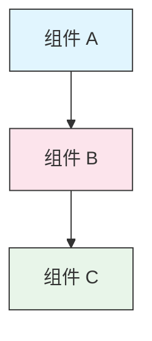

<picture>
  <source media="(prefers-color-scheme: dark)" srcset="resources/logos/claude-howto-logo-dark.svg">
  
</picture>

# 风格指南

> 用于贡献到 Claude How To 的规范和格式规则。遵循本指南可保持内容一致、专业且易于维护。

---

## 目录

- [文件和文件夹命名](#文件和文件夹命名)
- [文档结构](#文档结构)
- [标题](#标题)
- [文本格式](#文本格式)
- [列表](#列表)
- [表格](#表格)
- [代码块](#代码块)
- [链接和交叉引用](#链接和交叉引用)
- [图表](#图表)
- [Emoji 使用](#emoji-使用)
- [YAML 前置元数据](#yaml-前置元数据)
- [图片和媒体](#图片和媒体)
- [语气和风格](#语气和风格)
- [提交信息](#提交信息)
- [作者检查清单](#作者检查清单)

---

## 文件和文件夹命名

### 课程文件夹

课程文件夹使用**两位数字前缀**，后跟**短横线分隔（kebab-case）**的描述符：

```
01-slash-commands/
02-memory/
03-skills/
04-subagents/
05-mcp/
```

数字反映学习路径的顺序，从入门到进阶。

### 文件名称

| 类型 | 规范 | 示例 |
|------|-----------|----------|
| **课程 README** | `README.md` | `01-slash-commands/README.md` |
| **功能文件** | 短横线分隔的 `.md` | `code-reviewer.md`、`generate-api-docs.md` |
| **Shell 脚本** | 短横线分隔的 `.sh` | `format-code.sh`、`validate-input.sh` |
| **配置文件** | 标准命名 | `.mcp.json`、`settings.json` |
| **记忆文件** | 作用域前缀 | `project-CLAUDE.md`、`personal-CLAUDE.md` |
| **顶层文档** | 全大写 `.md` | `CATALOG.md`、`QUICK_REFERENCE.md`、`CONTRIBUTING.md` |
| **图片资源** | 短横线分隔 | `pr-slash-command.png`、`claude-howto-logo.svg` |

### 规则

- 所有文件和文件夹名称使用**小写**（顶级文档如 `README.md`、`CATALOG.md` 除外）
- 使用**连字符**（`-`）作为单词分隔符，不要使用下划线或空格
- 名称简洁且具有描述性

---

## 文档结构

### 根目录 README

根目录 `README.md` 遵循以下顺序：

1. Logo（使用 `<picture>` 元素，含明/暗模式变体）
2. H1 标题
3. 简介区块（一句话价值主张）
4. "为什么选择本指南？"部分，含对比表格
5. 水平分割线（`---`）
6. 目录
7. 功能目录
8. 快速导航
9. 学习路径
10. 各功能模块
11. 入门指南
12. 最佳实践 / 故障排查
13. 贡献指南 / 许可证

### 课程 README

每节课程的 `README.md` 遵循以下顺序：

1. H1 标题（如 `# 斜杠命令`）
2. 简要概述段落
3. 快速参考表格（可选）
4. 架构图（Mermaid）
5. 详细章节（H2）
6. 实际示例（编号，4-6 个示例）
7. 最佳实践（Do's 和 Don'ts 表格）
8. 故障排查
9. 相关指南 / 官方文档
10. 文档元数据页脚

### 功能/示例文件

单个功能文件（如 `optimize.md`、`pr.md`）：

1. YAML 前置元数据（如适用）
2. H1 标题
3. 用途 / 描述
4. 使用说明
5. 代码示例
6. 自定义建议

### 章节分隔符

使用水平分割线（`---`）分隔文档的主要区域：

```markdown
---

## 新的大章节
```

在简介区块之后以及文档的逻辑分界部分之间放置它们。

---

## 标题

### 层级

| 级别 | 用途 | 示例 |
|-------|-----|---------|
| `#` H1 | 页面标题（每篇文档一个） | `# Slash Commands` |
| `##` H2 | 主要章节 | `## 最佳实践` |
| `###` H3 | 子章节 | `### 添加一个技能` |
| `####` H4 | 子子章节（极少使用） | `#### 配置选项` |

### 规则

- **每篇文档只有一个 H1** — 仅用作页面标题
- **不要跳过级别** — 不要从 H2 直接跳到 H4
- **标题简洁** — 控制在 2-5 个词
- **使用句子大小写** — 仅首字母和专有名词大写（例外：功能名称保持原样）
- **仅在根 README 的章节标题前使用 emoji 前缀**（参见 [Emoji 使用](#emoji-使用)）

---

## 文本格式

### 强调

| 样式 | 使用场景 | 示例 |
|-------|------------|---------|
| **粗体**（`**text**`） | 关键术语、表格中的标签、重要概念 | `**安装**：` |
| *斜体*（`*text*`） | 首次出现的技术术语、书籍/文档名 | *frontmatter* |
| `代码`（`` `text` ``） | 文件名、命令、配置值、代码引用 | `CLAUDE.md` |

### 区块引用用于标注

使用带粗体前缀的区块引用作为重要提示：

```markdown
> **注意**：自 v2.0 起，自定义斜杠命令已合并到技能中。

> **重要**：永远不要提交 API 密钥或凭证。

> **提示**：将记忆与技能结合使用效果最佳。
```

支持的标注类型：**注意**、**重要**、**提示**、**警告**。

### 段落

- 段落简短（2-4 句）
- 段落之间加空行
- 重点先行，背景补充
- 解释"为什么"而不仅是"是什么"

---

## 列表

### 无序列表

使用短划线（`-`），嵌套用 2 个空格缩进：

```markdown
- 第一项
- 第二项
  - 嵌套项
  - 另一个嵌套项
    - 深层嵌套（避免超过 3 级）
- 第三项
```

### 有序列表

对顺序步骤、指令和排序项使用编号列表：

```markdown
1. 第一步
2. 第二步
   - 细节说明
   - 其他细节
3. 第三步
```

### 描述性列表

使用粗体标签作为键值样式的列表：

```markdown
- **性能瓶颈** - 识别 O(n^2) 操作、低效循环
- **内存泄漏** - 查找未释放的资源、循环引用
- **算法改进** - 建议使用更好的算法或数据结构
```

### 规则

- 缩进保持一致（每级 2 个空格）
- 列表前后各加一个空行
- 列表项结构平行（都以动词开头，或都是名词等）
- 嵌套不要超过 3 级

---

## 表格

### 标准格式

```markdown
| 列 1 | 列 2 | 列 3 |
|----------|----------|----------|
| 数据     | 数据     | 数据     |
```

### 常见表格模式

**功能比较（3-4 列）：**

```markdown
| 功能 | 调用方式 | 持久性 | 适用于 |
|---------|-----------|------------|----------|
| **斜杠命令** | 手动（`/cmd`） | 仅会话 | 快速快捷方式 |
| **记忆** | 自动加载 | 跨会话 | 长期学习 |
```

**Do's 和 Don'ts：**

```markdown
| Do（推荐） | Don't（避免） |
|----|-------|
| 使用描述性名称 | 使用模糊不清的名称 |
| 保持文件专注 | 单个文件内容过载 |
```

**快速参考：**

```markdown
| 方面 | 详情 |
|--------|---------|
| **用途** | 生成 API 文档 |
| **作用域** | 项目级 |
| **复杂度** | 中级 |
```

### 规则

- 当表头是行标签（第一列）时，使用**粗体**
- 源文件中管道符对齐以提高可读性（可选但推荐）
- 单元格内容简洁；细节使用链接
- 单元格中的命令和文件路径使用 `代码格式`

---

## 代码块

### 语言标签

始终指定语言标签以启用语法高亮：

| 语言 | 标签 | 用途 |
|----------|-----|---------|
| Shell | `bash` | CLI 命令、脚本 |
| Python | `python` | Python 代码 |
| JavaScript | `javascript` | JS 代码 |
| TypeScript | `typescript` | TS 代码 |
| JSON | `json` | 配置文件 |
| YAML | `yaml` | 前置元数据、配置 |
| Markdown | `markdown` | Markdown 示例 |
| SQL | `sql` | 数据库查询 |
| 纯文本 | （无标签） | 预期输出、目录树 |

### 规范

```bash
# 解释命令作用的注释
claude mcp add notion --transport http https://mcp.notion.com/mcp
```

- 在非明显的命令前加**注释行**
- 所有示例**可直接复制粘贴使用**
- 在相关时展示**简单版和进阶版**
- 有助于理解时包含**预期输出**（使用无标签代码块）

### 安装代码块

使用以下模式作为安装说明：

```bash
# 复制文件到你的项目
cp 01-slash-commands/*.md .claude/commands/
```

### 多步骤工作流

```bash
# 第 1 步：创建目录
mkdir -p .claude/commands

# 第 2 步：复制模板
cp 01-slash-commands/*.md .claude/commands/

# 第 3 步：验证安装
ls .claude/commands/
```

---

## 链接和交叉引用

### 内部链接（相对路径）

所有内部链接使用相对路径：

```markdown
[斜杠命令](01-slash-commands/)
[技能指南](03-skills/)
[记忆架构](02-memory/#记忆架构)
```

从课程文件夹返回根目录或兄弟文件夹：

```markdown
[返回主指南](../README.zh-CN.md)
[相关：技能](../03-skills/)
```

### 外部链接（绝对路径）

使用完整 URL 和描述性锚点文本：

```markdown
[Anthropic 官方文档](https://code.claude.com/docs/en/overview)
```

- 不要使用"点击此处"或"这个链接"作为锚点文本
- 使用描述性文本，脱离上下文也能理解

### 章节锚点

使用 GitHub 风格的锚点链接到同一文档内的章节：

```markdown
[特色目录](#-特色目录)
[最佳实践](#最佳实践)
```

### 相关指南模式

以相关指南部分作为课程结尾：

```markdown
## 相关指南

- [斜杠命令](../01-slash-commands/) - 快速快捷方式
- [记忆](../02-memory/) - 持久化上下文
- [技能](../03-skills/) - 可复用能力
```

---

## 图表

### Mermaid

所有图表使用 Mermaid。支持的类型：

- `graph TB` / `graph LR` — 架构、层级、流程
- `sequenceDiagram` — 交互流程
- `timeline` — 时间序列

### 样式规范

使用样式块应用一致的颜色：



**调色板：**

| 颜色 | 十六进制 | 用途 |
|-------|-----|---------|
| 浅蓝 | `#e1f5fe` | 主要组件、输入 |
| 浅粉 | `#fce4ec` | 处理、中间件 |
| 浅绿 | `#e8f5e9` | 输出、结果 |
| 浅黄 | `#fff9c4` | 配置、可选 |
| 浅紫 | `#f3e5f5` | 面向用户、UI |

### 规则

- 使用 `["标签文本"]` 设置节点标签（支持特殊字符）
- 使用 `<br/>` 在标签内换行
- 图表保持简洁（最多 10-12 个节点）
- 在图表下方添加简要文字描述以保证可访问性
- 层级使用自上而下（`TB`），工作流使用从左到右（`LR`）

---

## Emoji 使用

### 在哪里使用 Emoji

Emoji **简洁且有目的地使用** — 仅限特定场景：

| 上下文 | Emoji | 示例 |
|---------|--------|---------|
| 根 README 章节标题 | 分类图标 | `## 📚 学习路径` |
| 技能等级指示器 | 彩色圆圈 | 🟢 入门、🔵 中级、🔴 进阶 |
| Do's 和 Don'ts | 勾号/叉号 | ✅ 推荐这样做，❌ 不要这样做 |
| 复杂度评分 | 星星 | ⭐⭐⭐ |

### 标准 Emoji 集合

| Emoji | 含义 |
|-------|---------|
| 📚 | 学习、指南、文档 |
| ⚡ | 入门、快速参考 |
| 🎯 | 功能、快速参考 |
| 🎓 | 学习路径 |
| 📊 | 统计、比较 |
| 🚀 | 安装、快速命令 |
| 🟢 | 入门级别 |
| 🔵 | 中级级别 |
| 🔴 | 进阶级别 |
| ✅ | 推荐实践 |
| ❌ | 避免 / 反模式 |
| ⭐ | 复杂度评分单位 |

### 规则

- **正文中绝不使用 emoji**
- **根 README 外的文件不要在标题中使用 emoji**（不要在课程 README 中用）
- **不要添加装饰性 emoji** — 每个 emoji 都应传达意义
- Emoji 使用与上表保持一致

---

## YAML 前置元数据

### 功能文件（技能、命令、智能体）

```yaml
---
name: unique-identifier
description: 该功能的作用和使用场景
allowed-tools: Bash, Read, Grep
---
```

### 可选字段

```yaml
---
name: my-feature
description: 简要描述
argument-hint: "[file-path] [options]"
allowed-tools: Bash, Read, Grep, Write, Edit
model: opus                        # opus、sonnet 或 haiku
disable-model-invocation: true     # 仅用户调用
user-invocable: false              # 从用户菜单隐藏
context: fork                      # 在隔离子智能体中运行
agent: Explore                     # context: fork 的智能体类型
---
```

### 规则

- 将前置元数据放在文件最顶部
- `name` 字段使用**短横线分隔格式**
- `description` 控制在一句话
- 只包含需要的字段

---

## 图片和媒体

### Logo 模式

所有以 logo 开头的文档使用 `<picture>` 元素以支持明/暗模式：

```html
<picture>
  <source media="(prefers-color-scheme: dark)" srcset="resources/logos/claude-howto-logo-dark.svg">
  
</picture>
```

### 截图

- 存储在相关课程文件夹中（如 `01-slash-commands/pr-slash-command.png`）
- 文件名使用短横线分隔格式
- 包含描述性的 alt 文本
- 图表优先使用 SVG，截图使用 PNG

### 规则

- 所有图片务必提供 alt 文本
- 图片文件大小保持合理（PNG 小于 500KB）
- 图片引用使用相对路径
- 图片存储在与引用它们的文档同一目录，或存储在 `assets/` 中用于共享图片

---

## 语气和风格

### 写作风格

- **专业但平易近人** — 技术准确但不过度使用术语
- **主动语态** — "创建一个文件"而非 "文件应该被创建"
- **直接指导** — "运行此命令"而非"您可能想运行此命令"
- **对新手友好** — 假设读者不熟悉 Claude Code，但熟悉编程

### 内容原则

| 原则 | 示例 |
|-----------|---------|
| **展示，不要讲述** | 提供工作示例，而非抽象描述 |
| **渐进式复杂度** | 从简单开始，后续章节逐渐深入 |
| **解释"为什么"** | "使用记忆来...因为..."而不仅是"使用记忆来..." |
| **可直接复制粘贴** | 每个代码块都应可直接粘贴使用 |
| **真实场景** | 使用实际场景，而非编造的例子 |

### 词汇

- 使用"Claude Code"（而非 "Claude CLI" 或 "该工具"）
- 使用"skill"（而非 "custom command" — 后者是旧称）
- 使用"lesson"或"guide"指编号章节
- 使用"example"指单个功能文件

---

## 提交信息

遵循[规范提交（Conventional Commits）](https://www.conventionalcommits.org/)：

```
type(scope): description
```

### 类型

| 类型 | 用途 |
|------|---------|
| `feat` | 新功能、示例或指南 |
| `fix` | Bug 修复、更正、修复链接 |
| `docs` | 文档改进 |
| `refactor` | 结构重组但行为不变 |
| `style` | 仅格式变更 |
| `test` | 测试补充或变更 |
| `chore` | 构建、依赖、CI |

### 作用域

使用课程名或文件区域作为作用域：

```
feat(slash-commands): 添加 API 文档生成器
docs(memory): 改进个人偏好示例
fix(README): 修正目录链接
docs(skills): 添加全面的代码审查技能
```

---

## 文档元数据页脚

课程 README 以元数据区块结尾：

```markdown
---
**Last Updated**: March 2026
**Claude Code Version**: 2.1+
**Compatible Models**: Claude Sonnet 4.6, Claude Opus 4.6, Claude Haiku 4.5
```

- 使用"月 + 年"格式（如"March 2026"）
- 功能变更时更新版本号
- 列出所有兼容的模型

---

## 作者检查清单

提交内容前，请确认：

- [ ] 文件/文件夹名使用短横线分隔格式
- [ ] 文档以 H1 标题开头（每篇文件一个）
- [ ] 标题层级正确（无跳过级别）
- [ ] 所有代码块都有语言标签
- [ ] 代码示例可直接复制粘贴使用
- [ ] 内部链接使用相对路径
- [ ] 外部链接有描述性锚点文本
- [ ] 表格格式正确
- [ ] Emoji 遵循标准集合（如果使用了的话）
- [ ] Mermaid 图表使用标准调色板
- [ ] 无敏感信息（API 密钥、凭证）
- [ ] YAML 前置元数据有效（如适用）
- [ ] 图片有 alt 文本
- [ ] 段落简短且聚焦
- [ ] 相关指南部分链接到相关课程
- [ ] 提交信息遵循规范提交格式
