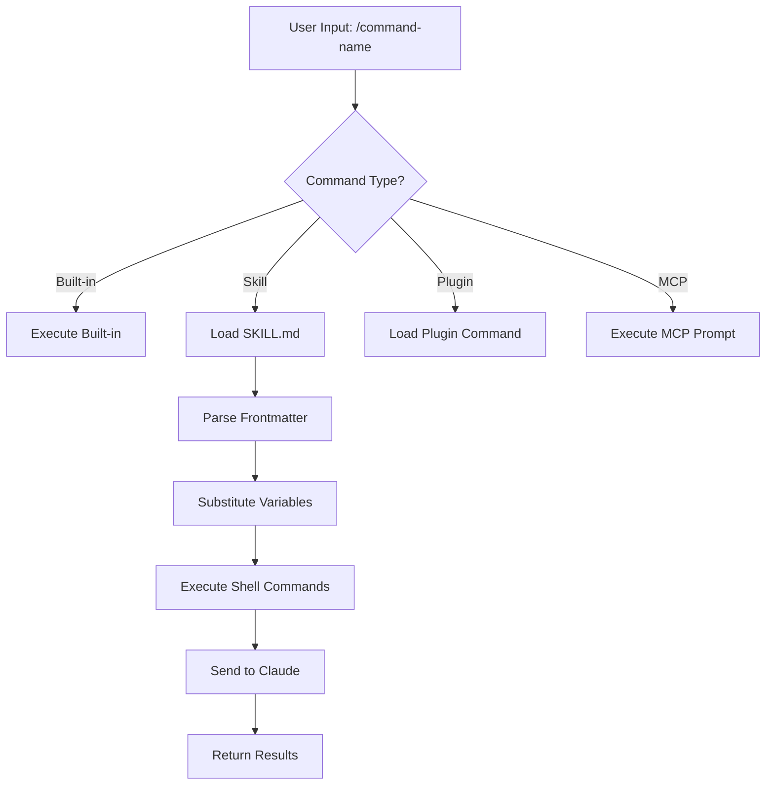
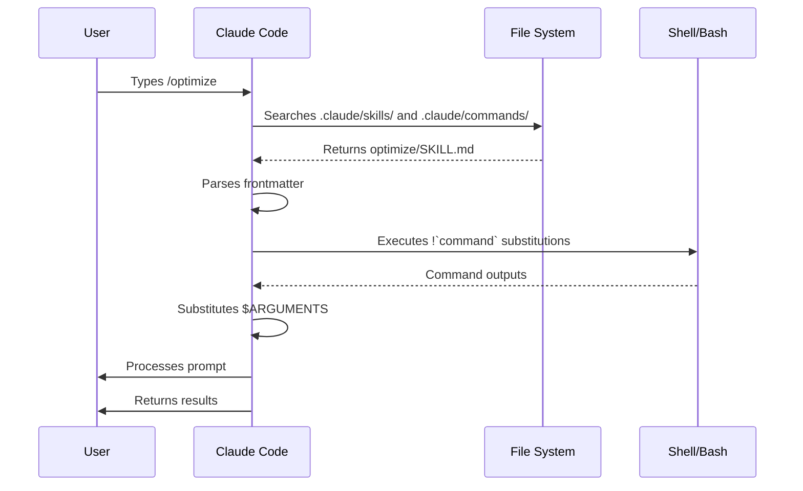

<!-- i18n-source: 01-slash-commands/README.md -->
<!-- i18n-source-sha: d17d515 -->
<!-- i18n-date: 2026-04-27 -->

<picture>
  <source media="(prefers-color-scheme: dark)" srcset="../../resources/logos/claude-howto-logo-dark.svg">
  
</picture>

# スラッシュコマンド

## 概要

スラッシュコマンドは、対話セッション中に Claude の動作を制御するためのショートカットである。次のようないくつかの種類がある:

- **組み込みコマンド**: Claude Code が提供する（`/help`、`/clear`、`/model`）
- **スキル**: ユーザーが `SKILL.md` ファイルとして定義するコマンド（`/optimize`、`/pr`）
- **プラグインコマンド**: インストール済みプラグインから提供されるコマンド（`/frontend-design:frontend-design`）
- **MCP プロンプト**: MCP サーバーから提供されるコマンド（`/mcp__github__list_prs`）

> **注意**: カスタムスラッシュコマンドはスキルに統合された。`.claude/commands/` のファイルは引き続き動くが、現在は `.claude/skills/` のスキル方式が推奨である。どちらも `/command-name` のショートカットを作る。完全なリファレンスは [スキルガイド](../03-skills/) を参照。

## 組み込みコマンドリファレンス

組み込みコマンドはよく使うアクションのショートカットである。**60 種類以上の組み込みコマンド**と **5 つの同梱スキル**が利用できる。Claude Code 上で `/` をタイプすると一覧が出る。`/` の後に文字を続けるとフィルタできる。

| コマンド | 用途 |
|---------|------|
| `/add-dir <path>` | 作業ディレクトリを追加 |
| `/agents` | エージェント設定を管理 |
| `/branch [name]` | 会話を分岐させて新しいセッションにする（エイリアス: `/fork`）。注: `/fork` は v2.1.77 で `/branch` に改名 |
| `/btw <question>` | Claude がメインタスクを進めている間に、メイン会話のコンテキストを汚さず一時的なサイド質問をする |
| `/chrome` | Chrome ブラウザ統合を設定 |
| `/clear` | 会話をクリア（エイリアス: `/reset`、`/new`） |
| `/color [color\|default]` | プロンプトバーの色を設定 |
| `/compact [instructions]` | 任意のフォーカス指示を付けて会話を圧縮 |
| `/config` | 設定を開く（エイリアス: `/settings`） |
| `/context` | コンテキスト使用量をカラーグリッドで可視化 |
| `/copy [N]` | アシスタントの応答をクリップボードにコピー。`w` でファイル書き出し |
| `/cost` | `/usage` のタイピング用エイリアス — コストタブを開く（v2.1.118+） |
| `/desktop` | Desktop アプリで継続（エイリアス: `/app`） |
| `/diff` | 未コミット変更のインタラクティブ差分ビューア |
| `/doctor` | インストール状態を診断 — Claude が応答中でも開ける。ステータスアイコンを表示。`f` で問題を自動修正（v2.1.116 で強化） |
| `/effort [low\|medium\|high\|xhigh\|max\|auto]` | 矢印キーのスライダーで思考量を設定。レベル: `low` → `medium` → `high` → `xhigh`（v2.1.111 で追加）→ `max`。Opus 4.7 のデフォルトは `xhigh`、`max` は Opus 4.7 が必要 |
| `/exit` | REPL を終了（エイリアス: `/quit`） |
| `/export [filename]` | 現在の会話をファイルまたはクリップボードにエクスポート |
| `/extra-usage` | レート制限の追加使用量を設定 |
| `/fast [on\|off]` | 高速モードを切り替え |
| `/feedback` | フィードバックを送信（エイリアス: `/bug`） |
| `/focus` | フォーカスビューを切り替え（v2.1.110 で追加。フォーカス切替は `Ctrl+O` から本コマンドへ移行） |
| `/help` | ヘルプを表示 |
| `/hooks` | フック設定を表示 |
| `/ide` | IDE 統合を管理 |
| `/init` | `CLAUDE.md` を初期化。インタラクティブフローには `CLAUDE_CODE_NEW_INIT=1` を設定 |
| `/insights` | セッション分析レポートを生成 |
| `/install-github-app` | GitHub Actions アプリをセットアップ |
| `/install-slack-app` | Slack アプリをインストール |
| `/keybindings` | キーバインド設定を開く |
| `/less-permission-prompts` | 直近の Bash／MCP ツール呼び出しを分析し、優先度の高い許可リストを `.claude/settings.json` に追加して権限プロンプトを減らす（v2.1.111 で追加） |
| `/login` | Anthropic アカウントを切り替え |
| `/logout` | Anthropic アカウントからサインアウト |
| `/mcp` | MCP サーバーと OAuth を管理 |
| `/memory` | `CLAUDE.md` を編集、自動メモリを切り替え |
| `/mobile` | モバイルアプリの QR コード（エイリアス: `/ios`、`/android`） |
| `/model [model]` | モデル選択。左右キーで思考量を変更 |
| `/passes` | Claude Code 無料 1 週間を共有 |
| `/permissions` | 権限を表示／更新（エイリアス: `/allowed-tools`） |
| `/plan [description]` | プランモードに入る |
| `/plugin` | プラグインを管理 |
| `/proactive` | `/loop` のエイリアス（v2.1.105 で追加） |
| `/powerup` | アニメーション付きデモのインタラクティブレッスンで機能を発見 |
| `/privacy-settings` | プライバシー設定（Pro／Max のみ） |
| `/release-notes` | 変更履歴を表示 |
| `/recap` | セッションへ戻ってきた際にセッションのおさらい／要約を表示（v2.1.108 で追加） |
| `/reload-plugins` | アクティブなプラグインをリロード |
| `/remote-control` | claude.ai からのリモート制御（エイリアス: `/rc`） |
| `/remote-env` | デフォルトのリモート環境を設定 |
| `/rename [name]` | セッションをリネーム |
| `/resume [session]` | 会話を再開（エイリアス: `/continue`） |
| `/review` | **非推奨** — 代わりに `code-review` プラグインを導入する |
| `/rewind` | 会話やコードを巻き戻す（エイリアス: `/checkpoint`） |
| `/sandbox` | サンドボックスモードを切り替え |
| `/schedule [description]` | クラウドのスケジュールタスクを作成／管理 |
| `/security-review` | ブランチをセキュリティ脆弱性の観点で分析 |
| `/skills` | 利用可能なスキルを一覧表示 |
| `/stats` | `/usage` のタイピング用エイリアス — 統計タブ（日次使用量、セッション、ストリーク）を開く（v2.1.118+） |
| `/stickers` | Claude Code のステッカーを注文 |
| `/status` | バージョン、モデル、アカウントを表示 |
| `/statusline` | ステータスラインを設定 |
| `/tasks` | バックグラウンドタスクを一覧／管理 |
| `/team-onboarding` | プロジェクトの Claude Code 設定からチームメイト向けランプアップガイドを生成（v2.1.101 で新規） |
| `/terminal-setup` | ターミナルのキーバインドを設定 |
| `/theme` | テーマピッカーを開く／カスタムテーマを管理（v2.1.118）。カスタムテーマは `~/.claude/themes/<name>.json` に JSON で定義 |
| `/tui` | ちらつきのないフルスクリーン TUI（テキストユーザーインターフェース）モードを切り替え（v2.1.110 で追加） |
| `/ultraplan <prompt>` | ultraplan セッションでプランを下書きし、ブラウザでレビュー |
| `/ultrareview` | マルチエージェント分析による包括的なクラウドベースのコードレビュー（v2.1.111 で追加） |
| `/undo` | `/rewind` のエイリアス（v2.1.108 で追加） |
| `/upgrade` | 上位プランへのアップグレードページを開く |
| `/usage` | 正式な使用状況ダッシュボード（v2.1.118）— プラン使用量制限、レート制限、コスト、日次セッション統計を統合。`/cost` と `/stats` は特定のタブを開くタイピング用エイリアス |
| `/voice` | プッシュトゥトーク音声入力を切り替え |

### 同梱スキル

これらのスキルは Claude Code に同梱され、スラッシュコマンドのように呼び出せる:

| スキル | 用途 |
|-------|------|
| `/batch <instruction>` | ワークツリーを使った大規模並列変更をオーケストレートする |
| `/claude-api` | プロジェクトの言語に応じた Claude API リファレンスを読み込む |
| `/debug [description]` | デバッグログを有効化 |
| `/loop [interval] <prompt>` | プロンプトを定期的に繰り返し実行 |
| `/simplify [focus]` | 変更されたファイルをコード品質の観点でレビュー |

### 非推奨コマンド

| コマンド | ステータス |
|---------|----------|
| `/review` | 非推奨 — `code-review` プラグインに置き換え |
| `/output-style` | v2.1.73 から非推奨 |
| `/fork` | `/branch` に改名（エイリアスは引き続き有効、v2.1.77） |
| `/pr-comments` | v2.1.91 で削除 — Claude に直接 PR コメントを見るよう依頼する |
| `/vim` | v2.1.92 で削除 — /config → エディタモードを使う |

### 直近の変更点

- `/fork` を `/branch` に改名し、`/fork` はエイリアスとして残置（v2.1.77）
- `/output-style` を非推奨化（v2.1.73）
- `/review` を非推奨化、`code-review` プラグインを推奨
- `/effort` コマンドを追加。`max` レベルは Opus 4.7 が必要（当初は Opus 4.6 限定）
- プッシュトゥトーク音声入力の `/voice` コマンドを追加
- スケジュールタスクの作成／管理用の `/schedule` コマンドを追加
- プロンプトバーをカスタマイズする `/color` コマンドを追加
- /pr-comments を v2.1.91 で削除 — Claude に直接 PR コメントを見るよう依頼する
- /vim を v2.1.92 で削除 — /config → エディタモードを使う
- ブラウザベースのプランレビューと実行を行う /ultraplan を追加
- インタラクティブな機能レッスン用に /powerup を追加
- サンドボックスモード切替用に /sandbox を追加
- `/model` ピッカーが、生のモデル ID ではなく可読ラベル（例: "Sonnet 4.6"）を表示するようになった
- `/resume` が `/continue` エイリアスに対応
- MCP プロンプトが `/mcp__<server>__<prompt>` コマンドとして利用可能（[MCP プロンプトをコマンドとして使う](#mcp-プロンプトをコマンドとして使う) を参照）
- チームメイト向けランプアップガイドを自動生成する `/team-onboarding` を追加（v2.1.101）
- ちらつきのないフルスクリーン TUI 描画用に `/tui` コマンドを追加（v2.1.110）
- フォーカスビュー切替用に `/focus` コマンドを追加。`Ctrl+O` は詳細トランスクリプトの切替のみに（v2.1.110）
- セッションコンテキストのおさらいを手動で発火する `/recap` コマンドを追加（v2.1.108）
- `/undo` を `/rewind` のエイリアスとして追加（v2.1.108）
- `/proactive` を `/loop` のエイリアスとして追加（v2.1.105）
- `/effort` がインタラクティブな矢印キースライダーを獲得し、`high` と `max` の間に新しい `xhigh` レベルを追加。Opus 4.7 プランではデフォルト思考量が `xhigh` に引き上げられた（v2.1.111）
- 包括的なクラウドベースのマルチエージェントコードレビュー用に `/ultrareview` を追加（v2.1.111）
- Bash／MCP ツール呼び出しを分析し、`.claude/settings.json` の許可リストで権限プロンプトを減らす `/less-permission-prompts` を追加（v2.1.111）
- Opus 4.7 を利用する Max サブスクライバについて、Auto モードに `--enable-auto-mode` フラグが不要になった（v2.1.112）

### `/team-onboarding` — チームメイト向けランプアップガイド

> **v2.1.101 で新規追加**

`/team-onboarding` を使うと、プロジェクトのローカルな Claude Code 利用状況からチームメイト向けランプアップガイドを生成できる。コマンドは `CLAUDE.md`、インストール済みのスキル、サブエージェント、フック、最近のワークフローを点検し、新しい開発者がすぐに生産的になれるオンボーディングドキュメントを作成する。

組み込みコマンドであり、インストール作業は不要である。

**使い方:**

```bash
claude /team-onboarding
```

生成されるガイドは次の内容を要約する:

- [`CLAUDE.md`](../02-memory/README.md) からのプロジェクトの目的と主な慣習
- 利用可能な [スキル](../03-skills/README.md) と自動起動の条件
- 設定済みの [サブエージェント](../04-subagents/README.md) とその責務
- 一般的なイベントで実行される [フック](../06-hooks/README.md)
- 新規参加者が知っておくべき共通ワークフロー

**提供開始:** Claude Code v2.1.101（2026 年 4 月 11 日）に同梱。

## カスタムコマンド（現在はスキル）

カスタムスラッシュコマンドは **スキルに統合された**。どちらの方式でも `/command-name` で呼び出せるコマンドを作成できる:

| 方式 | 配置場所 | ステータス |
|------|---------|----------|
| **スキル（推奨）** | `.claude/skills/<name>/SKILL.md` | 現行標準 |
| **レガシーコマンド** | `.claude/commands/<name>.md` | 引き続き動作 |

スキルとコマンドが同じ名前で存在する場合、**スキルが優先される**。例えば `.claude/commands/review.md` と `.claude/skills/review/SKILL.md` の両方が存在すれば、スキル版が使われる。

### 移行パス

既存の `.claude/commands/` のファイルは、変更なしで動作し続ける。スキルへ移行するには:

**変更前（コマンド）:**
```
.claude/commands/optimize.md
```

**変更後（スキル）:**
```
.claude/skills/optimize/SKILL.md
```

### なぜスキルなのか

スキルはレガシーコマンドにはない次の機能を提供する:

- **ディレクトリ構造**: スクリプト、テンプレート、参照ファイルをまとめられる
- **自動起動**: 関連性があるとき Claude が自動でスキルを発動できる
- **起動制御**: ユーザー、Claude、両者のうち誰が起動できるかを選べる
- **サブエージェント実行**: `context: fork` で隔離されたコンテキストでスキルを実行できる
- **段階的開示**: 必要なときだけ追加ファイルをロードする

### スキルとしてカスタムコマンドを作成する

`SKILL.md` を含むディレクトリを作る:

```bash
mkdir -p .claude/skills/my-command
```

**ファイル:** `.claude/skills/my-command/SKILL.md`

```yaml
---
name: my-command
description: What this command does and when to use it
---

# My Command

Instructions for Claude to follow when this command is invoked.

1. First step
2. Second step
3. Third step
```

### フロントマターリファレンス

| フィールド | 用途 | デフォルト |
|----------|------|----------|
| `name` | コマンド名（`/name` になる） | ディレクトリ名 |
| `description` | 簡単な説明（Claude がいつ使うか判断する材料） | 最初の段落 |
| `argument-hint` | 自動補完用の想定引数 | なし |
| `allowed-tools` | 権限なしで使えるツール | 継承 |
| `model` | 使用する特定のモデル | 継承 |
| `disable-model-invocation` | `true` ならユーザーのみ起動可（Claude は不可） | `false` |
| `user-invocable` | `false` なら `/` メニューから隠す | `true` |
| `context` | `fork` に設定すると隔離サブエージェントで実行 | なし |
| `agent` | `context: fork` 利用時のエージェント種別 | `general-purpose` |
| `hooks` | スキルスコープのフック（PreToolUse、PostToolUse、Stop） | なし |

### 引数

コマンドは引数を受け取れる:

**`$ARGUMENTS` で全引数を受ける:**

```yaml
---
name: fix-issue
description: Fix a GitHub issue by number
---

Fix issue #$ARGUMENTS following our coding standards
```

使い方: `/fix-issue 123` → `$ARGUMENTS` は "123" になる

**個別引数を `$0`、`$1` などで受ける:**

```yaml
---
name: review-pr
description: Review a PR with priority
---

Review PR #$0 with priority $1
```

使い方: `/review-pr 456 high` → `$0`="456"、`$1`="high"

### シェルコマンドによる動的コンテキスト

プロンプトの前に `` !`command` `` で bash コマンドを実行する:

```yaml
---
name: commit
description: Create a git commit with context
allowed-tools: Bash(git *)
---

## Context

- Current git status: !`git status`
- Current git diff: !`git diff HEAD`
- Current branch: !`git branch --show-current`
- Recent commits: !`git log --oneline -5`

## Your task

Based on the above changes, create a single git commit.
```

### ファイル参照

`@` でファイル内容を埋め込む:

```markdown
Review the implementation in @src/utils/helpers.js
Compare @src/old-version.js with @src/new-version.js
```

## プラグインコマンド

プラグインはカスタムコマンドを提供できる:

```
/plugin-name:command-name
```

または、名前衝突がない場合はシンプルに `/command-name`。

**例:**
```bash
/frontend-design:frontend-design
/commit-commands:commit
```

## MCP プロンプトをコマンドとして使う

MCP サーバーはプロンプトをスラッシュコマンドとして公開できる:

```
/mcp__<server-name>__<prompt-name> [arguments]
```

**例:**
```bash
/mcp__github__list_prs
/mcp__github__pr_review 456
/mcp__jira__create_issue "Bug title" high
```

### MCP 権限の構文

権限設定で MCP サーバーへのアクセスを制御する:

- `mcp__github` — GitHub MCP サーバー全体にアクセス
- `mcp__github__*` — すべてのツールにワイルドカードアクセス
- `mcp__github__get_issue` — 特定のツールにアクセス

## コマンドアーキテクチャ



## コマンドのライフサイクル



## このフォルダで提供するコマンド

これらのサンプルコマンドは、スキルとしても、レガシーコマンドとしてもインストールできる。

### 1. `/optimize` — コード最適化

パフォーマンス上の問題、メモリリーク、最適化の余地を分析する。

**使い方:**
```
/optimize
[Paste your code]
```

### 2. `/pr` — プルリクエスト準備

リント、テスト、コミットメッセージのフォーマットなど、PR 準備チェックリストを案内する。

**使い方:**
```
/pr
```

**スクリーンショット:**


### 3. `/generate-api-docs` — API ドキュメント生成

ソースコードから網羅的な API ドキュメントを生成する。

**使い方:**
```
/generate-api-docs
```

### 4. `/commit` — コンテキスト付き git コミット

リポジトリの動的コンテキストを含めて git コミットを作成する。

**使い方:**
```
/commit [optional message]
```

### 5. `/push-all` — ステージ・コミット・push

全変更をステージングし、コミットを作成し、安全性チェックを行ってリモートへ push する。

**使い方:**
```
/push-all
```

**安全性チェック:**
- シークレット: `.env*`、`*.key`、`*.pem`、`credentials.json`
- API キー: 実キーかプレースホルダかを判別
- 大きなファイル: Git LFS なしの `>10MB`
- ビルド成果物: `node_modules/`、`dist/`、`__pycache__/`

### 6. `/doc-refactor` — ドキュメント再構成

プロジェクトドキュメントを明瞭性とアクセシビリティの観点で再構成する。

**使い方:**
```
/doc-refactor
```

### 7. `/setup-ci-cd` — CI/CD パイプライン設定

品質保証のために pre-commit フックと GitHub Actions を導入する。

**使い方:**
```
/setup-ci-cd
```

### 8. `/unit-test-expand` — テストカバレッジ拡充

未テストの分岐とエッジケースを狙ってテストカバレッジを高める。

**使い方:**
```
/unit-test-expand
```

## インストール

### スキルとして（推奨）

スキルディレクトリにコピーする:

```bash
# skills ディレクトリを作成
mkdir -p .claude/skills

# 各コマンドファイルごとにスキルディレクトリを作成
for cmd in optimize pr commit; do
  mkdir -p .claude/skills/$cmd
  cp 01-slash-commands/$cmd.md .claude/skills/$cmd/SKILL.md
done
```

### レガシーコマンドとして

commands ディレクトリにコピーする:

```bash
# プロジェクト全体（チーム向け）
mkdir -p .claude/commands
cp 01-slash-commands/*.md .claude/commands/

# 個人利用
mkdir -p ~/.claude/commands
cp 01-slash-commands/*.md ~/.claude/commands/
```

## 自前のコマンドを作る

### スキルテンプレート（推奨）

`.claude/skills/my-command/SKILL.md` を作成する:

```yaml
---
name: my-command
description: What this command does. Use when [trigger conditions].
argument-hint: [optional-args]
allowed-tools: Bash(npm *), Read, Grep
---

# Command Title

## Context

- Current branch: !`git branch --show-current`
- Related files: @package.json

## Instructions

1. First step
2. Second step with argument: $ARGUMENTS
3. Third step

## Output Format

- How to format the response
- What to include
```

### ユーザーのみが起動可能なコマンド（自動起動なし）

副作用があり、Claude に自動で発火させたくないコマンド向け:

```yaml
---
name: deploy
description: Deploy to production
disable-model-invocation: true
allowed-tools: Bash(npm *), Bash(git *)
---

Deploy the application to production:

1. Run tests
2. Build application
3. Push to deployment target
4. Verify deployment
```

## ベストプラクティス

| やる | やらない |
|------|---------|
| 動詞中心の明確な名前を使う | 一回限りのタスクをコマンドにする |
| 起動条件付きの `description` を含める | コマンド内に複雑なロジックを組む |
| 単一タスクに絞ったコマンドにする | 機微情報をハードコードする |
| 副作用がある場合は `disable-model-invocation` を使う | description フィールドを省く |
| 動的コンテキストには `!` プレフィックスを使う | Claude が現在の状態を知っている前提にする |
| 関連ファイルはスキルディレクトリで整理する | すべてを 1 ファイルに詰め込む |

## トラブルシューティング

### コマンドが見つからない

**対処:**
- ファイルが `.claude/skills/<name>/SKILL.md` または `.claude/commands/<name>.md` に置かれているか確認
- フロントマターの `name` フィールドが期待するコマンド名と一致するか確認
- Claude Code セッションを再起動
- `/help` で利用可能なコマンドを確認

### コマンドが期待通りに動かない

**対処:**
- 指示をより具体的にする
- スキルファイルに例を含める
- bash コマンドを使う場合は `allowed-tools` を確認
- まずは単純な入力でテストする

### スキルとコマンドが衝突する

同じ名前で両方が存在する場合、**スキルが優先される**。どちらかを削除またはリネームする。

## 関連ガイド

- **[スキル](../03-skills/)** — スキルの完全リファレンス（自動起動される機能）
- **[メモリ](../02-memory/)** — CLAUDE.md による永続コンテキスト
- **[サブエージェント](../04-subagents/)** — 委任型 AI エージェント
- **[プラグイン](../07-plugins/)** — まとめられたコマンド集
- **[フック](../06-hooks/)** — イベント駆動の自動化

## 追加のリソース

- [公式インタラクティブモードドキュメント](https://code.claude.com/docs/en/interactive-mode) — 組み込みコマンドリファレンス
- [公式スキルドキュメント](https://code.claude.com/docs/en/skills) — スキルの完全リファレンス
- [CLI リファレンス](https://code.claude.com/docs/en/cli-reference) — コマンドラインオプション

---

**Last Updated**: April 24, 2026
**Claude Code Version**: 2.1.119
**Sources**:
- https://code.claude.com/docs/en/slash-commands
- https://code.claude.com/docs/en/interactive-mode
- https://code.claude.com/docs/en/changelog
- https://github.com/anthropics/claude-code/releases/tag/v2.1.118
- https://github.com/anthropics/claude-code/releases/tag/v2.1.116
**Compatible Models**: Claude Sonnet 4.6, Claude Opus 4.7, Claude Haiku 4.5

*[Claude How To](../) ガイドシリーズの一部*
