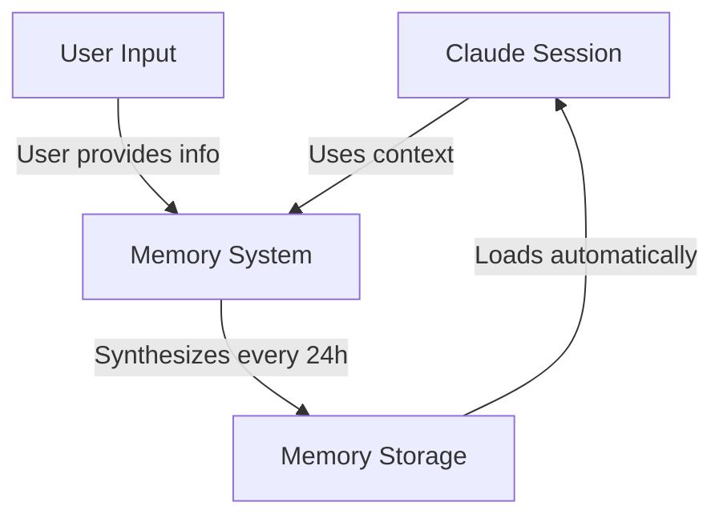
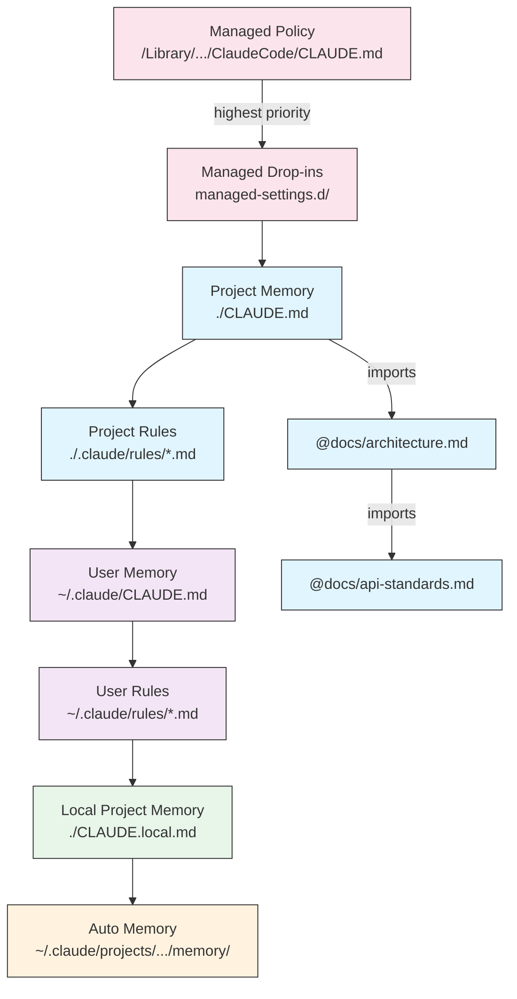
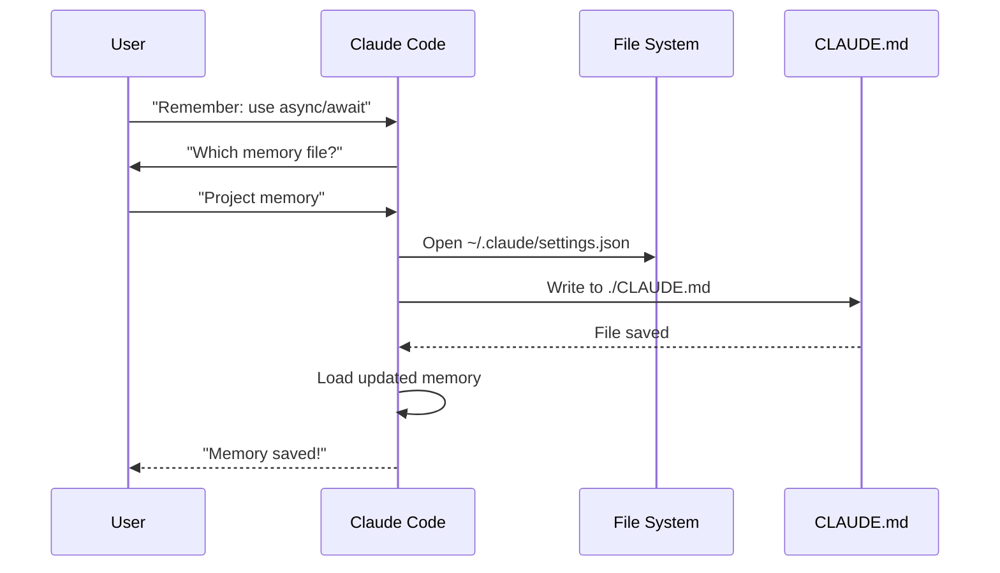
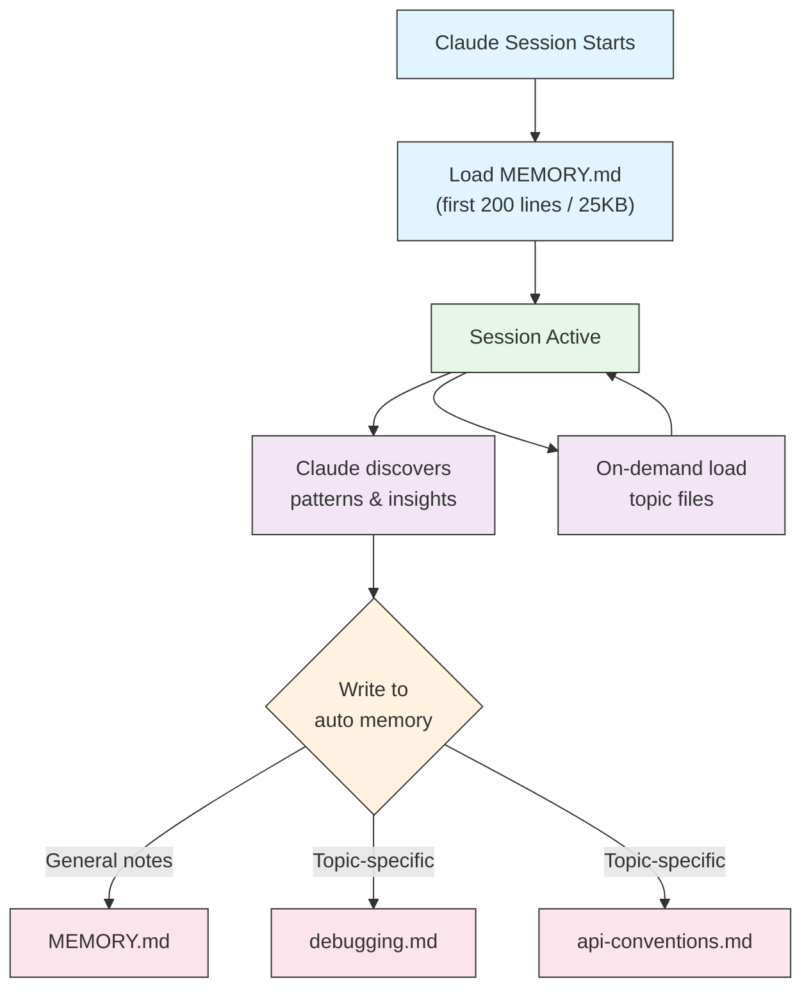

<!-- i18n-source: 02-memory/README.md -->
<!-- i18n-source-sha: d17d515 -->
<!-- i18n-date: 2026-04-27 -->

<picture>
  <source media="(prefers-color-scheme: dark)" srcset="../../resources/logos/claude-howto-logo-dark.svg">
  
</picture>

# メモリガイド

メモリにより、Claude はセッションや会話をまたいでコンテキストを保持できる。メモリには 2 つの形態がある: claude.ai の自動合成と、Claude Code のファイルシステムベースの CLAUDE.md である。

## 概要

Claude Code のメモリは、複数のセッションや会話をまたいで持続するコンテキストを提供する。一時的なコンテキストウィンドウとは異なり、メモリファイルは次のことを可能にする:

- プロジェクト標準をチームで共有する
- 個人の開発上の好みを保存する
- ディレクトリ固有のルールと設定を維持する
- 外部ドキュメントをインポートする
- メモリをプロジェクトの一部としてバージョン管理する

メモリシステムは、グローバルな個人設定から特定のサブディレクトリまで複数の階層で動作し、Claude が何を覚え、それをどう適用するかを細かく制御できる。

## メモリコマンドのクイックリファレンス

| コマンド | 用途 | 使い方 | 使うタイミング |
|---------|------|-------|--------------|
| `/init` | プロジェクトメモリを初期化 | `/init` | 新規プロジェクト開始時、初回の CLAUDE.md セットアップ |
| `/memory` | エディタでメモリファイルを編集 | `/memory` | 大規模な更新、再構成、内容のレビュー |
| `#` プレフィックス | ~~単一行を素早くメモリに追加~~ **廃止** | — | 代わりに `/memory` を使うか会話で依頼する |
| `@path/to/file` | 外部コンテンツをインポート | `@README.md` または `@docs/api.md` | CLAUDE.md から既存ドキュメントを参照する |

## クイックスタート: メモリの初期化

### `/init` コマンド

`/init` コマンドは Claude Code でプロジェクトメモリをセットアップする最速の方法である。基本となるプロジェクトドキュメントを含む CLAUDE.md ファイルを初期化する。

**使い方:**

```bash
/init
```

**機能:**

- プロジェクトに新しい CLAUDE.md ファイルを作成（通常は `./CLAUDE.md` または `./.claude/CLAUDE.md`）
- プロジェクトの慣習とガイドラインを確立する
- セッションをまたいだコンテキスト持続の基盤をセットアップ
- プロジェクト標準を文書化するためのテンプレート構造を提供

**強化されたインタラクティブモード:** `CLAUDE_CODE_NEW_INIT=1` を設定すると、ステップごとにプロジェクトセットアップを案内する複数フェーズのインタラクティブフローが有効になる:

```bash
CLAUDE_CODE_NEW_INIT=1 claude
/init
```

**`/init` を使う場面:**

- Claude Code で新規プロジェクトを開始するとき
- チームのコーディング標準と慣習を確立するとき
- コードベース構造に関するドキュメントを作るとき
- 共同開発のためにメモリ階層をセットアップするとき

**ワークフロー例:**

```markdown
# In your project directory
/init

# Claude creates CLAUDE.md with structure like:
# Project Configuration
## Project Overview
- Name: Your Project
- Tech Stack: [Your technologies]
- Team Size: [Number of developers]

## Development Standards
- Code style preferences
- Testing requirements
- Git workflow conventions
```

### メモリの簡易更新

> **注意**: インラインメモリ用の `#` ショートカットは廃止された。`/memory` でメモリファイルを直接編集するか、Claude に会話で覚えてほしいことを依頼する（例: 「TypeScript の strict モードを必ず使うことを覚えておいて」）。

メモリに情報を追加する推奨方法:

**方法 1: `/memory` コマンドを使う**

```bash
/memory
```

メモリファイルがシステムのエディタで開かれ、直接編集できる。

**方法 2: 会話で依頼する**

```
Remember that we always use TypeScript strict mode in this project.
Please add to memory: prefer async/await over promise chains.
```

Claude は依頼内容に基づき適切な CLAUDE.md ファイルを更新する。

**履歴用メモ**（現在は機能しない）:

`#` プレフィックスショートカットは以前、ルールをインラインで追加できた:

```markdown
# Always use TypeScript strict mode in this project  ← no longer works
```

このパターンに依存していた場合は、`/memory` コマンドや会話依頼に切り替える。

### `/memory` コマンド

`/memory` コマンドは、Claude Code セッション内から CLAUDE.md メモリファイルを直接編集する手段を提供する。メモリファイルをシステムのエディタで開き、包括的に編集できる。

**使い方:**

```bash
/memory
```

**機能:**

- メモリファイルをシステムのデフォルトエディタで開く
- 大規模な追加、修正、再構成を行える
- 階層内のすべてのメモリファイルへの直接アクセスを提供
- セッションをまたいだ永続コンテキストの管理を可能にする

**`/memory` を使う場面:**

- 既存のメモリ内容をレビューするとき
- プロジェクト標準を大規模に更新するとき
- メモリ構造を再構成するとき
- 詳細なドキュメントやガイドラインを追加するとき
- プロジェクトの進化に合わせてメモリを保守・更新するとき

**比較: `/memory` と `/init`**

| 観点 | `/memory` | `/init` |
|------|-----------|---------|
| **目的** | 既存メモリファイルの編集 | 新規 CLAUDE.md の初期化 |
| **使う場面** | プロジェクトコンテキストの更新／修正 | 新規プロジェクト開始時 |
| **動作** | 編集用にエディタを開く | スターターテンプレートを生成 |
| **ワークフロー** | 継続的なメンテナンス | 一回限りのセットアップ |

**ワークフロー例:**

```markdown
# Open memory for editing
/memory

# Claude presents options:
# 1. Managed Policy Memory
# 2. Project Memory (./CLAUDE.md)
# 3. User Memory (~/.claude/CLAUDE.md)
# 4. Local Project Memory

# Choose option 2 (Project Memory)
# Your default editor opens with ./CLAUDE.md content

# Make changes, save, and close editor
# Claude automatically reloads the updated memory
```

**メモリインポートの利用:**

CLAUDE.md ファイルは、外部コンテンツを取り込む `@path/to/file` 構文をサポートする:

```markdown
# Project Documentation
See @README.md for project overview
See @package.json for available npm commands
See @docs/architecture.md for system design

# Import from home directory using absolute path
@~/.claude/my-project-instructions.md
```

**インポート機能:**

- 相対パスと絶対パスの両方をサポート（例: `@docs/api.md`、`@~/.claude/my-project-instructions.md`）
- 再帰的インポートをサポート（最大ネスト深さ 5）
- 外部ロケーションからの初回インポートはセキュリティのため承認ダイアログが出る
- インポートディレクティブは Markdown のコードスパンやコードブロック内では評価されない（例として記述しても安全）
- 既存ドキュメントを参照することで重複を避けられる
- 参照されたコンテンツが Claude のコンテキストに自動で含まれる

## メモリアーキテクチャ

Claude Code のメモリは、スコープごとに異なる目的を持つ階層システムに従う:



## Claude Code のメモリ階層

Claude Code は多階層のメモリシステムを使う。Claude Code 起動時にメモリファイルが自動でロードされ、上位レベルのファイルが優先される。

**メモリ階層全体（優先度の高い順）:**

1. **Managed Policy** — 組織全体の指示
   - macOS: `/Library/Application Support/ClaudeCode/CLAUDE.md`
   - Linux/WSL: `/etc/claude-code/CLAUDE.md`
   - Windows: `C:\Program Files\ClaudeCode\CLAUDE.md`

2. **Managed Drop-ins** — アルファベット順にマージされるポリシーファイル（v2.1.83+）
   - 管理ポリシー CLAUDE.md と並ぶ `managed-settings.d/` ディレクトリ
   - モジュール式のポリシー管理のため、アルファベット順にマージされる

3. **Project Memory** — チーム共有のコンテキスト（バージョン管理対象）
   - `./.claude/CLAUDE.md` または `./CLAUDE.md`（リポジトリのルート）

4. **Project Rules** — モジュール式・トピック別のプロジェクト指示
   - `./.claude/rules/*.md`

5. **User Memory** — 個人設定（全プロジェクト）
   - `~/.claude/CLAUDE.md`

6. **User-Level Rules** — 個人ルール（全プロジェクト）
   - `~/.claude/rules/*.md`

7. **Local Project Memory** — プロジェクト固有の個人設定
   - `./CLAUDE.local.md`

> **注意**: `CLAUDE.local.md` は完全にサポートされ、[公式ドキュメント](https://code.claude.com/docs/en/memory) にも記載されている。バージョン管理にコミットしないプロジェクト固有の個人設定を提供する。`CLAUDE.local.md` は `.gitignore` に追加すること。

8. **Auto Memory** — Claude による自動メモと学習内容
   - `~/.claude/projects/<project>/memory/`

**メモリ探索の挙動:**

Claude は次の順序でメモリファイルを探索し、上位の場所が優先される:



## `claudeMdExcludes` で CLAUDE.md ファイルを除外する

大規模モノレポでは、現在の作業に関係ない CLAUDE.md があり得る。`claudeMdExcludes` 設定により、特定の CLAUDE.md ファイルをスキップしてコンテキストにロードしないようにできる:

```jsonc
// In ~/.claude/settings.json or .claude/settings.json
{
  "claudeMdExcludes": [
    "packages/legacy-app/CLAUDE.md",
    "vendors/**/CLAUDE.md"
  ]
}
```

パターンはプロジェクトルートからの相対パスに対して照合される。とくに次の場合に有用である:

- 多くのサブプロジェクトを抱えるモノレポで、関連するのが一部のみのとき
- ベンダー製・サードパーティ製の CLAUDE.md を含むリポジトリ
- 古い・無関係な指示を除外して Claude のコンテキストウィンドウのノイズを減らしたいとき

## 設定ファイルの階層

Claude Code の設定（`autoMemoryDirectory`、`claudeMdExcludes` などを含む）は 5 段階の階層から解決され、上位レベルが優先される:

| レベル | 場所 | スコープ |
|-------|------|--------|
| 1（最高） | 管理ポリシー（システムレベル） | 組織全体への強制 |
| 2 | `managed-settings.d/`（v2.1.83+） | モジュール式のポリシードロップイン、アルファベット順にマージ |
| 3 | `~/.claude/settings.json` | ユーザー設定 |
| 4 | `.claude/settings.json` | プロジェクトレベル（git にコミット） |
| 5（最低） | `.claude/settings.local.json` | ローカルオーバーライド（git 無視） |

**プラットフォーム固有の設定（v2.1.51+）:**

設定は次の方法でも構成できる:
- **macOS**: プロパティリスト（plist）ファイル
- **Windows**: Windows レジストリ

これらのプラットフォームネイティブの仕組みは JSON 設定ファイルとともに読み込まれ、同じ優先順位ルールに従う。

> **注意（v2.1.119）**: `/config` の変更は `~/.claude/settings.json` に永続化されるようになった。`/config` で書かれた値は、上記のプロジェクト／ローカル／ポリシーの優先順位チェーンに参加する — もはやセッション限りではない。インタラクティブな編集には `/config` を、スクリプト化または管理された設定には `settings.json` ファイルの直接編集を使う。

### 保持期間とクリーンアップ設定

| 設定 | 型 | デフォルト | 説明 |
|------|---|---------|------|
| `cleanupPeriodDays` | 整数（日） | 30 | ディスク上の成果物の保持期間。**v2.1.117 から**、checkpoints（`~/.claude/checkpoints/`）、tasks（`~/.claude/tasks/`）、shell-snapshots（`~/.claude/shell-snapshots/`）、backups（`~/.claude/backups/`）の 4 種すべてに適用される。期間より古いファイルは起動時に削除される。 |

```jsonc
// ~/.claude/settings.json
{
  "cleanupPeriodDays": 14
}
```

### 帰属表示・音声・PR URL の設定

| 設定 | 型 | 説明 |
|------|---|------|
| `attribution.commit` | boolean | Claude が作成したコミットに `Co-Authored-By: Claude` トレーラを追加。非推奨の `includeCoAuthoredBy` フラグを置き換え。 |
| `attribution.pr` | boolean | プルリクエストの説明に Claude の帰属表示を追加。PR について非推奨の `includeCoAuthoredBy` フラグを置き換え。 |
| `voice.enabled` | boolean | プッシュトゥトーク音声入力（`/voice`）を有効化。非推奨の `voiceEnabled` フラグを置き換え。 |
| `prUrlTemplate` | string | **v2.1.119 で新規。** フッターの PR バッジ用カスタム URL テンプレート。GitLab、Bitbucket、社内コードレビュー基盤などで有用。`{{owner}}`、`{{repo}}`、`{{number}}` プレースホルダをサポート。 |

```jsonc
// ~/.claude/settings.json
{
  "attribution": {
    "commit": false,
    "pr": true
  },
  "voice": {
    "enabled": true
  },
  "prUrlTemplate": "https://gitlab.internal/{{owner}}/{{repo}}/-/merge_requests/{{number}}"
}
```

#### 非推奨となった設定キー

以下のレガシー設定キーは引き続き動作するが非推奨。上記の置き換えを優先する。

| 非推奨キー | 置き換え | 備考 |
|----------|--------|------|
| `includeCoAuthoredBy` | `attribution.commit` ／ `attribution.pr` | 旧来の単一フラグはコミット用と PR 用の別スイッチに分割された。古いインストール環境のユーザーはレガシーキーを使い続けてよいが、新規プロジェクトはネスト形式を使うべき。 |
| `voiceEnabled` | `voice.enabled` | 将来の音声関連オプションと同様、`voice` 名前空間にまとめられた。 |

## モジュール式ルールシステム

`.claude/rules/` ディレクトリ構造を使うと、整理された・パス固有のルールを作成できる。ルールはプロジェクトレベルとユーザーレベルの両方で定義できる:

```
your-project/
├── .claude/
│   ├── CLAUDE.md
│   └── rules/
│       ├── code-style.md
│       ├── testing.md
│       ├── security.md
│       └── api/                  # Subdirectories supported
│           ├── conventions.md
│           └── validation.md

~/.claude/
├── CLAUDE.md
└── rules/                        # User-level rules (all projects)
    ├── personal-style.md
    └── preferred-patterns.md
```

ルールは `rules/` ディレクトリ内で再帰的に発見される（サブディレクトリも含む）。`~/.claude/rules/` のユーザーレベルルールはプロジェクトレベルルールより前にロードされ、プロジェクトが上書きできる個人デフォルトを設定できる。

### YAML フロントマターによるパス固有ルール

特定のファイルパスにのみ適用されるルールを定義できる:

```markdown
---
paths: src/api/**/*.ts
---

# API Development Rules

- All API endpoints must include input validation
- Use Zod for schema validation
- Document all parameters and response types
- Include error handling for all operations
```

**glob パターン例:**

- `**/*.ts` — すべての TypeScript ファイル
- `src/**/*` — src/ 配下のすべてのファイル
- `src/**/*.{ts,tsx}` — 複数の拡張子
- `{src,lib}/**/*.ts, tests/**/*.test.ts` — 複数のパターン

### サブディレクトリとシンボリックリンク

`.claude/rules/` のルールは 2 つの整理機能をサポートする:

- **サブディレクトリ**: ルールは再帰的に発見されるため、トピック別フォルダに整理できる（例: `rules/api/`、`rules/testing/`、`rules/security/`）
- **シンボリックリンク**: 複数プロジェクト間でルールを共有するためにシンボリックリンクをサポート。例えば、共有ルールファイルを中央の場所から各プロジェクトの `.claude/rules/` ディレクトリにシンボリックリンクできる

## メモリ配置一覧

| 場所 | スコープ | 優先度 | 共有 | アクセス | 適した用途 |
|------|--------|-------|------|--------|----------|
| `/Library/Application Support/ClaudeCode/CLAUDE.md`（macOS） | Managed Policy | 1（最高） | 組織 | システム | 会社全体のポリシー |
| `/etc/claude-code/CLAUDE.md`（Linux/WSL） | Managed Policy | 1（最高） | 組織 | システム | 組織標準 |
| `C:\Program Files\ClaudeCode\CLAUDE.md`（Windows） | Managed Policy | 1（最高） | 組織 | システム | 全社ガイドライン |
| `managed-settings.d/*.md`（ポリシーと並ぶ） | Managed Drop-ins | 1.5 | 組織 | システム | モジュール式ポリシーファイル（v2.1.83+） |
| `./CLAUDE.md` または `./.claude/CLAUDE.md` | Project Memory | 2 | チーム | Git | チーム標準、共有アーキテクチャ |
| `./.claude/rules/*.md` | Project Rules | 3 | チーム | Git | パス固有・モジュール式ルール |
| `~/.claude/CLAUDE.md` | User Memory | 4 | 個人 | ファイルシステム | 個人設定（全プロジェクト） |
| `~/.claude/rules/*.md` | User Rules | 5 | 個人 | ファイルシステム | 個人ルール（全プロジェクト） |
| `./CLAUDE.local.md` | Project Local | 6 | 個人 | Git（無視） | プロジェクト固有の個人設定 |
| `~/.claude/projects/<project>/memory/` | Auto Memory | 7（最低） | 個人 | ファイルシステム | Claude による自動メモと学習内容 |

## メモリ更新のライフサイクル

Claude Code セッションでメモリ更新がどう流れるかを示す:



## 自動メモリ（Auto Memory）

自動メモリは、Claude がプロジェクトでの作業中に学んだ内容、パターン、洞察を自動で記録する永続ディレクトリである。手動で書いて維持する CLAUDE.md ファイルとは異なり、自動メモリはセッション中に Claude 自身が書き込む。

### 自動メモリの仕組み

- **場所**: `~/.claude/projects/<project>/memory/`
- **エントリポイント**: `MEMORY.md` が自動メモリディレクトリのメインファイルとして機能する
- **トピックファイル**: 特定の主題向けのオプションファイル（例: `debugging.md`、`api-conventions.md`）
- **ロード挙動**: セッション開始時に `MEMORY.md` の最初の 200 行（または最初の 25KB のうち先に達したほう）がコンテキストにロードされる。トピックファイルは起動時ではなくオンデマンドでロードされる
- **読み書き**: Claude はパターンやプロジェクト固有の知識を発見しながら、セッション中にメモリファイルを読み書きする

### 自動メモリのアーキテクチャ



### 自動メモリのディレクトリ構造

```
~/.claude/projects/<project>/memory/
├── MEMORY.md              # Entrypoint (first 200 lines / 25KB loaded at startup)
├── debugging.md           # Topic file (loaded on demand)
├── api-conventions.md     # Topic file (loaded on demand)
└── testing-patterns.md    # Topic file (loaded on demand)
```

### バージョン要件

自動メモリには **Claude Code v2.1.59 以降** が必要である。古いバージョンを使っている場合は先にアップグレードする:

```bash
npm install -g @anthropic-ai/claude-code@latest
```

### カスタム自動メモリディレクトリ

デフォルトでは自動メモリは `~/.claude/projects/<project>/memory/` に保存される。`autoMemoryDirectory` 設定（**v2.1.74** 以降で利用可能）で場所を変更できる:

```jsonc
// In ~/.claude/settings.json or .claude/settings.local.json (user/local settings only)
{
  "autoMemoryDirectory": "/path/to/custom/memory/directory"
}
```

> **注意**: `autoMemoryDirectory` はユーザーレベル（`~/.claude/settings.json`）またはローカル設定（`.claude/settings.local.json`）でのみ設定でき、プロジェクト設定や管理ポリシー設定には設定できない。

これは次のような用途で便利である:

- 自動メモリを共有・同期可能な場所に保存したい場合
- デフォルトの Claude 設定ディレクトリから自動メモリを分離したい場合
- デフォルト階層の外にプロジェクト固有のパスを使いたい場合

### ワークツリーとリポジトリ間の共有

同じ git リポジトリ内のすべてのワークツリーとサブディレクトリは、単一の自動メモリディレクトリを共有する。つまり、ワークツリーを切り替えても、同じリポジトリの別サブディレクトリで作業しても、同じメモリファイルを読み書きする。

### サブエージェントのメモリ

サブエージェント（Task のようなツールや並列実行で起動されるもの）は、独自のメモリコンテキストを持てる。サブエージェント定義の `memory` フロントマターフィールドで、ロードするメモリスコープを指定する:

```yaml
memory: user      # Load user-level memory only
memory: project   # Load project-level memory only
memory: local     # Load local memory only
```

これにより、サブエージェントはメモリ階層全体を継承するのではなく、絞られたコンテキストで動作できる。

> **注意**: サブエージェントは独自の自動メモリも保持できる。詳細は [公式サブエージェントメモリドキュメント](https://code.claude.com/docs/en/sub-agents#enable-persistent-memory) を参照。

### 自動メモリの制御

自動メモリは `CLAUDE_CODE_DISABLE_AUTO_MEMORY` 環境変数で制御できる:

| 値 | 挙動 |
|----|------|
| `0` | 自動メモリを **強制 ON** |
| `1` | 自動メモリを **強制 OFF** |
| *(未設定)* | デフォルト挙動（自動メモリ有効） |

```bash
# Disable auto memory for a session
CLAUDE_CODE_DISABLE_AUTO_MEMORY=1 claude

# Force auto memory on explicitly
CLAUDE_CODE_DISABLE_AUTO_MEMORY=0 claude
```

## `--add-dir` で追加ディレクトリを指定する

`--add-dir` フラグにより、現在の作業ディレクトリ以外のディレクトリからも CLAUDE.md ファイルをロードできる。モノレポや、他ディレクトリのコンテキストが関連するマルチプロジェクト構成で便利である。

この機能を有効化するには、環境変数を設定する:

```bash
CLAUDE_CODE_ADDITIONAL_DIRECTORIES_CLAUDE_MD=1
```

そしてフラグを付けて Claude Code を起動する:

```bash
claude --add-dir /path/to/other/project
```

Claude は、現在の作業ディレクトリのメモリファイルに加えて、指定された追加ディレクトリの CLAUDE.md をロードする。

## 実例

### 例 1: プロジェクトメモリの構造

**ファイル:** `./CLAUDE.md`

```markdown
# Project Configuration

## Project Overview
- **Name**: E-commerce Platform
- **Tech Stack**: Node.js, PostgreSQL, React 18, Docker
- **Team Size**: 5 developers
- **Deadline**: Q4 2025

## Architecture
@docs/architecture.md
@docs/api-standards.md
@docs/database-schema.md

## Development Standards

### Code Style
- Use Prettier for formatting
- Use ESLint with airbnb config
- Maximum line length: 100 characters
- Use 2-space indentation

### Naming Conventions
- **Files**: kebab-case (user-controller.js)
- **Classes**: PascalCase (UserService)
- **Functions/Variables**: camelCase (getUserById)
- **Constants**: UPPER_SNAKE_CASE (API_BASE_URL)
- **Database Tables**: snake_case (user_accounts)

### Git Workflow
- Branch names: `feature/description` or `fix/description`
- Commit messages: Follow conventional commits
- PR required before merge
- All CI/CD checks must pass
- Minimum 1 approval required

### Testing Requirements
- Minimum 80% code coverage
- All critical paths must have tests
- Use Jest for unit tests
- Use Cypress for E2E tests
- Test filenames: `*.test.ts` or `*.spec.ts`

### API Standards
- RESTful endpoints only
- JSON request/response
- Use HTTP status codes correctly
- Version API endpoints: `/api/v1/`
- Document all endpoints with examples

### Database
- Use migrations for schema changes
- Never hardcode credentials
- Use connection pooling
- Enable query logging in development
- Regular backups required

### Deployment
- Docker-based deployment
- Kubernetes orchestration
- Blue-green deployment strategy
- Automatic rollback on failure
- Database migrations run before deploy

## Common Commands

| Command | Purpose |
|---------|---------|
| `npm run dev` | Start development server |
| `npm test` | Run test suite |
| `npm run lint` | Check code style |
| `npm run build` | Build for production |
| `npm run migrate` | Run database migrations |

## Team Contacts
- Tech Lead: Sarah Chen (@sarah.chen)
- Product Manager: Mike Johnson (@mike.j)
- DevOps: Alex Kim (@alex.k)

## Known Issues & Workarounds
- PostgreSQL connection pooling limited to 20 during peak hours
- Workaround: Implement query queuing
- Safari 14 compatibility issues with async generators
- Workaround: Use Babel transpiler

## Related Projects
- Analytics Dashboard: `/projects/analytics`
- Mobile App: `/projects/mobile`
- Admin Panel: `/projects/admin`
```

### 例 2: ディレクトリ固有メモリ

**ファイル:** `./src/api/CLAUDE.md`

````markdown
# API Module Standards

This file overrides root CLAUDE.md for everything in /src/api/

## API-Specific Standards

### Request Validation
- Use Zod for schema validation
- Always validate input
- Return 400 with validation errors
- Include field-level error details

### Authentication
- All endpoints require JWT token
- Token in Authorization header
- Token expires after 24 hours
- Implement refresh token mechanism

### Response Format

All responses must follow this structure:

```json
{
  "success": true,
  "data": { /* actual data */ },
  "timestamp": "2025-11-06T10:30:00Z",
  "version": "1.0"
}
```

Error responses:
```json
{
  "success": false,
  "error": {
    "code": "VALIDATION_ERROR",
    "message": "User message",
    "details": { /* field errors */ }
  },
  "timestamp": "2025-11-06T10:30:00Z"
}
```

### Pagination
- Use cursor-based pagination (not offset)
- Include `hasMore` boolean
- Limit max page size to 100
- Default page size: 20

### Rate Limiting
- 1000 requests per hour for authenticated users
- 100 requests per hour for public endpoints
- Return 429 when exceeded
- Include retry-after header

### Caching
- Use Redis for session caching
- Cache duration: 5 minutes default
- Invalidate on write operations
- Tag cache keys with resource type
````

### 例 3: 個人メモリ

**ファイル:** `~/.claude/CLAUDE.md`

```markdown
# My Development Preferences

## About Me
- **Experience Level**: 8 years full-stack development
- **Preferred Languages**: TypeScript, Python
- **Communication Style**: Direct, with examples
- **Learning Style**: Visual diagrams with code

## Code Preferences

### Error Handling
I prefer explicit error handling with try-catch blocks and meaningful error messages.
Avoid generic errors. Always log errors for debugging.

### Comments
Use comments for WHY, not WHAT. Code should be self-documenting.
Comments should explain business logic or non-obvious decisions.

### Testing
I prefer TDD (test-driven development).
Write tests first, then implementation.
Focus on behavior, not implementation details.

### Architecture
I prefer modular, loosely-coupled design.
Use dependency injection for testability.
Separate concerns (Controllers, Services, Repositories).

## Debugging Preferences
- Use console.log with prefix: `[DEBUG]`
- Include context: function name, relevant variables
- Use stack traces when available
- Always include timestamps in logs

## Communication
- Explain complex concepts with diagrams
- Show concrete examples before explaining theory
- Include before/after code snippets
- Summarize key points at the end

## Project Organization
I organize my projects as:

   project/
   ├── src/
   │   ├── api/
   │   ├── services/
   │   ├── models/
   │   └── utils/
   ├── tests/
   ├── docs/
   └── docker/

## Tooling
- **IDE**: VS Code with vim keybindings
- **Terminal**: Zsh with Oh-My-Zsh
- **Format**: Prettier (100 char line length)
- **Linter**: ESLint with airbnb config
- **Test Framework**: Jest with React Testing Library
```

_私のテスト_
Claude に新しいルールを保存するよう依頼する。


どこにも `Claude.md` ファイルを置いていなかったため、Claude はルールを保存しなかった。続いて Claude に保存場所の確認を依頼した。


### 例 4: セッション中のメモリ更新

アクティブな Claude Code セッション中にメモリへ新しいルールを追加できる。方法は 2 つある。

#### 方法 1: 直接依頼

```markdown
User: Remember that I prefer using React hooks instead of class components
     for all new components.

Claude: I'm adding that to your memory. Which memory file should this go in?
        1. Project memory (./CLAUDE.md)
        2. Personal memory (~/.claude/CLAUDE.md)

User: Project memory

Claude: ✅ Memory saved!

Added to ./CLAUDE.md:
---

### Component Development
- Use functional components with React Hooks
- Prefer hooks over class components
- Custom hooks for reusable logic
- Use useCallback for event handlers
- Use useMemo for expensive computations
```

#### 方法 2: 「# new rule into memory」パターンを使う

明示的なパターン「# new rule into memory」でメモリ更新を発火させることもできる:

```markdown
User: # new rule into memory
      Always validate user input with Zod schemas before processing.

Claude: I'm saving this rule to memory. Which memory file should I use?
        1. Project memory (./CLAUDE.md)
        2. Personal memory (~/.claude/CLAUDE.md)

User: Project memory

Claude: ✅ Memory saved!

Added to ./CLAUDE.md:
---

### Input Validation
- Always validate user input with Zod schemas before processing
- Define schemas at the top of each API handler file
- Return 400 status with validation errors
```

#### メモリ追加のコツ

- ルールは具体的かつ実行可能にする
- 関連するルールはセクション見出しの下にまとめる
- 内容を重複させず、既存セクションを更新する
- 適切なメモリスコープ（プロジェクト vs 個人）を選ぶ

## メモリ機能の比較

| 機能 | Claude Web／Desktop | Claude Code（CLAUDE.md） |
|------|-------------------|------------------------|
| 自動合成 | ✅ 24 時間ごと | ✅ 自動メモリ |
| プロジェクト横断 | ✅ 共有 | ❌ プロジェクト固有 |
| チームアクセス | ✅ 共有プロジェクト | ✅ Git 管理 |
| 検索可能 | ✅ 標準搭載 | ✅ `/memory` 経由 |
| 編集可能 | ✅ チャット内 | ✅ 直接ファイル編集 |
| インポート／エクスポート | ✅ 可 | ✅ コピー／ペースト |
| 永続性 | ✅ 24 時間以上 | ✅ 無期限 |

### Claude Web／Desktop のメモリ

#### メモリ合成のタイムライン


**メモリサマリの例:**

```markdown
## Claude's Memory of User

### Professional Background
- Senior full-stack developer with 8 years experience
- Focus on TypeScript/Node.js backends and React frontends
- Active open source contributor
- Interested in AI and machine learning

### Project Context
- Currently building e-commerce platform
- Tech stack: Node.js, PostgreSQL, React 18, Docker
- Working with team of 5 developers
- Using CI/CD and blue-green deployments

### Communication Preferences
- Prefers direct, concise explanations
- Likes visual diagrams and examples
- Appreciates code snippets
- Explains business logic in comments

### Current Goals
- Improve API performance
- Increase test coverage to 90%
- Implement caching strategy
- Document architecture
```

## ベストプラクティス

### Do — 含めるべきこと

- **具体的かつ詳細に**: 曖昧なガイダンスではなく、明確で詳細な指示を使う
  - ✅ 良い: 「すべての JavaScript ファイルで 2 スペースのインデントを使う」
  - ❌ 避ける: 「ベストプラクティスに従う」

- **整理する**: 明確な Markdown のセクションと見出しでメモリファイルを構造化する

- **適切な階層レベルを使う**:
  - **Managed Policy**: 全社ポリシー、セキュリティ標準、コンプライアンス要件
  - **Project Memory**: チーム標準、アーキテクチャ、コーディング規約（git にコミット）
  - **User Memory**: 個人設定、コミュニケーションスタイル、ツール選択
  - **Directory Memory**: モジュール固有のルールとオーバーライド

- **インポートを活用する**: `@path/to/file` 構文で既存ドキュメントを参照する
  - 最大 5 段階の再帰的ネストをサポート
  - メモリファイル間の重複を避ける
  - 例: `See @README.md for project overview`

- **頻出コマンドを記録する**: 繰り返し使うコマンドを含めて時間を節約する

- **プロジェクトメモリをバージョン管理する**: チームに恩恵があるよう、プロジェクトレベル CLAUDE.md を git にコミットする

- **定期的に見直す**: プロジェクトの進化や要件変更に合わせ、メモリを定期的に更新する

- **具体例を提示する**: コードスニペットや具体的なシナリオを含める

### Don't — 避けるべきこと

- **シークレットを保存しない**: API キー、パスワード、トークン、認証情報を絶対に含めない

- **機微データを含めない**: 個人情報、私的情報、独自の機密情報は不可

- **内容を重複させない**: 既存ドキュメントを参照するためにインポート（`@path`）を使う

- **曖昧にしない**: 「ベストプラクティスに従う」「良いコードを書く」のような汎用的記述を避ける

- **長くしすぎない**: 個々のメモリファイルは焦点を絞り、500 行以下に保つ

- **整理しすぎない**: 階層は戦略的に使う。サブディレクトリオーバーライドを過剰に作らない

- **更新を忘れない**: 古いメモリは混乱と時代遅れの慣習を招く

- **ネスト上限を超えない**: メモリインポートは最大 5 段階まで

### メモリ管理のヒント

**適切なメモリレベルを選ぶ:**

| ユースケース | メモリレベル | 理由 |
|-----------|-----------|------|
| 全社セキュリティポリシー | Managed Policy | 組織全体の全プロジェクトに適用 |
| チームのコードスタイルガイド | Project | git でチームに共有 |
| 自分の好みのエディタショートカット | User | 個人設定であり共有しない |
| API モジュール標準 | Directory | そのモジュールのみに固有 |

**素早い更新ワークフロー:**

1. 単一ルールの場合: 会話で `#` プレフィックスを使う
2. 複数の変更の場合: `/memory` でエディタを開く
3. 初期セットアップの場合: `/init` でテンプレートを作成する

**インポートのベストプラクティス:**

```markdown
# Good: Reference existing docs
@README.md
@docs/architecture.md
@package.json

# Avoid: Copying content that exists elsewhere
# Instead of copying README content into CLAUDE.md, just import it
```

## インストール手順

### プロジェクトメモリのセットアップ

#### 方法 1: `/init` コマンドを使う（推奨）

プロジェクトメモリをセットアップする最速の方法:

1. **プロジェクトディレクトリに移動:**
   ```bash
   cd /path/to/your/project
   ```

2. **Claude Code で init コマンドを実行:**
   ```bash
   /init
   ```

3. **Claude がテンプレート構造で CLAUDE.md を作成・記入する**

4. **生成されたファイルをプロジェクトに合わせてカスタマイズする**

5. **git にコミット:**
   ```bash
   git add CLAUDE.md
   git commit -m "Initialize project memory with /init"
   ```

#### 方法 2: 手動作成

手動でセットアップしたい場合:

1. **プロジェクトルートに CLAUDE.md を作成:**
   ```bash
   cd /path/to/your/project
   touch CLAUDE.md
   ```

2. **プロジェクト標準を追加:**
   ```bash
   cat > CLAUDE.md << 'EOF'
   # Project Configuration

   ## Project Overview
   - **Name**: Your Project Name
   - **Tech Stack**: List your technologies
   - **Team Size**: Number of developers

   ## Development Standards
   - Your coding standards
   - Naming conventions
   - Testing requirements
   EOF
   ```

3. **git にコミット:**
   ```bash
   git add CLAUDE.md
   git commit -m "Add project memory configuration"
   ```

#### 方法 3: `#` で素早く更新する

CLAUDE.md が存在したら、会話中に素早くルールを追加できる:

```markdown
# Use semantic versioning for all releases

# Always run tests before committing

# Prefer composition over inheritance
```

Claude はどのメモリファイルを更新するかを尋ねる。

### 個人メモリのセットアップ

1. **~/.claude ディレクトリを作成:**
   ```bash
   mkdir -p ~/.claude
   ```

2. **個人 CLAUDE.md を作成:**
   ```bash
   touch ~/.claude/CLAUDE.md
   ```

3. **設定を追加:**
   ```bash
   cat > ~/.claude/CLAUDE.md << 'EOF'
   # My Development Preferences

   ## About Me
   - Experience Level: [Your level]
   - Preferred Languages: [Your languages]
   - Communication Style: [Your style]

   ## Code Preferences
   - [Your preferences]
   EOF
   ```

### ディレクトリ固有メモリのセットアップ

1. **特定ディレクトリ用のメモリを作成:**
   ```bash
   mkdir -p /path/to/directory/.claude
   touch /path/to/directory/CLAUDE.md
   ```

2. **ディレクトリ固有のルールを追加:**
   ```bash
   cat > /path/to/directory/CLAUDE.md << 'EOF'
   # [Directory Name] Standards

   This file overrides root CLAUDE.md for this directory.

   ## [Specific Standards]
   EOF
   ```

3. **バージョン管理にコミット:**
   ```bash
   git add /path/to/directory/CLAUDE.md
   git commit -m "Add [directory] memory configuration"
   ```

### セットアップ確認

1. **メモリの場所を確認:**
   ```bash
   # Project root memory
   ls -la ./CLAUDE.md

   # Personal memory
   ls -la ~/.claude/CLAUDE.md
   ```

2. **Claude Code はセッション開始時にこれらのファイルを自動でロードする**

3. **プロジェクトで新しいセッションを始め Claude Code でテストする**

## 公式ドキュメント

最新情報は公式 Claude Code ドキュメントを参照する:

- **[メモリドキュメント](https://code.claude.com/docs/en/memory)** — メモリシステムの完全リファレンス
- **[スラッシュコマンドリファレンス](https://code.claude.com/docs/en/interactive-mode)** — `/init` や `/memory` を含む全組み込みコマンド
- **[CLI リファレンス](https://code.claude.com/docs/en/cli-reference)** — コマンドラインインターフェースのドキュメント

### 公式ドキュメントから抜粋した主要な技術詳細

**メモリのロード:**

- すべてのメモリファイルは Claude Code 起動時に自動でロードされる
- Claude は現在の作業ディレクトリから上位へさかのぼって CLAUDE.md ファイルを発見する
- サブツリー内のファイルはそのディレクトリにアクセスする際にコンテキスト的に発見・ロードされる

**インポート構文:**

- 外部コンテンツの取り込みに `@path/to/file` を使う（例: `@~/.claude/my-project-instructions.md`）
- 相対パスと絶対パスの両方をサポート
- 再帰的インポートをサポート（最大ネスト深さ 5）
- 外部からの初回インポートは承認ダイアログが出る
- Markdown のコードスパンやコードブロック内では評価されない
- 参照されたコンテンツが Claude のコンテキストに自動で含まれる

**メモリ階層の優先順位:**

1. Managed Policy（最高優先度）
2. Managed Drop-ins（`managed-settings.d/`、v2.1.83+）
3. Project Memory
4. Project Rules（`.claude/rules/`）
5. User Memory
6. User-Level Rules（`~/.claude/rules/`）
7. Local Project Memory
8. Auto Memory（最低優先度）

## 関連概念へのリンク

### 統合ポイント
- [MCP プロトコル](../05-mcp/) — メモリと並ぶライブデータアクセス
- [スラッシュコマンド](../01-slash-commands/) — セッション固有のショートカット
- [スキル](../03-skills/) — メモリコンテキストを伴う自動化ワークフロー

### 関連する Claude 機能
- [Claude Web メモリ](https://claude.ai) — 自動合成
- [公式メモリドキュメント](https://code.claude.com/docs/en/memory) — Anthropic ドキュメント

---
**Last Updated**: April 24, 2026
**Claude Code Version**: 2.1.119
**Sources**:
- https://code.claude.com/docs/en/memory
- https://code.claude.com/docs/en/settings
- https://github.com/anthropics/claude-code/releases/tag/v2.1.117
- https://github.com/anthropics/claude-code/releases/tag/v2.1.119
**Compatible Models**: Claude Sonnet 4.6, Claude Opus 4.7, Claude Haiku 4.5
