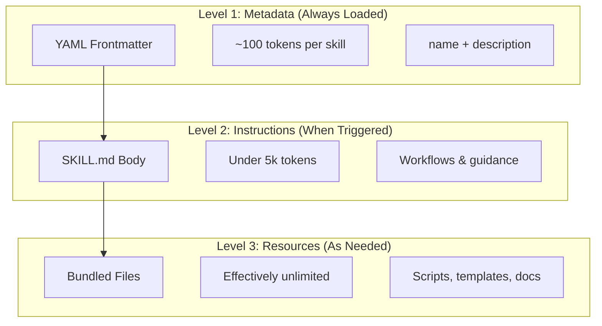
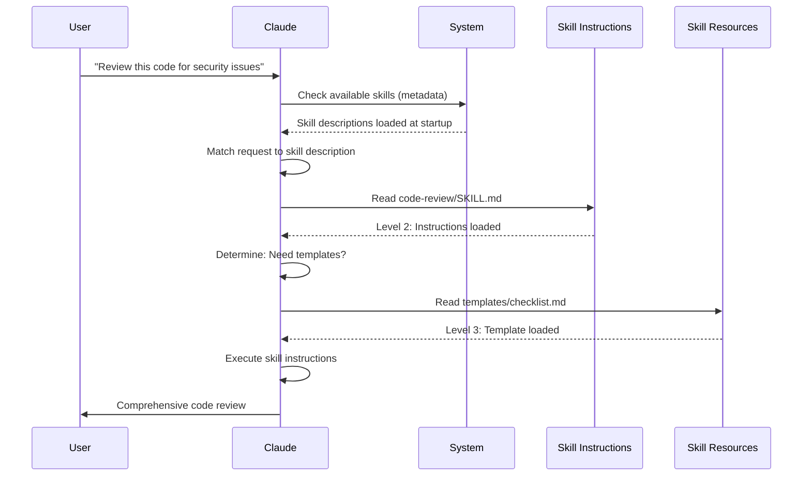

<!-- i18n-source: 03-skills/README.md -->
<!-- i18n-source-sha: 8e1f60f -->
<!-- i18n-date: 2026-04-27 -->
<picture>
  <source media="(prefers-color-scheme: dark)" srcset="../../resources/logos/claude-howto-logo-dark.svg">
  
</picture>

# Agent Skills ガイド

Agent Skills は、Claude の機能を拡張する再利用可能でファイルシステムベースの能力である。ドメイン固有の専門知識、ワークフロー、ベストプラクティスを、関連性に応じて Claude が自動的に利用できる発見可能なコンポーネントへとパッケージ化する。

## 概要

**Agent Skills** は汎用エージェントを専門家へと変貌させるモジュール化された能力である。プロンプト（単発タスク向けの会話レベルの指示）と異なり、スキルは必要に応じてロードされ、複数の会話にわたって同じガイダンスを繰り返し提供する必要をなくす。

### 主なメリット

- **Claude を専門化**: ドメイン固有のタスク向けに能力を仕立てる
- **繰り返しの削減**: 一度作成すれば、会話をまたいで自動的に利用される
- **能力の組み合わせ**: スキルを組み合わせて複雑なワークフローを構築できる
- **ワークフローのスケール**: 複数のプロジェクトやチームでスキルを再利用できる
- **品質の維持**: ベストプラクティスをワークフローへ直接埋め込める

スキルは [Agent Skills](https://agentskills.io) のオープン標準に準拠しており、複数の AI ツールで動作する。Claude Code は、呼び出し制御、サブエージェント実行、動的コンテキスト注入といった追加機能で標準を拡張している。

> **Note**: カスタムスラッシュコマンドはスキルへ統合された。`.claude/commands/` 内のファイルは引き続き動作し、同じフロントマターフィールドをサポートする。新規開発ではスキルが推奨される。同一パスに両方が存在する場合（例: `.claude/commands/review.md` と `.claude/skills/review/SKILL.md`）、スキルが優先される。

## スキルの仕組み: プログレッシブディスクロージャ

スキルは **プログレッシブディスクロージャ** アーキテクチャを活用する。Claude は事前に全てを消費するのではなく、必要に応じて段階的に情報をロードする。これにより、無制限のスケーラビリティを保ちつつ効率的なコンテキスト管理が可能となる。

### 3 段階のロード



| レベル | ロードされるタイミング | トークンコスト | 内容 |
|-------|------------|------------|---------|
| **Level 1: メタデータ** | 常時（起動時） | スキルあたり約 100 トークン | YAML フロントマターの `name` と `description` |
| **Level 2: 命令** | スキルがトリガーされたとき | 5k トークン未満 | SKILL.md 本文の指示とガイダンス |
| **Level 3+: リソース** | 必要に応じて | 実質無制限 | bash 経由で実行されるバンドル済みファイル（コンテンツはコンテキストにロードされない） |

つまり、コンテキストにペナルティを与えずに多数のスキルをインストールできる。Claude は、実際にトリガーされるまでは各スキルの存在と用途しか知らない。

## スキルのロードプロセス



## スキルの種類と配置場所

| 種類 | 配置場所 | スコープ | 共有 | 適した用途 |
|------|----------|-------|--------|----------|
| **Enterprise** | 管理対象設定 | 組織内全ユーザー | あり | 組織全体の標準 |
| **Personal** | `~/.claude/skills/<skill-name>/SKILL.md` | 個人 | なし | 個人のワークフロー |
| **Project** | `.claude/skills/<skill-name>/SKILL.md` | チーム | あり（git 経由） | チームの標準 |
| **Plugin** | `<plugin>/skills/<skill-name>/SKILL.md` | 有効化された範囲 | プラグインに依存 | プラグインへのバンドル |

スキル名がレベル間で重複する場合、優先度の高い配置場所が優先される: **enterprise > personal > project**。プラグインスキルは `plugin-name:skill-name` の名前空間を用いるため衝突しない。

### 自動検出

**ネストされたディレクトリ**: サブディレクトリ内のファイルを扱う際、Claude Code はネストされた `.claude/skills/` ディレクトリからスキルを自動的に検出する。例えば `packages/frontend/` 内のファイルを編集中の場合、Claude Code は `packages/frontend/.claude/skills/` 内のスキルも探す。これは、パッケージごとに独自のスキルを持つモノレポ構成をサポートする。

**`--add-dir` ディレクトリ**: `--add-dir` で追加されたディレクトリのスキルは、変更のライブ検出を伴って自動的にロードされる。それらのディレクトリ内のスキルファイルへの編集は、Claude Code を再起動せずに直ちに反映される。

**description のバジェット**: スキルの説明（Level 1 メタデータ）は **コンテキストウィンドウの 1 %** が上限となる（フォールバック: **8,000 文字**）。多数のスキルをインストールしている場合、説明が短縮されることがある。スキル名は常に含まれるが、説明は容量に合わせて切り詰められる。説明では主要なユースケースを冒頭に置くこと。バジェットは環境変数 `SLASH_COMMAND_TOOL_CHAR_BUDGET` で上書きできる。

## カスタムスキルの作成

### 基本ディレクトリ構造

```
my-skill/
├── SKILL.md           # メイン命令（必須）
├── template.md        # Claude が埋めるテンプレート
├── examples/
│   └── sample.md      # 期待される形式を示す出力例
└── scripts/
    └── validate.sh    # Claude が実行できるスクリプト
```

### SKILL.md の形式

```yaml
---
name: your-skill-name
description: Brief description of what this Skill does and when to use it
---

# Your Skill Name

## Instructions
Provide clear, step-by-step guidance for Claude.

## Examples
Show concrete examples of using this Skill.
```

### 必須フィールド

- **name**: 小文字、数字、ハイフンのみ（最大 64 文字）。"anthropic" や "claude" を含めることはできない。
- **description**: スキルが何をするかと、いつ使うか（最大 1024 文字）。Claude がスキルを発火させるべきタイミングを判断する上で重要である。

### オプションのフロントマターフィールド

```yaml
---
name: my-skill
description: What this skill does and when to use it
argument-hint: "[filename] [format]"        # 自動補完用ヒント
disable-model-invocation: true              # ユーザーのみ呼び出し可
user-invocable: false                       # スラッシュメニューから非表示
allowed-tools: Read, Grep, Glob             # ツールアクセスの制限
model: opus                                 # 使用するモデルの指定
effort: high                                # 努力レベルの上書き（low, medium, high, max）
context: fork                               # 隔離されたサブエージェントで実行
agent: Explore                              # エージェントタイプ（context: fork と併用）
shell: bash                                 # コマンドのシェル: bash（既定）または powershell
hooks:                                      # スキルスコープのフック
  PreToolUse:
    - matcher: "Bash"
      hooks:
        - type: command
          command: "./scripts/validate.sh"
paths: "src/api/**/*.ts"               # スキルの発火を制限する glob パターン
---
```

| フィールド | 説明 |
|-------|-------------|
| `name` | 小文字、数字、ハイフンのみ（最大 64 文字）。"anthropic" や "claude" を含められない。 |
| `description` | スキルが何をするかと、いつ使うか（最大 1024 文字）。自動呼び出しのマッチングに重要。 |
| `argument-hint` | `/` の自動補完メニューに表示されるヒント（例: `"[filename] [format]"`）。 |
| `disable-model-invocation` | `true` = ユーザーのみが `/name` で呼び出せる。Claude は自動呼び出ししない。 |
| `user-invocable` | `false` = `/` メニューから非表示。Claude のみが自動呼び出し可能。 |
| `allowed-tools` | 許可プロンプトなしでスキルが利用可能なツールのカンマ区切りリスト。 |
| `model` | スキルが有効な間のモデルの上書き（例: `opus`, `sonnet`）。 |
| `effort` | スキルが有効な間の努力レベルの上書き: `low`, `medium`, `high`, `max`。 |
| `context` | `fork` を指定するとスキルを独自のコンテキストウィンドウを持つフォーク済みサブエージェントコンテキストで実行する。 |
| `agent` | `context: fork` の際のサブエージェントタイプ（例: `Explore`, `Plan`, `general-purpose`）。 |
| `shell` | `` !`command` `` 置換とスクリプトに使うシェル: `bash`（既定）または `powershell`。 |
| `hooks` | このスキルのライフサイクルにスコープされたフック（グローバルフックと同じ形式）。 |
| `paths` | スキルが自動発火する条件を制限する glob パターン。カンマ区切り文字列または YAML リスト。パス固有ルールと同じ形式。 |

## スキルのコンテンツの種類

スキルは目的に応じて 2 種類のコンテンツを含むことができる。

### リファレンスコンテンツ

現在の作業に Claude が適用する知識を追加する。規約、パターン、スタイルガイド、ドメイン知識など。会話のコンテキストとインラインで動作する。

```yaml
---
name: api-conventions
description: API design patterns for this codebase
---

When writing API endpoints:
- Use RESTful naming conventions
- Return consistent error formats
- Include request validation
```

### タスクコンテンツ

特定のアクションを行うステップバイステップの命令。`/skill-name` で直接呼び出されることが多い。

```yaml
---
name: deploy
description: Deploy the application to production
context: fork
disable-model-invocation: true
---

Deploy the application:
1. Run the test suite
2. Build the application
3. Push to the deployment target
```

## スキルの呼び出し制御

既定では、ユーザーも Claude もどのスキルでも呼び出せる。2 つのフロントマターフィールドが 3 つの呼び出しモードを制御する。

| フロントマター | ユーザー呼び出し | Claude 呼び出し |
|---|---|---|
| （既定） | 可 | 可 |
| `disable-model-invocation: true` | 可 | 不可 |
| `user-invocable: false` | 不可 | 可 |

**`disable-model-invocation: true` を使うべき場面**: 副作用のあるワークフロー（`/commit`, `/deploy`, `/send-slack-message`）。コードが整って見えるからといって Claude が勝手にデプロイすることは望まれない。

**`user-invocable: false` を使うべき場面**: コマンドとして実行可能ではない背景知識。`legacy-system-context` のようなスキルは古いシステムの仕組みを説明するもので、Claude には有用だがユーザーにとって意味のあるアクションではない。

## 文字列置換

スキルは、コンテンツが Claude に届く前に解決される動的な値をサポートする。

| 変数 | 説明 |
|----------|-------------|
| `$ARGUMENTS` | スキル呼び出し時に渡された全引数 |
| `$ARGUMENTS[N]` または `$N` | インデックス（0 始まり）で特定の引数にアクセス |
| `${CLAUDE_SESSION_ID}` | 現在のセッション ID |
| `${CLAUDE_SKILL_DIR}` | スキルの SKILL.md ファイルを含むディレクトリ |
| `` !`command` `` | 動的コンテキスト注入 — シェルコマンドを実行し出力をインライン化する |

**例:**

```yaml
---
name: fix-issue
description: Fix a GitHub issue
---

Fix GitHub issue $ARGUMENTS following our coding standards.
1. Read the issue description
2. Implement the fix
3. Write tests
4. Create a commit
```

`/fix-issue 123` を実行すると `$ARGUMENTS` が `123` に置換される。

## 動的コンテキストの注入

`` !`command` `` 構文は、スキルコンテンツが Claude に送信される前にシェルコマンドを実行する。

```yaml
---
name: pr-summary
description: Summarize changes in a pull request
context: fork
agent: Explore
---

## Pull request context
- PR diff: !`gh pr diff`
- PR comments: !`gh pr view --comments`
- Changed files: !`gh pr diff --name-only`

## Your task
Summarize this pull request...
```

コマンドは即座に実行され、Claude には最終出力のみが見える。既定では `bash` で実行される。フロントマターで `shell: powershell` を設定すれば PowerShell を使える。

## サブエージェント内でのスキル実行

スキルに `context: fork` を追加すると、隔離されたサブエージェントコンテキストで実行される。スキルのコンテンツが、独自のコンテキストウィンドウを持つ専用サブエージェントへのタスクとなり、メインの会話を散らかさない。

`agent` フィールドはどのエージェントタイプを使うかを指定する。

| エージェントタイプ | 適した用途 |
|---|---|
| `Explore` | 読み取り専用のリサーチ、コードベース解析 |
| `Plan` | 実装プランの作成 |
| `general-purpose` | 全ツールが必要な広範なタスク |
| カスタムエージェント | 設定で定義された専門エージェント |

**フロントマターの例:**

```yaml
---
context: fork
agent: Explore
---
```

**完全なスキル例:**

```yaml
---
name: deep-research
description: Research a topic thoroughly
context: fork
agent: Explore
---

Research $ARGUMENTS thoroughly:
1. Find relevant files using Glob and Grep
2. Read and analyze the code
3. Summarize findings with specific file references
```

## 実用例

### 例 1: コードレビュースキル

**ディレクトリ構造:**

```
~/.claude/skills/code-review/
├── SKILL.md
├── templates/
│   ├── review-checklist.md
│   └── finding-template.md
└── scripts/
    ├── analyze-metrics.py
    └── compare-complexity.py
```

**ファイル:** `~/.claude/skills/code-review/SKILL.md`

```yaml
---
name: code-review-specialist
description: Comprehensive code review with security, performance, and quality analysis. Use when users ask to review code, analyze code quality, evaluate pull requests, or mention code review, security analysis, or performance optimization.
---

# Code Review Skill

This skill provides comprehensive code review capabilities focusing on:

1. **Security Analysis**
   - Authentication/authorization issues
   - Data exposure risks
   - Injection vulnerabilities
   - Cryptographic weaknesses

2. **Performance Review**
   - Algorithm efficiency (Big O analysis)
   - Memory optimization
   - Database query optimization
   - Caching opportunities

3. **Code Quality**
   - SOLID principles
   - Design patterns
   - Naming conventions
   - Test coverage

4. **Maintainability**
   - Code readability
   - Function size (should be < 50 lines)
   - Cyclomatic complexity
   - Type safety

## Review Template

For each piece of code reviewed, provide:

### Summary
- Overall quality assessment (1-5)
- Key findings count
- Recommended priority areas

### Critical Issues (if any)
- **Issue**: Clear description
- **Location**: File and line number
- **Impact**: Why this matters
- **Severity**: Critical/High/Medium
- **Fix**: Code example

For detailed checklists, see [templates/review-checklist.md](templates/review-checklist.md).
```

### 例 2: コードベース可視化スキル

インタラクティブな HTML 可視化を生成するスキル。

**ディレクトリ構造:**

```
~/.claude/skills/codebase-visualizer/
├── SKILL.md
└── scripts/
    └── visualize.py
```

**ファイル:** `~/.claude/skills/codebase-visualizer/SKILL.md`

````yaml
---
name: codebase-visualizer
description: Generate an interactive collapsible tree visualization of your codebase. Use when exploring a new repo, understanding project structure, or identifying large files.
allowed-tools: Bash(python *)
---

# Codebase Visualizer

Generate an interactive HTML tree view showing your project's file structure.

## Usage

Run the visualization script from your project root:

```bash
python ~/.claude/skills/codebase-visualizer/scripts/visualize.py .
```

This creates `codebase-map.html` and opens it in your default browser.

## What the visualization shows

- **Collapsible directories**: Click folders to expand/collapse
- **File sizes**: Displayed next to each file
- **Colors**: Different colors for different file types
- **Directory totals**: Shows aggregate size of each folder
````

バンドルされた Python スクリプトが重い処理を担い、Claude はオーケストレーションを行う。

### 例 3: デプロイスキル（ユーザー呼び出し専用）

```yaml
---
name: deploy
description: Deploy the application to production
disable-model-invocation: true
allowed-tools: Bash(npm *), Bash(git *)
---

Deploy $ARGUMENTS to production:

1. Run the test suite: `npm test`
2. Build the application: `npm run build`
3. Push to the deployment target
4. Verify the deployment succeeded
5. Report deployment status
```

### 例 4: ブランドボイススキル（背景知識）

```yaml
---
name: brand-voice
description: Ensure all communication matches brand voice and tone guidelines. Use when creating marketing copy, customer communications, or public-facing content.
user-invocable: false
---

## Tone of Voice
- **Friendly but professional** - approachable without being casual
- **Clear and concise** - avoid jargon
- **Confident** - we know what we're doing
- **Empathetic** - understand user needs

## Writing Guidelines
- Use "you" when addressing readers
- Use active voice
- Keep sentences under 20 words
- Start with value proposition

For templates, see [templates/](templates/).
```

### 例 5: CLAUDE.md ジェネレータースキル

```yaml
---
name: claude-md
description: Create or update CLAUDE.md files following best practices for optimal AI agent onboarding. Use when users mention CLAUDE.md, project documentation, or AI onboarding.
---

## Core Principles

**LLMs are stateless**: CLAUDE.md is the only file automatically included in every conversation.

### The Golden Rules

1. **Less is More**: Keep under 300 lines (ideally under 100)
2. **Universal Applicability**: Only include information relevant to EVERY session
3. **Don't Use Claude as a Linter**: Use deterministic tools instead
4. **Never Auto-Generate**: Craft it manually with careful consideration

## Essential Sections

- **Project Name**: Brief one-line description
- **Tech Stack**: Primary language, frameworks, database
- **Development Commands**: Install, test, build commands
- **Critical Conventions**: Only non-obvious, high-impact conventions
- **Known Issues / Gotchas**: Things that trip up developers
```

### 例 6: スクリプトを伴うリファクタリングスキル

**ディレクトリ構造:**

```
refactor/
├── SKILL.md
├── references/
│   ├── code-smells.md
│   └── refactoring-catalog.md
├── templates/
│   └── refactoring-plan.md
└── scripts/
    ├── analyze-complexity.py
    └── detect-smells.py
```

**ファイル:** `refactor/SKILL.md`

```yaml
---
name: code-refactor
description: Systematic code refactoring based on Martin Fowler's methodology. Use when users ask to refactor code, improve code structure, reduce technical debt, or eliminate code smells.
---

# Code Refactoring Skill

A phased approach emphasizing safe, incremental changes backed by tests.

## Workflow

Phase 1: Research & Analysis → Phase 2: Test Coverage Assessment →
Phase 3: Code Smell Identification → Phase 4: Refactoring Plan Creation →
Phase 5: Incremental Implementation → Phase 6: Review & Iteration

## Core Principles

1. **Behavior Preservation**: External behavior must remain unchanged
2. **Small Steps**: Make tiny, testable changes
3. **Test-Driven**: Tests are the safety net
4. **Continuous**: Refactoring is ongoing, not a one-time event

For code smell catalog, see [references/code-smells.md](references/code-smells.md).
For refactoring techniques, see [references/refactoring-catalog.md](references/refactoring-catalog.md).
```

## 補助ファイル

スキルは `SKILL.md` 以外にも複数のファイルをディレクトリに含められる。これらの補助ファイル（テンプレート、例、スクリプト、リファレンスドキュメント）は、必要に応じて Claude がロードできる追加リソースを提供しつつ、メインのスキルファイルを焦点の絞られた状態に保つ。

```
my-skill/
├── SKILL.md              # メイン命令（必須、500 行以下に保つ）
├── templates/            # Claude が埋めるテンプレート
│   └── output-format.md
├── examples/             # 期待される形式を示す出力例
│   └── sample-output.md
├── references/           # ドメイン知識と仕様
│   └── api-spec.md
└── scripts/              # Claude が実行できるスクリプト
    └── validate.sh
```

補助ファイルのガイドライン:

- `SKILL.md` は **500 行以下** に保つ。詳細なリファレンス、大きな例、仕様は別ファイルへ移す。
- `SKILL.md` から追加ファイルを参照する際は **相対パス** を使う（例: `[API reference](references/api-spec.md)`）。
- 補助ファイルは Level 3（必要に応じて）でロードされるため、Claude が実際に読むまではコンテキストを消費しない。

## スキルの管理

### 利用可能なスキルの確認

Claude に直接尋ねる:
```
What Skills are available?
```

またはファイルシステムを確認する:
```bash
# 個人スキル一覧
ls ~/.claude/skills/

# プロジェクトスキル一覧
ls .claude/skills/
```

### スキルのテスト

テスト方法は 2 種類ある。

**Claude に自動で呼び出させる**: 説明にマッチするものを聞く:
```
Can you help me review this code for security issues?
```

**スキル名で直接呼び出す**:
```
/code-review src/auth/login.ts
```

### スキルの更新

`SKILL.md` を直接編集する。変更は次回の Claude Code 起動時に反映される。

```bash
# 個人スキル
code ~/.claude/skills/my-skill/SKILL.md

# プロジェクトスキル
code .claude/skills/my-skill/SKILL.md
```

### Claude のスキルアクセス制限

Claude が呼び出せるスキルを制御する 3 つの方法。

**全スキルの無効化** は `/permissions` で:
```
# deny ルールに追加:
Skill
```

**特定のスキルを許可または拒否**:
```
# 特定スキルのみ許可
Skill(commit)
Skill(review-pr *)

# 特定スキルを拒否
Skill(deploy *)
```

**個別スキルの非表示** は、フロントマターに `disable-model-invocation: true` を追加する。

## ベストプラクティス

### 1. 説明を具体的にする

- **悪い例（曖昧）**: "Helps with documents"
- **良い例（具体的）**: "Extract text and tables from PDF files, fill forms, merge documents. Use when working with PDF files or when the user mentions PDFs, forms, or document extraction."

### 2. スキルを 1 つの目的に絞る

- 1 スキル = 1 機能
- 良い例: "PDF form filling"
- 悪い例: "Document processing"（広すぎる）

### 3. トリガーワードを含める

ユーザーのリクエストとマッチするキーワードを説明に追加する:
```yaml
description: Analyze Excel spreadsheets, generate pivot tables, create charts. Use when working with Excel files, spreadsheets, or .xlsx files.
```

### 4. SKILL.md を 500 行以下に保つ

詳細なリファレンスは別ファイルへ移し、必要に応じて Claude がロードできるようにする。

### 5. 補助ファイルを参照する

```markdown
## Additional resources

- For complete API details, see [reference.md](reference.md)
- For usage examples, see [examples.md](examples.md)
```

### やるべきこと

- 明確で説明的な名前を使う
- 包括的な命令を含める
- 具体的な例を入れる
- 関連スクリプトとテンプレートをパッケージ化する
- 実シナリオでテストする
- 依存関係をドキュメント化する

### やってはいけないこと

- 一度きりのタスク向けにスキルを作らない
- 既存機能を重複させない
- スキルを広くしすぎない
- description フィールドを省略しない
- 信頼できないソースのスキルを監査せずにインストールしない

## トラブルシューティング

### クイックリファレンス

| 問題 | 解決策 |
|-------|----------|
| Claude がスキルを使わない | description をトリガー語句で具体化する |
| スキルファイルが見つからない | パス確認: `~/.claude/skills/name/SKILL.md` |
| YAML エラー | `---` マーカー、インデント、タブ無し確認 |
| スキルが衝突する | description に区別できるトリガー語句を入れる |
| スクリプトが動かない | パーミッション確認: `chmod +x scripts/*.py` |
| Claude が一部スキルを認識しない | スキルが多すぎる。`/context` で警告を確認 |

### スキルがトリガーされない場合

Claude が期待通りにスキルを使わない場合:

1. ユーザーが自然に発する語句が description のキーワードに含まれているか確認する
2. 「What skills are available?」と尋ねてスキルが表示されるか確認する
3. リクエストを description にマッチするように言い換える
4. `/skill-name` で直接呼び出してテストする

### スキルが過剰にトリガーされる場合

意図しないところで Claude がスキルを使う場合:

1. description をより具体的にする
2. 手動呼び出しのみとするため `disable-model-invocation: true` を追加する

### Claude が一部のスキルを認識しない場合

スキルの description は **コンテキストウィンドウの 1 %** を上限としてロードされる（フォールバック: **8,000 文字**）。各エントリはバジェットに関係なく 250 文字に制限される。`/context` を実行して除外されたスキルに関する警告を確認する。バジェットは環境変数 `SLASH_COMMAND_TOOL_CHAR_BUDGET` で上書きできる。

## セキュリティ上の考慮事項

**信頼できるソースのスキルのみを使うこと。** スキルは命令とコードを通じて Claude に能力を与える。悪意あるスキルは、Claude に有害な方法でツールを呼び出させたりコードを実行させたりする可能性がある。

**主要なセキュリティ考慮事項:**

- **徹底した監査**: スキルディレクトリ内の全ファイルをレビューする
- **外部ソースはリスクが高い**: 外部 URL から取得するスキルは侵害される恐れがある
- **ツールの悪用**: 悪意あるスキルが有害な方法でツールを呼び出すおそれがある
- **ソフトウェアインストールと同様に扱う**: 信頼できるソースのスキルのみを使う

### スキル内のシェル置換の無効化

スキルは Claude が見る前に `` !`command` `` 構文でシェルコマンドの出力をプロンプトに挿入できる。セキュリティ重視の環境（共有された組織展開、ロックダウンされた CI ランナー）では、`disableSkillShellExecution` 設定で置換を完全に無効化できる（**v2.1.91** で追加）:

```jsonc
// ~/.claude/settings.json または管理ポリシー
{
  "disableSkillShellExecution": true
}
```

`disableSkillShellExecution` が `true` のとき、スキル内の `` !`command` `` マーカーは実行されずリテラル文字列として残される。スキル自体を無効化することなく、スキルレベルのシェルインジェクション攻撃面を取り除ける。多層防御のため、`allowedTools` 許可リストとの組み合わせを検討するとよい。

## スキルと他機能の比較

| 機能 | 呼び出し | 適した用途 |
|---------|------------|----------|
| **スキル** | 自動または `/name` | 再利用可能な専門知識、ワークフロー |
| **スラッシュコマンド** | ユーザー起点 `/name` | 簡易ショートカット（スキルへ統合済み） |
| **サブエージェント** | 自動委譲 | 隔離されたタスク実行 |
| **メモリ（CLAUDE.md）** | 常時ロード | 永続的なプロジェクトコンテキスト |
| **MCP** | リアルタイム | 外部データやサービスへのアクセス |
| **フック** | イベント駆動 | 自動化された副作用 |

## バンドル済みスキル

Claude Code には、インストール不要で常時利用できる組み込みスキルが複数同梱されている。

| スキル | 説明 |
|-------|-------------|
| `/simplify` | 変更ファイルを再利用性、品質、効率の観点でレビューする。3 つの並列レビューエージェントを起動 |
| `/batch <instruction>` | git worktree を用いてコードベース全体に大規模な並列変更をオーケストレーション |
| `/debug [description]` | デバッグログを読んで現在のセッションをトラブルシュート |
| `/loop [interval] <prompt>` | プロンプトを定期的に繰り返し実行（例: `/loop 5m check the deploy`） |
| `/claude-api` | Claude API/SDK リファレンスをロード。`anthropic`/`@anthropic-ai/sdk` のインポート時に自動発火 |

これらのスキルは追加インストールや設定なしでそのまま使える。カスタムスキルと同じ SKILL.md 形式に従う。

## スキルの共有

### プロジェクトスキル（チーム共有）

1. `.claude/skills/` にスキルを作成する
2. git にコミットする
3. チームメンバーが pull すれば即時に利用可能となる

### 個人スキル

```bash
# 個人ディレクトリへコピー
cp -r my-skill ~/.claude/skills/

# スクリプトを実行可能にする
chmod +x ~/.claude/skills/my-skill/scripts/*.py
```

### プラグイン配布

より広範な配布のため、プラグインの `skills/` ディレクトリにスキルをパッケージ化する。

## さらに進むには: スキルコレクションとスキルマネージャー

スキルを本格的に作り始めると、2 つのものが不可欠となる。実証済みスキルのライブラリと、それらを管理するツールである。

**[luongnv89/skills](https://github.com/luongnv89/skills)** — ほぼ全プロジェクトで日々使っているスキルのコレクション。ハイライトとして `logo-designer`（プロジェクトロゴをその場で生成）や `ollama-optimizer`（ハードウェアに合わせてローカル LLM の性能をチューニング）がある。すぐ使えるスキルを探しているなら良い出発点である。

**[luongnv89/asm](https://github.com/luongnv89/asm)** — Agent Skill Manager。スキル開発、重複検出、テストを扱う。`asm link` コマンドにより、ファイルをコピーすることなく任意のプロジェクトでスキルをテストできる。スキルが少し増えてきたら不可欠なツールである。

## 追加リソース

- [公式スキルドキュメント](https://code.claude.com/docs/en/skills)
- [Agent Skills アーキテクチャブログ](https://claude.com/blog/equipping-agents-for-the-real-world-with-agent-skills)
- [Skills リポジトリ](https://github.com/luongnv89/skills) - すぐ使えるスキルのコレクション
- [スラッシュコマンドガイド](../01-slash-commands/) - ユーザー起点のショートカット
- [サブエージェントガイド](../04-subagents/) - 委譲された AI エージェント
- [メモリガイド](../02-memory/) - 永続的なコンテキスト
- [MCP（Model Context Protocol）](../05-mcp/) - リアルタイム外部データ
- [フックガイド](../06-hooks/) - イベント駆動の自動化

---
**最終更新**: 2026 年 4 月 24 日
**Claude Code バージョン**: 2.1.119
**情報源**:
- https://code.claude.com/docs/en/skills
- https://code.claude.com/docs/en/settings
- https://code.claude.com/docs/en/changelog
**対応モデル**: Claude Sonnet 4.6, Claude Opus 4.7, Claude Haiku 4.5
