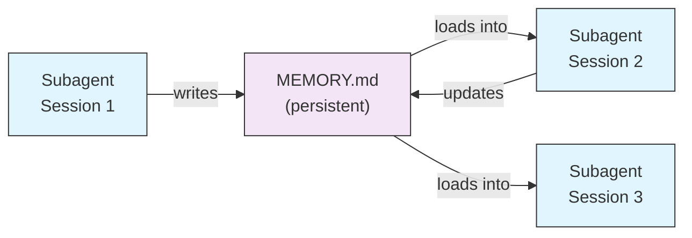
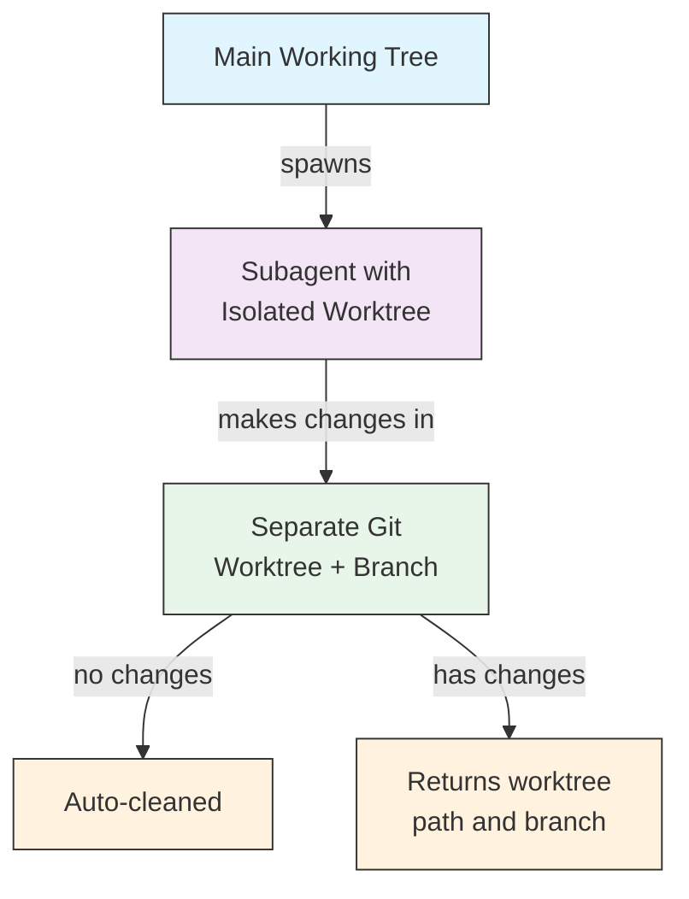
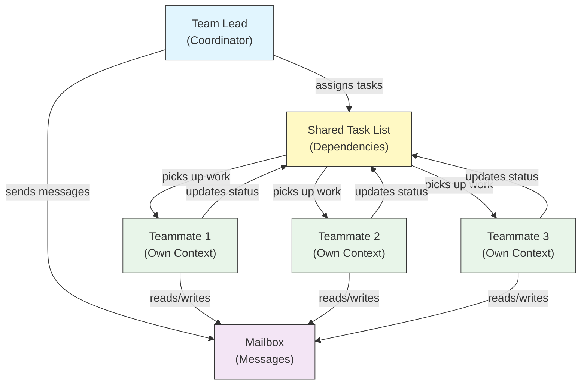
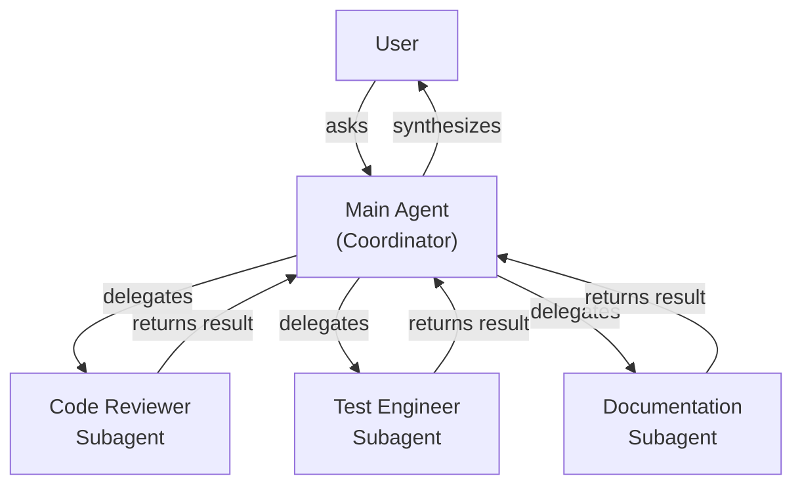
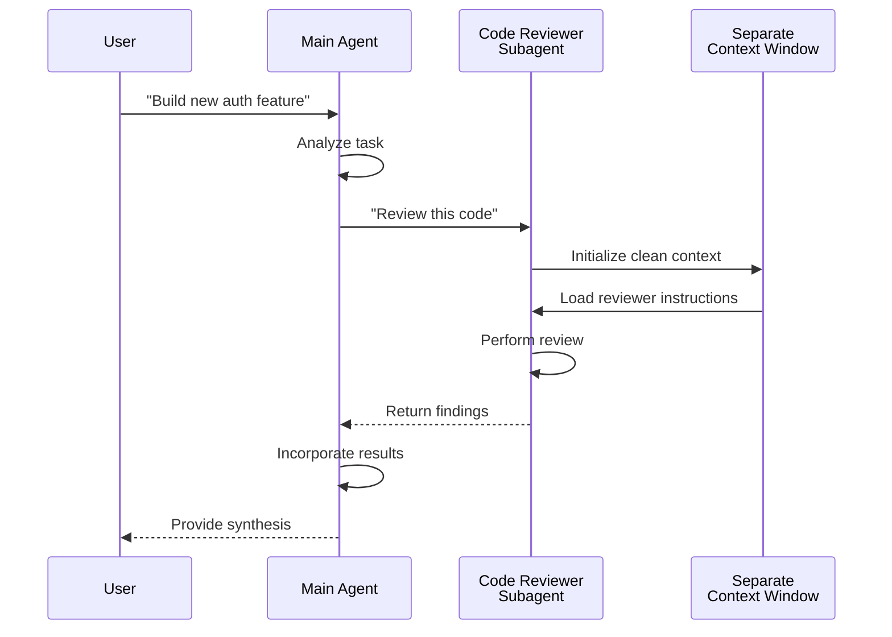
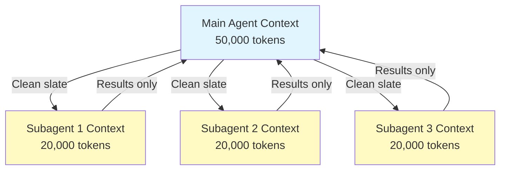
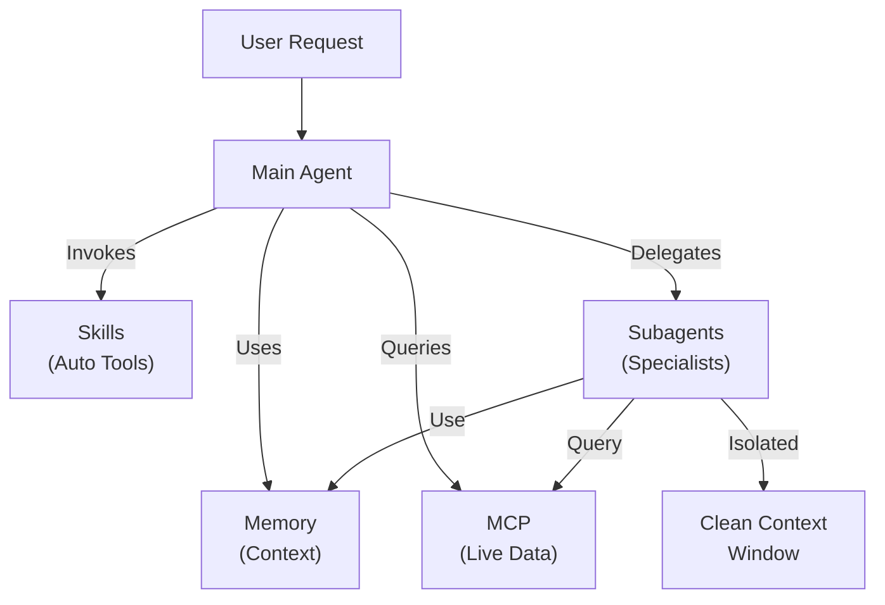

<!-- i18n-source: 04-subagents/README.md -->
<!-- i18n-source-sha: d17d515 -->
<!-- i18n-date: 2026-04-27 -->

<picture>
  <source media="(prefers-color-scheme: dark)" srcset="../../resources/logos/claude-howto-logo-dark.svg">
  
</picture>

# サブエージェント — 完全リファレンスガイド

サブエージェントは、Claude Code がタスクを委譲できる専門化された AI アシスタントである。各サブエージェントは特定の目的を持ち、メインの会話とは別の独自のコンテキストウィンドウを使い、特定のツールとカスタムシステムプロンプトで構成できる。

## 目次

1. [概要](#概要)
2. [主な利点](#主な利点)
3. [ファイルの配置場所](#ファイルの配置場所)
4. [設定](#設定)
5. [組み込みサブエージェント](#組み込みサブエージェント)
6. [サブエージェントの管理](#サブエージェントの管理)
7. [サブエージェントの使い方](#サブエージェントの使い方)
8. [再開可能なエージェント](#再開可能なエージェント)
9. [サブエージェントの連鎖](#サブエージェントの連鎖)
10. [サブエージェントの永続メモリ](#サブエージェントの永続メモリ)
11. [バックグラウンドサブエージェント](#バックグラウンドサブエージェント)
12. [ワークツリー分離](#ワークツリー分離)
13. [生成可能なサブエージェントの制限](#生成可能なサブエージェントの制限)
14. [`claude agents` CLI コマンド](#claude-agents-cli-コマンド)
15. [Agent Teams（実験的）](#agent-teams実験的)
16. [プラグインサブエージェントのセキュリティ](#プラグインサブエージェントのセキュリティ)
17. [アーキテクチャ](#アーキテクチャ)
18. [コンテキスト管理](#コンテキスト管理)
19. [サブエージェントを使うべきとき](#サブエージェントを使うべきとき)
20. [ベストプラクティス](#ベストプラクティス)
21. [このフォルダのサンプルサブエージェント](#このフォルダのサンプルサブエージェント)
22. [インストール手順](#インストール手順)
23. [関連概念](#関連概念)

---

## 概要

サブエージェントは、Claude Code に以下を可能にしてタスクの委譲実行を実現する：

- 別のコンテキストウィンドウを持つ **隔離された AI アシスタント** の作成
- 専門的な知見のための **カスタマイズされたシステムプロンプト** の提供
- 機能を制限するための **ツールアクセス制御** の強制
- 複雑なタスクによる **コンテキスト汚染の防止**
- 複数の専門タスクの **並列実行** の実現

各サブエージェントは独立して動作し、クリーンスレートの状態でそのタスクに必要な特定のコンテキストのみを受け取り、結果をメインエージェントに返して統合する。

**クイックスタート**：`/agents` コマンドを使うと、サブエージェントを対話的に作成・表示・編集・管理できる。

---

## 主な利点

| 利点 | 説明 |
|------|------|
| **コンテキスト保持** | 別コンテキストで動作し、メイン会話の汚染を防ぐ |
| **専門化された知見** | 特定ドメインに調整され、成功率が高い |
| **再利用性** | 異なるプロジェクト間で利用でき、チームと共有できる |
| **柔軟な権限** | サブエージェントの種類ごとに異なるツールアクセスレベル |
| **スケーラビリティ** | 複数のエージェントが異なる側面に同時に取り組める |

---

## ファイルの配置場所

サブエージェントファイルはスコープの異なる複数の場所に保存できる：

| 優先度 | 種類 | 場所 | スコープ |
|--------|------|------|---------|
| 1（最高） | **CLI 定義** | `--agents` フラグ経由（JSON） | セッションのみ |
| 2 | **プロジェクトサブエージェント** | `.claude/agents/` | 現在のプロジェクト |
| 3 | **ユーザーサブエージェント** | `~/.claude/agents/` | 全プロジェクト |
| 4（最低） | **プラグインエージェント** | プラグインの `agents/` ディレクトリ | プラグイン経由 |

同名が複数存在する場合、優先度の高いソースが優先される。

---

## 設定

### ファイル形式

サブエージェントは YAML フロントマターで定義され、その後に Markdown 形式のシステムプロンプトが続く：

```yaml
---
name: your-sub-agent-name
description: Description of when this subagent should be invoked
tools: tool1, tool2, tool3  # オプション — 省略するとすべてのツールを継承
disallowedTools: tool4  # オプション — 明示的に禁止するツール
model: sonnet  # オプション — sonnet、opus、haiku、または inherit
permissionMode: default  # オプション — 権限モード
maxTurns: 20  # オプション — エージェント的なターン数を制限
skills: skill1, skill2  # オプション — コンテキストにプリロードするスキル
mcpServers: server1  # オプション — 利用可能にする MCP サーバー
memory: user  # オプション — 永続メモリのスコープ（user、project、local）
background: false  # オプション — バックグラウンドタスクとして実行
effort: high  # オプション — 推論努力（low、medium、high、max）
isolation: worktree  # オプション — git ワークツリー分離
initialPrompt: "Start by analyzing the codebase"  # オプション — 自動送信される最初のターン
hooks:  # オプション — コンポーネントスコープのフック
  PreToolUse:
    - matcher: "Bash"
      hooks:
        - type: command
          command: "./scripts/security-check.sh"
---

サブエージェントのシステムプロンプトをここに記述する。複数段落になってもよく、
サブエージェントの役割、機能、問題解決のアプローチを明確に定義すべきである。
```

### 設定フィールド

| フィールド | 必須 | 説明 |
|-----------|-----|------|
| `name` | はい | 一意な識別子（小文字とハイフン） |
| `description` | はい | 用途の自然言語による説明。"use PROACTIVELY" を含めると自動呼び出しが促進される |
| `tools` | いいえ | 特定ツールのカンマ区切りリスト。省略するとすべてのツールを継承。`Agent(agent_name)` 構文で生成可能なサブエージェントを制限できる |
| `disallowedTools` | いいえ | サブエージェントが使用してはならないツールのカンマ区切りリスト |
| `model` | いいえ | 使用モデル：`sonnet`、`opus`、`haiku`、フルモデル ID、または `inherit`。デフォルトは設定済みのサブエージェントモデル |
| `permissionMode` | いいえ | `default`、`acceptEdits`、`dontAsk`、`bypassPermissions`、`plan` |
| `maxTurns` | いいえ | サブエージェントが取れるエージェント的ターンの最大数 |
| `skills` | いいえ | プリロードするスキルのカンマ区切りリスト。起動時にスキルの全内容をサブエージェントのコンテキストに注入する |
| `mcpServers` | いいえ | サブエージェントから利用可能にする MCP サーバー |
| `hooks` | いいえ | コンポーネントスコープのフック（PreToolUse、PostToolUse、Stop） |
| `memory` | いいえ | 永続メモリディレクトリのスコープ：`user`、`project`、`local` |
| `background` | いいえ | `true` にすると常にこのサブエージェントをバックグラウンドタスクとして実行 |
| `effort` | いいえ | 推論努力レベル：`low`、`medium`、`high`、`max` |
| `isolation` | いいえ | `worktree` にするとサブエージェント専用の git ワークツリーを与える |
| `initialPrompt` | いいえ | サブエージェントがメインエージェントとして実行されるとき、自動送信される最初のターン |

### メインスレッドエージェントのフロントマター尊重（v2.1.117+/v2.1.119+）

エージェントがメインスレッドエージェントとして呼び出されるとき（`claude --agent <name>` または `--print` モード経由）、以下のフロントマターフィールドが尊重される：

| フィールド | バージョン | 備考 |
|-----------|---------|------|
| `mcpServers` | v2.1.117+ | `claude --agent <name>` でメインスレッドエージェントとして呼び出されたときにロード |
| `permissionMode` | v2.1.119+ | `--agent <name>` 経由の組み込みエージェントで尊重される |
| `tools` / `disallowedTools` | v2.1.119+ | `--print` モード（非対話／スクリプト用途）で尊重される |

**例 — `mcpServers` と `permissionMode` を持つエージェント：**

```yaml
---
name: secure-researcher
description: Research agent with scoped MCP access and restricted permissions
permissionMode: acceptEdits
mcpServers:
  notion:
    type: http
    url: https://mcp.notion.com/mcp
  github:
    type: http
    url: https://api.github.com/mcp
tools: Read, Grep, Glob
---

You are a research agent. You may query Notion and GitHub through the
configured MCP servers, and read local files, but you cannot write or
execute commands outside of accepted edits.
```

実行：

```bash
claude --agent secure-researcher
```

### ツール設定オプション

**オプション 1：すべてのツールを継承（フィールドを省略）**

```yaml
---
name: full-access-agent
description: Agent with all available tools
---
```

**オプション 2：個別ツールを指定**

```yaml
---
name: limited-agent
description: Agent with specific tools only
tools: Read, Grep, Glob, Bash
---
```

> **Glob/Grep に関する注記（v2.1.113+）：** ネイティブ macOS/Linux ビルドでは、Glob と Grep は別個のツールではなく Bash ツール経由で `bfs`/`ugrep` として提供される。Windows と npm-JS ビルドでは引き続きスタンドアロンツールとして公開される。著者は引き続き `allowedTools` で Glob/Grep を参照でき、バックエンドの置換は透過的に行われる。

**オプション 3：条件付きツールアクセス**

```yaml
---
name: conditional-agent
description: Agent with filtered tool access
tools: Read, Bash(npm:*), Bash(test:*)
---
```

### CLI ベースの設定

`--agents` フラグを JSON 形式で使うと、単一セッション用にサブエージェントを定義できる：

```bash
claude --agents '{
  "code-reviewer": {
    "description": "Expert code reviewer. Use proactively after code changes.",
    "prompt": "You are a senior code reviewer. Focus on code quality, security, and best practices.",
    "tools": ["Read", "Grep", "Glob", "Bash"],
    "model": "sonnet"
  }
}'
```

**`--agents` フラグの JSON 形式：**

```json
{
  "agent-name": {
    "description": "Required: when to invoke this agent",
    "prompt": "Required: system prompt for the agent",
    "tools": ["Optional", "array", "of", "tools"],
    "model": "optional: sonnet|opus|haiku"
  }
}
```

**エージェント定義の優先順位：**

エージェント定義は次の優先順位でロードされる（最初に一致したものが優先）：

1. **CLI 定義** — `--agents` フラグ（セッションのみ、JSON）
2. **プロジェクトレベル** — `.claude/agents/`（現在のプロジェクト）
3. **ユーザーレベル** — `~/.claude/agents/`（すべてのプロジェクト）
4. **プラグインレベル** — プラグインの `agents/` ディレクトリ

これにより、CLI 定義が単一セッションにおいて他のすべてのソースを上書きできる。

---

## 組み込みサブエージェント

Claude Code には常に利用可能な組み込みサブエージェントがいくつか含まれている：

| エージェント | モデル | 目的 |
|-------------|-------|------|
| **general-purpose** | 継承 | 複雑な多段タスク |
| **Plan** | 継承 | プランモードのリサーチ |
| **Explore** | Haiku | 読み取り専用のコードベース探索（quick/medium/very thorough） |
| **Bash** | 継承 | 別コンテキストでのターミナルコマンド |
| **statusline-setup** | Sonnet | ステータスラインの設定 |
| **Claude Code Guide** | Haiku | Claude Code の機能に関する質問への回答 |

### General-Purpose サブエージェント

| プロパティ | 値 |
|-----------|-----|
| **モデル** | 親から継承 |
| **ツール** | 全ツール |
| **目的** | 複雑な調査タスク、多段操作、コード変更 |

**使用場面**：探索と変更の両方が必要で、複雑な推論を伴うタスク。

### Plan サブエージェント

| プロパティ | 値 |
|-----------|-----|
| **モデル** | 親から継承 |
| **ツール** | Read、Glob、Grep、Bash |
| **目的** | プランモードでコードベースを調査するために自動で使われる |

**使用場面**：Claude がプランを提示する前にコードベースを理解する必要があるとき。

### Explore サブエージェント

| プロパティ | 値 |
|-----------|-----|
| **モデル** | Haiku（高速・低レイテンシ） |
| **モード** | 厳密に読み取り専用 |
| **ツール** | Glob、Grep、Read、Bash（読み取り専用コマンドのみ） |
| **目的** | 高速なコードベース検索と分析 |

**使用場面**：変更を加えずにコードを検索・理解するとき。

**徹底度レベル** — 探索の深さを指定する：

- **"quick"** — 最小限の探索による高速検索。特定パターンを見つけるのに適する
- **"medium"** — 適度な探索。速度と徹底度のバランスが取れたデフォルトのアプローチ
- **"very thorough"** — 複数の場所と命名規約をまたぐ網羅的分析。時間がかかる場合がある

### Bash サブエージェント

| プロパティ | 値 |
|-----------|-----|
| **モデル** | 親から継承 |
| **ツール** | Bash |
| **目的** | 別のコンテキストウィンドウでターミナルコマンドを実行 |

**使用場面**：隔離されたコンテキストの恩恵を受けるシェルコマンドを実行するとき。

### Statusline Setup サブエージェント

| プロパティ | 値 |
|-----------|-----|
| **モデル** | Sonnet |
| **ツール** | Read、Write、Bash |
| **目的** | Claude Code のステータスライン表示を設定 |

**使用場面**：ステータスラインのセットアップやカスタマイズ時。

### Claude Code Guide サブエージェント

| プロパティ | 値 |
|-----------|-----|
| **モデル** | Haiku（高速・低レイテンシ） |
| **ツール** | 読み取り専用 |
| **目的** | Claude Code の機能と使い方に関する質問に回答 |

**使用場面**：ユーザーが Claude Code の動作や特定機能の使い方について質問するとき。

---

## サブエージェントの管理

### `/agents` コマンドを使う（推奨）

```bash
/agents
```

これは以下を行う対話メニューを提供する：

- 利用可能なすべてのサブエージェント（組み込み、ユーザー、プロジェクト）の表示
- ガイド付きセットアップで新しいサブエージェントを作成
- 既存のカスタムサブエージェントとツールアクセスの編集
- カスタムサブエージェントの削除
- 重複がある場合にどのサブエージェントが有効かを確認

### 直接ファイル管理

```bash
# プロジェクトサブエージェントを作成
mkdir -p .claude/agents
cat > .claude/agents/test-runner.md << 'EOF'
---
name: test-runner
description: Use proactively to run tests and fix failures
---

You are a test automation expert. When you see code changes, proactively
run the appropriate tests. If tests fail, analyze the failures and fix
them while preserving the original test intent.
EOF

# ユーザーサブエージェントを作成（すべてのプロジェクトで利用可能）
mkdir -p ~/.claude/agents
```

---

## サブエージェントの使い方

### 自動委譲

Claude は以下に基づいて積極的にタスクを委譲する：

- リクエスト内のタスク説明
- サブエージェント設定の `description` フィールド
- 現在のコンテキストと利用可能なツール

積極的な使用を促すには、`description` フィールドに "use PROACTIVELY" または "MUST BE USED" を含める：

```yaml
---
name: code-reviewer
description: Expert code review specialist. Use PROACTIVELY after writing or modifying code.
---
```

### 明示的な呼び出し

特定のサブエージェントを明示的にリクエストできる：

```
> Use the test-runner subagent to fix failing tests
> Have the code-reviewer subagent look at my recent changes
> Ask the debugger subagent to investigate this error
```

### @-Mention による呼び出し

`@` プレフィックスを使うと、特定のサブエージェントが確実に呼び出される（自動委譲のヒューリスティクスをバイパス）：

```
> @"code-reviewer (agent)" review the auth module
```

### セッション全体のエージェント

特定のエージェントをメインエージェントとしてセッション全体を実行する：

```bash
# CLI フラグ経由
claude --agent code-reviewer

# settings.json 経由
{
  "agent": "code-reviewer"
}
```

### 利用可能なエージェントの一覧表示

`claude agents` コマンドを使って、すべてのソースから設定済みエージェントを一覧表示する：

```bash
claude agents
```

---

## 再開可能なエージェント

サブエージェントは、完全なコンテキストを保持したまま以前の会話を継続できる：

```bash
# 初回呼び出し
> Use the code-analyzer agent to start reviewing the authentication module
# agentId を返す: "abc123"

# 後でエージェントを再開
> Resume agent abc123 and now analyze the authorization logic as well
```

**ユースケース**：

- 複数セッションをまたぐ長期にわたる調査
- コンテキストを失わない反復的な調整
- コンテキストを維持する多段ワークフロー

---

## サブエージェントの連鎖

複数のサブエージェントを順次実行する：

```bash
> First use the code-analyzer subagent to find performance issues,
  then use the optimizer subagent to fix them
```

これにより、あるサブエージェントの出力を別のサブエージェントへ流す複雑なワークフローが実現できる。

---

## サブエージェントの永続メモリ

`memory` フィールドは、会話をまたいで存続する永続ディレクトリをサブエージェントに与える。これによりサブエージェントは、メモやセッション間で永続する文脈と発見を蓄積できる。

### メモリスコープ

| スコープ | ディレクトリ | ユースケース |
|---------|------------|------------|
| `user` | `~/.claude/agent-memory/<name>/` | 全プロジェクト共通の個人メモと好み |
| `project` | `.claude/agent-memory/<name>/` | チームと共有するプロジェクト固有の知識 |
| `local` | `.claude/agent-memory-local/<name>/` | バージョン管理にコミットしないローカルプロジェクト知識 |

### しくみ

- メモリディレクトリ内の `MEMORY.md` の最初の 200 行が自動的にサブエージェントのシステムプロンプトにロードされる
- メモリファイルを管理するため `Read`、`Write`、`Edit` ツールがサブエージェントに自動的に有効化される
- サブエージェントは必要に応じてメモリディレクトリ内に追加ファイルを作成できる

### 設定例

```yaml
---
name: researcher
memory: user
---

You are a research assistant. Use your memory directory to store findings,
track progress across sessions, and build up knowledge over time.

Check your MEMORY.md file at the start of each session to recall previous context.
```



---

## バックグラウンドサブエージェント

サブエージェントはバックグラウンドで実行でき、メイン会話を他のタスクのために解放できる。

### 設定

フロントマターで `background: true` を設定すると、常にバックグラウンドタスクとしてサブエージェントを実行する：

```yaml
---
name: long-runner
background: true
description: Performs long-running analysis tasks in the background
---
```

### キーボードショートカット

| ショートカット | 動作 |
|-------------|------|
| `Ctrl+B` | 現在実行中のサブエージェントタスクをバックグラウンド化 |
| `Ctrl+F` | バックグラウンドエージェントをすべて終了（確認のため 2 回押下） |

### バックグラウンドタスクの無効化

環境変数を設定するとバックグラウンドタスクのサポートを完全に無効化できる：

```bash
export CLAUDE_CODE_DISABLE_BACKGROUND_TASKS=1
```

---

## ワークツリー分離

`isolation: worktree` 設定により、サブエージェントに独自の git ワークツリーが与えられ、メインの作業ツリーに影響を与えずに独立して変更を加えられる。

### 設定

```yaml
---
name: feature-builder
isolation: worktree
description: Implements features in an isolated git worktree
tools: Read, Write, Edit, Bash, Grep, Glob
---
```

### しくみ



- サブエージェントは独立したブランチ上の独自の git ワークツリーで動作する
- サブエージェントが変更を加えなかった場合、ワークツリーは自動的にクリーンアップされる
- 変更がある場合、ワークツリーのパスとブランチ名がメインエージェントに返され、レビューやマージが可能になる

---

## フォークサブエージェント

フォークサブエージェント（`context: fork`）は、フォーク時点の親エージェントの会話コンテキスト全体を継承し、クリーンスレートではなくその状態から開始する。これは、これまでの作業を失わずに代替案を探索する場合に有用である。

> **可用性**：v2.1.117 で GA。外部ビルド（ファーストパーティ以外の配布）では `CLAUDE_CODE_FORK_SUBAGENT=1` を設定するとフォークが有効化される。

### 設定

```yaml
---
name: alternative-explorer
description: Explore an alternative implementation path while preserving parent context
context: fork
tools: Read, Edit, Bash, Grep, Glob
---

You are a forked subagent. You inherit the parent's full conversation and
may explore an alternative approach. Return your findings and the parent
will decide whether to adopt them.
```

### 外部ビルドでの有効化

```bash
export CLAUDE_CODE_FORK_SUBAGENT=1
claude
```

### Fork とクリーンコンテキストの使い分け

| シナリオ | `context: fork` | クリーンコンテキスト（デフォルト） |
|---------|-----------------|-------------------------|
| 代替実装の探索 | はい | いいえ（コンテキストを失う） |
| 既存コンテキストを伴う長期調査 | はい | いいえ |
| 独立した専門タスク | いいえ | はい |
| コンテキスト汚染を避ける | いいえ | はい |

---

## 生成可能なサブエージェントの制限

`tools` フィールドで `Agent(agent_type)` 構文を使うと、特定のサブエージェントが生成できるサブエージェントを制御できる。これは委譲対象の特定サブエージェントを許可リスト化する手段を提供する。

> **注**：v2.1.63 で `Task` ツールは `Agent` にリネームされた。既存の `Task(...)` 参照は引き続きエイリアスとして機能する。

### 例

```yaml
---
name: coordinator
description: Coordinates work between specialized agents
tools: Agent(worker, researcher), Read, Bash
---

You are a coordinator agent. You can delegate work to the "worker" and
"researcher" subagents only. Use Read and Bash for your own exploration.
```

この例では、`coordinator` サブエージェントは `worker` と `researcher` サブエージェントのみ生成できる。他のサブエージェントが定義されていても、それらを生成することはできない。

---

## `claude agents` CLI コマンド

`claude agents` コマンドは、設定済みのすべてのエージェントをソース別（組み込み、ユーザーレベル、プロジェクトレベル）にグループ化して一覧表示する：

```bash
claude agents
```

このコマンドは：

- すべてのソースから利用可能なエージェントを表示する
- ソースの場所別にエージェントをグループ化する
- 高い優先度レベルのエージェントが低い優先度のエージェントを覆い隠す場合（例：ユーザーレベルと同名のプロジェクトレベルエージェント）、**override** を表示する

---

## Agent Teams（実験的）

Agent Teams は、複雑なタスクで連携する複数の Claude Code インスタンスをコーディネートする。サブエージェント（委譲されたサブタスクが結果を返す形）と異なり、チームメイトは独自のコンテキストウィンドウで独立して動作し、共有メールボックスシステムを通じて互いに直接メッセージを送れる。

> **公式ドキュメント**：[code.claude.com/docs/en/agent-teams](https://code.claude.com/docs/en/agent-teams)

> **注**：Agent Teams は実験的でデフォルトでは無効。Claude Code v2.1.32+ が必要。使用前に有効化すること。

### サブエージェント vs Agent Teams

| 観点 | サブエージェント | Agent Teams |
|-----|-----------|-------------|
| **委譲モデル** | 親がサブタスクを委譲し、結果を待つ | チームリードが作業をコーディネートし、チームメイトが独立して実行 |
| **コンテキスト** | サブタスクごとに新しいコンテキスト、結果は蒸留して戻る | 各チームメイトは独自の永続コンテキストウィンドウを保持 |
| **コーディネーション** | 親が管理する直列または並列 | 自動依存関係管理付きの共有タスクリスト |
| **通信** | 親に結果のみ返却（エージェント間メッセージなし） | チームメイト同士がメールボックス経由で直接メッセージ送信可能 |
| **セッション再開** | サポートあり | インプロセスチームメイトではサポートなし |
| **適する用途** | 焦点が絞られ十分定義されたサブタスク | エージェント間通信と並列実行を要する複雑な作業 |

### Agent Teams の有効化

環境変数を設定するか、`settings.json` に追加する：

```bash
export CLAUDE_CODE_EXPERIMENTAL_AGENT_TEAMS=1
```

または `settings.json` で：

```json
{
  "env": {
    "CLAUDE_CODE_EXPERIMENTAL_AGENT_TEAMS": "1"
  }
}
```

### チームの開始

有効化後は、プロンプトでチームメイトとの作業を Claude に依頼する：

```
User: Build the authentication module. Use a team — one teammate for the API endpoints,
      one for the database schema, and one for the test suite.
```

Claude はチームを作成し、タスクを割り当て、作業を自動的にコーディネートする。

### 表示モード

チームメイトの活動表示方法を制御する：

| モード | フラグ | 説明 |
|-------|------|------|
| **Auto** | `--teammate-mode auto` | ターミナルに最適な表示モードを自動選択 |
| **In-process**（デフォルト） | `--teammate-mode in-process` | 現在のターミナルでチームメイトの出力をインライン表示 |
| **Split-panes** | `--teammate-mode tmux` | tmux または iTerm2 のペインを分けて各チームメイトを開く |

```bash
claude --teammate-mode tmux
```

`settings.json` で表示モードを設定することもできる：

```json
{
  "teammateMode": "tmux"
}
```

> **注**：分割ペインモードは tmux または iTerm2 が必要。VS Code のターミナル、Windows Terminal、Ghostty では利用できない。

### ナビゲーション

`Shift+Down` で分割ペインモード内のチームメイト間を移動できる。

### チーム設定

チーム設定は `~/.claude/teams/{team-name}/config.json` に保存される。

### アーキテクチャ



**主要コンポーネント**：

- **Team Lead**：チームを作成し、タスクを割り当て、コーディネートするメイン Claude Code セッション
- **共有タスクリスト**：自動依存関係追跡を伴う同期されたタスクリスト
- **Mailbox**：チームメイトがステータス通信とコーディネートを行うためのエージェント間メッセージングシステム
- **Teammates**：それぞれ独自のコンテキストウィンドウを持つ独立した Claude Code インスタンス

### タスク割り当てとメッセージング

チームリードは作業をタスクに分解してチームメイトに割り当てる。共有タスクリストが扱うのは：

- **自動依存関係管理** — タスクは依存関係の完了を待つ
- **ステータス追跡** — チームメイトは作業中にタスクのステータスを更新する
- **エージェント間メッセージング** — コーディネーションのためチームメイトがメールボックス経由でメッセージを送る（例：「データベーススキーマが準備できた、クエリを書き始めてよい」）

### プラン承認ワークフロー

複雑なタスクでは、チームメイトが作業を始める前にチームリードが実行プランを作成する。ユーザーがプランをレビューして承認することで、コード変更が行われる前にチームのアプローチが期待と合致していることを確認する。

### チーム向けフックイベント

Agent Teams は 2 つの追加 [フックイベント](../06-hooks/) を導入する：

| イベント | 発火タイミング | ユースケース |
|--------|------------|------------|
| `TeammateIdle` | チームメイトが現在のタスクを終え、保留中の作業がないとき | 通知のトリガー、フォローアップタスクの割り当て |
| `TaskCompleted` | 共有タスクリストのタスクが完了とマークされたとき | 検証の実行、ダッシュボード更新、依存作業の連鎖 |

### ベストプラクティス

- **チームサイズ**：最適なコーディネーションのためチームを 3〜5 人に保つ
- **タスクサイジング**：作業を 5〜15 分のタスクに分解する — 並列化に十分小さく、意味を持つに十分大きく
- **ファイル衝突の回避**：マージ衝突を防ぐため異なるファイル／ディレクトリを異なるチームメイトに割り当てる
- **シンプルに始める**：最初のチームではインプロセスモードを使う。慣れたら分割ペインに切り替える
- **明確なタスク説明**：チームメイトが独立して作業できるよう、具体的で実行可能なタスク説明を提供する

### 制限事項

- **実験的**：機能の動作は将来のリリースで変わる可能性がある
- **セッション再開なし**：インプロセスチームメイトはセッション終了後に再開できない
- **セッションあたり 1 チーム**：単一セッションで入れ子チームや複数チームを作成できない
- **固定リーダーシップ**：チームリードロールはチームメイトに移譲できない
- **分割ペイン制限**：tmux/iTerm2 が必要。VS Code のターミナル、Windows Terminal、Ghostty では利用不可
- **クロスセッションチームなし**：チームメイトは現在のセッション内にのみ存在する

> **警告**：Agent Teams は実験的である。重要でない作業でまずテストし、予期しない動作がないかチームメイトのコーディネーションを監視すること。

---

## プラグインサブエージェントのセキュリティ

プラグイン提供のサブエージェントには、セキュリティのためフロントマター機能の制限がある。プラグインサブエージェント定義では、以下のフィールドは **許可されない**：

- `hooks` — ライフサイクルフックを定義できない
- `mcpServers` — MCP サーバーを設定できない
- `permissionMode` — 権限設定を上書きできない

これにより、プラグインがサブエージェントフックを通じて権限を昇格させたり任意コマンドを実行したりすることを防ぐ。

---

## アーキテクチャ

### ハイレベルアーキテクチャ



### サブエージェントのライフサイクル



---

## コンテキスト管理



### 重要点

- 各サブエージェントは **新しいコンテキストウィンドウ** を取得し、メイン会話の履歴を持たない
- サブエージェントには特定のタスクに対して **関連するコンテキストのみ** が渡される
- 結果は **蒸留** されてメインエージェントに返される
- これにより長期プロジェクトでの **コンテキストトークン枯渇** を防ぐ

### パフォーマンスの考慮事項

- **コンテキスト効率** — エージェントはメインコンテキストを保護し、より長いセッションを可能にする
- **レイテンシ** — サブエージェントはクリーンスレートで開始するため、初期コンテキストの収集にレイテンシが加わる場合がある

### 主要な動作

- **入れ子生成なし** — サブエージェントは他のサブエージェントを生成できない
- **バックグラウンド権限** — バックグラウンドサブエージェントは事前承認されていない権限を自動拒否する
- **バックグラウンド化** — `Ctrl+B` で現在実行中のタスクをバックグラウンド化
- **トランスクリプト** — サブエージェントのトランスクリプトは `~/.claude/projects/{project}/{sessionId}/subagents/agent-{agentId}.jsonl` に保存される
- **自動圧縮** — サブエージェントのコンテキストは容量約 95% で自動圧縮される（`CLAUDE_AUTOCOMPACT_PCT_OVERRIDE` 環境変数で上書き可能）

---

## サブエージェントを使うべきとき

| シナリオ | サブエージェント使用 | 理由 |
|---------|--------------|-----|
| 多段の複雑な機能 | はい | 関心を分離し、コンテキスト汚染を防ぐ |
| クイックなコードレビュー | いいえ | オーバーヘッドが不要 |
| 並列タスク実行 | はい | 各サブエージェントが独自コンテキストを持つ |
| 専門知識が必要 | はい | カスタムシステムプロンプト |
| 長時間の分析 | はい | メインコンテキストの枯渇を防ぐ |
| 単一タスク | いいえ | 不要なレイテンシを追加する |

---

## ベストプラクティス

### 設計原則

**やるべきこと：**

- Claude が生成したエージェントから始める — 初期サブエージェントを Claude に生成させ、その後カスタマイズする
- 焦点を絞ったサブエージェントを設計する — 1 つで何でもこなすのではなく、単一で明確な責務にする
- 詳細なプロンプトを書く — 具体的な指示、例、制約を含める
- ツールアクセスを制限する — サブエージェントの目的に必要なツールのみを付与する
- バージョン管理 — チーム連携のためプロジェクトサブエージェントをバージョン管理にチェックインする

**やってはいけないこと：**

- 役割が重複するサブエージェントを作らない
- 不要なツールアクセスをサブエージェントに与えない
- 単純な単段タスクにサブエージェントを使わない
- 1 つのサブエージェントのプロンプトで関心を混ぜない
- 必要なコンテキストの受け渡しを忘れない

### システムプロンプトのベストプラクティス

1. **役割を具体的に**
   ```
   You are an expert code reviewer specializing in [specific areas]
   ```

2. **優先順位を明確に定義**
   ```
   Review priorities (in order):
   1. Security Issues
   2. Performance Problems
   3. Code Quality
   ```

3. **出力フォーマットを指定**
   ```
   For each issue provide: Severity, Category, Location, Description, Fix, Impact
   ```

4. **アクションステップを含める**
   ```
   When invoked:
   1. Run git diff to see recent changes
   2. Focus on modified files
   3. Begin review immediately
   ```

### ツールアクセス戦略

1. **制限から始める**：必須ツールのみで始める
2. **必要なときだけ拡張する**：要件が要求するときにツールを追加する
3. **可能なら読み取り専用に**：分析エージェントには Read/Grep を使う
4. **サンドボックス実行**：Bash コマンドを特定のパターンに制限する

---

## このフォルダのサンプルサブエージェント

このフォルダにはすぐに使えるサンプルサブエージェントが含まれている：

### 1. Code Reviewer（`code-reviewer.md`）

**目的**：コード品質と保守性の包括的分析

**ツール**：Read、Grep、Glob、Bash

**専門分野**：

- セキュリティ脆弱性の検出
- パフォーマンス最適化箇所の特定
- コード保守性の評価
- テストカバレッジ分析

**使用場面**：品質とセキュリティに焦点を当てた自動コードレビューが必要なとき

---

### 2. Test Engineer（`test-engineer.md`）

**目的**：テスト戦略、カバレッジ分析、自動テスト

**ツール**：Read、Write、Bash、Grep

**専門分野**：

- 単体テストの作成
- 統合テストの設計
- エッジケースの特定
- カバレッジ分析（80% 以上が目標）

**使用場面**：包括的なテストスイートの作成やカバレッジ分析が必要なとき

---

### 3. Documentation Writer（`documentation-writer.md`）

**目的**：技術ドキュメント、API ドキュメント、ユーザーガイド

**ツール**：Read、Write、Grep

**専門分野**：

- API エンドポイントのドキュメント
- ユーザーガイドの作成
- アーキテクチャドキュメント
- コードコメントの改善

**使用場面**：プロジェクトドキュメントの作成や更新が必要なとき

---

### 4. Secure Reviewer（`secure-reviewer.md`）

**目的**：最小権限でのセキュリティ重視コードレビュー

**ツール**：Read、Grep

**専門分野**：

- セキュリティ脆弱性の検出
- 認証・認可の問題
- データ露出のリスク
- インジェクション攻撃の特定

**使用場面**：変更機能なしでセキュリティ監査が必要なとき

---

### 5. Implementation Agent（`implementation-agent.md`）

**目的**：機能開発のためのフル実装機能

**ツール**：Read、Write、Edit、Bash、Grep、Glob

**専門分野**：

- 機能実装
- コード生成
- ビルドとテスト実行
- コードベース変更

**使用場面**：機能をエンドツーエンドで実装するサブエージェントが必要なとき

---

### 6. Debugger（`debugger.md`）

**目的**：エラー、テスト失敗、予期せぬ動作のデバッグ専門家

**ツール**：Read、Edit、Bash、Grep、Glob

**専門分野**：

- 根本原因分析
- エラー調査
- テスト失敗の解決
- 最小修正の実装

**使用場面**：バグ、エラー、予期せぬ動作に遭遇したとき

---

### 7. Data Scientist（`data-scientist.md`）

**目的**：SQL クエリとデータインサイトのデータ分析専門家

**ツール**：Bash、Read、Write

**専門分野**：

- SQL クエリの最適化
- BigQuery の操作
- データ分析と可視化
- 統計的インサイト

**使用場面**：データ分析、SQL クエリ、BigQuery 操作が必要なとき

---

## インストール手順

### 方法 1：/agents コマンドを使う（推奨）

```bash
/agents
```

その後：

1. 'Create New Agent' を選択
2. プロジェクトレベルかユーザーレベルを選択
3. サブエージェントを詳しく説明する
4. アクセスを許可するツールを選択（または空欄ですべてを継承）
5. 保存して使用

### 方法 2：プロジェクトにコピー

エージェントファイルをプロジェクトの `.claude/agents/` ディレクトリにコピーする：

```bash
# プロジェクトに移動
cd /path/to/your/project

# agents ディレクトリがなければ作成
mkdir -p .claude/agents

# このフォルダから全エージェントファイルをコピー
cp /path/to/04-subagents/*.md .claude/agents/

# README は不要なので削除
rm .claude/agents/README.md
```

### 方法 3：ユーザーディレクトリにコピー

すべてのプロジェクトで利用可能なエージェントとして：

```bash
# ユーザー agents ディレクトリを作成
mkdir -p ~/.claude/agents

# エージェントをコピー
cp /path/to/04-subagents/code-reviewer.md ~/.claude/agents/
cp /path/to/04-subagents/debugger.md ~/.claude/agents/
# ... 必要に応じて他もコピー
```

### 検証

インストール後、エージェントが認識されているか確認する：

```bash
/agents
```

組み込みエージェントとともにインストールしたエージェントが一覧表示されるはずである。

---

## ファイル構造

```
project/
├── .claude/
│   └── agents/
│       ├── code-reviewer.md
│       ├── test-engineer.md
│       ├── documentation-writer.md
│       ├── secure-reviewer.md
│       ├── implementation-agent.md
│       ├── debugger.md
│       └── data-scientist.md
└── ...
```

---

## 関連概念

### 関連機能

- **[スラッシュコマンド](../01-slash-commands/)** — ユーザーが呼び出すクイックショートカット
- **[メモリ](../02-memory/)** — セッションをまたぐ永続コンテキスト
- **[スキル](../03-skills/)** — 再利用可能な自律的機能
- **[MCP プロトコル](../05-mcp/)** — リアルタイムの外部データアクセス
- **[フック](../06-hooks/)** — イベント駆動のシェルコマンド自動化
- **[プラグイン](../07-plugins/)** — まとめられた拡張パッケージ

### 他の機能との比較

| 機能 | ユーザー呼び出し | 自動呼び出し | 永続的 | 外部アクセス | 隔離コンテキスト |
|-----|--------------|--------------|--------|------------|------------|
| **スラッシュコマンド** | はい | いいえ | いいえ | いいえ | いいえ |
| **サブエージェント** | はい | はい | いいえ | いいえ | はい |
| **メモリ** | 自動 | 自動 | はい | いいえ | いいえ |
| **MCP** | 自動 | はい | いいえ | はい | いいえ |
| **スキル** | はい | はい | いいえ | いいえ | いいえ |

### 統合パターン



---

## 追加リソース

- [サブエージェント公式ドキュメント](https://code.claude.com/docs/en/sub-agents)
- [CLI リファレンス](https://code.claude.com/docs/en/cli-reference) — `--agents` フラグとその他の CLI オプション
- [プラグインガイド](../07-plugins/) — 他機能と組み合わせたバンドル化
- [スキルガイド](../03-skills/) — 自動呼び出し機能
- [メモリガイド](../02-memory/) — 永続コンテキスト
- [フックガイド](../06-hooks/) — イベント駆動の自動化

---

**最終更新**：2026 年 4 月 24 日
**Claude Code バージョン**：2.1.119
**ソース**：

- https://code.claude.com/docs/en/sub-agents
- https://code.claude.com/docs/en/agent-teams
- https://github.com/anthropics/claude-code/releases/tag/v2.1.117
- https://github.com/anthropics/claude-code/releases/tag/v2.1.119

**互換モデル**：Claude Sonnet 4.6、Claude Opus 4.7、Claude Haiku 4.5
