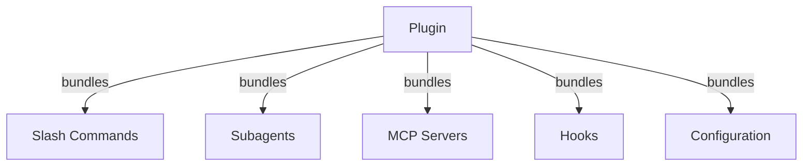
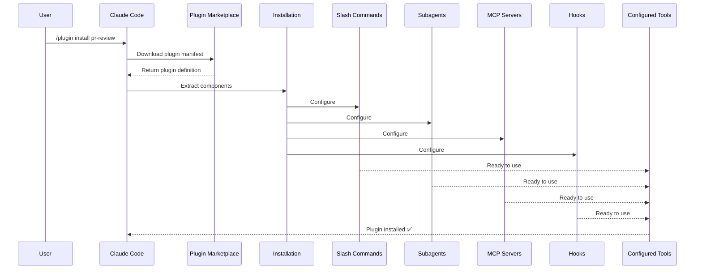
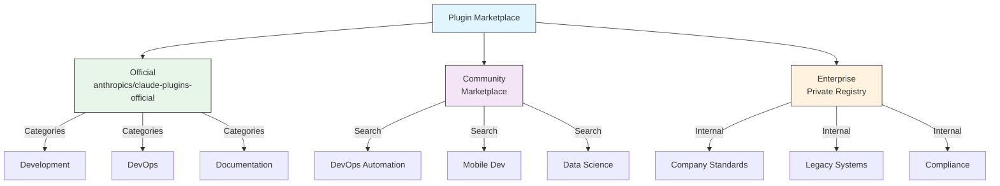
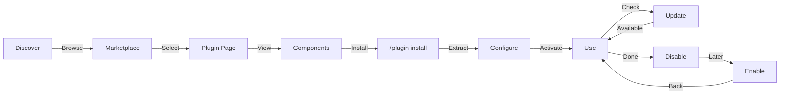
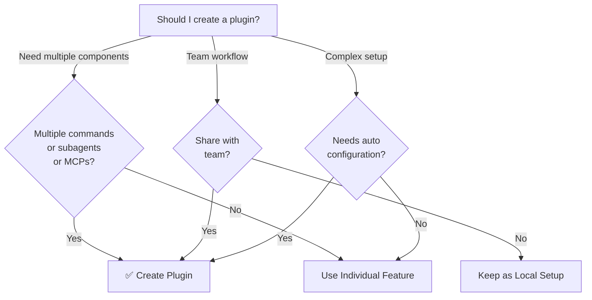

<!-- i18n-source: 07-plugins/README.md -->
<!-- i18n-source-sha: c5f1c75 -->
<!-- i18n-date: 2026-04-27 -->

<picture>
  <source media="(prefers-color-scheme: dark)" srcset="../resources/logos/claude-howto-logo-dark.svg">
  
</picture>

# Claude Code プラグイン

このフォルダには、複数の Claude Code 機能をひとつのインストール可能なパッケージにまとめた、完成度の高いプラグインの例が収録されている。

## 概要

Claude Code プラグインは、カスタマイズ（スラッシュコマンド、サブエージェント、MCP サーバー、フック）を束ねて 1 コマンドでインストールできるバンドル形式である。複数の機能をまとめて配布できる、最も上位の拡張機構と言える。

## プラグインのアーキテクチャ



## プラグインの読み込みプロセス



## プラグインの種類と配布

| 種別 | スコープ | 共有範囲 | 管理主体 | 例 |
|------|---------|---------|---------|----|
| Official | グローバル | 全ユーザー | Anthropic | PR Review、Security Guidance |
| Community | 公開 | 全ユーザー | コミュニティ | DevOps、Data Science |
| Organization | 社内 | チームメンバー | 企業 | 社内標準・ツール |
| Personal | 個人 | 単一ユーザー | 開発者 | 個別ワークフロー |

## プラグイン定義の構造

プラグインのマニフェストは `.claude-plugin/plugin.json` の JSON 形式で記述する：

```json
{
  "name": "my-first-plugin",
  "description": "A greeting plugin",
  "version": "1.0.0",
  "author": {
    "name": "Your Name"
  },
  "homepage": "https://example.com",
  "repository": "https://github.com/user/repo",
  "license": "MIT"
}
```

## プラグイン構造の例

```
my-plugin/
├── .claude-plugin/
│   └── plugin.json       # マニフェスト（name、description、version、author）
├── commands/             # Markdown 形式のスキル
│   ├── task-1.md
│   ├── task-2.md
│   └── workflows/
├── agents/               # カスタムエージェント定義
│   ├── specialist-1.md
│   ├── specialist-2.md
│   └── configs/
├── skills/               # SKILL.md ファイルを伴うエージェントスキル
│   ├── skill-1.md
│   └── skill-2.md
├── hooks/                # hooks.json のイベントハンドラ
│   └── hooks.json
├── .mcp.json             # MCP サーバーの設定
├── .lsp.json             # コードインテリジェンス用の LSP サーバー設定
├── bin/                  # プラグイン有効化中に Bash ツールの PATH に追加される実行ファイル
├── settings.json         # プラグイン有効化時に適用されるデフォルト設定（現状は `agent` キーのみサポート）
├── themes/               # 任意：Claude Code のカスタムテーマを同梱（v2.1.118 以降）
├── templates/
│   └── issue-template.md
├── scripts/
│   ├── helper-1.sh
│   └── helper-2.py
├── docs/
│   ├── README.md
│   └── USAGE.md
└── tests/
    └── plugin.test.js
```

### LSP サーバーの設定

プラグインはリアルタイムなコードインテリジェンス向けに Language Server Protocol（LSP）サポートを含められる。LSP サーバーは作業中の診断、コードナビゲーション、シンボル情報を提供する。

**設定の場所**：
- プラグインのルートディレクトリにある `.lsp.json`
- `plugin.json` 内のインライン `lsp` キー

#### フィールドリファレンス

| フィールド | 必須 | 説明 |
|----------|----|-----|
| `command` | はい | LSP サーバーのバイナリ（PATH 上にある必要あり） |
| `extensionToLanguage` | はい | ファイル拡張子を言語 ID にマップ |
| `args` | いいえ | サーバーへのコマンドライン引数 |
| `transport` | いいえ | 通信方式：`stdio`（デフォルト）または `socket` |
| `env` | いいえ | サーバープロセス用の環境変数 |
| `initializationOptions` | いいえ | LSP 初期化時に送るオプション |
| `settings` | いいえ | サーバーへ渡すワークスペース設定 |
| `workspaceFolder` | いいえ | ワークスペースフォルダのパスを上書き |
| `startupTimeout` | いいえ | サーバー起動を待つ最大時間（ミリ秒） |
| `shutdownTimeout` | いいえ | 正常終了を待つ最大時間（ミリ秒） |
| `restartOnCrash` | いいえ | クラッシュ時に自動再起動するか |
| `maxRestarts` | いいえ | 諦めるまでの再起動回数の上限 |

#### 設定例

**Go（gopls）**：

```json
{
  "go": {
    "command": "gopls",
    "args": ["serve"],
    "extensionToLanguage": {
      ".go": "go"
    }
  }
}
```

**Python（pyright）**：

```json
{
  "python": {
    "command": "pyright-langserver",
    "args": ["--stdio"],
    "extensionToLanguage": {
      ".py": "python",
      ".pyi": "python"
    }
  }
}
```

**TypeScript**：

```json
{
  "typescript": {
    "command": "typescript-language-server",
    "args": ["--stdio"],
    "extensionToLanguage": {
      ".ts": "typescript",
      ".tsx": "typescriptreact",
      ".js": "javascript",
      ".jsx": "javascriptreact"
    }
  }
}
```

#### 利用可能な LSP プラグイン

公式マーケットプレイスには事前設定された LSP プラグインが含まれる：

| プラグイン | 言語 | サーバーバイナリ | インストールコマンド |
|----------|------|---------------|-----------------|
| `pyright-lsp` | Python | `pyright-langserver` | `pip install pyright` |
| `typescript-lsp` | TypeScript / JavaScript | `typescript-language-server` | `npm install -g typescript-language-server typescript` |
| `rust-lsp` | Rust | `rust-analyzer` | `rustup component add rust-analyzer` でインストール |

#### LSP の機能

設定が完了すると、LSP サーバーは以下を提供する：

- **即時診断** — 編集直後にエラーや警告が表示される
- **コードナビゲーション** — 定義へジャンプ、参照や実装を検索
- **ホバー情報** — ホバー時に型シグネチャやドキュメントを表示
- **シンボル一覧** — 現在のファイルやワークスペースのシンボルを閲覧

## プラグインのオプション（v2.1.83 以降）

プラグインはマニフェストの `userConfig` を介してユーザーが設定可能なオプションを宣言できる。`sensitive: true` のフィールドは平文の設定ファイルではなくシステムキーチェーンに保存される：

```json
{
  "name": "my-plugin",
  "version": "1.0.0",
  "userConfig": {
    "apiKey": {
      "description": "API key for the service",
      "sensitive": true
    },
    "region": {
      "description": "Deployment region",
      "default": "us-east-1"
    }
  }
}
```

## 永続的なプラグインデータ（`${CLAUDE_PLUGIN_DATA}`）（v2.1.78 以降）

プラグインは `${CLAUDE_PLUGIN_DATA}` 環境変数経由で永続的な状態保存ディレクトリにアクセスできる。このディレクトリはプラグインごとに固有で、セッションをまたいで残るため、キャッシュ・データベース・その他の永続状態の保存先に適している：

```json
{
  "hooks": {
    "PostToolUse": [
      {
        "command": "node ${CLAUDE_PLUGIN_DATA}/track-usage.js"
      }
    ]
  }
}
```

このディレクトリはプラグインのインストール時に自動作成される。ここに保存したファイルはプラグインがアンインストールされるまで保持される。

### バックグラウンドモニター（v2.1.105）

プラグインは、セッション開始時やプラグインのスキル呼び出し時に自動起動するバックグラウンドモニターを登録できる。プラグインマニフェストにトップレベルの `monitors` キーを追加する：

```json
{
  "name": "my-plugin",
  "version": "1.0.0",
  "monitors": [
    {
      "command": "tail -f /var/log/app.log",
      "trigger": "session_start"
    }
  ]
}
```

`trigger` フィールドが受け付ける値：
- `"session_start"` — セッション開始時に自動でモニターを起動
- `"skill_invoke"` — プラグインのスキルが呼ばれたときにモニターを起動

モニターは内部的に Monitor ツールを利用しており、stdout の各行を Claude が反応できるイベントとしてストリーミングする。

## 設定によるインラインプラグイン（`source: 'settings'`）（v2.1.80 以降）

プラグインは、`source: 'settings'` フィールドを使って設定ファイル中にマーケットプレイスエントリとしてインラインで定義できる。これにより、別個のリポジトリやマーケットプレイスを用意せずにプラグイン定義を直接埋め込める：

```json
{
  "pluginMarketplaces": [
    {
      "name": "inline-tools",
      "source": "settings",
      "plugins": [
        {
          "name": "quick-lint",
          "source": "./local-plugins/quick-lint"
        }
      ]
    }
  ]
}
```

## プラグインの設定

プラグインはデフォルト設定を提供するために `settings.json` を同梱できる。現状サポートされるのは `agent` キーで、プラグインのメインスレッドエージェントを設定する：

```json
{
  "agent": "agents/specialist-1.md"
}
```

`settings.json` を含むプラグインをインストールすると、そのデフォルト値が適用される。ユーザーは自身のプロジェクト設定やユーザー設定で上書きできる。

## スタンドアロン vs プラグイン方式

| 方式 | コマンド名 | 設定 | 向いているケース |
|------|----------|----|-------------|
| **スタンドアロン** | `/hello` | CLAUDE.md で手動セットアップ | 個人用、プロジェクト固有 |
| **プラグイン** | `/plugin-name:hello` | plugin.json で自動化 | 共有・配布・チーム利用 |

個人で素早く使うワークフローには **スタンドアロンのスラッシュコマンド** を、複数機能をまとめてチームで共有したり配布したい場合は **プラグイン** を使う。

## 実用例

### 例 1：PR Review プラグイン

**ファイル：** `.claude-plugin/plugin.json`

```json
{
  "name": "pr-review",
  "version": "1.0.0",
  "description": "Complete PR review workflow with security, testing, and docs",
  "author": {
    "name": "Anthropic"
  },
  "repository": "https://github.com/your-org/pr-review",
  "license": "MIT"
}
```

**ファイル：** `commands/review-pr.md`

```markdown
---
name: Review PR
description: Start comprehensive PR review with security and testing checks
---

# PR Review

This command initiates a complete pull request review including:

1. Security analysis
2. Test coverage verification
3. Documentation updates
4. Code quality checks
5. Performance impact assessment
```

**ファイル：** `agents/security-reviewer.md`

```yaml
---
name: security-reviewer
description: Security-focused code review
tools: read, grep, diff
---

# Security Reviewer

Specializes in finding security vulnerabilities:
- Authentication/authorization issues
- Data exposure
- Injection attacks
- Secure configuration
```

**インストール：**

```bash
/plugin install pr-review

# Result:
# ✅ 3 slash commands installed
# ✅ 3 subagents configured
# ✅ 2 MCP servers connected
# ✅ 4 hooks registered
# ✅ Ready to use!
```

### 例 2：DevOps プラグイン

**構成要素：**

```
devops-automation/
├── commands/
│   ├── deploy.md
│   ├── rollback.md
│   ├── status.md
│   └── incident.md
├── agents/
│   ├── deployment-specialist.md
│   ├── incident-commander.md
│   └── alert-analyzer.md
├── mcp/
│   ├── github-config.json
│   ├── kubernetes-config.json
│   └── prometheus-config.json
├── hooks/
│   ├── pre-deploy.js
│   ├── post-deploy.js
│   └── on-error.js
└── scripts/
    ├── deploy.sh
    ├── rollback.sh
    └── health-check.sh
```

### 例 3：Documentation プラグイン

**同梱コンポーネント：**

```
documentation/
├── commands/
│   ├── generate-api-docs.md
│   ├── generate-readme.md
│   ├── sync-docs.md
│   └── validate-docs.md
├── agents/
│   ├── api-documenter.md
│   ├── code-commentator.md
│   └── example-generator.md
├── mcp/
│   ├── github-docs-config.json
│   └── slack-announce-config.json
└── templates/
    ├── api-endpoint.md
    ├── function-docs.md
    └── adr-template.md
```

## プラグインマーケットプレイス

Anthropic が運営する公式プラグインディレクトリは `anthropics/claude-plugins-official` である。エンタープライズ管理者は社内配布用にプライベートのプラグインマーケットプレイスを作ることもできる。



### マーケットプレイスの設定

エンタープライズや上級ユーザーは、設定を通じてマーケットプレイスの挙動を制御できる：

| 設定 | 説明 |
|-----|-----|
| `extraKnownMarketplaces` | デフォルト以外のマーケットプレイスソースを追加 |
| `strictKnownMarketplaces` | ユーザーが追加できるマーケットプレイスを制限（管理者専用） |
| `blockedMarketplaces` | 管理者が管理するマーケットプレイスのブロックリスト（v2.1.119 以降は `hostPattern` / `pathPattern` の正規表現フィールドをサポート） |
| `deniedPlugins` | 管理者が管理する、特定のプラグインをインストールさせないブロックリスト |

> **適用範囲**（v2.1.117 以降）：`blockedMarketplaces` と `strictKnownMarketplaces` は最初の追加時だけでなく、インストール・更新・リフレッシュ・自動更新といったあらゆるプラグインのライフサイクルイベントで適用される。`strictKnownMarketplaces` は管理者専用。

`blockedMarketplaces` でホスト / パス正規表現を使う例（v2.1.119）：

```json
{
  "blockedMarketplaces": [
    {
      "hostPattern": "^evil\\.example\\.com$",
      "pathPattern": "^/marketplaces/.*"
    }
  ]
}
```

### マーケットプレイスの追加機能

- **デフォルトの git タイムアウト**：大規模なプラグインリポジトリ向けに 30 秒から 120 秒へ拡大
- **カスタム npm レジストリ**：依存関係解決にカスタム npm レジストリ URL を指定可能
- **バージョンピン留め**：再現可能な環境のためにプラグインを特定バージョンに固定

### マーケットプレイス定義のスキーマ

プラグインマーケットプレイスは `.claude-plugin/marketplace.json` で定義する：

```json
{
  "name": "my-team-plugins",
  "owner": "my-org",
  "plugins": [
    {
      "name": "code-standards",
      "source": "./plugins/code-standards",
      "description": "Enforce team coding standards",
      "version": "1.2.0",
      "author": "platform-team"
    },
    {
      "name": "deploy-helper",
      "source": {
        "source": "github",
        "repo": "my-org/deploy-helper",
        "ref": "v2.0.0"
      },
      "description": "Deployment automation workflows"
    }
  ]
}
```

| フィールド | 必須 | 説明 |
|----------|----|-----|
| `name` | はい | kebab-case のマーケットプレイス名 |
| `owner` | はい | マーケットプレイスを保守する組織またはユーザー |
| `plugins` | はい | プラグインエントリの配列 |
| `plugins[].name` | はい | プラグイン名（kebab-case） |
| `plugins[].source` | はい | プラグインソース（パス文字列または source オブジェクト） |
| `plugins[].description` | いいえ | プラグインの簡単な説明 |
| `plugins[].version` | いいえ | セマンティックバージョン文字列 |
| `plugins[].author` | いいえ | プラグイン作者名 |

### プラグインソースの種類

プラグインは複数のソースから取得できる：

| ソース | 構文 | 例 |
|-------|----|----|
| **相対パス** | パス文字列 | `"./plugins/my-plugin"` |
| **GitHub** | `{ "source": "github", "repo": "owner/repo" }` | `{ "source": "github", "repo": "acme/lint-plugin", "ref": "v1.0" }` |
| **Git URL** | `{ "source": "url", "url": "..." }` | `{ "source": "url", "url": "https://git.internal/plugin.git" }` |
| **Git サブディレクトリ** | `{ "source": "git-subdir", "url": "...", "path": "..." }` | `{ "source": "git-subdir", "url": "https://github.com/org/monorepo.git", "path": "packages/plugin" }` |
| **npm** | `{ "source": "npm", "package": "..." }` | `{ "source": "npm", "package": "@acme/claude-plugin", "version": "^2.0" }` |
| **pip** | `{ "source": "pip", "package": "..." }` | `{ "source": "pip", "package": "claude-data-plugin", "version": ">=1.0" }` |

GitHub および git ソースは、バージョンピン留め用に任意の `ref`（ブランチ / タグ）と `sha`（コミットハッシュ）フィールドをサポートする。

### 配布方法

**GitHub（推奨）**：
```bash
# Users add your marketplace
/plugin marketplace add owner/repo-name
```

**その他の git サービス**（完全な URL が必要）：
```bash
/plugin marketplace add https://gitlab.com/org/marketplace-repo.git
```

**プライベートリポジトリ**：git の credential helper や環境変数のトークン経由でサポートされる。ユーザーは対象リポジトリへの読み取り権限を持っている必要がある。

**公式マーケットプレイスへの提出**：[claude.ai/settings/plugins/submit](https://claude.ai/settings/plugins/submit) または [platform.claude.com/plugins/submit](https://platform.claude.com/plugins/submit) から、Anthropic がキュレートする公式マーケットプレイスにプラグインを提出して広く配布できる。

### マーケットプレイスの管理

```bash
# Marketplace CLI commands
claude plugin marketplace add <source>       # Add marketplace (GitHub, URL, local)
claude plugin marketplace update [name]      # Refresh catalog index
claude plugin marketplace remove <name>      # Remove marketplace
claude plugin marketplace list               # List configured marketplaces
```

> **重要**：`marketplace update` はプラグインカタログ（インストール可能な一覧）を更新するだけで、インストール済みプラグインは更新しない。インストール済みプラグインを更新するには `plugin update <name>` を使う。

### Strict モード

マーケットプレイス定義とローカルの `plugin.json` の関係を制御する：

| 設定 | 動作 |
|-----|-----|
| `strict: true`（デフォルト） | ローカルの `plugin.json` が正で、マーケットプレイスのエントリは補足扱い |
| `strict: false` | マーケットプレイスのエントリがプラグイン定義の全てとなる |

`strictKnownMarketplaces` による **組織の制限**：

| 値 | 効果 |
|----|----|
| 未設定 | 制限なし — ユーザーは任意のマーケットプレイスを追加可能 |
| 空配列 `[]` | ロックダウン — マーケットプレイスを追加不可 |
| パターン配列 | 許可リスト — 一致するマーケットプレイスのみ追加可能 |

```json
{
  "strictKnownMarketplaces": [
    "my-org/*",
    "github.com/trusted-vendor/*"
  ]
}
```

> **警告**：`strictKnownMarketplaces` を使った strict モードでは、ユーザーは許可リストにあるマーケットプレイスからしかプラグインをインストールできない。プラグイン配布を制御したいエンタープライズ環境で有用。

## プラグインのインストールとライフサイクル



## プラグインの機能比較

| 機能 | スラッシュコマンド | スキル | サブエージェント | プラグイン |
|------|--------------|------|-------------|---------|
| **インストール** | 手動コピー | 手動コピー | 手動設定 | 1 コマンド |
| **セットアップ時間** | 5 分 | 10 分 | 15 分 | 2 分 |
| **バンドル** | 単一ファイル | 単一ファイル | 単一ファイル | 複数 |
| **バージョン管理** | 手動 | 手動 | 手動 | 自動 |
| **チーム共有** | ファイルコピー | ファイルコピー | ファイルコピー | インストール ID |
| **更新** | 手動 | 手動 | 手動 | 自動取得 |
| **依存関係** | なし | なし | なし | 含めることが可能 |
| **マーケットプレイス** | なし | なし | なし | あり |
| **配布** | リポジトリ | リポジトリ | リポジトリ | マーケットプレイス |

## プラグイン CLI コマンド

すべてのプラグイン操作は CLI コマンドとして利用できる：

```bash
claude plugin install <name>@<marketplace>   # Install from a marketplace
claude plugin uninstall <name>               # Remove a plugin
claude plugin update <name>                  # Update installed plugin to latest version
claude plugin list                           # List installed plugins
claude plugin enable <name>                  # Enable a disabled plugin
claude plugin disable <name>                 # Disable a plugin
claude plugin validate                       # Validate plugin structure
claude plugin tag <version>                  # Create a release git tag with version validation (v2.1.118+)
```

例：`claude plugin tag v0.3.0` はバージョン形式を検証し、対応する git タグを作成する。配布用にプラグインをリリースする際の推奨手順である。

## インストール方法

### マーケットプレイスから
```bash
/plugin install plugin-name
# or from CLI:
claude plugin install plugin-name@marketplace-name
```

### 有効化 / 無効化（スコープは自動検出）
```bash
/plugin enable plugin-name
/plugin disable plugin-name
```

### ローカルプラグイン（開発用）
```bash
# CLI flag for local testing (repeatable for multiple plugins)
claude --plugin-dir ./path/to/plugin
claude --plugin-dir ./plugin-a --plugin-dir ./plugin-b
```

### Git リポジトリから
```bash
/plugin install github:username/repo
```

## 自動更新

Claude Code は起動時にマーケットプレイスとそこにインストール済みのプラグインを自動更新できる。

| マーケットプレイス種別 | 自動更新のデフォルト | 切り替え方法 |
|----------------|---------------|----------|
| Official（`claude-plugins-official`） | ✅ 有効 | `/plugin` → Marketplaces → 選択 |
| サードパーティ / ローカル | ❌ 無効 | 同じ UI パス |

自動更新が走ると、Claude Code は次の処理を行う：
1. マーケットプレイスのカタログを更新
2. インストール済みプラグインを最新バージョンへ更新
3. `/reload-plugins` を促す通知を表示

### 環境変数

| 変数 | 効果 |
|-----|----|
| `DISABLE_AUTOUPDATER=1` | すべての自動更新（Claude Code + プラグイン）を無効化 |
| `DISABLE_AUTOUPDATER=1` + `FORCE_AUTOUPDATE_PLUGINS=1` | プラグインの自動更新は維持し、Claude Code 自体の更新を無効化 |

```bash
# Disable all auto-updates
export DISABLE_AUTOUPDATER=1

# Keep plugin auto-updates only
export DISABLE_AUTOUPDATER=1
export FORCE_AUTOUPDATE_PLUGINS=1
```

## プラグインを作るべきとき



### プラグインのユースケース

| ユースケース | 推奨 | 理由 |
|----------|----|----|
| **チームのオンボーディング** | ✅ プラグインを使う | 即時セットアップで設定がすべて整う |
| **フレームワークのセットアップ** | ✅ プラグインを使う | フレームワーク固有のコマンドをまとめられる |
| **エンタープライズ標準** | ✅ プラグインを使う | 一元配布とバージョン管理 |
| **小さなタスクの自動化** | ❌ コマンドを使う | プラグインは過剰 |
| **単一ドメインの専門知識** | ❌ スキルを使う | プラグインは重すぎる、スキルで十分 |
| **特殊な解析** | ❌ サブエージェントを使う | 手動作成またはスキルで対応 |
| **ライブデータへのアクセス** | ❌ MCP を使う | 単独で使い、バンドルしない |

## プラグインのテスト

公開前に、`--plugin-dir` CLI フラグ（複数指定可能）を使ってプラグインをローカルでテストする：

```bash
claude --plugin-dir ./my-plugin
claude --plugin-dir ./my-plugin --plugin-dir ./another-plugin
```

これによりプラグインを読み込んだ状態で Claude Code が起動し、次を確認できる：
- すべてのスラッシュコマンドが利用可能であること
- サブエージェントとエージェントが正しく機能すること
- MCP サーバーが正常に接続されること
- フックが実行されること
- LSP サーバーの設定
- 設定エラーがないこと

## ホットリロード

プラグインは開発中のホットリロードをサポートする。プラグインのファイルを修正すると Claude Code が変更を自動検出する。次のコマンドでも強制的にリロードできる：

```bash
/reload-plugins
```

これにより、セッションを再起動せずに、すべてのプラグインのマニフェスト・コマンド・エージェント・スキル・フック・MCP / LSP 設定が再読み込みされる。

## プラグイン向けの管理対象設定

管理者は管理対象設定を使って組織全体のプラグイン挙動を制御できる：

| 設定 | 説明 |
|-----|-----|
| `enabledPlugins` | デフォルトで有効化するプラグインの許可リスト |
| `deniedPlugins` | インストールを禁止するプラグインのブロックリスト |
| `extraKnownMarketplaces` | デフォルト以外のマーケットプレイスソースを追加 |
| `strictKnownMarketplaces` | ユーザーが追加できるマーケットプレイスを制限（管理者専用、v2.1.117 以降はあらゆるプラグインのライフサイクルイベントで適用） |
| `blockedMarketplaces` | マーケットプレイスのブロックリスト（v2.1.117 以降はあらゆるライフサイクルイベントで適用、v2.1.119 以降は `hostPattern` / `pathPattern` の正規表現フィールドをサポート） |
| `allowedChannelPlugins` | リリースチャネルごとに許可するプラグインを制御 |

これらの設定は管理対象設定ファイルで組織レベルに適用でき、ユーザーレベルの設定より優先される。

## プラグインのセキュリティ

プラグインのサブエージェントは制限付きサンドボックスで動作する。プラグインのサブエージェント定義では以下のフロントマターキーは **使用不可** である：

- `hooks` — サブエージェントはイベントハンドラを登録できない
- `mcpServers` — サブエージェントは MCP サーバーを設定できない
- `permissionMode` — サブエージェントは権限モデルを上書きできない

これにより、プラグインが宣言したスコープを超えて権限昇格したりホスト環境を変更したりできないようにしている。

## プラグインの公開

**公開手順：**

1. すべてのコンポーネントを含むプラグイン構造を作成
2. `.claude-plugin/plugin.json` マニフェストを記述
3. ドキュメント用の `README.md` を作成
4. `claude --plugin-dir ./my-plugin` でローカルテスト
5. `claude plugin tag v0.3.0`（v2.1.118 以降）でリリースタグを作成 — バージョン文字列を検証し、対応する git タグを作成
6. プラグインマーケットプレイスへ提出
7. レビューと承認を受ける
8. マーケットプレイスで公開
9. ユーザーが 1 コマンドでインストール可能になる

**提出例：**

```markdown
# PR Review Plugin

## Description
Complete PR review workflow with security, testing, and documentation checks.

## What's Included
- 3 slash commands for different review types
- 3 specialized subagents
- GitHub and CodeQL MCP integration
- Automated security scanning hooks

## Installation
```bash
/plugin install pr-review
```

## Features
✅ Security analysis
✅ Test coverage checking
✅ Documentation verification
✅ Code quality assessment
✅ Performance impact analysis

## Usage
```bash
/review-pr
/check-security
/check-tests
```

## Requirements
- Claude Code 1.0+
- GitHub access
- CodeQL (optional)
```

## プラグイン vs 手動設定

**手動セットアップ（2 時間以上）：**
- スラッシュコマンドを 1 つずつインストール
- サブエージェントを個別に作成
- MCP を別々に設定
- フックを手動で設定
- すべてをドキュメント化
- チームに共有（正しく設定してくれることを祈る）

**プラグインを使う場合（2 分）：**
```bash
/plugin install pr-review
# ✅ Everything installed and configured
# ✅ Ready to use immediately
# ✅ Team can reproduce exact setup
```

## ベストプラクティス

### Do（推奨）✅
- 明快で説明的なプラグイン名を使う
- 包括的な README を含める
- セマンティックバージョニングで適切にバージョン管理する
- すべてのコンポーネントを通しでテストする
- 必要要件を明確にドキュメント化する
- 使用例を提供する
- エラーハンドリングを含める
- 検索性を高めるタグを付ける
- 後方互換性を維持する
- プラグインを焦点を絞った一貫性ある内容に保つ
- 包括的なテストを含める
- すべての依存関係をドキュメント化する

### Don't（避ける）❌
- 関連のない機能を混ぜない
- 認証情報をハードコードしない
- テストを省略しない
- ドキュメントを忘れない
- 重複したプラグインを作らない
- バージョン管理を軽視しない
- コンポーネント間の依存を複雑にしすぎない
- エラーを優雅に処理することを忘れない

## インストール手順

### マーケットプレイスからインストール

1. **利用可能なプラグインを閲覧：**
   ```bash
   /plugin list
   ```

2. **プラグインの詳細を表示：**
   ```bash
   /plugin info plugin-name
   ```

3. **プラグインをインストール：**
   ```bash
   /plugin install plugin-name
   ```

### ローカルパスからインストール

```bash
/plugin install ./path/to/plugin-directory
```

### GitHub からインストール

```bash
/plugin install github:username/repo
```

### インストール済みプラグインの一覧

```bash
/plugin list --installed
```

### プラグインの更新

```bash
/plugin update plugin-name
```

### プラグインの無効化 / 有効化

```bash
# Temporarily disable
/plugin disable plugin-name

# Re-enable
/plugin enable plugin-name
```

### プラグインのアンインストール

```bash
/plugin uninstall plugin-name
```

## 関連概念

以下の Claude Code 機能はプラグインと組み合わせて動作する：

- **[スラッシュコマンド](../01-slash-commands/)** — プラグインに含まれる個々のコマンド
- **[メモリ](../02-memory/)** — プラグイン用の永続コンテキスト
- **[スキル](../03-skills/)** — プラグインに包めるドメイン専門知識
- **[サブエージェント](../04-subagents/)** — プラグインのコンポーネントとして含まれる専門エージェント
- **[MCP サーバー](../05-mcp/)** — プラグインに同梱される Model Context Protocol 連携
- **[フック](../06-hooks/)** — プラグインのワークフローを起動するイベントハンドラ

## 完全なワークフロー例

### PR Review プラグインの全ワークフロー

```
1. User: /review-pr

2. Plugin executes:
   ├── pre-review.js hook validates git repo
   ├── GitHub MCP fetches PR data
   ├── security-reviewer subagent analyzes security
   ├── test-checker subagent verifies coverage
   └── performance-analyzer subagent checks performance

3. Results synthesized and presented:
   ✅ Security: No critical issues
   ⚠️  Testing: Coverage 65% (recommend 80%+)
   ✅ Performance: No significant impact
   📝 12 recommendations provided
```

## トラブルシューティング

### プラグインがインストールできない
- Claude Code のバージョン互換性を確認：`/version`
- JSON バリデーターで `plugin.json` の構文を検証
- インターネット接続を確認（リモートプラグインの場合）
- 権限を確認：`ls -la plugin/`

### コンポーネントが読み込まれない
- `plugin.json` のパスが実際のディレクトリ構造と一致するか確認
- ファイル権限を確認：`chmod +x scripts/`
- コンポーネントファイルの構文を確認
- ログを確認：`/plugin debug plugin-name`

### MCP 接続が失敗する
- 環境変数が正しく設定されているか確認
- MCP サーバーのインストール状況と健全性を確認
- `/mcp test` で MCP 接続を単独で確認
- `mcp/` ディレクトリ内の MCP 設定を確認

### インストール後にコマンドが利用できない
- プラグインが正しくインストールされているか確認：`/plugin list --installed`
- プラグインが有効か確認：`/plugin status plugin-name`
- Claude Code を再起動：`exit` して再度開く
- 既存のコマンドと名前が衝突していないか確認

### フック実行の問題
- フックファイルの権限が正しいか確認
- フックの構文とイベント名を確認
- フックのログでエラー詳細を確認
- 可能ならフックを手動でテスト

## 追加リソース

- [公式プラグインドキュメント](https://code.claude.com/docs/en/plugins)
- [プラグインを探す](https://code.claude.com/docs/en/discover-plugins)
- [プラグインマーケットプレイス](https://code.claude.com/docs/en/plugin-marketplaces)
- [プラグインリファレンス](https://code.claude.com/docs/en/plugins-reference)
- [MCP サーバーリファレンス](https://modelcontextprotocol.io/)
- [サブエージェント設定ガイド](../04-subagents/README.md)
- [フックシステムリファレンス](../06-hooks/README.md)

---

**最終更新**: 2026 年 4 月 24 日
**Claude Code バージョン**: 2.1.119
**出典**:
- https://code.claude.com/docs/en/plugins
- https://code.claude.com/docs/en/plugin-marketplaces
- https://github.com/anthropics/claude-code/releases/tag/v2.1.117
- https://github.com/anthropics/claude-code/releases/tag/v2.1.118
- https://github.com/anthropics/claude-code/releases/tag/v2.1.119
**対応モデル**: Claude Sonnet 4.6、Claude Opus 4.7、Claude Haiku 4.5
