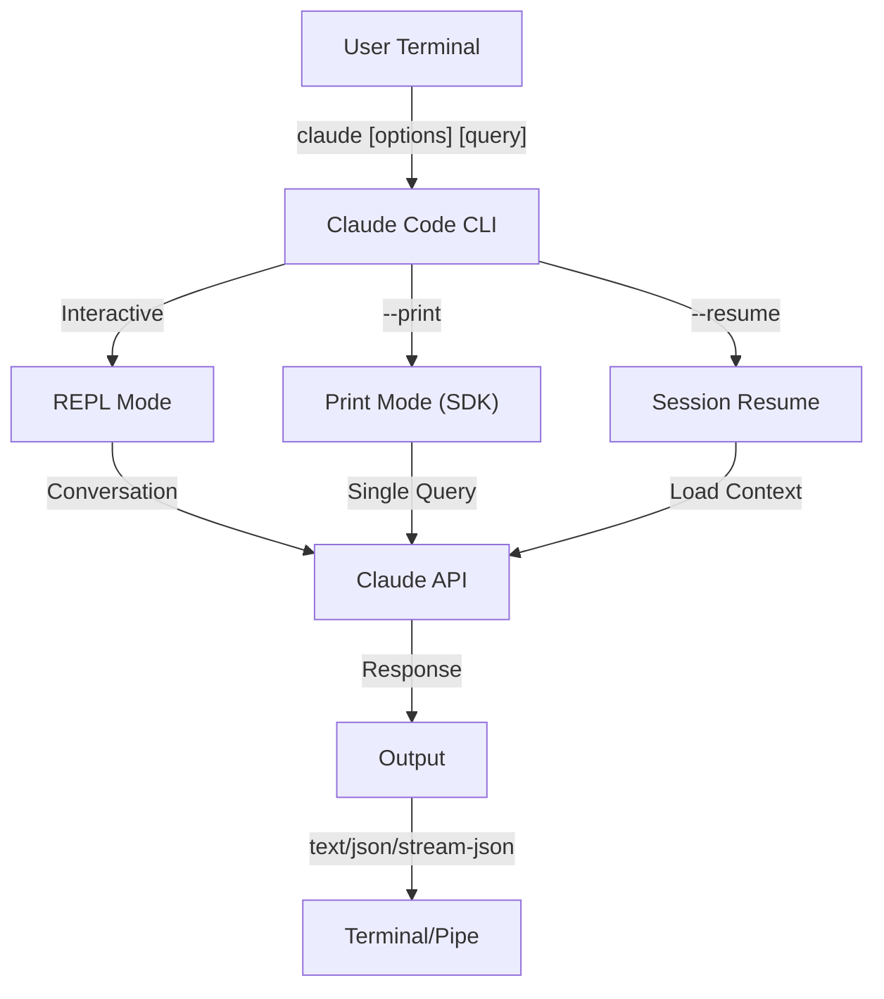
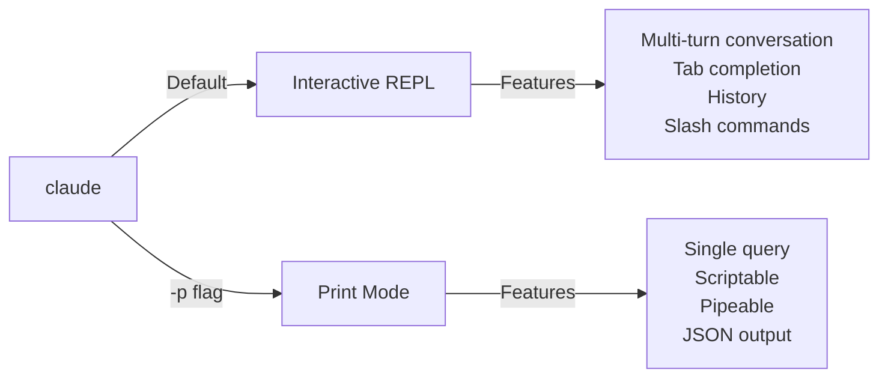

<!-- i18n-source: 10-cli/README.md -->
<!-- i18n-source-sha: e43872e -->
<!-- i18n-date: 2026-04-27 -->

<picture>
  <source media="(prefers-color-scheme: dark)" srcset="../../resources/logos/claude-howto-logo-dark.svg">
  
</picture>

# CLI リファレンス

## 概観

Claude Code CLI（Command Line Interface）は Claude Code を操作する主要な手段である。クエリの実行、セッション管理、モデル設定、開発ワークフローへの組み込みを行う強力なオプション群を備えている。

## アーキテクチャ



## ランタイムとパッケージング

**v2.1.113** 以降、Claude Code CLI は npm のオプション依存を介して **プラットフォーム別のネイティブバイナリ**（macOS、Linux、Windows）を起動する。バイナリはインストール時に OS とアーキテクチャに合わせて選択される — 旧来のバンドル JavaScript ランタイムは macOS / Linux ではもはやデフォルトではない。

**ユーザー側のインストール手順は変わらない**: `npm install -g @anthropic-ai/claude-code` がそのまま動作し、引き続き推奨経路である。裏側で npm がプラットフォームに合った正しいネイティブバイナリを取得する。

**ダウンロードホスト**（v2.1.116+）: ネイティブバイナリ成果物は `https://downloads.claude.ai/claude-code-releases` から配信される。

> **企業ネットワーク／プロキシ環境**: ネットワークが明示的な許可リストを必要とする場合、プロキシのエグレスルールに `downloads.claude.ai`（および `https://downloads.claude.ai/claude-code-releases`）を追加すること。以前 `storage.googleapis.com` または npm レジストリのみを許可していた環境は更新が必要で、未対応のままだと `claude update` や初回インストールが失敗する。

旧来の JavaScript バンドルは Windows 用および固定利用の環境向けに引き続き提供される。これらのインストールでは Glob と Grep が引き続きファーストクラスツールとして同梱される（[ツール](#ツールと権限の管理) 節の Glob/Grep 注記を参照）。

## CLI コマンド

| コマンド | 説明 | 例 |
|---------|------|-----|
| `claude` | 対話型 REPL を起動 | `claude` |
| `claude "query"` | 初期プロンプト付きで REPL を起動 | `claude "explain this project"` |
| `claude -p "query"` | プリントモード - クエリ実行後に終了 | `claude -p "explain this function"` |
| `cat file \| claude -p "query"` | パイプ入力を処理 | `cat logs.txt \| claude -p "explain"` |
| `claude -c` | 直近の会話を継続 | `claude -c` |
| `claude -c -p "query"` | プリントモードで継続 | `claude -c -p "check for type errors"` |
| `claude -r "<session>" "query"` | ID または名前でセッション再開 | `claude -r "auth-refactor" "finish this PR"` |
| `claude update` | 最新版に更新 | `claude update` |
| `/doctor`（スラッシュコマンド） | インストール、設定、プラグインの健全性を診断する。v2.1.116 以降は **Claude が応答中でも開ける** ようになり、ステータスアイコンをインライン表示し、`f` キーで検出された問題を自動修正する | REPL 内で `/doctor` を実行 |
| `claude mcp` | MCP サーバーを設定 | [MCP のドキュメント](../05-mcp/) を参照 |
| `claude mcp serve` | Claude Code を MCP サーバーとして起動 | `claude mcp serve` |
| `claude agents` | 設定済みのサブエージェントを一覧表示 | `claude agents` |
| `claude auto-mode defaults` | 自動モードのデフォルトルールを JSON で出力 | `claude auto-mode defaults` |
| `claude remote-control` | リモートコントロールサーバーを起動 | `claude remote-control` |
| `claude plugin` | プラグインを管理（インストール・有効化・無効化） | `claude plugin install my-plugin` |
| `claude plugin tag <version>` | バージョン検証付きでプラグインのリリース git タグを作成（v2.1.118+） | `claude plugin tag v0.3.0` |
| `claude install [version]` | 指定したネイティブバイナリのバージョンをインストール。`stable`、`latest`、明示的なバージョン文字列を受け付ける | `claude install 2.1.119` |
| `claude auth login` | ログイン（`--email`、`--sso` をサポート） | `claude auth login --email user@example.com` |
| `claude auth logout` | 現在のアカウントからログアウト | `claude auth logout` |
| `claude auth status` | 認証状態を確認（ログイン中なら exit 0、未ログインなら 1） | `claude auth status` |

## 主要フラグ

| フラグ | 説明 | 例 |
|------|------|-----|
| `-p, --print` | 対話モードを使わず応答を出力 | `claude -p "query"` |
| `-c, --continue` | 直近の会話を読み込む | `claude --continue` |
| `-r, --resume` | ID または名前で特定セッションを再開 | `claude --resume auth-refactor` |
| `-v, --version` | バージョン番号を出力 | `claude -v` |
| `-w, --worktree` | 隔離された git ワークツリーで起動 | `claude -w` |
| `-n, --name` | セッションの表示名 | `claude -n "auth-refactor"` |
| `--from-pr <url-or-number>` | プル／マージリクエストに紐づくセッションを再開する。v2.1.119 以降は GitHub（クラウド + Enterprise）、GitLab MR、Bitbucket PR の URL を受け付ける（以前は GitHub.com のみ） | `claude --from-pr 42` または `claude --from-pr https://gitlab.example.com/org/repo/-/merge_requests/17` |
| `--remote "task"` | claude.ai 上に web セッションを作成 | `claude --remote "implement API"` |
| `--remote-control, --rc` | リモートコントロール付きの対話セッション | `claude --rc` |
| `--teleport` | web セッションをローカルで再開 | `claude --teleport` |
| `--teammate-mode` | エージェントチームの表示モード | `claude --teammate-mode tmux` |
| `--bare` | 最小モード（フック、スキル、プラグイン、MCP、自動メモリ、CLAUDE.md をスキップ） | `claude --bare` |
| `--enable-auto-mode` | 自動権限モードを解禁（Opus 4.7 の Max 加入者には不要） | `claude --enable-auto-mode` |
| `--channels` | MCP チャンネルプラグインを購読 | `claude --channels discord,telegram` |
| `--chrome` / `--no-chrome` | Chrome ブラウザ統合を有効化／無効化 | `claude --chrome` |
| `--effort` | 思考労力レベルを設定 | `claude --effort high` |
| `--init` / `--init-only` | 初期化フックを実行 | `claude --init` |
| `--maintenance` | メンテナンスフックを実行して終了 | `claude --maintenance` |
| `--disable-slash-commands` | すべてのスキルとスラッシュコマンドを無効化 | `claude --disable-slash-commands` |
| `--no-session-persistence` | セッション保存を無効化（プリントモード） | `claude -p --no-session-persistence "query"` |
| `--exclude-dynamic-system-prompt-sections` | プロンプトキャッシュヒット率向上のため、システムプロンプトから動的セクションを除外 | `claude -p --exclude-dynamic-system-prompt-sections "query"` |

### 対話モードとプリントモード



**対話モード**（デフォルト）:
```bash
# 対話セッションを開始
claude

# 初期プロンプト付きで開始
claude "explain the authentication flow"
```

**プリントモード**（非対話）:
```bash
# 単一クエリ実行後に終了
claude -p "what does this function do?"

# ファイル内容を処理
cat error.log | claude -p "explain this error"

# 他のツールとチェーン
claude -p "list todos" | grep "URGENT"
```

## モデルと設定

| フラグ | 説明 | 例 |
|------|------|-----|
| `--model` | モデルを設定（sonnet、opus、haiku、または完全名） | `claude --model opus` |
| `--fallback-model` | 過負荷時の自動フォールバックモデル | `claude -p --fallback-model sonnet "query"` |
| `--agent` | セッションに使うエージェントを指定 | `claude --agent my-custom-agent` |
| `--agents` | JSON でカスタムサブエージェントを定義 | [Agents の設定](#agents-の設定) を参照 |
| `--effort` | 労力レベルを設定（low、medium、high、xhigh、max） | `claude --effort xhigh` |

### モデル選択の例

```bash
# 複雑なタスクには Opus 4.7
claude --model opus "design a caching strategy"

# 速いタスクには Haiku 4.5
claude --model haiku -p "format this JSON"

# モデル名のフルネーム指定
claude --model claude-sonnet-4-6-20250929 "review this code"

# 信頼性のためフォールバック付き
claude -p --model opus --fallback-model sonnet "analyze architecture"

# opusplan（Opus が計画、Sonnet が実装）
claude --model opusplan "design and implement the caching layer"
```

## システムプロンプトのカスタマイズ

| フラグ | 説明 | 例 |
|------|------|-----|
| `--system-prompt` | デフォルトプロンプト全体を置き換える | `claude --system-prompt "You are a Python expert"` |
| `--system-prompt-file` | ファイルからプロンプトを読み込む（プリントモード） | `claude -p --system-prompt-file ./prompt.txt "query"` |
| `--append-system-prompt` | デフォルトプロンプトに追記 | `claude --append-system-prompt "Always use TypeScript"` |

### システムプロンプトの例

```bash
# 完全カスタムなペルソナ
claude --system-prompt "You are a senior security engineer. Focus on vulnerabilities."

# 特定の指示を追加
claude --append-system-prompt "Always include unit tests with code examples"

# 複雑なプロンプトをファイルから読み込み
claude -p --system-prompt-file ./prompts/code-reviewer.txt "review main.py"
```

### システムプロンプトフラグの比較

| フラグ | 挙動 | 対話 | プリント |
|------|-----|------|---------|
| `--system-prompt` | デフォルトのシステムプロンプト全体を置き換える | ✅ | ✅ |
| `--system-prompt-file` | ファイルのプロンプトに置き換える | ❌ | ✅ |
| `--append-system-prompt` | デフォルトに追記する | ✅ | ✅ |

**`--system-prompt-file` はプリントモードでのみ使用する。対話モードでは `--system-prompt` または `--append-system-prompt` を使うこと。**

## ツールと権限の管理

| フラグ | 説明 | 例 |
|------|------|-----|
| `--tools` | 利用可能な組み込みツールを制限 | `claude -p --tools "Bash,Edit,Read" "query"` |
| `--allowedTools` | 確認なしで実行できるツール | `"Bash(git log:*)" "Read"` |
| `--disallowedTools` | コンテキストから除外するツール | `"Bash(rm:*)" "Edit"` |
| `--dangerously-skip-permissions` | 全ての権限プロンプトをスキップ | `claude --dangerously-skip-permissions` |
| `--permission-mode` | 指定した権限モードで開始 | `claude --permission-mode auto` |
| `--permission-prompt-tool` | 権限処理用の MCP ツール | `claude -p --permission-prompt-tool mcp_auth "query"` |
| `--enable-auto-mode` | 自動権限モードを解禁 | `claude --enable-auto-mode` |

> **Glob / Grep 注記（v2.1.113+）**: ネイティブな macOS／Linux ビルドでは、`Glob` と `Grep` は独立したファーストクラスツールではなく、Bash ツール経由で呼び出される組み込みの `bfs` および `ugrep` バイナリとして提供される。Windows 版および npm バンドル（JS）版では引き続きスタンドアロンツールとして公開される。サブエージェントの `allowedTools` ／ `disallowedTools` リストでは、バックエンド側の置換は透過的なため、どのプラットフォームでも設定では引き続き `Glob` ／ `Grep` を参照すればよい。

> **PowerShell の自動承認（v2.1.119）**: PowerShell ツールのコマンドは、Bash コマンドとまったく同じ方式で権限モードによる自動承認が可能になった。`Bash(...)` ルールで使うのと同じマッチャ構文で PowerShell の権限を絞り込める — 例: `PowerShell(Get-ChildItem:*)`。

### 権限の例

```bash
# コードレビュー用の読み取り専用モード
claude --permission-mode plan "review this codebase"

# 安全なツールのみに制限
claude --tools "Read,Grep,Glob" -p "find all TODO comments"

# 特定の git コマンドを確認なしで許可
claude --allowedTools "Bash(git status:*)" "Bash(git log:*)"

# 危険な操作をブロック
claude --disallowedTools "Bash(rm -rf:*)" "Bash(git push --force:*)"
```

## 出力とフォーマット

| フラグ | 説明 | オプション | 例 |
|------|------|-----------|-----|
| `--output-format` | 出力フォーマット指定（プリントモード） | `text`、`json`、`stream-json` | `claude -p --output-format json "query"` |
| `--input-format` | 入力フォーマット指定（プリントモード） | `text`、`stream-json` | `claude -p --input-format stream-json` |
| `--verbose` | 詳細ログを有効化 | | `claude --verbose` |
| `--include-partial-messages` | ストリーミングイベントを含める | `stream-json` が必要 | `claude -p --output-format stream-json --include-partial-messages "query"` |
| `--json-schema` | スキーマに沿って検証された JSON を取得 | | `claude -p --json-schema '{"type":"object"}' "query"` |
| `--max-budget-usd` | プリントモードでの最大支出額 | | `claude -p --max-budget-usd 5.00 "query"` |

### 出力フォーマットの例

```bash
# プレーンテキスト（デフォルト）
claude -p "explain this code"

# プログラムから扱うための JSON
claude -p --output-format json "list all functions in main.py"

# リアルタイム処理向けのストリーミング JSON
claude -p --output-format stream-json "generate a long report"

# スキーマ検証付きの構造化出力
claude -p --json-schema '{"type":"object","properties":{"bugs":{"type":"array"}}}' \
  "find bugs in this code and return as JSON"
```

## ワークスペースとディレクトリ

| フラグ | 説明 | 例 |
|------|------|-----|
| `--add-dir` | 追加の作業ディレクトリを指定 | `claude --add-dir ../apps ../lib` |
| `--setting-sources` | カンマ区切りの設定ソース | `claude --setting-sources user,project` |

> **`/config` の永続化（v2.1.119）**: `/config` コマンドで対話的に行った変更は `~/.claude/settings.json` に書き込まれ、通常の優先順位チェーン（project → local → policy → user）に組み込まれるようになった。v2.1.119 以前は一部の `/config` 変更がセッション限定だった。完全な優先順位については [メモリと設定](../02-memory/README.md) を参照。
| `--settings` | ファイルまたは JSON から設定を読み込む | `claude --settings ./settings.json` |
| `--plugin-dir` | ディレクトリからプラグインを読み込む（複数指定可） | `claude --plugin-dir ./my-plugin` |

### 複数ディレクトリの例

```bash
# 複数のプロジェクトディレクトリを横断作業
claude --add-dir ../frontend ../backend ../shared "find all API endpoints"

# カスタム設定の読み込み
claude --settings '{"model":"opus","verbose":true}' "complex task"
```

## MCP の設定

| フラグ | 説明 | 例 |
|------|------|-----|
| `--mcp-config` | JSON から MCP サーバーを読み込む | `claude --mcp-config ./mcp.json` |
| `--strict-mcp-config` | 指定した MCP 設定のみを使う | `claude --strict-mcp-config --mcp-config ./mcp.json` |
| `--channels` | MCP チャンネルプラグインを購読 | `claude --channels discord,telegram` |

### MCP の例

```bash
# GitHub MCP サーバーの読み込み
claude --mcp-config ./github-mcp.json "list open PRs"

# 厳密モード - 指定したサーバーのみ
claude --strict-mcp-config --mcp-config ./production-mcp.json "deploy to staging"
```

## セッション管理

| フラグ | 説明 | 例 |
|------|------|-----|
| `--session-id` | 特定セッション ID（UUID）を使用 | `claude --session-id "550e8400-..."` |
| `--fork-session` | 再開時に新しいセッションを作成 | `claude --resume abc123 --fork-session` |

### セッションの例

```bash
# 直前の会話を継続
claude -c

# 名前付きセッションを再開
claude -r "feature-auth" "continue implementing login"

# 試行錯誤のためセッションをフォーク
claude --resume feature-auth --fork-session "try alternative approach"

# 特定のセッション ID を使用
claude --session-id "550e8400-e29b-41d4-a716-446655440000" "continue"
```

### セッションのフォーク

既存セッションから分岐したブランチを作成し試行錯誤する：

```bash
# 別アプローチを試すためにセッションをフォーク
claude --resume abc123 --fork-session "try alternative implementation"

# カスタムメッセージ付きでフォーク
claude -r "feature-auth" --fork-session "test with different architecture"
```

**ユースケース:**
- 元のセッションを失わずに別実装を試す
- 並行して複数のアプローチを試行錯誤する
- 成功した作業からバリエーションのブランチを作る
- メインセッションに影響を与えずに破壊的な変更を試す

元のセッションは変更されず、フォークは新しい独立セッションになる。

## 高度な機能

| フラグ | 説明 | 例 |
|------|------|-----|
| `--chrome` | Chrome ブラウザ統合を有効化 | `claude --chrome` |
| `--no-chrome` | Chrome ブラウザ統合を無効化 | `claude --no-chrome` |
| `--ide` | 利用可能なら IDE と自動接続 | `claude --ide` |
| `--max-turns` | エージェントターンを制限（非対話） | `claude -p --max-turns 3 "query"` |
| `--debug` | フィルタ付きデバッグモードを有効化 | `claude --debug "api,mcp"` |
| `--enable-lsp-logging` | 詳細な LSP ログを有効化 | `claude --enable-lsp-logging` |
| `--betas` | API リクエストのベータヘッダ | `claude --betas interleaved-thinking` |
| `--plugin-dir` | ディレクトリからプラグインを読み込む（複数指定可） | `claude --plugin-dir ./my-plugin` |
| `--enable-auto-mode` | 自動権限モードを解禁 | `claude --enable-auto-mode` |
| `--effort` | 思考労力レベルを設定 | `claude --effort high` |
| `--bare` | 最小モード（フック、スキル、プラグイン、MCP、自動メモリ、CLAUDE.md をスキップ） | `claude --bare` |
| `--channels` | MCP チャンネルプラグインを購読 | `claude --channels discord` |
| `--tmux` | ワークツリー用に tmux セッションを作成 | `claude --tmux` |
| `--fork-session` | 再開時に新しいセッション ID を作成 | `claude --resume abc --fork-session` |
| `--max-budget-usd` | 最大支出額（プリントモード） | `claude -p --max-budget-usd 5.00 "query"` |
| `--json-schema` | 検証付き JSON 出力 | `claude -p --json-schema '{"type":"object"}' "q"` |

### プラットフォームとテーマの注記（v2.1.112）

- **Windows 版の PowerShell ツール**: Windows 向けに専用の PowerShell ツールがロールアウトされ、環境変数で制御できる。
- **「Auto（ターミナルに合わせる）」テーマ**: 新しい "Auto (match terminal)" テーマで Claude Code のライト／ダーク表示をターミナルと同期できる。
- **静かな権限プロンプト**: 読み取り専用の `Bash` 呼び出しと `Glob` パターンは権限プロンプトを発生させなくなった。

### 高度な例

```bash
# 自律アクション数を制限
claude -p --max-turns 5 "refactor this module"

# API 呼び出しをデバッグ
claude --debug "api" "test query"

# IDE 統合を有効化
claude --ide "help me with this file"
```

## Agents の設定

`--agents` フラグはセッションに対するカスタムサブエージェントを定義する JSON オブジェクトを受け取る。

### Agents の JSON フォーマット

```json
{
  "agent-name": {
    "description": "Required: when to invoke this agent",
    "prompt": "Required: system prompt for the agent",
    "tools": ["Optional", "array", "of", "tools"],
    "model": "optional: sonnet|opus|haiku"
  }
}
```

**必須フィールド:**
- `description` - エージェントを使う場面の自然言語による説明
- `prompt` - エージェントの役割と挙動を定義するシステムプロンプト

**任意フィールド:**
- `tools` - 利用可能なツールの配列（省略時は全ツールを継承）
  - 形式: `["Read", "Grep", "Glob", "Bash"]`
- `model` - 使用するモデル: `sonnet`、`opus`、`haiku`

### 完全な Agents の例

```json
{
  "code-reviewer": {
    "description": "Expert code reviewer. Use proactively after code changes.",
    "prompt": "You are a senior code reviewer. Focus on code quality, security, and best practices.",
    "tools": ["Read", "Grep", "Glob", "Bash"],
    "model": "sonnet"
  },
  "debugger": {
    "description": "Debugging specialist for errors and test failures.",
    "prompt": "You are an expert debugger. Analyze errors, identify root causes, and provide fixes.",
    "tools": ["Read", "Edit", "Bash", "Grep"],
    "model": "opus"
  },
  "documenter": {
    "description": "Documentation specialist for generating guides.",
    "prompt": "You are a technical writer. Create clear, comprehensive documentation.",
    "tools": ["Read", "Write"],
    "model": "haiku"
  }
}
```

### Agents コマンドの例

```bash
# カスタムエージェントをインラインで定義
claude --agents '{
  "security-auditor": {
    "description": "Security specialist for vulnerability analysis",
    "prompt": "You are a security expert. Find vulnerabilities and suggest fixes.",
    "tools": ["Read", "Grep", "Glob"],
    "model": "opus"
  }
}' "audit this codebase for security issues"

# ファイルからエージェントを読み込み
claude --agents "$(cat ~/.claude/agents.json)" "review the auth module"

# 他のフラグと組み合わせ
claude -p --agents "$(cat agents.json)" --model sonnet "analyze performance"
```

### エージェントの優先順位

複数のエージェント定義が存在する場合、以下の優先順位で読み込まれる：
1. **CLI 定義**（`--agents` フラグ） - セッション固有
2. **プロジェクトレベル**（`.claude/agents/`） - 現在のプロジェクト
3. **ユーザーレベル**（`~/.claude/agents/`） - 全プロジェクト

CLI 定義のエージェントは、当該セッションにおいてプロジェクトおよびユーザーのエージェントを上書きする。プロジェクトレベルのエージェントは、名前が衝突した場合にユーザーレベルのエージェントを上書きする。プラグインレベルのエージェントを含む完全な優先順位表は [Lesson 04 — サブエージェント](../04-subagents/README.md#file-locations) を参照。

---

## 価値の高いユースケース

### 1. CI/CD への組み込み

Claude Code を CI/CD パイプラインに組み込み、コードレビュー、テスト、ドキュメント生成を自動化する。

**GitHub Actions の例:**

```yaml
name: AI Code Review

on: [pull_request]

jobs:
  review:
    runs-on: ubuntu-latest
    steps:
      - uses: actions/checkout@v4

      - name: Install Claude Code
        run: npm install -g @anthropic-ai/claude-code

      - name: Run Code Review
        env:
          ANTHROPIC_API_KEY: ${{ secrets.ANTHROPIC_API_KEY }}
        run: |
          claude -p --output-format json \
            --max-turns 1 \
            "Review the changes in this PR for:
            - Security vulnerabilities
            - Performance issues
            - Code quality
            Output as JSON with 'issues' array" > review.json

      - name: Post Review Comment
        uses: actions/github-script@v7
        with:
          script: |
            const fs = require('fs');
            const review = JSON.parse(fs.readFileSync('review.json', 'utf8'));
            // Process and post review comments
```

**Jenkins パイプライン:**

```groovy
pipeline {
    agent any
    stages {
        stage('AI Review') {
            steps {
                sh '''
                    claude -p --output-format json \
                      --max-turns 3 \
                      "Analyze test coverage and suggest missing tests" \
                      > coverage-analysis.json
                '''
            }
        }
    }
}
```

### 2. スクリプトのパイプ処理

ファイル、ログ、データを Claude に流し込んで分析する。

**ログ解析:**

```bash
# エラーログの分析
tail -1000 /var/log/app/error.log | claude -p "summarize these errors and suggest fixes"

# アクセスログ内のパターン抽出
cat access.log | claude -p "identify suspicious access patterns"

# git 履歴の要約
git log --oneline -50 | claude -p "summarize recent development activity"
```

**コード処理:**

```bash
# 特定ファイルのレビュー
cat src/auth.ts | claude -p "review this authentication code for security issues"

# ドキュメントの生成
cat src/api/*.ts | claude -p "generate API documentation in markdown"

# TODO の抽出と優先順位付け
grep -r "TODO" src/ | claude -p "prioritize these TODOs by importance"
```

### 3. マルチセッションのワークフロー

複数の会話スレッドで複雑なプロジェクトを管理する。

```bash
# フィーチャーブランチ用セッションを開始
claude -r "feature-auth" "let's implement user authentication"

# 後で同じセッションを継続
claude -r "feature-auth" "add password reset functionality"

# 別アプローチを試すためフォーク
claude --resume feature-auth --fork-session "try OAuth instead"

# 別の機能のセッションへ切り替え
claude -r "feature-payments" "continue with Stripe integration"
```

### 4. カスタムエージェントの設定

チームのワークフロー向けに専門エージェントを定義する。

```bash
# エージェント設定をファイルに保存
cat > ~/.claude/agents.json << 'EOF'
{
  "reviewer": {
    "description": "Code reviewer for PR reviews",
    "prompt": "Review code for quality, security, and maintainability.",
    "model": "opus"
  },
  "documenter": {
    "description": "Documentation specialist",
    "prompt": "Generate clear, comprehensive documentation.",
    "model": "sonnet"
  },
  "refactorer": {
    "description": "Code refactoring expert",
    "prompt": "Suggest and implement clean code refactoring.",
    "tools": ["Read", "Edit", "Glob"]
  }
}
EOF

# セッションでエージェントを使用
claude --agents "$(cat ~/.claude/agents.json)" "review the auth module"
```

### 5. バッチ処理

一貫した設定で複数クエリを処理する。

```bash
# 複数ファイルの処理
for file in src/*.ts; do
  echo "Processing $file..."
  claude -p --model haiku "summarize this file: $(cat $file)" >> summaries.md
done

# バッチコードレビュー
find src -name "*.py" -exec sh -c '
  echo "## $1" >> review.md
  cat "$1" | claude -p "brief code review" >> review.md
' _ {} \;

# 全モジュールのテスト生成
for module in $(ls src/modules/); do
  claude -p "generate unit tests for src/modules/$module" > "tests/$module.test.ts"
done
```

### 6. セキュリティを意識した開発

権限制御で安全に運用する。

```bash
# 読み取り専用のセキュリティ監査
claude --permission-mode plan \
  --tools "Read,Grep,Glob" \
  "audit this codebase for security vulnerabilities"

# 危険なコマンドをブロック
claude --disallowedTools "Bash(rm:*)" "Bash(curl:*)" "Bash(wget:*)" \
  "help me clean up this project"

# 制限付き自動化
claude -p --max-turns 2 \
  --allowedTools "Read" "Glob" \
  "find all hardcoded credentials"
```

### 7. JSON API としての利用

`jq` のパースと組み合わせて、Claude をプログラム可能な API として活用する。

```bash
# 構造化された分析を取得
claude -p --output-format json \
  --json-schema '{"type":"object","properties":{"functions":{"type":"array"},"complexity":{"type":"string"}}}' \
  "analyze main.py and return function list with complexity rating"

# jq で処理に組み込む
claude -p --output-format json "list all API endpoints" | jq '.endpoints[]'

# スクリプト内で利用
RESULT=$(claude -p --output-format json "is this code secure? answer with {secure: boolean, issues: []}" < code.py)
if echo "$RESULT" | jq -e '.secure == false' > /dev/null; then
  echo "Security issues found!"
  echo "$RESULT" | jq '.issues[]'
fi
```

### jq でのパース例

`jq` で Claude の JSON 出力をパース・処理する：

```bash
# 特定フィールドの抽出
claude -p --output-format json "analyze this code" | jq '.result'

# 配列要素のフィルタ
claude -p --output-format json "list issues" | jq -r '.issues[] | select(.severity=="high")'

# 複数フィールドの抽出
claude -p --output-format json "describe the project" | jq -r '.{name, version, description}'

# CSV への変換
claude -p --output-format json "list functions" | jq -r '.functions[] | [.name, .lineCount] | @csv'

# 条件付き処理
claude -p --output-format json "check security" | jq 'if .vulnerabilities | length > 0 then "UNSAFE" else "SAFE" end'

# ネストされた値の取得
claude -p --output-format json "analyze performance" | jq '.metrics.cpu.usage'

# 配列全体の処理
claude -p --output-format json "find todos" | jq '.todos | length'

# 出力の変換
claude -p --output-format json "list improvements" | jq 'map({title: .title, priority: .priority})'
```

---

## モデル

Claude Code は能力の異なる複数のモデルをサポートする：

| モデル | ID | コンテキストウィンドウ | 備考 |
|-------|-----|----------------------|------|
| Opus 4.7 | `claude-opus-4-7` | 1M トークン（1M コンテキスト対応は v2.1.117 で実装） | 最も能力が高く、適応的な労力レベルを備える。Claude Code では Opus 4.7 ローンチ（2026-04-16）以降 `xhigh` がデフォルトの労力レベル |
| Sonnet 4.6 | `claude-sonnet-4-6` | 1M トークン | 速度と能力のバランスが良い。Pro／Max 加入者のデフォルト労力は v2.1.117 で `medium` から `high` に引き上げられた |
| Haiku 4.5 | `claude-haiku-4-5` | 1M トークン | 最速で、軽いタスクに最適 |

### モデルの選択

```bash
# 短縮名で指定
claude --model opus "complex architectural review"
claude --model sonnet "implement this feature"
claude --model haiku -p "format this JSON"

# opusplan エイリアス（Opus が計画、Sonnet が実装）
claude --model opusplan "design and implement the API"

# セッション中にファストモードを切り替え
/fast
```

### 労力レベル（Opus 4.7）

Opus 4.7 は適応的推論をサポートし、軽い順から `low`（○）、`medium`（◐）、`high`（●）、`xhigh`（Claude Code では Opus 4.7 ローンチ以降のデフォルト、2026-04-16）、`max`（Opus 4.7 のみ）の労力レベルを持つ。Opus 4.6 ／ Sonnet 4.6 では、Pro／Max 加入者のデフォルト労力が v2.1.117 で `medium` から `high` に引き上げられた。

```bash
# CLI フラグで労力レベルを設定
claude --effort xhigh "complex review"

# スラッシュコマンドで労力レベルを設定
/effort xhigh

# 環境変数で労力レベルを設定
export CLAUDE_CODE_EFFORT_LEVEL=xhigh   # low, medium, high, xhigh (default on Opus 4.7), or max (Opus 4.7 only)
```

プロンプト内のキーワード「ultrathink」は深い推論を有効化する。`max` の労力レベルは Opus 4.7 専用である。

---

## 主要な環境変数

| 変数 | 説明 |
|------|------|
| `ANTHROPIC_API_KEY` | 認証用の API キー |
| `ANTHROPIC_MODEL` | デフォルトモデルを上書き |
| `ANTHROPIC_CUSTOM_MODEL_OPTION` | API 用のカスタムモデルオプション |
| `ANTHROPIC_DEFAULT_OPUS_MODEL` | デフォルトの Opus モデル ID を上書き |
| `ANTHROPIC_DEFAULT_SONNET_MODEL` | デフォルトの Sonnet モデル ID を上書き |
| `ANTHROPIC_DEFAULT_HAIKU_MODEL` | デフォルトの Haiku モデル ID を上書き |
| `MAX_THINKING_TOKENS` | 拡張思考のトークン予算を設定 |
| `CLAUDE_CODE_EFFORT_LEVEL` | 労力レベルを設定（`low`／`medium`／`high`／`xhigh`／`max`） — `xhigh` は Opus 4.7 のデフォルト、`max` は Opus 4.7 のみ |
| `CLAUDE_CODE_SIMPLE` | 最小モード（`--bare` フラグで設定される） |
| `CLAUDE_CODE_DISABLE_AUTO_MEMORY` | CLAUDE.md の自動更新を無効化 |
| `CLAUDE_CODE_DISABLE_BACKGROUND_TASKS` | バックグラウンドタスク実行を無効化 |
| `CLAUDE_CODE_DISABLE_CRON` | スケジュール／cron タスクを無効化 |
| `CLAUDE_CODE_DISABLE_GIT_INSTRUCTIONS` | git 関連の指示を無効化 |
| `CLAUDE_CODE_DISABLE_TERMINAL_TITLE` | ターミナルタイトル更新を無効化 |
| `CLAUDE_CODE_DISABLE_1M_CONTEXT` | 1M トークンコンテキストウィンドウを無効化 |
| `CLAUDE_CODE_DISABLE_NONSTREAMING_FALLBACK` | 非ストリーミングフォールバックを無効化 |
| `CLAUDE_CODE_ENABLE_TASKS` | タスクリスト機能を有効化 |
| `CLAUDE_CODE_TASK_LIST_ID` | セッション間で共有する名前付きタスクディレクトリ |
| `CLAUDE_CODE_ENABLE_PROMPT_SUGGESTION` | プロンプトサジェストを切り替え（`true`／`false`） |
| `CLAUDE_CODE_EXPERIMENTAL_AGENT_TEAMS` | 実験的なエージェントチームを有効化 |
| `CLAUDE_CODE_NEW_INIT` | 新しい初期化フローを使用 |
| `CLAUDE_CODE_SUBAGENT_MODEL` | サブエージェント実行用モデル |
| `CLAUDE_CODE_PLUGIN_SEED_DIR` | プラグインシードファイル用ディレクトリ |
| `CLAUDE_CODE_SUBPROCESS_ENV_SCRUB` | サブプロセスから取り除く環境変数 |
| `CLAUDE_AUTOCOMPACT_PCT_OVERRIDE` | 自動コンパクションのパーセンテージを上書き |
| `CLAUDE_STREAM_IDLE_TIMEOUT_MS` | ストリームのアイドルタイムアウト（ミリ秒） |
| `SLASH_COMMAND_TOOL_CHAR_BUDGET` | スラッシュコマンドツールの文字数予算 |
| `ENABLE_TOOL_SEARCH` | ツール検索機能を有効化 |
| `MAX_MCP_OUTPUT_TOKENS` | MCP ツール出力の最大トークン数 |
| `CLAUDE_CODE_PERFORCE_MODE` | `1` を設定すると Perforce モードを有効化 — ファイルをデフォルトで読み取り専用として扱う（Perforce/P4 バージョン管理ワークフロー向け）（v2.1.98 追加） |
| `DISABLE_UPDATES` | 手動の `claude update` を含むすべての更新経路をブロックする。バックグラウンドの自動更新のみブロックする `DISABLE_AUTOUPDATER` より厳密（v2.1.118+） |
| `CLAUDE_CODE_HIDE_CWD` | `1` に設定すると、起動時ロゴでカレント作業ディレクトリを隠す（プライバシー／画面共有用途）（v2.1.119+） |
| `CLAUDE_CODE_FORK_SUBAGENT` | `1` を設定すると外部ビルド（Bedrock、Vertex、Foundry）でフォーク済みサブエージェントを有効化。Anthropic API ではフォーク済みサブエージェントが GA のため効果なし（v2.1.117+） |
| `OTEL_LOG_TOOL_DETAILS` | `1` を設定すると OpenTelemetry イベント中のカスタムおよび MCP コマンド名のリダクションを解除する（v2.1.117+）。デフォルトはリダクション有効。 |

> **Vertex AI 上の `ENABLE_TOOL_SEARCH`（v2.1.119+）**: ツール検索は **Google Cloud Vertex AI 上のデプロイではデフォルト無効** である。Vertex 上でツール検索機能を使いたい場合は `export ENABLE_TOOL_SEARCH=true` で明示的にオプトインする必要がある。Anthropic API 直結ではデフォルト有効のままである。

---

## クイックリファレンス

### 最もよく使うコマンド

```bash
# 対話セッション
claude

# サッと質問
claude -p "how do I..."

# 会話を継続
claude -c

# ファイルを処理
cat file.py | claude -p "review this"

# スクリプト用の JSON 出力
claude -p --output-format json "query"
```

### フラグの組み合わせ

| ユースケース | コマンド |
|-------------|----------|
| 簡易コードレビュー | `cat file \| claude -p "review"` |
| 構造化出力 | `claude -p --output-format json "query"` |
| 安全な探索 | `claude --permission-mode plan` |
| 安全装置付き自律実行 | `claude --enable-auto-mode --permission-mode auto` |
| CI/CD 連携 | `claude -p --max-turns 3 --output-format json` |
| 作業の再開 | `claude -r "session-name"` |
| カスタムモデル | `claude --model opus "complex task"` |
| 最小モード | `claude --bare "quick query"` |
| 予算上限付き実行 | `claude -p --max-budget-usd 2.00 "analyze code"` |

---

## トラブルシューティング

### コマンドが見つからない

**問題:** `claude: command not found`

**対処法:**
- Claude Code をインストール: `npm install -g @anthropic-ai/claude-code`
- PATH に npm のグローバル bin ディレクトリが含まれていることを確認
- フルパスで実行を試す: `npx claude`

### API キーの問題

**問題:** 認証に失敗する

**対処法:**
- API キーを設定: `export ANTHROPIC_API_KEY=your-key`
- キーが有効でクレジットが十分か確認
- 要求モデルに対するキー権限を確認

### セッションが見つからない

**問題:** セッションを再開できない

**対処法:**
- 利用可能なセッションを一覧表示し、正しい名前／ID を確認
- セッションは一定期間使用しないと失効する場合がある
- `-c` で直近のセッションを継続する

### 出力フォーマットの問題

**問題:** JSON 出力が壊れている

**対処法:**
- `--json-schema` で構造を強制する
- プロンプト内に明示的な JSON 指示を含める
- プロンプトで JSON を要求するだけでなく `--output-format json` を使用する

### 権限拒否

**問題:** ツール実行がブロックされる

**対処法:**
- `--permission-mode` 設定を確認
- `--allowedTools` と `--disallowedTools` フラグを見直す
- 自動化用途では（注意のうえ）`--dangerously-skip-permissions` を使用

---

## 追加リソース

- **[公式 CLI リファレンス](https://code.claude.com/docs/en/cli-reference)** - 完全なコマンドリファレンス
- **[ヘッドレスモードのドキュメント](https://code.claude.com/docs/en/headless)** - 自動実行
- **[スラッシュコマンド](../01-slash-commands/)** - Claude 内のカスタムショートカット
- **[メモリガイド](../02-memory/)** - CLAUDE.md による永続コンテキスト
- **[MCP プロトコル](../05-mcp/)** - 外部ツール連携
- **[高度な機能](../09-advanced-features/)** - プランニングモード、拡張思考
- **[サブエージェントガイド](../04-subagents/)** - 委譲によるタスク実行

---

*[Claude How To](../) ガイドシリーズの一部*

---

**最終更新**: 2026 年 4 月 24 日
**Claude Code バージョン**: 2.1.119
**出典**:
- https://code.claude.com/docs/en/cli-reference
- https://code.claude.com/docs/en/settings
- https://code.claude.com/docs/en/changelog
- https://www.anthropic.com/news/claude-opus-4-7
- https://github.com/anthropics/claude-code/releases/tag/v2.1.113
- https://github.com/anthropics/claude-code/releases/tag/v2.1.116
- https://github.com/anthropics/claude-code/releases/tag/v2.1.117
- https://github.com/anthropics/claude-code/releases/tag/v2.1.118
- https://github.com/anthropics/claude-code/releases/tag/v2.1.119
**対応モデル**: Claude Sonnet 4.6、Claude Opus 4.7、Claude Haiku 4.5
