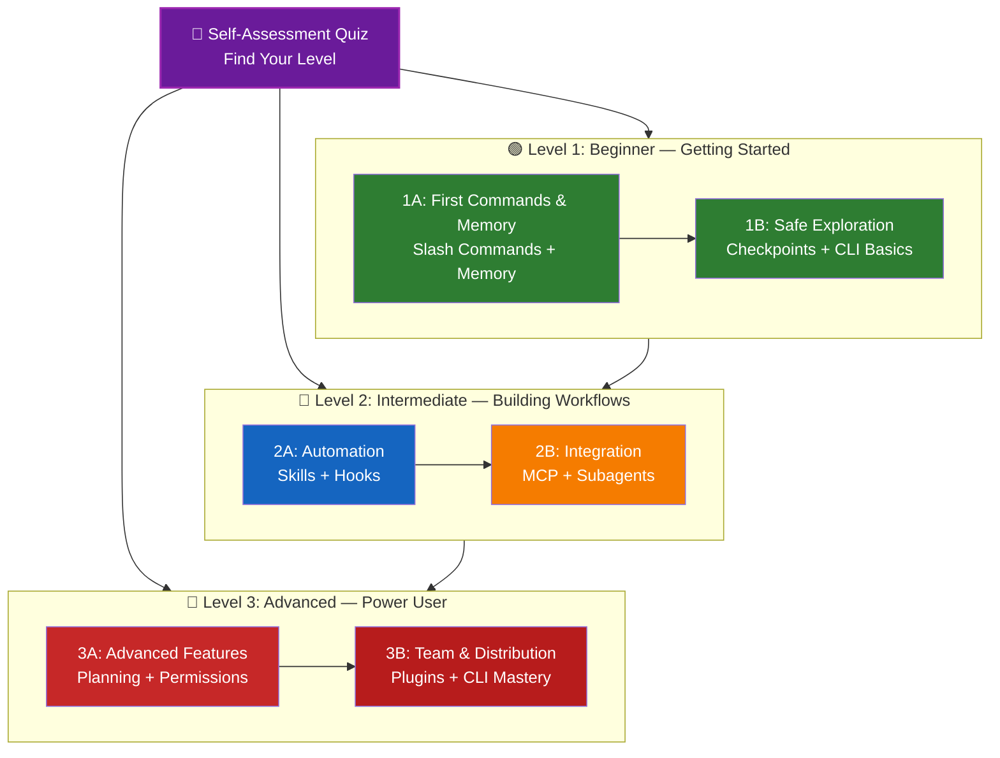

<!-- i18n-source: LEARNING-ROADMAP.md -->
<!-- i18n-source-sha: d17d515 -->
<!-- i18n-date: 2026-04-27 -->

<picture>
  <source media="(prefers-color-scheme: dark)" srcset="../resources/logos/claude-howto-logo-dark.svg">
  
</picture>

# 📚 Claude Code 学習ロードマップ

**Claude Code に初めて触れる？** 本ガイドは自分のペースで Claude Code の機能を習得する助けになる。完全な初心者でも経験豊富な開発者でも、まず以下の自己評価クイズで自分に合うパスを見つけてほしい。

---

## 🧭 自分のレベルを見つける

全員が同じ地点から始めるわけではない。手早い自己評価で適切な入口を見つける。

**正直に答えてほしい：**

- [ ] Claude Code を起動して対話できる（`claude`）
- [ ] CLAUDE.md ファイルを作成または編集したことがある
- [ ] 組み込みのスラッシュコマンドを 3 個以上使ったことがある（例：/help、/compact、/model）
- [ ] カスタムスラッシュコマンドまたはスキル（SKILL.md）を作成したことがある
- [ ] MCP サーバを設定したことがある（例：GitHub、データベース）
- [ ] `~/.claude/settings.json` でフックを設定したことがある
- [ ] カスタムサブエージェントを作成または使用したことがある（`.claude/agents/`）
- [ ] スクリプトや CI/CD で印字モード（`claude -p`）を使ったことがある

**あなたのレベル：**

| チェック数 | レベル | 開始地点 | 完了までの時間 |
|--------|-------|----------|------------------|
| 0〜2 | **レベル 1：初級** — はじめの一歩 | [マイルストーン 1A](#マイルストーン-1a最初のコマンドとメモリ) | 約 3 時間 |
| 3〜5 | **レベル 2：中級** — ワークフロー構築 | [マイルストーン 2A](#マイルストーン-2a自動化スキル--フック) | 約 5 時間 |
| 6〜8 | **レベル 3：上級** — パワーユーザーとチームリード | [マイルストーン 3A](#マイルストーン-3a高度な機能) | 約 5 時間 |

> **ヒント**：迷ったら 1 段階下から始めるのがよい。慣れた内容を素早く復習する方が、基礎を取りこぼすよりはるかに有益である。

> **インタラクティブ版**：Claude Code 内で `/self-assessment` を実行すると、10 機能領域すべての習熟度を測るガイド付きクイズが受けられ、個別の学習パスが生成される。

---

## 🎯 学習思想

本リポジトリのフォルダは、3 つの原則に基づいた **推奨学習順** で番号付けされている。

1. **依存関係** — 基礎的な概念を先に置く
2. **複雑度** — 簡単な機能を高度な機能の前に置く
3. **使用頻度** — 最頻出の機能を早い段階で教える

このアプローチによって、堅固な基礎を築きつつ、即座に生産性を得られる。

---

## 🗺️ あなたの学習パス



**カラー凡例：**
- 💜 紫：自己評価クイズ
- 🟢 緑：レベル 1 — 初級パス
- 🔵 青 / 🟡 黄：レベル 2 — 中級パス
- 🔴 赤：レベル 3 — 上級パス

---

## 📊 完全ロードマップ表

| ステップ | 機能 | 複雑度 | 時間 | レベル | 依存 | 学ぶ理由 | 主な利点 |
|------|---------|-----------|------|-------|--------------|----------------|--------------|
| **1** | [スラッシュコマンド](01-slash-commands/) | ⭐ 初級 | 30 分 | レベル 1 | なし | すぐ得られる生産性向上（組み込み 55 個 + バンドル 5 スキル） | 即時自動化、チーム標準化 |
| **2** | [メモリ](02-memory/) | ⭐⭐ 初級+ | 45 分 | レベル 1 | なし | 全機能の基礎 | 永続コンテキスト、設定保持 |
| **3** | [チェックポイント](08-checkpoints/) | ⭐⭐ 中級 | 45 分 | レベル 1 | セッション管理 | 安全な探索 | 実験、復旧 |
| **4** | [CLI 基礎](10-cli/) | ⭐⭐ 初級+ | 30 分 | レベル 1 | なし | コア CLI の使い方 | 対話モード・印字モード |
| **5** | [スキル](03-skills/) | ⭐⭐ 中級 | 1 時間 | レベル 2 | スラッシュコマンド | 自動的な専門性 | 再利用、一貫性 |
| **6** | [フック](06-hooks/) | ⭐⭐ 中級 | 1 時間 | レベル 2 | ツール、コマンド | ワークフロー自動化（28 イベント、5 種類） | 検証、品質ゲート |
| **7** | [MCP](05-mcp/) | ⭐⭐⭐ 中級+ | 1 時間 | レベル 2 | 設定 | ライブデータアクセス | リアルタイム連携、API |
| **8** | [サブエージェント](04-subagents/) | ⭐⭐⭐ 中級+ | 1.5 時間 | レベル 2 | メモリ、コマンド | 複雑タスクの処理（Bash 含む組み込み 6 個） | 委譲、専門性 |
| **9** | [高度な機能](09-advanced-features/) | ⭐⭐⭐⭐⭐ 上級 | 2〜3 時間 | レベル 3 | これまでの全機能 | パワーユーザー向けツール | プランニング、Auto Mode、チャンネル、音声入力、権限 |
| **10** | [プラグイン](07-plugins/) | ⭐⭐⭐⭐ 上級 | 2 時間 | レベル 3 | これまでの全機能 | 完全なソリューション | チームオンボーディング、配布 |
| **11** | [CLI マスタリー](10-cli/) | ⭐⭐⭐ 上級 | 1 時間 | レベル 3 | 推奨：これまでの全機能 | コマンドライン利用の習熟 | スクリプト、CI/CD、自動化 |

**学習総時間**：約 11〜13 時間（自分のレベルにジャンプすれば短縮可能）

---

## 🟢 レベル 1：初級 — はじめの一歩

**対象**：クイズで 0〜2 個チェックの利用者
**時間**：約 3 時間
**焦点**：即時の生産性、基礎の理解
**到達点**：日常利用に慣れたユーザー、レベル 2 への準備完了

### マイルストーン 1A：最初のコマンドとメモリ

**トピック**：スラッシュコマンド + メモリ
**時間**：1〜2 時間
**複雑度**：⭐ 初級
**目標**：カスタムコマンドと永続コンテキストによる即時の生産性向上

#### 達成事項
✅ 反復作業向けにカスタムスラッシュコマンドを作成
✅ チーム標準のためのプロジェクトメモリをセットアップ
✅ 個人の好みを設定
✅ Claude が自動的にコンテキストを読み込む仕組みを理解

#### ハンズオン演習

```bash
# 演習 1: 最初のスラッシュコマンドをインストール
mkdir -p .claude/commands
cp 01-slash-commands/optimize.md .claude/commands/

# 演習 2: プロジェクトメモリを作成
cp 02-memory/project-CLAUDE.md ./CLAUDE.md

# 演習 3: 試す
# Claude Code で次を入力: /optimize
```

#### 達成基準
- [ ] `/optimize` コマンドを正常に実行できる
- [ ] CLAUDE.md からプロジェクト規約を Claude が記憶している
- [ ] スラッシュコマンドとメモリの使い分けを理解している

#### 次のステップ
慣れたら以下を読む：
- [01-slash-commands/README.md](01-slash-commands/README.md)
- [02-memory/README.md](02-memory/README.md)

> **理解度チェック**：Claude Code 内で `/lesson-quiz slash-commands` または `/lesson-quiz memory` を実行して学習内容をテストする。

---

### マイルストーン 1B：安全な探索

**トピック**：チェックポイント + CLI 基礎
**時間**：1 時間
**複雑度**：⭐⭐ 初級+
**目標**：安全に実験する方法とコア CLI コマンドの使い方を学ぶ

#### 達成事項
✅ 安全な実験のためにチェックポイントを作成・復元
✅ 対話モードと印字モードの違いを理解
✅ 基本的な CLI フラグとオプションを使う
✅ パイプ経由でファイルを処理

#### ハンズオン演習

```bash
# 演習 1: チェックポイントワークフローを試す
# Claude Code で:
# 試験的な変更をいくつか加え、Esc+Esc を押すか /rewind を実行
# 実験前のチェックポイントを選択
# "Restore code and conversation" を選んで戻る

# 演習 2: 対話モード対印字モード
claude "explain this project"           # 対話モード
claude -p "explain this function"       # 印字モード (非対話)

# 演習 3: パイプでファイル内容を処理
cat error.log | claude -p "explain this error"
```

#### 達成基準
- [ ] チェックポイントを作成し、それに戻った
- [ ] 対話モードと印字モードの両方を使った
- [ ] ファイルをパイプで Claude に渡して解析した
- [ ] 安全な実験のためチェックポイントをいつ使うかを理解した

#### 次のステップ
- 読む：[08-checkpoints/README.md](08-checkpoints/README.md)
- 読む：[10-cli/README.md](10-cli/README.md)
- **レベル 2 へ進む準備完了！** [マイルストーン 2A](#マイルストーン-2a自動化スキル--フック) へ。

> **理解度チェック**：`/lesson-quiz checkpoints` または `/lesson-quiz cli` を実行してレベル 2 への準備が整っているか確認する。

---

## 🔵 レベル 2：中級 — ワークフロー構築

**対象**：クイズで 3〜5 個チェックの利用者
**時間**：約 5 時間
**焦点**：自動化、統合、タスク委譲
**到達点**：自動化ワークフロー、外部統合、レベル 3 への準備完了

### 前提条件チェック

レベル 2 を始める前に、以下のレベル 1 の概念に慣れていることを確認する：

- [ ] スラッシュコマンドを作成・利用できる（[01-slash-commands/](01-slash-commands/)）
- [ ] CLAUDE.md でプロジェクトメモリを設定済み（[02-memory/](02-memory/)）
- [ ] チェックポイントの作成と復元方法を知っている（[08-checkpoints/](08-checkpoints/)）
- [ ] コマンドラインから `claude` および `claude -p` を使える（[10-cli/](10-cli/)）

> **不足あり？** 続行前に上記のチュートリアルを復習する。

---

### マイルストーン 2A：自動化（スキル + フック）

**トピック**：スキル + フック
**時間**：2〜3 時間
**複雑度**：⭐⭐ 中級
**目標**：日常ワークフローと品質チェックの自動化

#### 達成事項
✅ YAML フロントマター（`effort` と `shell` フィールドを含む）で専門機能を自動起動
✅ 28 個のフックイベントにまたがるイベント駆動自動化を構築
✅ 5 種類のフック（command、http、mcp_tool、prompt、agent）を活用
✅ コード品質基準を強制
✅ ワークフロー向けカスタムフックを作成

#### ハンズオン演習

```bash
# 演習 1: スキルをインストール
cp -r 03-skills/code-review ~/.claude/skills/

# 演習 2: フックをセットアップ
mkdir -p ~/.claude/hooks
cp 06-hooks/pre-tool-check.sh ~/.claude/hooks/
chmod +x ~/.claude/hooks/pre-tool-check.sh

# 演習 3: 設定でフックを構成
# ~/.claude/settings.json に追加:
{
  "hooks": {
    "PreToolUse": [
      {
        "matcher": "Bash",
        "hooks": [
          {
            "type": "command",
            "command": "~/.claude/hooks/pre-tool-check.sh"
          }
        ]
      }
    ]
  }
}
```

#### 達成基準
- [ ] 関連場面で code review スキルが自動起動される
- [ ] PreToolUse フックがツール実行前に走る
- [ ] スキルの自動起動とフックのイベントトリガーの違いを理解している

#### 次のステップ
- 自分のカスタムスキルを作成
- ワークフロー向けに追加フックを設定
- 読む：[03-skills/README.md](03-skills/README.md)
- 読む：[06-hooks/README.md](06-hooks/README.md)

> **理解度チェック**：次に進む前に `/lesson-quiz skills` または `/lesson-quiz hooks` で知識を試す。

---

### マイルストーン 2B：統合（MCP + サブエージェント）

**トピック**：MCP + サブエージェント
**時間**：2〜3 時間
**複雑度**：⭐⭐⭐ 中級+
**目標**：外部サービスを統合し、複雑タスクを委譲する

#### 達成事項
✅ GitHub、データベースなどからライブデータにアクセス
✅ 専門 AI エージェントに作業を委譲
✅ MCP とサブエージェントの使い分けを理解
✅ 統合ワークフローを構築

#### ハンズオン演習

```bash
# 演習 1: GitHub MCP をセットアップ
export GITHUB_TOKEN="your_github_token"
claude mcp add github -- npx -y @modelcontextprotocol/server-github

# 演習 2: MCP 統合をテスト
# Claude Code で: /mcp__github__list_prs

# 演習 3: サブエージェントをインストール
mkdir -p .claude/agents
cp 04-subagents/*.md .claude/agents/
```

#### 統合演習
以下の完全ワークフローを試す：
1. MCP で GitHub PR を取得
2. Claude が code-reviewer サブエージェントにレビューを委譲
3. フックでテストを自動実行

#### 達成基準
- [ ] MCP 経由で GitHub データを正常に取得した
- [ ] Claude が複雑タスクをサブエージェントに委譲する
- [ ] MCP とサブエージェントの違いを理解している
- [ ] ワークフローで MCP + サブエージェント + フックを組み合わせた

#### 次のステップ
- 追加の MCP サーバ（データベース、Slack など）を設定
- 自分のドメイン向けカスタムサブエージェントを作成
- 読む：[05-mcp/README.md](05-mcp/README.md)
- 読む：[04-subagents/README.md](04-subagents/README.md)
- **レベル 3 へ進む準備完了！** [マイルストーン 3A](#マイルストーン-3a高度な機能) へ。

> **理解度チェック**：`/lesson-quiz mcp` または `/lesson-quiz subagents` でレベル 3 への準備を確認する。

---

## 🔴 レベル 3：上級 — パワーユーザーとチームリード

**対象**：クイズで 6〜8 個チェックの利用者
**時間**：約 5 時間
**焦点**：チームツール、CI/CD、エンタープライズ機能、プラグイン開発
**到達点**：パワーユーザー、チームワークフローと CI/CD のセットアップが可能

### 前提条件チェック

レベル 3 を始める前に、以下のレベル 2 の概念に慣れていることを確認する：

- [ ] 自動起動つきのスキルを作成・利用できる（[03-skills/](03-skills/)）
- [ ] イベント駆動自動化のためのフックを設定済み（[06-hooks/](06-hooks/)）
- [ ] 外部データ向けに MCP サーバを設定できる（[05-mcp/](05-mcp/)）
- [ ] タスク委譲のためのサブエージェントの使い方を知っている（[04-subagents/](04-subagents/)）

> **不足あり？** 続行前に上記のチュートリアルを復習する。

---

### マイルストーン 3A：高度な機能

**トピック**：高度な機能（プランニング、権限、拡張思考、Auto Mode、チャンネル、音声入力、リモート / デスクトップ / Web）
**時間**：2〜3 時間
**複雑度**：⭐⭐⭐⭐⭐ 上級
**目標**：高度なワークフローとパワーユーザー向けツールを習得する

#### 達成事項
✅ 複雑な機能向けのプランニングモード
✅ 6 モード（default、acceptEdits、plan、auto、dontAsk、bypassPermissions）の詳細な権限制御
✅ Alt+T / Option+T による拡張思考の切り替え
✅ バックグラウンドタスク管理
✅ 学習済み設定のための Auto Memory
✅ バックグラウンド安全性分類器付きの Auto Mode
✅ 構造化マルチセッションワークフロー向けチャンネル
✅ ハンズフリー操作のための音声入力
✅ リモート操作、デスクトップアプリ、Web セッション
✅ マルチエージェント協調のための Agent Teams

#### ハンズオン演習

```bash
# 演習 1: プランニングモードを使う
/plan Implement user authentication system

# 演習 2: 権限モードを試す (default, acceptEdits, plan, auto, dontAsk, bypassPermissions の 6 種)
claude --permission-mode plan "analyze this codebase"
claude --permission-mode acceptEdits "refactor the auth module"
claude --permission-mode auto "implement the feature"

# 演習 3: 拡張思考を有効化
# セッション中に Alt+T (macOS は Option+T) を押して切り替え

# 演習 4: 高度なチェックポイントワークフロー
# 1. "Clean state" チェックポイントを作成
# 2. プランニングモードで機能を設計
# 3. サブエージェントへの委譲で実装
# 4. バックグラウンドでテスト実行
# 5. テスト失敗ならチェックポイントへ巻き戻し
# 6. 別アプローチを試す

# 演習 5: auto モード (バックグラウンド安全性分類器) を試す
claude --permission-mode auto "implement user settings page"

# 演習 6: Agent Teams を有効化
export CLAUDE_AGENT_TEAMS=1
# Claude にこう依頼: "Implement feature X using a team approach"

# 演習 7: スケジュールタスク
/loop 5m /check-status
# あるいは永続的なスケジュールタスクには CronCreate を使う

# 演習 8: マルチセッションワークフローのチャンネル
# セッションをまたぐ作業をチャンネルで整理する

# 演習 9: 音声入力
# ハンズフリーで Claude Code とやり取りするため音声入力を使う
```

#### 達成基準
- [ ] 複雑な機能でプランニングモードを使った
- [ ] 権限モードを設定した（plan、acceptEdits、auto、dontAsk）
- [ ] Alt+T / Option+T で拡張思考を切り替えた
- [ ] バックグラウンド安全性分類器付き auto モードを使った
- [ ] 長時間処理でバックグラウンドタスクを使った
- [ ] マルチセッションワークフローのためチャンネルを試した
- [ ] ハンズフリー入力のため音声入力を試した
- [ ] リモート操作、デスクトップアプリ、Web セッションを理解している
- [ ] 協調作業のため Agent Teams を有効化して使った
- [ ] 反復タスクや定期監視に `/loop` を使った

#### 次のステップ
- 読む：[09-advanced-features/README.md](09-advanced-features/README.md)

> **理解度チェック**：`/lesson-quiz advanced` でパワーユーザー機能の習熟度を試す。

---

### マイルストーン 3B：チームと配布（プラグイン + CLI マスタリー）

**トピック**：プラグイン + CLI マスタリー + CI/CD
**時間**：2〜3 時間
**複雑度**：⭐⭐⭐⭐ 上級
**目標**：チームツールを構築し、プラグインを作成し、CI/CD 統合を習得する

#### 達成事項
✅ 完全バンドル済みプラグインのインストールと作成
✅ スクリプトと自動化のための CLI マスタリー
✅ `claude -p` による CI/CD 統合のセットアップ
✅ 自動化パイプラインのための JSON 出力
✅ セッション管理とバッチ処理

#### ハンズオン演習

```bash
# 演習 1: 完全プラグインをインストール
# Claude Code で: /plugin install pr-review

# 演習 2: CI/CD のための印字モード
claude -p "Run all tests and generate report"

# 演習 3: スクリプト用 JSON 出力
claude -p --output-format json "list all functions"

# 演習 4: セッション管理と再開
claude -r "feature-auth" "continue implementation"

# 演習 5: 制約つき CI/CD 統合
claude -p --max-turns 3 --output-format json "review code"

# 演習 6: バッチ処理
for file in *.md; do
  claude -p --output-format json "summarize this: $(cat $file)" > ${file%.md}.summary.json
done
```

#### CI/CD 統合演習
シンプルな CI/CD スクリプトを作成する：
1. `claude -p` で変更ファイルをレビュー
2. 結果を JSON で出力
3. `jq` で特定の問題を抽出
4. GitHub Actions ワークフローに統合

#### 達成基準
- [ ] プラグインをインストールして使った
- [ ] チーム向けにプラグインを作成または改造した
- [ ] CI/CD で印字モード（`claude -p`）を使った
- [ ] スクリプト向け JSON 出力を生成した
- [ ] 過去セッションを正常に再開した
- [ ] バッチ処理スクリプトを作成した
- [ ] Claude を CI/CD ワークフローに統合した

#### CLI の実用ユースケース
- **コードレビュー自動化**：CI/CD パイプラインでコードレビューを実行
- **ログ解析**：エラーログとシステム出力を解析
- **ドキュメント生成**：ドキュメントをバッチ生成
- **テスト分析**：テスト失敗の解析
- **パフォーマンス分析**：パフォーマンス指標のレビュー
- **データ処理**：データファイルの変換と解析

#### 次のステップ
- 読む：[07-plugins/README.md](07-plugins/README.md)
- 読む：[10-cli/README.md](10-cli/README.md)
- チーム共通の CLI ショートカットとプラグインを作成
- バッチ処理スクリプトをセットアップ

> **理解度チェック**：`/lesson-quiz plugins` または `/lesson-quiz cli` で習熟を確認する。

---

## 🧪 知識を試す

本リポジトリには、Claude Code 内でいつでも理解度を評価できる 2 つのインタラクティブスキルが含まれている。

| スキル | コマンド | 用途 |
|-------|---------|---------|
| **自己評価** | `/self-assessment` | 10 機能全体での総合的習熟度を評価。Quick（2 分）または Deep（5 分）モードを選び、個別スキルプロファイルと学習パスを得る。 |
| **レッスンクイズ** | `/lesson-quiz [lesson]` | 特定レッスンの理解度を 10 問で試す。レッスン前（事前テスト）、途中（進捗確認）、後（習熟確認）に利用する。 |

**例：**
```
/self-assessment                  # 総合レベルを判定
/lesson-quiz hooks                # レッスン 06: フックのクイズ
/lesson-quiz 03                   # レッスン 03: スキルのクイズ
/lesson-quiz advanced-features    # レッスン 09 のクイズ
```

---

## ⚡ クイックスタートパス

### 15 分しかない場合
**目標**：最初の成果を得る

1. スラッシュコマンドを 1 つコピー：`cp 01-slash-commands/optimize.md .claude/commands/`
2. Claude Code で試す：`/optimize`
3. 読む：[01-slash-commands/README.md](01-slash-commands/README.md)

**到達点**：動くスラッシュコマンドが 1 つあり、基礎を理解している

---

### 1 時間ある場合
**目標**：必須の生産性ツールをセットアップ

1. **スラッシュコマンド**（15 分）：`/optimize` と `/pr` をコピーして試す
2. **プロジェクトメモリ**（15 分）：プロジェクト規約を含む CLAUDE.md を作成
3. **スキルをインストール**（15 分）：code-review スキルを設定
4. **組み合わせて試す**（15 分）：連携動作を確認

**到達点**：コマンド、メモリ、自動スキルによる基本的な生産性向上

---

### 週末ある場合
**目標**：ほとんどの機能を使いこなせるようになる

**土曜午前**（3 時間）：
- マイルストーン 1A：スラッシュコマンド + メモリ
- マイルストーン 1B：チェックポイント + CLI 基礎

**土曜午後**（3 時間）：
- マイルストーン 2A：スキル + フック
- マイルストーン 2B：MCP + サブエージェント

**日曜**（4 時間）：
- マイルストーン 3A：高度な機能
- マイルストーン 3B：プラグイン + CLI マスタリー + CI/CD
- チーム向けカスタムプラグインを構築

**到達点**：他者を訓練し、複雑なワークフローを自動化できる Claude Code パワーユーザー

---

## 💡 学習のヒント

### ✅ 推奨

- **まずクイズを受けて** スタート地点を見つける
- 各マイルストーンの **ハンズオン演習を完了する**
- **シンプルに始め**、徐々に複雑度を上げる
- 次に進む前に **各機能をテスト** する
- 自分のワークフローで何が効くか **メモを取る**
- 高度なトピックを学ぶ過程で過去の概念を **見直す**
- チェックポイントで **安全に実験する**
- チームと **知識を共有する**

### ❌ 非推奨

- 上位レベルへ飛ぶときに **前提条件チェックを飛ばさない**
- **一度にすべてを学ぼうとしない** — 圧倒される
- 設定を理解せずに **コピペしない** — デバッグできなくなる
- **テストを忘れない** — 機能の動作を必ず検証する
- マイルストーンを **急いで通り抜けない** — 理解に時間をかける
- ドキュメントを **無視しない** — 各 README には貴重な詳細がある
- **孤立して作業しない** — チームと議論する

---

## 🎓 学習スタイル

### 視覚優位の学習者
- 各 README の Mermaid 図を学習する
- コマンドの実行フローを観察する
- 自分でワークフロー図を描く
- 上記の視覚的学習パスを利用する

### 実践優位の学習者
- すべてのハンズオン演習を完了する
- バリエーションを試す
- 壊して直す（チェックポイントを使う！）
- 自分の例を作成する

### 読書優位の学習者
- 各 README を丁寧に読む
- コード例を学習する
- 比較表を見直す
- リソースに記載のブログ記事を読む

### 社会的学習者
- ペアプログラミングセッションを設定する
- チームメンバーに概念を教える
- Claude Code コミュニティの議論に参加する
- 自分のカスタム設定を共有する

---

## 📈 進捗トラッキング

レベル別の進捗をこのチェックリストで追える。`/self-assessment` をいつでも実行して最新のスキルプロファイルを得るか、各チュートリアル後に `/lesson-quiz [lesson]` で理解を確認する。

### 🟢 レベル 1：初級
- [ ] [01-slash-commands](01-slash-commands/) を完了
- [ ] [02-memory](02-memory/) を完了
- [ ] 最初のカスタムスラッシュコマンドを作成
- [ ] プロジェクトメモリをセットアップ
- [ ] **マイルストーン 1A 達成**
- [ ] [08-checkpoints](08-checkpoints/) を完了
- [ ] [10-cli](10-cli/) 基礎を完了
- [ ] チェックポイントを作成して戻った
- [ ] 対話モードと印字モードを使った
- [ ] **マイルストーン 1B 達成**

### 🔵 レベル 2：中級
- [ ] [03-skills](03-skills/) を完了
- [ ] [06-hooks](06-hooks/) を完了
- [ ] 最初のスキルをインストール
- [ ] PreToolUse フックをセットアップ
- [ ] **マイルストーン 2A 達成**
- [ ] [05-mcp](05-mcp/) を完了
- [ ] [04-subagents](04-subagents/) を完了
- [ ] GitHub MCP に接続
- [ ] カスタムサブエージェントを作成
- [ ] ワークフローで複数の統合を組み合わせた
- [ ] **マイルストーン 2B 達成**

### 🔴 レベル 3：上級
- [ ] [09-advanced-features](09-advanced-features/) を完了
- [ ] プランニングモードを正常に使った
- [ ] 権限モードを設定（auto を含む 6 モード）
- [ ] 安全性分類器付き auto モードを使った
- [ ] 拡張思考の切り替えを使った
- [ ] チャンネルと音声入力を試した
- [ ] **マイルストーン 3A 達成**
- [ ] [07-plugins](07-plugins/) を完了
- [ ] [10-cli](10-cli/) 上級利用を完了
- [ ] CI/CD で印字モード（`claude -p`）をセットアップ
- [ ] 自動化のための JSON 出力を作成
- [ ] CI/CD パイプラインに Claude を統合
- [ ] チームプラグインを作成
- [ ] **マイルストーン 3B 達成**

---

## 🆘 よくある学習上の課題

### 課題 1：「概念が多すぎる」
**解決策**：一度に 1 つのマイルストーンに集中する。前進する前にすべての演習を完了する。

### 課題 2：「どの機能をいつ使えばよいか分からない」
**解決策**：メイン README の [ユースケース表](README.md#何が作れるか) を参照する。

### 課題 3：「設定が動かない」
**解決策**：[トラブルシューティング](README.md#トラブルシューティング) セクションを確認し、ファイルの配置場所を検証する。

### 課題 4：「概念が重なって見える」
**解決策**：違いを理解するため [機能比較](README.md#機能比較) 表を見直す。

### 課題 5：「全部覚えるのが大変」
**解決策**：自分専用のチートシートを作る。チェックポイントで安全に実験する。

### 課題 6：「経験はあるがどこから始めるか分からない」
**解決策**：上の [自己評価クイズ](#-自分のレベルを見つける) を受ける。自分のレベルへ飛び、前提条件チェックでギャップを特定する。

---

## 🎯 完了後は何をするか

すべてのマイルストーンを完了したら：

1. **チームドキュメントを作成** — チームの Claude Code セットアップを文書化
2. **カスタムプラグインを構築** — チームのワークフローをパッケージ化
3. **リモートコントロールを試す** — 外部ツールから Claude Code セッションをプログラムで制御
4. **Web セッションを試す** — リモート開発のためブラウザベースインターフェースで Claude Code を使う
5. **デスクトップアプリを使う** — ネイティブデスクトップアプリで Claude Code 機能を利用
6. **Auto Mode を使う** — バックグラウンド安全性分類器付きで Claude を自律的に動かす
7. **Auto Memory を活用** — Claude に好みを時間とともに自動学習させる
8. **Agent Teams をセットアップ** — 複雑で多面的なタスクで複数エージェントを協調させる
9. **チャンネルを使う** — 構造化マルチセッションワークフローで作業を整理
10. **音声入力を試す** — ハンズフリー音声入力で Claude Code とやり取りする
11. **スケジュールタスクを使う** — `/loop` や cron ツールで反復チェックを自動化
12. **例をコントリビュート** — コミュニティと共有する
13. **他者を指導する** — チームメンバーの学習を助ける
14. **ワークフローを最適化** — 利用状況に基づき継続的に改善する
15. **最新情報を追う** — Claude Code のリリースと新機能を追いかける

---

## 📚 追加リソース

### 公式ドキュメント
- [Claude Code Documentation](https://code.claude.com/docs/en/overview)
- [Anthropic Documentation](https://docs.anthropic.com)
- [MCP Protocol Specification](https://modelcontextprotocol.io)

### ブログ記事
- [Discovering Claude Code Slash Commands](https://medium.com/@luongnv89/discovering-claude-code-slash-commands-cdc17f0dfb29)

### コミュニティ
- [Anthropic Cookbook](https://github.com/anthropics/anthropic-cookbook)
- [MCP Servers Repository](https://github.com/modelcontextprotocol/servers)

---

## 💬 フィードバックとサポート

- **問題を見つけた？** リポジトリで issue を作成
- **提案がある？** プルリクエストを送る
- **助けが必要？** ドキュメントを確認するか、コミュニティに尋ねる

---

**最終更新**：2026 年 4 月 24 日
**Claude Code バージョン**：2.1.119
**情報源**：
- https://code.claude.com/docs/en/overview
- https://code.claude.com/docs/en/hooks
- https://github.com/anthropics/claude-code/releases/tag/v2.1.119
**互換モデル**：Claude Sonnet 4.6、Claude Opus 4.7、Claude Haiku 4.5
**メンテナンス**：Claude How-To Contributors
**ライセンス**：教育目的、自由に使用・改変可能

---

[← メイン README に戻る](README.md)
