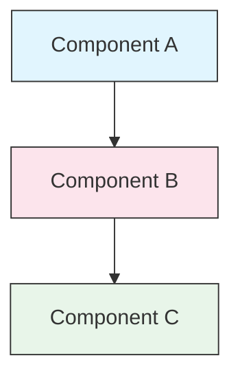

<!-- i18n-source: STYLE_GUIDE.md -->
<!-- i18n-source-sha: d17d515 -->
<!-- i18n-date: 2026-04-27 -->

<picture>
  <source media="(prefers-color-scheme: dark)" srcset="../resources/logos/claude-howto-logo-dark.svg">
  
</picture>

# スタイルガイド

> Claude How To にコントリビュートする際の規約とフォーマットルール。コンテンツを一貫した、プロフェッショナルで保守しやすい状態に保つため、本ガイドに従うこと。
>
> ※日本語訳における文体・用語ルールについては `TRANSLATION_NOTES.md` も参照。

---

## 目次

- [ファイルとフォルダの命名](#ファイルとフォルダの命名)
- [ドキュメント構造](#ドキュメント構造)
- [見出し](#見出し)
- [テキストフォーマット](#テキストフォーマット)
- [リスト](#リスト)
- [テーブル](#テーブル)
- [コードブロック](#コードブロック)
- [リンクと相互参照](#リンクと相互参照)
- [図](#図)
- [絵文字の使い方](#絵文字の使い方)
- [YAML フロントマター](#yaml-フロントマター)
- [画像とメディア](#画像とメディア)
- [トーンと声](#トーンと声)
- [コミットメッセージ](#コミットメッセージ)
- [著者向けチェックリスト](#著者向けチェックリスト)

---

## ファイルとフォルダの命名

### レッスンフォルダ

レッスンフォルダは **2 桁の番号プレフィックス** に **kebab-case** の記述子を続ける：

```
01-slash-commands/
02-memory/
03-skills/
04-subagents/
05-mcp/
```

番号は初心者から上級者への学習パスの順序を反映する。

### ファイル名

| 種別 | 規約 | 例 |
|------|-----------|----------|
| **レッスン README** | `README.md` | `01-slash-commands/README.md` |
| **機能ファイル** | kebab-case `.md` | `code-reviewer.md`、`generate-api-docs.md` |
| **シェルスクリプト** | kebab-case `.sh` | `format-code.sh`、`validate-input.sh` |
| **設定ファイル** | 標準名 | `.mcp.json`、`settings.json` |
| **メモリファイル** | スコーププレフィックス | `project-CLAUDE.md`、`personal-CLAUDE.md` |
| **トップレベル文書** | UPPER_CASE `.md` | `CATALOG.md`、`QUICK_REFERENCE.md`、`CONTRIBUTING.md` |
| **画像アセット** | kebab-case | `pr-slash-command.png`、`claude-howto-logo.svg` |

### ルール

- すべてのファイル名・フォルダ名は **小文字** を使用する（`README.md`、`CATALOG.md` などのトップレベル文書を除く）
- 単語区切りには **ハイフン**（`-`）を使い、アンダースコアやスペースは使わない
- 名前は記述的かつ簡潔に保つ

---

## ドキュメント構造

### ルート README

ルート `README.md` は以下の順序に従う：

1. ロゴ（ダーク／ライト両対応の `<picture>` 要素）
2. H1 タイトル
3. 導入のブロッククォート（1 行のバリュープロポジション）
4. "Why This Guide?" セクションと比較テーブル
5. 水平線（`---`）
6. 目次
7. 機能カタログ
8. クイックナビゲーション
9. 学習パス
10. 機能セクション
11. はじめに
12. ベストプラクティス／トラブルシューティング
13. コントリビュート／ライセンス

### レッスン README

各レッスン `README.md` は以下の順序に従う：

1. H1 タイトル（例：`# Slash Commands`）
2. 簡潔な概要段落
3. クイックリファレンステーブル（任意）
4. アーキテクチャ図（Mermaid）
5. 詳細セクション（H2）
6. 実践例（番号付き、4〜6 個）
7. ベストプラクティス（Do と Don't のテーブル）
8. トラブルシューティング
9. 関連ガイド／公式ドキュメント
10. ドキュメントメタデータのフッタ

### 機能／サンプルファイル

個別の機能ファイル（例：`optimize.md`、`pr.md`）：

1. YAML フロントマター（該当する場合）
2. H1 タイトル
3. 目的／説明
4. 使用方法
5. コード例
6. カスタマイズのヒント

### セクション区切り

主要なドキュメント領域を区切るために水平線（`---`）を使う：

```markdown
---

## 新しい主要セクション
```

導入のブロッククォートの後と、論理的に異なる部分の間に配置する。

---

## 見出し

### 階層

| レベル | 用途 | 例 |
|-------|-----|---------|
| `#` H1 | ページタイトル（1 ドキュメントに 1 つ） | `# Slash Commands` |
| `##` H2 | 主要セクション | `## Best Practices` |
| `###` H3 | サブセクション | `### Adding a Skill` |
| `####` H4 | サブサブセクション（まれ） | `#### Configuration Options` |

### ルール

- **1 ドキュメントに H1 は 1 つ** — ページタイトルだけ
- **レベルを飛ばさない** — H2 から H4 へ飛ばない
- **見出しは簡潔に** — 2〜5 語が目安
- **センテンスケースを使う** — 最初の単語と固有名詞のみ大文字（例外：機能名はそのまま）
- **絵文字プレフィックスはルート README のセクションヘッダにのみ追加**（[絵文字の使い方](#絵文字の使い方)を参照）

---

## テキストフォーマット

### 強調

| スタイル | いつ使うか | 例 |
|-------|------------|---------|
| **ボールド**（`**text**`） | 重要な用語、テーブル内のラベル、重要概念 | `**Installation**:` |
| *イタリック*（`*text*`） | 専門用語の初出、書籍／文書のタイトル | `*frontmatter*` |
| `コード`（`` `text` ``） | ファイル名、コマンド、設定値、コード参照 | `` `CLAUDE.md` `` |

### コールアウト用ブロッククォート

重要な注意にはボールドプレフィックス付きのブロッククォートを使う：

```markdown
> **Note**: Custom slash commands have been merged into skills since v2.0.

> **Important**: Never commit API keys or credentials.

> **Tip**: Combine memory with skills for maximum effectiveness.
```

サポートするコールアウトの種類：**Note**、**Important**、**Tip**、**Warning**。

### 段落

- 段落は短く保つ（2〜4 文）
- 段落の間に空行を入れる
- 重要点を先に、コンテキストは後に
- 「何を」だけでなく「なぜ」を説明する

---

## リスト

### 番号なしリスト

ダッシュ（`-`）と 2 スペースのインデントでネストする：

```markdown
- 最初の項目
- 2 番目の項目
  - ネスト項目
  - もう 1 つのネスト項目
    - 深いネスト（3 階層より深くしない）
- 3 番目の項目
```

### 番号付きリスト

順序のあるステップ、手順、ランク付け項目には番号付きリストを使う：

```markdown
1. 最初のステップ
2. 2 番目のステップ
   - サブポイントの詳細
   - もう 1 つのサブポイント
3. 3 番目のステップ
```

### 説明型リスト

キー・バリュー形式のリストにはボールドラベルを使う：

```markdown
- **パフォーマンスのボトルネック** - O(n^2) の操作、非効率なループを特定する
- **メモリリーク** - 解放されていないリソース、循環参照を発見する
- **アルゴリズム改善** - よりよいアルゴリズムやデータ構造を提案する
```

### ルール

- 一貫したインデントを保つ（1 階層につき 2 スペース）
- リストの前後に空行を入れる
- リスト項目は構造を揃える（すべて動詞で始める、またはすべて名詞、など）
- 3 階層より深いネストは避ける

---

## テーブル

### 標準フォーマット

```markdown
| Column 1 | Column 2 | Column 3 |
|----------|----------|----------|
| Data     | Data     | Data     |
```

### よくあるテーブルパターン

**機能比較（3〜4 列）：**

```markdown
| Feature | Invocation | Persistence | Best For |
|---------|-----------|------------|----------|
| **Slash Commands** | Manual (`/cmd`) | Session only | Quick shortcuts |
| **Memory** | Auto-loaded | Cross-session | Long-term learning |
```

**Do と Don't：**

```markdown
| Do | Don't |
|----|-------|
| Use descriptive names | Use vague names |
| Keep files focused | Overload a single file |
```

**クイックリファレンス：**

```markdown
| Aspect | Details |
|--------|---------|
| **Purpose** | Generate API documentation |
| **Scope** | Project-level |
| **Complexity** | Intermediate |
```

### ルール

- **テーブルヘッダをボールドにする** — 行ラベル（最初の列）の場合
- ソースの可読性のためにパイプを揃える（任意だが推奨）
- セルの内容は簡潔に保つ。詳細はリンクで
- セル内のコマンドやファイルパスには `code formatting` を使う

---

## コードブロック

### 言語タグ

シンタックスハイライトのために必ず言語タグを指定する：

| 言語 | タグ | 用途 |
|----------|-----|---------|
| シェル | `bash` | CLI コマンド、スクリプト |
| Python | `python` | Python コード |
| JavaScript | `javascript` | JS コード |
| TypeScript | `typescript` | TS コード |
| JSON | `json` | 設定ファイル |
| YAML | `yaml` | フロントマター、設定 |
| Markdown | `markdown` | Markdown の例 |
| SQL | `sql` | データベースクエリ |
| プレーンテキスト | （タグなし） | 期待される出力、ディレクトリツリー |

### 規約

```bash
# コマンドの動作を説明するコメント
claude mcp add notion --transport http https://mcp.notion.com/mcp
```

- 自明でないコマンドの前に **コメント行** を追加する
- すべての例を **コピー＆ペースト可能** にする
- 関連するときは **シンプル版と高度版の両方** を示す
- 理解の助けとなる場合は **期待される出力** を含める（タグなしのコードブロックを使う）

### インストールブロック

インストール手順には以下のパターンを使う：

```bash
# プロジェクトにファイルをコピー
cp 01-slash-commands/*.md .claude/commands/
```

### 複数ステップのワークフロー

```bash
# Step 1: ディレクトリを作成
mkdir -p .claude/commands

# Step 2: テンプレートをコピー
cp 01-slash-commands/*.md .claude/commands/

# Step 3: インストールを確認
ls .claude/commands/
```

---

## リンクと相互参照

### 内部リンク（相対）

すべての内部リンクは相対パスを使う：

```markdown
[Slash Commands](01-slash-commands/)
[Skills Guide](03-skills/)
[Memory Architecture](02-memory/#memory-architecture)
```

レッスンフォルダからルートまたは兄弟へ：

```markdown
[Back to main guide](../README.md)
[Related: Skills](../03-skills/)
```

### 外部リンク（絶対）

説明的なアンカーテキストを伴う完全 URL を使う：

```markdown
[Anthropic's official documentation](https://code.claude.com/docs/en/overview)
```

- アンカーテキストに「click here」「this link」を使わない
- 文脈外でも意味が通る記述的なテキストを使う

### セクションアンカー

GitHub スタイルのアンカーで同一文書内のセクションへリンクする：

```markdown
[Feature Catalog](#-feature-catalog)
[Best Practices](#best-practices)
```

### 関連ガイドのパターン

レッスンの末尾に関連ガイドのセクションを置く：

```markdown
## Related Guides

- [Slash Commands](../01-slash-commands/) - Quick shortcuts
- [Memory](../02-memory/) - Persistent context
- [Skills](../03-skills/) - Reusable capabilities
```

---

## 図

### Mermaid

すべての図に Mermaid を使う。サポートする種類：

- `graph TB` / `graph LR` — アーキテクチャ、階層、フロー
- `sequenceDiagram` — インタラクションフロー
- `timeline` — 時系列

### スタイル規約

スタイルブロックで一貫した色を適用する：



**カラーパレット：**

| 色 | Hex | 用途 |
|-------|-----|---------|
| ライトブルー | `#e1f5fe` | 主要コンポーネント、入力 |
| ライトピンク | `#fce4ec` | 処理、ミドルウェア |
| ライトグリーン | `#e8f5e9` | 出力、結果 |
| ライトイエロー | `#fff9c4` | 設定、任意 |
| ライトパープル | `#f3e5f5` | ユーザー向け、UI |

### ルール

- ノードラベルには `["Label text"]` を使う（特殊文字を許可）
- ラベル内の改行には `<br/>` を使う
- 図はシンプルに保つ（最大 10〜12 ノード）
- アクセシビリティのため図の下に簡潔なテキスト説明を追加する
- 階層には上から下（`TB`）、ワークフローには左から右（`LR`）を使う

---

## 絵文字の使い方

### 絵文字を使う場所

絵文字は **控えめかつ目的を持って** 使う — 特定のコンテキストでのみ：

| コンテキスト | 絵文字 | 例 |
|---------|--------|---------|
| ルート README のセクションヘッダ | カテゴリアイコン | `## 📚 Learning Path` |
| スキルレベル指標 | 色付き丸 | 🟢 初心者、🔵 中級者、🔴 上級者 |
| Do と Don't | チェック／クロスマーク | ✅ こうする、❌ こうしない |
| 複雑さ評価 | 星 | ⭐⭐⭐ |

### 標準絵文字セット

| 絵文字 | 意味 |
|-------|---------|
| 📚 | 学習、ガイド、ドキュメント |
| ⚡ | はじめに、クイックリファレンス |
| 🎯 | 機能、クイックリファレンス |
| 🎓 | 学習パス |
| 📊 | 統計、比較 |
| 🚀 | インストール、クイックコマンド |
| 🟢 | 初心者レベル |
| 🔵 | 中級者レベル |
| 🔴 | 上級者レベル |
| ✅ | 推奨される慣行 |
| ❌ | 避ける／アンチパターン |
| ⭐ | 複雑さ評価の単位 |

### ルール

- **本文や段落で絵文字を使わない**
- ヘッダで絵文字を使うのは **ルート README のみ**（レッスン README では使わない）
- **装飾的な絵文字を追加しない** — どの絵文字も意味を伝えるべき
- 絵文字の使い方は上記の表と一貫させる

---

## YAML フロントマター

### 機能ファイル（スキル、コマンド、エージェント）

```yaml
---
name: unique-identifier
description: What this feature does and when to use it
allowed-tools: Bash, Read, Grep
---
```

### 任意フィールド

```yaml
---
name: my-feature
description: Brief description
argument-hint: "[file-path] [options]"
allowed-tools: Bash, Read, Grep, Write, Edit
model: opus                        # opus, sonnet, または haiku
disable-model-invocation: true     # ユーザー専用の起動
user-invocable: false              # ユーザーメニューから隠す
context: fork                      # 隔離されたサブエージェントで実行
agent: Explore                     # context: fork のエージェント種別
---
```

### ルール

- フロントマターはファイルの最上部に置く
- `name` フィールドは **kebab-case** を使う
- `description` は 1 文に保つ
- 必要なフィールドのみを含める

---

## 画像とメディア

### ロゴパターン

ロゴで始まる文書はすべて、ダーク／ライトモード対応のために `<picture>` 要素を使う：

```html
<picture>
  <source media="(prefers-color-scheme: dark)" srcset="resources/logos/claude-howto-logo-dark.svg">
  
</picture>
```

### スクリーンショット

- 関連するレッスンフォルダに保存する（例：`01-slash-commands/pr-slash-command.png`）
- ファイル名に kebab-case を使う
- 説明的な alt テキストを含める
- 図には SVG、スクリーンショットには PNG を優先する

### ルール

- 画像には常に alt テキストを提供する
- 画像のファイルサイズを適切に保つ（PNG は 500KB 未満）
- 画像参照には相対パスを使う
- 画像は参照する文書と同じディレクトリ、または共有画像なら `assets/` に保存する

---

## トーンと声

### 執筆スタイル

- **プロフェッショナルだが親しみやすく** — 専門用語の過多なしに技術的に正確
- **能動態** — 「ファイルを作成する」（「ファイルが作成されるべき」ではない）
- **直接的な指示** — 「このコマンドを実行する」（「このコマンドを実行したいかもしれない」ではない）
- **初心者にやさしく** — 読者は Claude Code に新しい人だが、プログラミングに新しい人ではないと仮定

### コンテンツの原則

| 原則 | 例 |
|-----------|---------|
| **見せる、語らない** | 抽象的な記述ではなく、動くサンプルを提供する |
| **段階的な複雑さ** | シンプルから始め、後のセクションで深さを加える |
| **「なぜ」を説明する** | 「メモリは…のために使う」だけでなく「メモリは…なぜなら…」 |
| **コピー＆ペーストで動く** | すべてのコードブロックは貼り付けるだけで動くべき |
| **実世界のコンテキスト** | わざとらしい例ではなく実用的なシナリオを使う |

### 語彙

- 「Claude Code」を使う（「Claude CLI」や「the tool」ではない）
- 「skill」を使う（「custom command」ではない — 旧称）
- 番号付きセクションには「lesson」または「guide」を使う
- 個別の機能ファイルには「example」を使う

---

## コミットメッセージ

[Conventional Commits](https://www.conventionalcommits.org/) に従う：

```
type(scope): description
```

### 種別

| 種別 | 用途 |
|------|---------|
| `feat` | 新機能、サンプル、ガイド |
| `fix` | バグ修正、訂正、リンク切れ |
| `docs` | ドキュメント改善 |
| `refactor` | 動作を変えない再構築 |
| `style` | フォーマット変更のみ |
| `test` | テスト追加・変更 |
| `chore` | ビルド、依存関係、CI |

### スコープ

スコープにはレッスン名やファイル領域を使う：

```
feat(slash-commands): Add API documentation generator
docs(memory): Improve personal preferences example
fix(README): Correct table of contents link
docs(skills): Add comprehensive code review skill
```

---

## ドキュメントメタデータのフッタ

レッスン README はメタデータブロックで終わる：

```markdown
---
**Last Updated**: March 2026
**Claude Code Version**: 2.1.97
**Compatible Models**: Claude Sonnet 4.6, Claude Opus 4.7, Claude Haiku 4.5
```

- 月＋年の形式を使う（例：「March 2026」）
- 機能変更時にバージョンを更新する
- 互換モデルをすべてリストする

---

## 著者向けチェックリスト

コンテンツを提出する前に確認する：

- [ ] ファイル／フォルダ名が kebab-case
- [ ] 文書が H1 タイトルで始まる（1 ファイルに 1 つ）
- [ ] 見出し階層が正しい（レベルの飛ばしなし）
- [ ] すべてのコードブロックに言語タグがある
- [ ] コード例がコピー＆ペーストで動く
- [ ] 内部リンクは相対パス
- [ ] 外部リンクには記述的なアンカーテキスト
- [ ] テーブルが正しくフォーマットされている
- [ ] 絵文字は標準セットに従う（使う場合）
- [ ] Mermaid 図は標準カラーパレットを使う
- [ ] 機微な情報（API キー、認証情報）が含まれない
- [ ] YAML フロントマターが妥当（該当する場合）
- [ ] 画像に alt テキストがある
- [ ] 段落が短く焦点が絞られている
- [ ] 関連ガイドのセクションが関連レッスンへリンクする
- [ ] コミットメッセージが Conventional Commits 形式に従う

---

**Last Updated**: April 24, 2026
**Claude Code Version**: 2.1.119
**Sources**:
- https://code.claude.com/docs/en/overview
- https://code.claude.com/docs/en/changelog
- https://www.anthropic.com/news/claude-opus-4-7
**Compatible Models**: Claude Sonnet 4.6, Claude Opus 4.7, Claude Haiku 4.5
