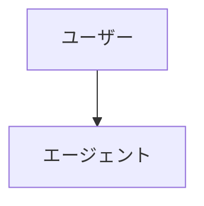
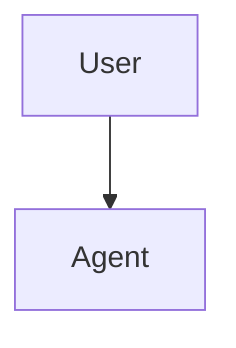

# 翻訳用語集とスタイルガイド

# Translation Glossary & Style Guide

> **重要：** 本書は Claude Code ドキュメントを日本語へ翻訳する際のルールを定める。作業開始前に必ず読むこと。

## 基本方針

- **文体：** だ・である調（常体）
- **用語方針：** カタカナ寄り（IT 業界で定着済みのカタカナ語を優先）
- **コード保持：** 実行コードは 100% 維持。コメント・docstring のみ翻訳
- **Mermaid 図：** ラベルテキストは英語のまま維持
- **原典追従：** 各ファイル先頭に `i18n-source-sha` を埋め込み、再同期可能にする

---

## 技術用語集

全ファイルで統一するための対訳表：

| English | 日本語 | 備考 |
|---------|--------|------|
| slash command | スラッシュコマンド | Claude Code の機能名 |
| hook | フック | IT 業界で定着 |
| skill | スキル | Claude Code の機能名 |
| subagent | サブエージェント | Claude Code の機能名 |
| agent | エージェント | 一般的なカタカナ表記 |
| memory | メモリ | Claude Code の機能名（記憶領域の意味） |
| checkpoint | チェックポイント | セッションのスナップショット |
| plugin | プラグイン | 一般用語 |
| pull request / PR | プルリクエスト / PR | GitHub 用語 |
| commit | コミット | Git 用語 |
| branch | ブランチ | Git 用語 |
| merge | マージ | Git 用語 |
| MCP (Model Context Protocol) | MCP | プロトコル名はそのまま |
| CLAUDE.md | CLAUDE.md | ファイル名はそのまま |
| prompt | プロンプト | 定着したカタカナ |
| workflow | ワークフロー | 定着したカタカナ |
| repository | リポジトリ | Git 用語 |
| issue | Issue | GitHub 用語、原文表記 |
| release | リリース | 定着したカタカナ |
| API | API | そのまま |
| CLI | CLI | Command-Line Interface、そのまま |
| CI/CD | CI/CD | そのまま |
| pre-commit hook | pre-commit フック | ツール名は維持 |
| environment variable | 環境変数 | 訳語が定着 |
| dependencies | 依存関係 | 訳語が定着 |
| template | テンプレート | カタカナ |
| worktree | ワークツリー | Git 用語、カタカナ化 |
| frontmatter | フロントマター | YAML 先頭ブロック |
| token | トークン | カタカナ |
| context window | コンテキストウィンドウ | カタカナ |
| fork | フォーク | Git 用語 |
| clone | クローン（する） | Git 用語 |
| sandbox | サンドボックス | カタカナ |
| boilerplate | ボイラープレート | カタカナ |
| debugging | デバッグ | カタカナ |
| linting | リンティング | カタカナ |
| refactoring | リファクタリング | カタカナ |
| build | ビルド | カタカナ |
| deploy | デプロイ | カタカナ |
| feature | 機能 | 文脈に応じて「フィーチャー」も可 |
| user | ユーザー | カタカナ |
| developer | 開発者 | 訳語が定着 |
| documentation | ドキュメント / ドキュメンテーション | 短縮形「ドキュメント」を優先 |
| roadmap | ロードマップ | カタカナ |
| ecosystem | エコシステム | カタカナ |
| orchestration | オーケストレーション | カタカナ |
| permission | 権限 / パーミッション | 文脈に応じて |
| settings | 設定 | 訳語が定着 |
| configuration | 設定 / コンフィグ | 短縮形「設定」を優先 |
| trigger | トリガー | カタカナ |
| event | イベント | カタカナ |
| script | スクリプト | カタカナ |
| handler | ハンドラ | カタカナ |
| wrapper | ラッパー | カタカナ |
| middleware | ミドルウェア | カタカナ |
| pipeline | パイプライン | カタカナ |
| best practice | ベストプラクティス | カタカナ |
| use case | ユースケース | カタカナ |
| trade-off | トレードオフ | カタカナ |

---

## Claude Code 固有名詞（絶対変更不可）

以下は Claude Code の **製品名・機能名** であり、**訳さず英語表記のまま** 維持する：

| 表記 | 種別 | 補足 |
|------|------|------|
| Claude | 製品名 | カタカナ「クロード」にしない |
| Claude Code | 製品名 | そのまま |
| Anthropic | 会社名 | そのまま |
| CLAUDE.md | ファイル名 | 大文字維持 |
| SKILL.md | ファイル名 | 大文字維持 |
| MCP / Model Context Protocol | プロトコル名 | 略語使用、初出は併記 |
| `.claude/` | ディレクトリ名 | そのまま |
| `~/.claude/` | パス | そのまま |
| `claude.ai` / `claude.com` / `code.claude.com` | URL | そのまま |
| Sonnet / Opus / Haiku | モデル名 | カタカナにしない |

ただし、**機能カテゴリ** は日本語化する（カタカナ寄り）：

| English | 日本語 | 備考 |
|---------|--------|------|
| Slash Commands（機能名） | スラッシュコマンド | 見出しでも翻訳する |
| Memory（機能名） | メモリ | 「記憶」とは訳さない |
| Skills（機能名） | スキル | そのまま |
| Subagents（機能名） | サブエージェント | 「副エージェント」NG |
| Hooks（機能名） | フック | そのまま |
| Plugins（機能名） | プラグイン | そのまま |
| Checkpoints（機能名） | チェックポイント | そのまま |
| Advanced Features（カテゴリ） | 高度な機能 | 訳す |
| CLI Reference（カテゴリ） | CLI リファレンス | 訳す |

---

## モジュール名の取り扱い

各モジュールの見出し・URL での扱い：

| 原典の見出し | 日本語訳 | URL（変更しない） |
|-----------|--------|--------------|
| 01 Slash Commands | スラッシュコマンド | `01-slash-commands/` |
| 02 Memory | メモリ | `02-memory/` |
| 03 Skills | スキル | `03-skills/` |
| 04 Subagents | サブエージェント | `04-subagents/` |
| 05 MCP | MCP | `05-mcp/` |
| 06 Hooks | フック | `06-hooks/` |
| 07 Plugins | プラグイン | `07-plugins/` |
| 08 Checkpoints | チェックポイント | `08-checkpoints/` |
| 09 Advanced Features | 高度な機能 | `09-advanced-features/` |
| 10 CLI | CLI | `10-cli/` |

**重要：** ディレクトリ名・ファイルパスは絶対に変更しない。日本語化するのは見出し・本文中の言及のみ。

---

## 翻訳ルール

### 1. コードとコマンド

**黄金ルール：** 実行可能コードは 100% 保持する。翻訳するのはコメントと説明文のみ。

**正しい例（✅）：**

````markdown
このコマンドを実行するには：

```bash
/optimize
```

このコマンドはコードを解析する。
````

**誤った例（❌）：**

````markdown
このコマンドを実行するには：

```bash
/最適化  # コマンド名は絶対に翻訳しない
```
````

### 2. コード内コメント

コメントは日本語に翻訳する：

```python
# ✅ 正しい — コメントを翻訳
# このスラッシュコマンドはコードを最適化する
def optimize_code():
    pass

# ❌ 誤り — 関数名は翻訳しない
def 最適化_コード():  # 関数名は変更しない
    pass
```

### 3. 関数名・変数名・クラス名

英語のまま維持する：

```python
# ✅ 正しい
def create_subagent(name: str, system_prompt: str):
    pass

# ❌ 誤り
def サブエージェント作成(名前: str, システムプロンプト: str):
    pass
```

### 4. Mermaid 図

**100% そのまま維持する。** mermaid ブロック内のテキストは一切翻訳しない。

````markdown
<!-- ❌ 誤り -->


<!-- ✅ 正しい -->

````

**重要：** Mermaid のコメントは `%%` を使う。`#` はパーサエラーになる。

````markdown
<!-- ✅ 正しい -->


<!-- ❌ 誤り -->
```text
graph TD
    # これはパーサを壊す！
    A[User] --> B[Agent]
```
````

### 5. ファイルパスと URL

そのまま維持する：

```markdown
<!-- ✅ 正しい -->
設定については `.claude/settings.json` を参照。

<!-- ❌ 誤り -->
設定については `.claude/設定.json` を参照。
```

### 6. テーブル

構造（列・行数）はそのまま維持する。テキスト内容は翻訳し、技術的な値はそのままにする：

```markdown
| コマンド | 説明 | 例 |
|---------|------|-----|
| `/help` | ヘルプを表示 | `/help memory` |
| `/clear` | セッションをクリア | `/clear` |
```

### 7. ファイル間リンク

`ja/` 内では相対パスを使う：

```markdown
<!-- モジュール間 -->
[メモリ](../02-memory/)

<!-- 英語の原典へ -->
[English version](../../README.md)

<!-- コードファイル — 原典を参照する。コピーしない -->
[`format-code.sh`](../../06-hooks/format-code.sh)
```

### 8. バージョントラッキング用フロントマター

各翻訳ファイルの先頭に、原典のバージョン追跡用 HTML コメントを付ける：

```markdown
<!-- i18n-source: 01-slash-commands/README.md -->
<!-- i18n-source-sha: a1b2c3d4 -->
<!-- i18n-date: 2026-04-27 -->

# 翻訳されたファイルの見出し
```

SHA は元になった英語ファイルの短縮コミットハッシュ。取得方法：`git log --oneline -1 -- <英語ファイルへのパス>`。

### 9. 文体ルール

- **基本文体：** だ・である調（常体）。例：「〜である」「〜する」「〜だ」
- **読者への呼びかけ：** 「あなた」は使わず、命令形か「〜できる」「〜してほしい」を使う
- **見出し・箇条書き：** 体言止め可（「インストール」「設定方法」など）
- **本文：** 常体で統一
- **冗長表現を避ける：** 「実行する」 > 「実行を行う」
- **技術略語：** 初出時は「正式名称（略語）」、以降は略語のみ
- **数字：** 半角数字を使用（10 個、3 ステップなど）
- **句読点：** 「、」と「。」を使用（「，」「．」は使わない）
- **括弧：** 全角（）を使うが、コード内は半角 ()

### 10. 「ですます」と「である」の境界

- **本文・説明：** である調
  - 「この機能は CLAUDE.md ファイルから設定を読み込む」
- **箇条書きの末尾：** 体言止めまたは常体
  - 「インストール手順」「メモリの管理方法」
- **コードのコメント内：** である調 or 簡潔な体言止め
  - `# このフックはコミット前に実行される`
- **見出し：** 体言止めまたは疑問形
  - 「## はじめに」「## なぜ必要か」

---

## DO / DON'T

### ✅ DO：説明文を翻訳する

```markdown
スラッシュコマンドは、Claude の対話セッション中の動作を制御するショートカットである。
```

### ✅ DO：コード内のコメントを翻訳する

```python
# ✅ 正しい
# この関数は新しいサブエージェントを作成する
def create_subagent():
    pass
```

### ❌ DON'T：関数名を翻訳しない

```python
# ❌ 誤り
def サブエージェント作成():
    pass

# ✅ 正しい
def create_subagent():
    pass
```

### ❌ DON'T：Mermaid 図を翻訳しない

````markdown
<!-- ❌ 誤り -->


<!-- ✅ 正しい -->

````

### ❌ DON'T：機械翻訳を無検証で使わない

機械翻訳（Google 翻訳、DeepL など）は以下の問題を起こしやすい：

- 技術用語の誤訳
- コードの文脈を理解しない
- コマンドの意味を歪める
- Markdown 書式を壊す

**機械翻訳の後は必ず人手でチェック・編集すること。**

### ❌ DON'T：コミットメッセージ例を翻訳しない

Conventional Commits 形式は規約のため、英語のまま維持する：

```markdown
<!-- ✅ 正しい -->
- `feat(slash-commands): Add API documentation generator`

<!-- ❌ 誤り -->
- `機能追加(slash-commands): API ドキュメント生成機能を追加`
```

### ❌ DON'T：CLI 出力例を翻訳しない

実際のコマンド出力を示している例は、英語のまま維持する（再現性のため）：

```text
✅ 正しい：
$ claude --version
2.1.119

❌ 誤り：
$ claude --version
バージョン 2.1.119
```

---

## コミット前チェックリスト

- [ ] 技術的正確性が保たれている
- [ ] 日本語として自然に読める
- [ ] 用語が glossary と一致している
- [ ] コードは 100% そのまま（変更なし）
- [ ] Mermaid 図は変更されていない
- [ ] 内部リンクが機能する
- [ ] 外部リンクが保持されている
- [ ] Markdown 書式が正しい
- [ ] コード内コメントが翻訳されている
- [ ] 関数名・変数名・クラス名は英語のまま
- [ ] ファイルパスと URL は変更なし
- [ ] フロントマター `i18n-source-sha` を追加済み
- [ ] pre-commit チェックがすべて通る

---

## 困ったとき

翻訳中に疑問が生じたら：

1. 本書の glossary を確認
2. 他モジュールの類似ファイルがどう訳されているか確認
3. `uk/`、`vi/`、`zh/` の対応ファイルを参照
4. 必要なら GitHub Issue を立てて議論

---

**最終更新：** 2026-04-27
**言語：** 日本語（ja-JP）
