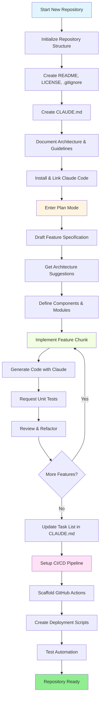
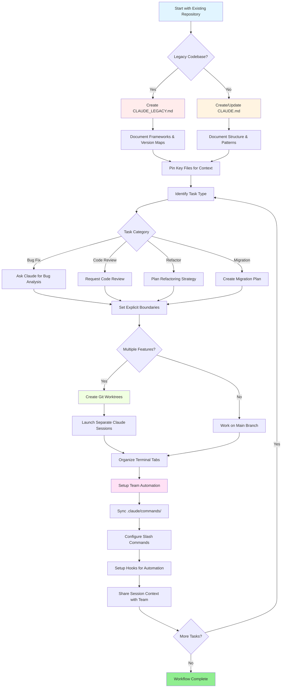

<!-- i18n-source: resources.md -->
<!-- i18n-source-sha: d17d515 -->
<!-- i18n-date: 2026-04-27 -->

<picture>
  <source media="(prefers-color-scheme: dark)" srcset="../resources/logos/claude-howto-logo-dark.svg">
  
</picture>

# 良質なリソース一覧

## 公式ドキュメント

| リソース | 説明 | リンク |
|----------|-------------|------|
| Claude Code Docs | Claude Code の公式ドキュメント | [code.claude.com/docs/en/overview](https://code.claude.com/docs/en/overview) |
| Anthropic Docs | Anthropic 公式の総合ドキュメント | [docs.anthropic.com](https://docs.anthropic.com) |
| MCP Protocol | Model Context Protocol 仕様 | [modelcontextprotocol.io](https://modelcontextprotocol.io) |
| MCP Servers | 公式 MCP サーバ実装 | [github.com/modelcontextprotocol/servers](https://github.com/modelcontextprotocol/servers) |
| Anthropic Cookbook | コード例とチュートリアル | [github.com/anthropics/anthropic-cookbook](https://github.com/anthropics/anthropic-cookbook) |
| Claude Code Skills | コミュニティスキルのリポジトリ | [github.com/anthropics/skills](https://github.com/anthropics/skills) |
| Agent Teams | マルチエージェントの調整と協調 | [code.claude.com/docs/en/agent-teams](https://code.claude.com/docs/en/agent-teams) |
| Scheduled Tasks | `/loop` と cron による定期タスク | [code.claude.com/docs/en/scheduled-tasks](https://code.claude.com/docs/en/scheduled-tasks) |
| Chrome Integration | ブラウザ自動化 | [code.claude.com/docs/en/chrome](https://code.claude.com/docs/en/chrome) |
| Keybindings | キーボードショートカットのカスタマイズ | [code.claude.com/docs/en/keybindings](https://code.claude.com/docs/en/keybindings) |
| Desktop App | ネイティブのデスクトップアプリケーション | [code.claude.com/docs/en/desktop](https://code.claude.com/docs/en/desktop) |
| Remote Control | リモートセッション制御 | [code.claude.com/docs/en/remote-control](https://code.claude.com/docs/en/remote-control) |
| Auto Mode | 自動権限管理 | [code.claude.com/docs/en/permissions](https://code.claude.com/docs/en/permissions) |
| Channels | マルチチャネル通信 | [code.claude.com/docs/en/channels](https://code.claude.com/docs/en/channels) |
| Voice Dictation | Claude Code の音声入力 | [code.claude.com/docs/en/voice-dictation](https://code.claude.com/docs/en/voice-dictation) |

## Anthropic エンジニアリングブログ

| 記事 | 説明 | リンク |
|---------|-------------|------|
| Code Execution with MCP | コード実行を使って MCP のコンテキスト肥大化を解決する方法 — 98.7% のトークン削減 | [anthropic.com/engineering/code-execution-with-mcp](https://www.anthropic.com/engineering/code-execution-with-mcp) |

---

## Claude Code を 30 分でマスターする

_動画_：https://www.youtube.com/watch?v=6eBSHbLKuN0

_**全 Tips**_
- **高度な機能とショートカットを探求する**
  - リリースノートで Claude の新しいコード編集・コンテキスト機能を定期的に確認する。
  - チャット、ファイル、エディタビュー間を素早く切り替えるキーボードショートカットを覚える。

- **効率的なセットアップ**
  - 後で見つけやすいよう、明確な名前／説明を付けたプロジェクト固有セッションを作成する。
  - Claude がいつでもアクセスできるよう、よく使うファイルやフォルダをピン留めする。
  - Claude の連携機能（GitHub、人気 IDE など）を設定して、コーディングプロセスを合理化する。

- **効果的なコードベース Q&A**
  - アーキテクチャ、デザインパターン、特定モジュールについて Claude に詳しく質問する。
  - 質問にファイルと行参照を使う（例：「`app/models/user.py` のロジックは何を達成するか？」）。
  - 大きなコードベースでは、Claude が焦点を絞れるようサマリやマニフェストを提供する。
  - **プロンプト例**：_「src/auth/AuthService.ts:45-120 で実装された認証フローを説明できる？src/middleware/auth.ts のミドルウェアとどう統合される？」_

- **コード編集とリファクタリング**
  - インラインコメントやコードブロック内のリクエストで焦点を絞った編集を得る（「この関数を分かりやすくリファクタリングして」）。
  - 並列のビフォア／アフター比較を求める。
  - 大きな編集の後は、品質保証のため Claude にテストやドキュメントを生成させる。
  - **プロンプト例**：_「api/users.js の getUserData 関数を、Promise の代わりに async/await を使うようリファクタリングして。ビフォア／アフターの比較を見せ、リファクタ版の単体テストを生成して」_

- **コンテキスト管理**
  - 貼り付けるコード／コンテキストは、現在のタスクに関係するものだけに限定する。
  - 構造化されたプロンプト（「ファイル A はこれ、関数 B はこれ、私の質問は X」）を使うと最高のパフォーマンスが出る。
  - コンテキスト制限を超えないよう、プロンプトウィンドウから大きなファイルを取り除くか折りたたむ。
  - **プロンプト例**：_「models/User.js の User モデルと utils/validation.js の validateUser 関数。私の質問：後方互換性を保ちつつメール検証を追加するにはどうすればいい？」_

- **チームツールと統合する**
  - Claude セッションをチームのリポジトリやドキュメントに接続する。
  - 繰り返しのエンジニアリングタスクには組み込みテンプレートを使うか、独自のものを作る。
  - セッション記録やプロンプトをチームメイトと共有して協働する。

- **パフォーマンスを高める**
  - Claude に明確で目標志向の指示を与える（例：「このクラスを 5 つの箇条書きで要約して」）。
  - コンテキストウィンドウから不要なコメントとボイラープレートを削る。
  - Claude の出力が外れている場合は、コンテキストをリセットするか質問を言い換えて整合性を高める。
  - **プロンプト例**：_「src/db/Manager.ts の DatabaseManager クラスを 5 つの箇条書きで要約して、主な責任と主要メソッドに焦点を当てて」_

- **実用的な利用例**
  - デバッグ：エラーやスタックトレースを貼り付け、原因と修正案を尋ねる。
  - テスト生成：複雑なロジックに対するプロパティベース、単体、統合テストを依頼する。
  - コードレビュー：リスクのある変更、エッジケース、コードスメルを Claude に特定させる。
  - **プロンプト例**：
    - _「'TypeError: Cannot read property 'map' of undefined at line 42 in components/UserList.jsx' というエラーが出ている。スタックトレースと該当コードはこれ。原因と修正方法は？」_
    - _「PaymentProcessor クラスの包括的な単体テストを生成して。失敗したトランザクション、タイムアウト、無効な入力のエッジケースを含めて」_
    - _「このプルリクエストの diff をレビューして、潜在的なセキュリティ問題、パフォーマンスのボトルネック、コードスメルを特定して」_

- **ワークフローの自動化**
  - 反復タスク（フォーマット、クリーンアップ、繰り返しのリネームなど）を Claude のプロンプトでスクリプト化する。
  - コード差分から PR 説明文、リリースノート、ドキュメントを Claude に下書きさせる。
  - **プロンプト例**：_「git diff に基づいて、変更の要約、変更ファイル一覧、テスト手順、影響を含む詳細な PR 説明を作成して。バージョン 2.3.0 のリリースノートも生成して」_

**Tip**：最高の結果を得るには複数の慣行を組み合わせる — まず重要ファイルをピン留めして目標を要約し、次に焦点を絞ったプロンプトと Claude のリファクタリングツールを使ってコードベースと自動化を漸進的に改善する。

**Claude Code 推奨ワークフロー**

### Claude Code 推奨ワークフロー

#### 新規リポジトリの場合

1. **リポジトリと Claude 連携の初期化**
   - 必須構造（README、LICENSE、.gitignore、ルート設定）で新規リポジトリをセットアップする。
   - アーキテクチャ、ハイレベルな目標、コーディングガイドラインを記述した `CLAUDE.md` ファイルを作成する。
   - Claude Code をインストールしてリポジトリにリンクし、コード提案、テスト雛形作成、ワークフロー自動化を有効にする。

2. **プランモードと仕様を活用する**
   - プランモード（`shift-tab` または `/plan`）を使って、機能実装の前に詳細な仕様を起草する。
   - Claude にアーキテクチャ提案と初期プロジェクトレイアウトを尋ねる。
   - 明確で目標志向のプロンプト連鎖を保つ — コンポーネントの概要、主要モジュール、責任を尋ねる。

3. **反復的に開発・レビューする**
   - 中核機能を小さな塊で実装し、コード生成、リファクタリング、ドキュメント化を Claude に依頼する。
   - 各増分の後に単体テストと例を要求する。
   - CLAUDE.md に進行中のタスクリストを維持する。

4. **CI/CD とデプロイを自動化する**
   - GitHub Actions、npm/yarn スクリプト、デプロイワークフローの雛形を Claude に作らせる。
   - CLAUDE.md を更新し、対応するコマンド／スクリプトを依頼することでパイプラインを容易に適応させる。

#### 既存リポジトリの場合

1. **リポジトリとコンテキストのセットアップ**
   - リポジトリ構造、コーディングパターン、主要ファイルを記録するために `CLAUDE.md` を追加または更新する。レガシーリポジトリでは、フレームワーク、バージョンマップ、手順、既知のバグ、アップグレードノートをカバーする `CLAUDE_LEGACY.md` を使う。
   - Claude が文脈に使うべきメインファイルをピン留めまたは強調表示する。

2. **文脈に応じたコード Q&A**
   - 特定のファイル／関数を参照しながら、コードレビュー、バグ説明、リファクタリング、移行計画を Claude に依頼する。
   - Claude に明確な境界を与える（例：「これらのファイルだけを変更する」「新しい依存関係を追加しない」）。

3. **ブランチ、ワークツリー、マルチセッション管理**
   - 複数の git ワークツリーを使って機能やバグ修正を隔離し、ワークツリーごとに別の Claude セッションを起動する。
   - ターミナルのタブ／ウィンドウをブランチや機能ごとに整理して並列ワークフローを作る。

4. **チームツールと自動化**
   - `.claude/commands/` を介してカスタムコマンドを同期し、チーム全体の整合性を保つ。
   - Claude のスラッシュコマンドやフックで反復タスク、PR 作成、コード整形を自動化する。
   - 共同トラブルシューティングとレビューのために、セッションとコンテキストをチームメンバーと共有する。

**Tips**：
- 新しい機能や修正は、仕様とプランモードのプロンプトから始める。
- レガシーや複雑なリポジトリでは、詳細なガイダンスを CLAUDE.md／CLAUDE_LEGACY.md に保存する。
- 明確で焦点を絞った指示を与え、複雑な作業を多段階の計画に分解する。
- 散らかりを避けるため、定期的にセッションをクリーンアップし、コンテキストを整理し、完了したワークツリーを削除する。

これらのステップは、新規および既存のコードベースにおける Claude Code とのスムーズなワークフローのコア推奨事項を捉えている。

---

## 新機能と能力（2026 年 3 月）

### 主要機能リソース

| 機能 | 説明 | 詳細 |
|---------|-------------|------------|
| **Auto Memory** | Claude がセッションをまたいで好みを自動的に学習・記憶する | [メモリガイド](02-memory/) |
| **Remote Control** | 外部ツールやスクリプトから Claude Code セッションをプログラム的に制御 | [高度な機能](09-advanced-features/) |
| **Web Sessions** | リモート開発のためのブラウザ経由の Claude Code アクセス | [CLI リファレンス](10-cli/) |
| **Desktop App** | UI を強化した Claude Code のネイティブデスクトップアプリ | [Claude Code Docs](https://code.claude.com/docs/en/desktop) |
| **Extended Thinking** | `Alt+T`／`Option+T` または `MAX_THINKING_TOKENS` 環境変数による深い推論の切り替え | [高度な機能](09-advanced-features/) |
| **Permission Modes** | きめ細かい制御：default、acceptEdits、plan、auto、dontAsk、bypassPermissions | [高度な機能](09-advanced-features/) |
| **7-Tier Memory** | Managed Policy、Project、Project Rules、User、User Rules、Local、Auto Memory | [メモリガイド](02-memory/) |
| **Hook Events** | 28 イベント：PreToolUse、PostToolUse、PostToolUseFailure、Stop、StopFailure、SubagentStart、SubagentStop、Notification、Elicitation など | [フックガイド](06-hooks/) |
| **Agent Teams** | 複雑なタスクで複数のエージェントを協調させる | [サブエージェントガイド](04-subagents/) |
| **Scheduled Tasks** | `/loop` と cron ツールで定期タスクをセットアップ | [高度な機能](09-advanced-features/) |
| **Chrome Integration** | ヘッドレス Chromium によるブラウザ自動化 | [高度な機能](09-advanced-features/) |
| **Keyboard Customization** | コードシーケンスを含むキーバインドのカスタマイズ | [高度な機能](09-advanced-features/) |
| **Monitor Tool** | バックグラウンドコマンドの stdout ストリームを監視し、ポーリングではなくイベントに反応する（v2.1.98+） | [高度な機能](09-advanced-features/) |

---
**Last Updated**: April 24, 2026
**Claude Code Version**: 2.1.119
**Sources**:
- https://code.claude.com/docs/en/overview
- https://code.claude.com/docs/en/changelog
- https://github.com/anthropics/claude-code/releases/tag/v2.1.119
**Compatible Models**: Claude Sonnet 4.6, Claude Opus 4.7, Claude Haiku 4.5
