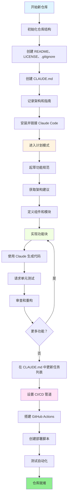
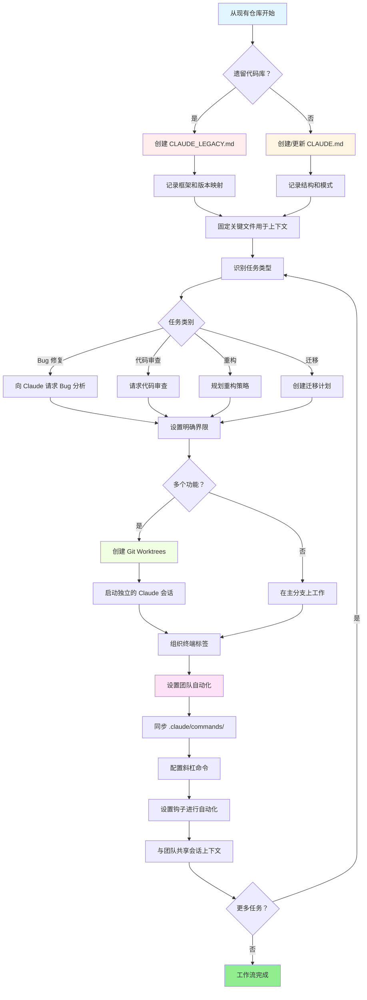

<picture>
  <source media="(prefers-color-scheme: dark)" srcset="resources/logos/claude-howto-logo-dark.svg">
  
</picture>

# 优质资源清单

## 官方文档

| 资源 | 描述 | 链接 |
|----------|-------------|------|
| Claude Code 文档 | 官方 Claude Code 文档 | [code.claude.com/docs/en/overview](https://code.claude.com/docs/en/overview) |
| Anthropic 文档 | 完整的 Anthropic 文档 | [docs.anthropic.com](https://docs.anthropic.com) |
| MCP 协议 | Model Context Protocol 规范 | [modelcontextprotocol.io](https://modelcontextprotocol.io) |
| MCP 服务器 | 官方 MCP 服务器实现 | [github.com/modelcontextprotocol/servers](https://github.com/modelcontextprotocol/servers) |
| Anthropic Cookbook | 代码示例和教程 | [github.com/anthropics/anthropic-cookbook](https://github.com/anthropics/anthropic-cookbook) |
| Claude Code 技能 | 社区技能仓库 | [github.com/anthropics/skills](https://github.com/anthropics/skills) |
| 智能体团队 | 多智能体协调和协作 | [code.claude.com/docs/en/agent-teams](https://code.claude.com/docs/en/agent-teams) |
| 定时任务 | 使用 /loop 和 cron 进行定时任务 | [code.claude.com/docs/en/scheduled-tasks](https://code.claude.com/docs/en/scheduled-tasks) |
| Chrome 集成 | 浏览器自动化 | [code.claude.com/docs/en/chrome](https://code.claude.com/docs/en/chrome) |
| 键盘快捷键 | 键盘快捷键自定义 | [code.claude.com/docs/en/keybindings](https://code.claude.com/docs/en/keybindings) |
| 桌面应用 | 原生桌面应用 | [code.claude.com/docs/en/desktop](https://code.claude.com/docs/en/desktop) |
| 远程控制 | 远程会话控制 | [code.claude.com/docs/en/remote-control](https://code.claude.com/docs/en/remote-control) |
| 自动模式 | 自动权限管理 | [code.claude.com/docs/en/permissions](https://code.claude.com/docs/en/permissions) |
| 频道 | 多频道通信 | [code.claude.com/docs/en/channels](https://code.claude.com/docs/en/channels) |
| 语音输入 | Claude Code 的语音输入 | [code.claude.com/docs/en/voice-dictation](https://code.claude.com/docs/en/voice-dictation) |

## Anthropic 工程博客

| 文章 | 描述 | 链接 |
|---------|-------------|------|
| 使用 MCP 进行代码执行 | 如何使用代码执行解决 MCP 上下文膨胀 — 减少 98.7% 的 token | [anthropic.com/engineering/code-execution-with-mcp](https://www.anthropic.com/engineering/code-execution-with-mcp) |

---

## 30 分钟精通 Claude Code

_视频_：https://www.youtube.com/watch?v=6eBSHbLKuN0

_**所有技巧**_

- **探索高级功能和快捷方式**
  - 定期检查 Claude 发布笔记中的新代码编辑和上下文功能。
  - 学习键盘快捷键，快速在聊天、文件和编辑器视图间切换。

- **高效的设置**
  - 创建具有清晰名称/描述的项目特定会话，便于检索。
  - 固定最常用的文件或文件夹，以便 Claude 随时访问。
  - 设置 Claude 集成（如 GitHub、流行的 IDE），简化你的编码流程。

- **有效的代码库问答**
  - 向 Claude 询问架构、设计模式和特定模块的详细问题。
  - 在问题中使用文件和行号引用（例如，"app/models/user.py 中的逻辑实现了什么？"）。
  - 对于大型代码库，提供摘要或清单帮助 Claude 聚焦。
  - **示例提示**：_"请解释 src/auth/AuthService.ts:45-120 中实现的认证流程。它如何与 src/middleware/auth.ts 中的中间件集成？"_

- **代码编辑与重构**
  - 在代码块中使用内联注释或请求来获取专注的编辑（"重构此函数以提高清晰度"）。
  - 请求并排的前后对比。
  - 在重大编辑后让 Claude 生成测试或文档以保证质量。
  - **示例提示**：_"将 api/users.js 中的 getUserData 函数重构为使用 async/await 而非 promises。给我一个前后对比，并为重构后的版本生成单元测试。"_

- **上下文管理**
  - 将粘贴的代码/上下文限制为仅与当前任务相关的内容。
  - 使用结构化提示（"这里是文件 A，这里是函数 B，我的问题是 X"）以获得最佳性能。
  - 在提示窗口中删除或折叠大文件，避免超出上下文限制。
  - **示例提示**：_"这是 models/User.js 中的 User 模型和 utils/validation.js 中的 validateUser 函数。我的问题是：如何添加电子邮件验证同时保持向后兼容性？"_

- **集成团队工具**
  - 将 Claude 会话连接到团队的仓库和文档。
  - 使用内置模板或为重复的工程任务创建自定义模板。
  - 通过与队友共享会话记录和提示进行协作。

- **提升性能**
  - 给 Claude 清晰、以目标为导向的指令（例如，"用五个要点总结这个类"）。
  - 从上下文窗口中修剪不必要的注释和样板代码。
  - 如果 Claude 的输出偏离轨道，重置上下文或重新措辞问题以获得更好的对齐。
  - **示例提示**：_"用五个要点总结 src/db/Manager.ts 中的 DatabaseManager 类，重点关注其主要职责和关键方法。"_

- **实际使用示例**
  - 调试：粘贴错误和堆栈跟踪，然后询问可能的原因和修复方法。
  - 测试生成：为复杂逻辑请求基于属性的、单元或集成测试。
  - 代码审查：要求 Claude 识别有风险的更改、边缘情况或代码坏味道。
  - **示例提示**：
    - _"我收到这个错误：'TypeError: Cannot read property 'map' of undefined at line 42 in components/UserList.jsx'。这是堆栈跟踪和相关代码。这是什么原因，如何修复？"_
    - _"为 PaymentProcessor 类生成全面的单元测试，包括失败交易、超时和无效输入的边缘情况。"_
    - _"审查这个 pull request 差异，识别潜在的安全问题、性能瓶颈和代码坏味道。"_

- **工作流自动化**
  - 使用 Claude 脚本编写重复任务（如格式化、清理、重命名）。
  - 让 Claude 基于代码差异起草 PR 描述、发布说明或文档。
  - **示例提示**：_"基于 git diff，创建详细的 PR 描述，包含变更摘要、修改文件列表、测试步骤和潜在影响。同时为版本 2.3.0 生成发布说明。"_

**提示**：为获得最佳效果，结合使用这些做法—首先固定关键文件并总结你的目标，然后使用专注的提示和 Claude 的重构工具来逐步改进你的代码库和自动化。

**与 Claude Code 推荐的工作流**

### 与 Claude Code 推荐的工作流

#### 对于新仓库

1. **初始化仓库和 Claude 集成**
   - 使用基本结构设置你的新仓库：README、LICENSE、.gitignore、根级配置。
   - 创建一个 `CLAUDE.md` 文件描述架构、高层目标和编码指南。
   - 安装 Claude Code 并将其连接到你的仓库，以获取代码建议、测试脚手架和工作流自动化。

2. **使用计划模式和规范**
   - 使用计划模式（`shift-tab` 或 `/plan`）在实现功能前制定详细规范。
   - 向 Claude 请求架构建议和初始项目布局。
   - 保持清晰、以目标为导向的提示序列—要求组件大纲、主要模块和职责。

3. **迭代开发和审查**
   - 以小块实现核心功能，提示 Claude 生成代码、重构和文档。
   - 在每个增量后请求单元测试和示例。
   - 在 CLAUDE.md 中维护一个正在进行的任务列表。

4. **自动化 CI/CD 和部署**
   - 使用 Claude 设置 GitHub Actions、npm/yarn 脚本或部署工作流。
   - 通过更新你的 CLAUDE.md 并请求相应的命令/脚本轻松调整管道。

#### 对于现有仓库

1. **仓库和上下文设置**
   - 添加或更新 `CLAUDE.md` 以记录仓库结构、编码模式和关键文件。对于遗留仓库，使用 `CLAUDE_LEGACY.md`，涵盖框架、版本映射、说明、bug 和升级说明。
   - 固定或突出 Claude 应用于上下文的主要文件。

2. **上下文代码问答**
   - 向 Claude 请求代码审查、bug 解释、重构或迁移计划，引用特定文件/函数。
   - 给 Claude 明确的界限（例如，"只修改这些文件"或"不添加新依赖"）。

3. **分支、工作区和多会话管理**
   - 使用多个 git worktree 进行隔离的功能或 bug 修复，并为每个 worktree 启动单独的 Claude 会话。
   - 按分支或功能组织终端标签/窗口，支持并行工作流。

4. **团队工具和自动化**
   - 通过 `.claude/commands/` 同步自定义命令，实现跨团队一致性。
   - 通过 Claude 的斜杠命令或钩子自动化重复任务、PR 创建和代码格式化。
   - 与团队成员共享会话和上下文，进行协作性故障排查和审查。

**提示**：
- 从规范和计划模式提示开始每个新功能或修复。
- 对于遗留和复杂仓库，将详细指导存储在 CLAUDE.md/CLAUDE_LEGACY.md 中。
- 给清晰、专注的指令，将复杂工作分解为多阶段计划。
- 定期清理会话、精简上下文、移除已完成的工作区，避免混乱。

这些步骤捕捉了在新旧代码库中使用 Claude Code 的核心建议，实现流畅的工作流。

---

## 新功能与能力（2026 年 3 月）

### 关键功能资源

| 功能 | 描述 | 了解更多 |
|---------|-------------|------------|
| **自动记忆** | Claude 自动学习和记住你的跨会话偏好 | [记忆指南](02-memory/) |
| **远程控制** | 从外部工具和脚本编程控制 Claude Code 会话 | [进阶功能](09-advanced-features/) |
| **Web 会话** | 通过基于浏览器的界面访问 Claude Code，支持远程开发 | [CLI 参考](10-cli/) |
| **桌面应用** | Claude Code 的原生桌面应用，增强的 UI | [Claude Code 文档](https://code.claude.com/docs/en/desktop) |
| **扩展思考** | 通过 `Alt+T`/`Option+T` 或 `MAX_THINKING_TOKENS` 环境变量进行深度推理切换 | [进阶功能](09-advanced-features/) |
| **权限模式** | 细粒度控制：default、acceptEdits、plan、auto、dontAsk、bypassPermissions | [进阶功能](09-advanced-features/) |
| **7 层记忆** | 管理策略、项目、项目规则、用户、用户规则、本地、自动记忆 | [记忆指南](02-memory/) |
| **钩子事件** | 25 个事件：PreToolUse、PostToolUse、PostToolUseFailure、Stop、StopFailure、SubagentStart、SubagentStop、Notification、Elicitation 等 | [钩子指南](06-hooks/) |
| **智能体团队** | 协调多个智能体协同完成复杂任务 | [子智能体指南](04-subagents/) |
| **定时任务** | 使用 `/loop` 和 cron 工具设置定期任务 | [进阶功能](09-advanced-features/) |
| **Chrome 集成** | 使用无头 Chrome 进行浏览器自动化 | [进阶功能](09-advanced-features/) |
| **键盘自定义** | 自定义键绑定，包括和弦序列 | [进阶功能](09-advanced-features/) |
