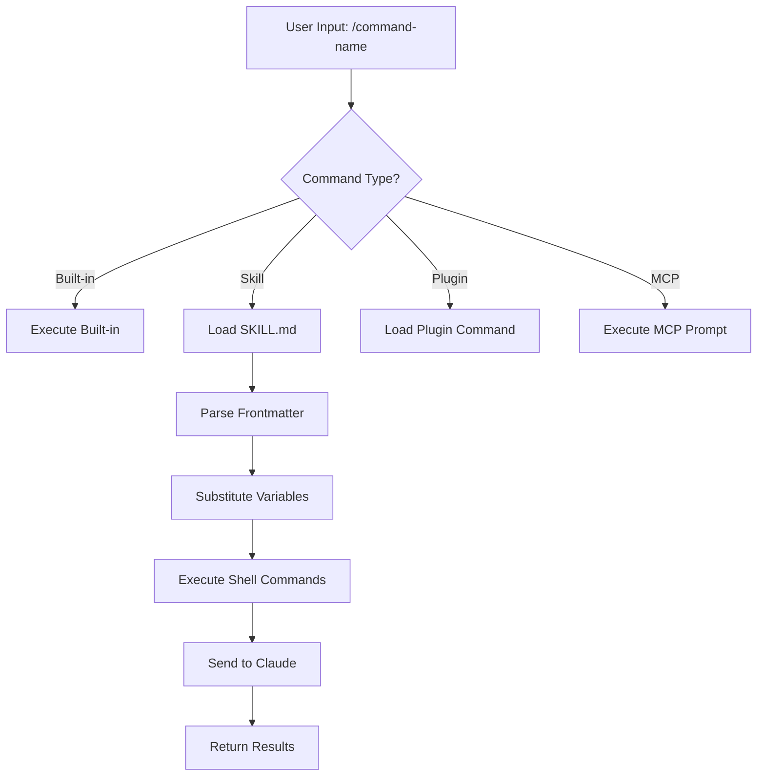
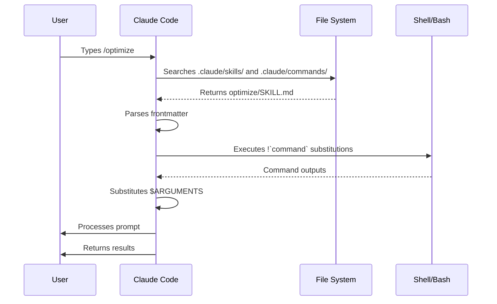

<!-- i18n-source: 01-slash-commands/README.md -->
<!-- i18n-source-sha: 63a1416 -->
<!-- i18n-date: 2026-04-09 -->

<picture>
  <source media="(prefers-color-scheme: dark)" srcset="../../resources/logos/claude-howto-logo-dark.svg">
  
</picture>

# Слеш-команди

## Огляд

Слеш-команди — це ярлики, що керують поведінкою Claude під час інтерактивної сесії. Вони бувають кількох типів:

- **Вбудовані команди**: Надаються Claude Code (`/help`, `/clear`, `/model`)
- **Навички (Skills)**: Користувацькі команди, створені як файли `SKILL.md` (`/optimize`, `/pr`)
- **Команди плагінів**: Команди з встановлених плагінів (`/frontend-design:frontend-design`)
- **MCP-промпти**: Команди з MCP-серверів (`/mcp__github__list_prs`)

> **Примітка**: Кастомні слеш-команди об'єднані з навичками. Файли в `.claude/commands/` все ще працюють, але навички (`.claude/skills/`) — рекомендований підхід. Обидва створюють ярлики `/command-name`. Див. [Посібник з навичок](../03-skills/) для повного довідника.

## Довідник вбудованих команд

Вбудовані команди — це ярлики для типових дій. Доступно **60+ вбудованих команд** та **5 вбудованих навичок**. Введіть `/` у Claude Code для повного списку, або `/` з літерами для фільтрації.

| Команда | Призначення |
|---------|------------|
| `/add-dir <path>` | Додати робочий каталог |
| `/agents` | Управління конфігураціями агентів |
| `/branch [name]` | Розгалужити розмову в нову сесію (аліас: `/fork`). Примітка: `/fork` перейменовано на `/branch` у v2.1.77 |
| `/btw <question>` | Побічне запитання без додавання в історію |
| `/chrome` | Налаштування інтеграції з Chrome |
| `/clear` | Очистити розмову (аліаси: `/reset`, `/new`) |
| `/color [color\|default]` | Встановити колір рядка промпту |
| `/compact [instructions]` | Компактизувати розмову з необов'язковими інструкціями фокусу |
| `/config` | Відкрити налаштування (аліас: `/settings`) |
| `/context` | Візуалізація використання контексту кольоровою сіткою |
| `/copy [N]` | Скопіювати відповідь у буфер; `w` записує у файл |
| `/cost` | Показати статистику використання токенів |
| `/desktop` | Продовжити в десктопному застосунку (аліас: `/app`) |
| `/diff` | Інтерактивний перегляд незакомічених змін |
| `/doctor` | Діагностика стану встановлення |
| `/effort [low\|medium\|high\|max\|auto]` | Встановити рівень зусиль. `max` потребує Opus 4.6 |
| `/exit` | Вийти з REPL (аліас: `/quit`) |
| `/export [filename]` | Експортувати розмову у файл або буфер |
| `/extra-usage` | Налаштування додаткового використання для лімітів |
| `/fast [on\|off]` | Перемкнути швидкий режим |
| `/feedback` | Надіслати відгук (аліас: `/bug`) |
| `/help` | Показати довідку |
| `/hooks` | Переглянути конфігурації хуків |
| `/ide` | Управління IDE-інтеграціями |
| `/init` | Ініціалізувати `CLAUDE.md`. `CLAUDE_CODE_NEW_INIT=1` для інтерактивного потоку |
| `/insights` | Згенерувати звіт аналізу сесії |
| `/install-github-app` | Налаштувати GitHub Actions |
| `/install-slack-app` | Встановити Slack-застосунок |
| `/keybindings` | Відкрити налаштування клавіш |
| `/login` | Змінити обліковий запис Anthropic |
| `/logout` | Вийти з облікового запису Anthropic |
| `/mcp` | Управління MCP-серверами та OAuth |
| `/memory` | Редагувати `CLAUDE.md`, перемкнути автопам'ять |
| `/mobile` | QR-код для мобільного (аліаси: `/ios`, `/android`) |
| `/model [model]` | Вибір моделі зі стрілками вліво/вправо для рівня зусиль |
| `/passes` | Поділитися безкоштовним тижнем Claude Code |
| `/permissions` | Переглянути/оновити дозволи (аліас: `/allowed-tools`) |
| `/plan [description]` | Увійти в режим планування |
| `/plugin` | Управління плагінами |
| `/powerup` | Інтерактивні уроки з анімованими демо |
| `/privacy-settings` | Налаштування приватності (Pro/Max) |
| `/release-notes` | Переглянути журнал змін |
| `/reload-plugins` | Перезавантажити активні плагіни |
| `/remote-control` | Віддалене керування з claude.ai (аліас: `/rc`) |
| `/remote-env` | Налаштування стандартного віддаленого середовища |
| `/rename [name]` | Перейменувати сесію |
| `/resume [session]` | Відновити розмову (аліас: `/continue`) |
| `/review` | **Застаріла** — встановіть плагін `code-review` |
| `/rewind` | Відкат розмови та/або коду (аліас: `/checkpoint`) |
| `/sandbox` | Перемкнути режим пісочниці |
| `/schedule [description]` | Створити/управляти хмарними запланованими завданнями |
| `/security-review` | Аналіз гілки на вразливості безпеки |
| `/skills` | Список доступних навичок |
| `/stats` | Візуалізація щоденного використання, сесій, серій |
| `/stickers` | Замовити стікери Claude Code |
| `/status` | Показати версію, модель, обліковий запис |
| `/statusline` | Налаштування рядка стану |
| `/tasks` | Список/управління фоновими завданнями |
| `/terminal-setup` | Налаштування клавіш терміналу |
| `/theme` | Змінити колірну тему |
| `/ultraplan <prompt>` | Створити план в ultraplan-сесії, переглянути в браузері |
| `/upgrade` | Відкрити сторінку оновлення тарифу |
| `/usage` | Показати ліміти плану та статус обмежень |
| `/voice` | Перемкнути голосовий ввід push-to-talk |

### Вбудовані навички

Ці навички поставляються з Claude Code і викликаються як слеш-команди:

| Навичка | Призначення |
|---------|------------|
| `/batch <instruction>` | Оркестрація масштабних паралельних змін через worktrees |
| `/claude-api` | Завантажити довідник Claude API для мови проекту |
| `/debug [description]` | Увімкнути налагоджувальне логування |
| `/loop [interval] <prompt>` | Запускати промпт повторно за інтервалом |
| `/simplify [focus]` | Перевірити змінені файли на якість коду |

### Застарілі команди

| Команда | Статус |
|---------|--------|
| `/review` | Застаріла — замінена плагіном `code-review` |
| `/output-style` | Застаріла з v2.1.73 |
| `/fork` | Перейменована на `/branch` (аліас працює, v2.1.77) |
| `/pr-comments` | Видалена в v2.1.91 — запитайте Claude напряму |
| `/vim` | Видалена в v2.1.92 — використовуйте /config → Editor mode |

### Останні зміни

- `/fork` перейменовано на `/branch`, `/fork` залишено як аліас (v2.1.77)
- `/output-style` застаріла (v2.1.73)
- `/review` застаріла на користь плагіна `code-review`
- Додано команду `/effort` з рівнем `max` для Opus 4.6
- Додано команду `/voice` для голосового вводу push-to-talk
- Додано команду `/schedule` для запланованих завдань
- Додано команду `/color` для кастомізації рядка промпту
- `/pr-comments` видалена в v2.1.91
- `/vim` видалена в v2.1.92
- Додано `/ultraplan` для перегляду плану в браузері
- Додано `/powerup` для інтерактивних уроків
- Додано `/sandbox` для режиму пісочниці
- Вибір `/model` тепер показує зрозумілі назви (наприклад, "Sonnet 4.6") замість ID моделей
- `/resume` підтримує аліас `/continue`
- MCP-промпти доступні як команди `/mcp__<server>__<prompt>` (див. [MCP-промпти як команди](#mcp-промпти-як-команди))

## Кастомні команди (тепер навички)

Кастомні слеш-команди **об'єднані з навичками**. Обидва підходи створюють команди, які викликаються через `/command-name`:

| Підхід | Розташування | Статус |
|--------|-------------|--------|
| **Навички (Рекомендовано)** | `.claude/skills/<n>/SKILL.md` | Поточний стандарт |
| **Legacy-команди** | `.claude/commands/<n>.md` | Все ще працює |

Якщо навичка і команда мають однакове ім'я, **навичка має пріоритет**. Наприклад, коли існують і `.claude/commands/review.md`, і `.claude/skills/review/SKILL.md`, використовується версія навички.

### Шлях міграції

Існуючі файли `.claude/commands/` продовжують працювати без змін. Для міграції на навички:

**До (Команда):**

```
.claude/commands/optimize.md
```

**Після (Навичка):**

```
.claude/skills/optimize/SKILL.md
```

### Чому навички?

Навички пропонують додаткові можливості порівняно з legacy-командами:

- **Структура каталогів**: Пакування скриптів, шаблонів та довідкових файлів
- **Автовиклик**: Claude може запускати навички автоматично за потреби
- **Контроль виклику**: Вибір — користувач, Claude, або обидва можуть викликати
- **Виконання в субагенті**: Запуск навичок в ізольованих контекстах з `context: fork`
- **Прогресивне розкриття**: Завантаження додаткових файлів лише за потреби

### Створення кастомної команди як навички

Створіть каталог з файлом `SKILL.md`:

```bash
mkdir -p .claude/skills/my-command
```

**Файл:** `.claude/skills/my-command/SKILL.md`

```yaml
---
name: my-command
description: Що робить ця команда і коли її використовувати
---

# My Command

Інструкції для Claude при виклику цієї команди.

1. Перший крок
2. Другий крок
3. Третій крок
```

### Довідник фронтматеру

| Поле | Призначення | За замовчуванням |
|------|------------|-----------------|
| `name` | Ім'я команди (стає `/name`) | Ім'я каталогу |
| `description` | Короткий опис (допомагає Claude знати коли використовувати) | Перший абзац |
| `argument-hint` | Очікувані аргументи для автодоповнення | Немає |
| `allowed-tools` | Інструменти без запиту дозволу | Успадковується |
| `model` | Конкретна модель для використання | Успадковується |
| `disable-model-invocation` | Якщо `true`, тільки користувач може викликати | `false` |
| `user-invocable` | Якщо `false`, сховати з меню `/` | `true` |
| `context` | `fork` для запуску в ізольованому субагенті | Немає |
| `agent` | Тип агента при `context: fork` | `general-purpose` |
| `hooks` | Хуки на рівні навички (PreToolUse, PostToolUse, Stop) | Немає |

### Аргументи

Команди можуть отримувати аргументи:

**Усі аргументи з `$ARGUMENTS`:**

```yaml
---
name: fix-issue
description: Fix a GitHub issue by number
---

Fix issue #$ARGUMENTS following our coding standards
```

Використання: `/fix-issue 123` → `$ARGUMENTS` стає "123"

**Окремі аргументи з `$0`, `$1` тощо:**

```yaml
---
name: review-pr
description: Review a PR with priority
---

Review PR #$0 with priority $1
```

Використання: `/review-pr 456 high` → `$0`="456", `$1`="high"

### Динамічний контекст з shell-командами

Виконуйте bash-команди перед промптом з допомогою `` !`command` ``:

```yaml
---
name: commit
description: Create a git commit with context
allowed-tools: Bash(git *)
---

## Context

- Current git status: !`git status`
- Current git diff: !`git diff HEAD`
- Current branch: !`git branch --show-current`
- Recent commits: !`git log --oneline -5`

## Your task

Based on the above changes, create a single git commit.
```

### Посилання на файли

Включайте вміст файлів з `@`:

```markdown
Review the implementation in @src/utils/helpers.js
Compare @src/old-version.js with @src/new-version.js
```

## Команди плагінів

Плагіни можуть надавати кастомні команди:

```
/plugin-name:command-name
```

Або просто `/command-name`, якщо немає конфліктів імен.

**Приклади:**

```bash
/frontend-design:frontend-design
/commit-commands:commit
```

## MCP-промпти як команди

MCP-сервери можуть надавати промпти як слеш-команди:

```
/mcp__<server-name>__<prompt-name> [arguments]
```

**Приклади:**

```bash
/mcp__github__list_prs
/mcp__github__pr_review 456
/mcp__jira__create_issue "Bug title" high
```

### Синтаксис дозволів MCP

Контроль доступу до MCP-серверів у дозволах:

- `mcp__github` — Доступ до всього GitHub MCP-сервера
- `mcp__github__*` — Wildcard-доступ до всіх інструментів
- `mcp__github__get_issue` — Доступ до конкретного інструменту

## Архітектура команд



## Життєвий цикл команди



## Доступні команди в цьому каталозі

Ці приклади команд можна встановити як навички або legacy-команди.

### 1. `/optimize` — Оптимізація коду

Аналізує код на проблеми продуктивності, витоки пам'яті та можливості оптимізації.

**Використання:**

```
/optimize
[Вставте ваш код]
```

### 2. `/pr` — Підготовка Pull Request

Проводить через чекліст підготовки PR, включаючи лінтинг, тестування та форматування комітів.

**Використання:**

```
/pr
```

**Скріншот:**


### 3. `/generate-api-docs` — Генератор API-документації

Генерує комплексну API-документацію з вихідного коду.

**Використання:**

```
/generate-api-docs
```

### 4. `/commit` — Git-коміт з контекстом

Створює git-коміт з динамічним контекстом вашого репозиторію.

**Використання:**

```
/commit [необов'язкове повідомлення]
```

### 5. `/push-all` — Stage, Commit та Push

Stage всіх змін, створення коміту та push на remote з перевірками безпеки.

**Використання:**

```
/push-all
```

**Перевірки безпеки:**

- Секрети: `.env*`, `*.key`, `*.pem`, `credentials.json`
- API-ключі: Виявлення реальних ключів vs. заповнювачів
- Великі файли: `>10MB` без Git LFS
- Артефакти збірки: `node_modules/`, `dist/`, `__pycache__/`

### 6. `/doc-refactor` — Реструктуризація документації

Реструктуризує документацію проекту для ясності та доступності.

**Використання:**

```
/doc-refactor
```

### 7. `/setup-ci-cd` — Налаштування CI/CD-пайплайну

Впроваджує pre-commit хуки та GitHub Actions для контролю якості.

**Використання:**

```
/setup-ci-cd
```

### 8. `/unit-test-expand` — Розширення покриття тестами

Збільшує покриття тестами, націлюючись на непротестовані гілки та крайові випадки.

**Використання:**

```
/unit-test-expand
```

## Встановлення

### Як навички (Рекомендовано)

Скопіюйте у каталог навичок:

```bash
# Створити каталог навичок
mkdir -p .claude/skills

# Для кожного файлу команди створити каталог навички
for cmd in optimize pr commit; do
  mkdir -p .claude/skills/$cmd
  cp 01-slash-commands/$cmd.md .claude/skills/$cmd/SKILL.md
done
```

### Як legacy-команди

Скопіюйте у каталог команд:

```bash
# На рівні проекту (команда)
mkdir -p .claude/commands
cp 01-slash-commands/*.md .claude/commands/

# Персональне використання
mkdir -p ~/.claude/commands
cp 01-slash-commands/*.md ~/.claude/commands/
```

## Створення власних команд

### Шаблон навички (Рекомендовано)

Створіть `.claude/skills/my-command/SKILL.md`:

```yaml
---
name: my-command
description: What this command does. Use when [trigger conditions].
argument-hint: [optional-args]
allowed-tools: Bash(npm *), Read, Grep
---

# Command Title

## Context

- Current branch: !`git branch --show-current`
- Related files: @package.json

## Instructions

1. First step
2. Second step with argument: $ARGUMENTS
3. Third step

## Output Format

- How to format the response
- What to include
```

### Команда лише для користувача (без автовиклику)

Для команд з побічними ефектами, які Claude не повинен запускати автоматично:

```yaml
---
name: deploy
description: Deploy to production
disable-model-invocation: true
allowed-tools: Bash(npm *), Bash(git *)
---

Deploy the application to production:

1. Run tests
2. Build application
3. Push to deployment target
4. Verify deployment
```

## Найкращі практики

| Робіть | Не робіть |
|--------|-----------|
| Використовуйте чіткі, орієнтовані на дію назви | Не створюйте команди для одноразових завдань |
| Додавайте `description` з умовами тригеру | Не вбудовуйте складну логіку в команди |
| Тримайте команди зосередженими на одному завданні | Не хардкодьте чутливу інформацію |
| Використовуйте `disable-model-invocation` для побічних ефектів | Не пропускайте поле description |
| Використовуйте `!` для динамічного контексту | Не вважайте, що Claude знає поточний стан |
| Організуйте пов'язані файли в каталогах навичок | Не кладіть все в один файл |

## Усунення неполадок

### Команда не знайдена

**Рішення:**

- Перевірте, що файл у `.claude/skills/<n>/SKILL.md` або `.claude/commands/<n>.md`
- Перевірте поле `name` у фронтматері
- Перезапустіть сесію Claude Code
- Запустіть `/help` для перегляду доступних команд

### Команда працює не як очікувалось

**Рішення:**

- Додайте більш конкретні інструкції
- Включіть приклади у файл навички
- Перевірте `allowed-tools` при використанні bash-команд
- Спочатку тестуйте з простими вхідними даними

### Конфлікт навички та команди

Якщо обидві існують з однаковим ім'ям, **навичка має пріоритет**. Видаліть одну або перейменуйте.

## Пов'язані посібники

- **[Навички](../03-skills/)** — Повний довідник навичок (автоматично викликані можливості)
- **[Пам'ять](../02-memory/)** — Постійний контекст з CLAUDE.md
- **[Субагенти](../04-subagents/)** — Делеговані AI-агенти
- **[Плагіни](../07-plugins/)** — Пакетні набори команд
- **[Хуки](../06-hooks/)** — Автоматизація на основі подій

## Додаткові ресурси

- [Офіційна документація інтерактивного режиму](https://code.claude.com/docs/en/interactive-mode) — Довідник вбудованих команд
- [Офіційна документація навичок](https://code.claude.com/docs/en/skills) — Повний довідник навичок
- [Довідник CLI](https://code.claude.com/docs/en/cli-reference) — Опції командного рядка

---

**Останнє оновлення**: 9 квітня 2026
**Версія Claude Code**: 2.1.97
**Сумісні моделі**: Claude Sonnet 4.6, Claude Opus 4.6, Claude Haiku 4.5

*Частина серії посібників [Claude How To](../)*
