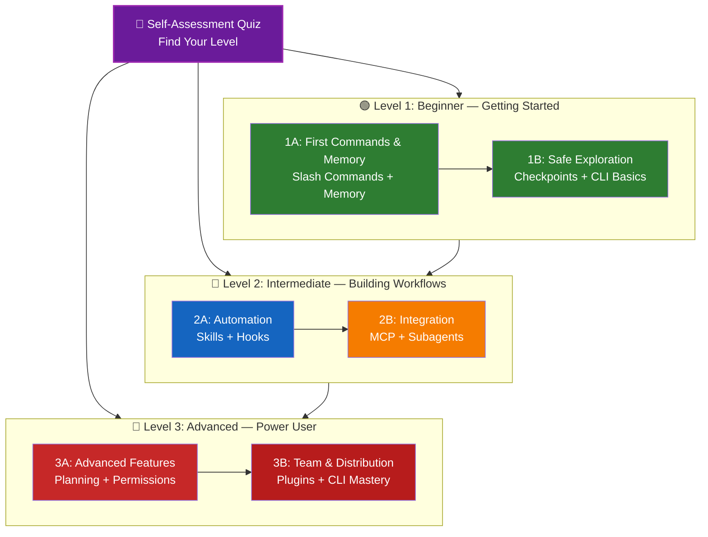

<!-- i18n-source: LEARNING-ROADMAP.md -->
<!-- i18n-source-sha: 63a1416 -->
<!-- i18n-date: 2026-04-09 -->

<picture>
  <source media="(prefers-color-scheme: dark)" srcset="../resources/logos/claude-howto-logo-dark.svg">
  
</picture>

# 📚 Навчальний план Claude Code

**Новачок у Claude Code?** Цей посібник допоможе вам опанувати функції Claude Code у зручному темпі. Незалежно від того, чи ви абсолютний початківець, чи досвідчений розробник, почніть з тесту самооцінки нижче, щоб знайти свій рівень.

---

## 🧭 Визначте свій рівень

Не всі починають з однієї точки. Пройдіть швидку самооцінку, щоб знайти правильну відправну точку.

**Відповідайте чесно:**

- [ ] Я можу запустити Claude Code та вести розмову (`claude`)
- [ ] Я створював або редагував файл CLAUDE.md
- [ ] Я використовував принаймні 3 вбудовані слеш-команди (наприклад, /help, /compact, /model)
- [ ] Я створював кастомну слеш-команду або навичку (SKILL.md)
- [ ] Я налаштовував MCP-сервер (наприклад, GitHub, база даних)
- [ ] Я налаштовував хуки в ~/.claude/settings.json
- [ ] Я створював або використовував кастомних субагентів (.claude/agents/)
- [ ] Я використовував print mode (`claude -p`) для скриптів або CI/CD

**Ваш рівень:**

| Відмічено | Рівень | Почніть з | Час на завершення |
|-----------|--------|-----------|-------------------|
| 0-2 | **Рівень 1: Початківець** — Перші кроки | [Етап 1A](#етап-1a-перші-команди-та-память) | ~3 години |
| 3-5 | **Рівень 2: Середній** — Побудова процесів | [Етап 2A](#етап-2a-автоматизація-навички--хуки) | ~5 годин |
| 6-8 | **Рівень 3: Просунутий** — Досвідчений користувач | [Етап 3A](#етап-3a-розширені-функції) | ~5 годин |

> **Порада**: Якщо не впевнені, почніть на рівень нижче. Краще швидко переглянути знайомий матеріал, ніж пропустити базові концепції.

> **Інтерактивна версія**: Запустіть `/self-assessment` у Claude Code для керованого інтерактивного тесту, який оцінить вашу компетенцію за всіма 10 функціональними напрямками та згенерує персоналізований навчальний план.

---

## 🎯 Філософія навчання

Каталоги в цьому репозиторії пронумеровані у **рекомендованому порядку вивчення** на основі трьох принципів:

1. **Залежності** — Базові концепції йдуть першими
2. **Складність** — Простіші функції перед складними
3. **Частота використання** — Найпоширеніші функції вивчаються раніше

Цей підхід забезпечує міцну основу та негайний приріст продуктивності.

---

## 🗺️ Ваш навчальний шлях



**Легенда кольорів:**

- 💜 Фіолетовий: Тест самооцінки
- 🟢 Зелений: Рівень 1 — Шлях початківця
- 🔵 Синій / 🟡 Золотий: Рівень 2 — Середній шлях
- 🔴 Червоний: Рівень 3 — Просунутий шлях

---

## 📊 Повна таблиця навчального плану

| Крок | Функція | Складність | Час | Рівень | Залежності | Чому вивчати | Ключові переваги |
|------|---------|-----------|-----|--------|------------|-------------|-----------------|
| **1** | [Слеш-команди](../01-slash-commands/) | ⭐ Початківець | 30 хв | Рівень 1 | Немає | Швидкий приріст продуктивності (55+ вбудованих + 5 навичок) | Миттєва автоматизація |
| **2** | [Пам'ять](../02-memory/) | ⭐⭐ Початківець+ | 45 хв | Рівень 1 | Немає | Необхідна для всіх функцій | Постійний контекст |
| **3** | [Контрольні точки](../08-checkpoints/) | ⭐⭐ Середній | 45 хв | Рівень 1 | Управління сесіями | Безпечне дослідження | Експериментування, відновлення |
| **4** | [Основи CLI](../10-cli/) | ⭐⭐ Початківець+ | 30 хв | Рівень 1 | Немає | Базове використання CLI | Інтерактивний та print mode |
| **5** | [Навички](../03-skills/) | ⭐⭐ Середній | 1 год | Рівень 2 | Слеш-команди | Автоматична експертиза | Повторювані можливості |
| **6** | [Хуки](../06-hooks/) | ⭐⭐ Середній | 1 год | Рівень 2 | Інструменти, Команди | Автоматизація процесів (25 подій, 4 типи) | Валідація, контроль якості |
| **7** | [MCP](../05-mcp/) | ⭐⭐⭐ Середній+ | 1 год | Рівень 2 | Конфігурація | Доступ до даних у реальному часі | Інтеграція, API |
| **8** | [Субагенти](../04-subagents/) | ⭐⭐⭐ Середній+ | 1.5 год | Рівень 2 | Пам'ять, Команди | Складні завдання (6 вбудованих) | Делегування, спеціалізація |
| **9** | [Розширені функції](../09-advanced-features/) | ⭐⭐⭐⭐⭐ Просунутий | 2-3 год | Рівень 3 | Усі попередні | Інструменти експерта | Планування, Auto Mode, канали |
| **10** | [Плагіни](../07-plugins/) | ⭐⭐⭐⭐ Просунутий | 2 год | Рівень 3 | Усі попередні | Комплексні рішення | Онбординг команди, дистрибуція |
| **11** | [Майстерність CLI](../10-cli/) | ⭐⭐⭐ Просунутий | 1 год | Рівень 3 | Рекомендовано: Усі | Майстерність командного рядка | Скрипти, CI/CD |

**Загальний час навчання**: ~11-13 годин (або перейдіть на свій рівень і заощадьте час)

---

## 🟢 Рівень 1: Початківець — Перші кроки

**Для**: Користувачів з 0-2 відмітками в тесті
**Час**: ~3 години
**Фокус**: Негайна продуктивність, розуміння основ
**Результат**: Впевнений щоденний користувач, готовий до Рівня 2

### Етап 1A: Перші команди та пам'ять

**Теми**: Слеш-команди + Пам'ять
**Час**: 1-2 години
**Складність**: ⭐ Початківець
**Мета**: Негайний приріст продуктивності з кастомними командами та постійним контекстом

#### Що ви досягнете

✅ Створення кастомних слеш-команд для повторюваних завдань
✅ Налаштування пам'яті проекту для командних стандартів
✅ Конфігурація персональних налаштувань
✅ Розуміння автоматичного завантаження контексту Claude

#### Практичні вправи

```bash
# Вправа 1: Встановіть першу слеш-команду
mkdir -p .claude/commands
cp 01-slash-commands/optimize.md .claude/commands/

# Вправа 2: Створіть пам'ять проекту
cp 02-memory/project-CLAUDE.md ./CLAUDE.md

# Вправа 3: Спробуйте
# У Claude Code введіть: /optimize
```

#### Критерії успіху

- [ ] Успішний виклик команди `/optimize`
- [ ] Claude пам'ятає стандарти проекту з CLAUDE.md
- [ ] Ви розумієте, коли використовувати слеш-команди, а коли пам'ять

#### Наступні кроки

Коли освоїтесь, прочитайте:

- [01-slash-commands/README.md](../01-slash-commands/README.md)
- [02-memory/README.md](../02-memory/README.md)

> **Перевірте розуміння**: Запустіть `/lesson-quiz slash-commands` або `/lesson-quiz memory` у Claude Code.

---

### Етап 1B: Безпечне дослідження

**Теми**: Контрольні точки + Основи CLI
**Час**: 1 година
**Складність**: ⭐⭐ Початківець+
**Мета**: Навчитися безпечно експериментувати та використовувати базові команди CLI

#### Що ви досягнете

✅ Створення та відновлення контрольних точок для безпечних експериментів
✅ Розуміння інтерактивного та print mode
✅ Використання базових прапорців та опцій CLI
✅ Обробка файлів через пайпінг

#### Практичні вправи

```bash
# Вправа 1: Спробуйте процес з контрольними точками
# У Claude Code:
# Зробіть експериментальні зміни, потім натисніть Esc+Esc або /rewind
# Оберіть контрольну точку перед експериментом
# Оберіть "Restore code and conversation" для повернення

# Вправа 2: Інтерактивний та Print mode
claude "explain this project"           # Інтерактивний режим
claude -p "explain this function"       # Print mode (неінтерактивний)

# Вправа 3: Обробка вмісту файлу через пайп
cat error.log | claude -p "explain this error"
```

#### Критерії успіху

- [ ] Створено та відновлено контрольну точку
- [ ] Використано інтерактивний та print mode
- [ ] Передано файл Claude для аналізу через пайп
- [ ] Розуміння використання контрольних точок для безпечних експериментів

#### Наступні кроки

- Прочитайте: [08-checkpoints/README.md](../08-checkpoints/README.md)
- Прочитайте: [10-cli/README.md](../10-cli/README.md)
- **Готові до Рівня 2!** Переходьте до [Етапу 2A](#етап-2a-автоматизація-навички--хуки)

> **Перевірте розуміння**: Запустіть `/lesson-quiz checkpoints` або `/lesson-quiz cli`.

---

## 🔵 Рівень 2: Середній — Побудова процесів

**Для**: Користувачів з 3-5 відмітками в тесті
**Час**: ~5 годин
**Фокус**: Автоматизація, інтеграція, делегування завдань
**Результат**: Автоматизовані процеси, зовнішні інтеграції, готовність до Рівня 3

### Перевірка передумов

Перед початком Рівня 2 переконайтеся, що ви освоїли концепції Рівня 1:

- [ ] Вмієте створювати та використовувати слеш-команди ([01-slash-commands/](../01-slash-commands/))
- [ ] Налаштували пам'ять проекту через CLAUDE.md ([02-memory/](../02-memory/))
- [ ] Знаєте, як створювати та відновлювати контрольні точки ([08-checkpoints/](../08-checkpoints/))
- [ ] Вмієте використовувати `claude` та `claude -p` з командного рядка ([10-cli/](../10-cli/))

> **Прогалини?** Перегляньте відповідні посібники перед продовженням.

---

### Етап 2A: Автоматизація (Навички + Хуки)

**Теми**: Навички + Хуки
**Час**: 2-3 години
**Складність**: ⭐⭐ Середній
**Мета**: Автоматизувати типові процеси та перевірки якості

#### Що ви досягнете

✅ Автовиклик спеціалізованих можливостей з YAML-фронтматером (включно з полями `effort` та `shell`)
✅ Налаштування автоматизації на основі подій через 25 подій хуків
✅ Використання всіх 4 типів хуків (command, http, prompt, agent)
✅ Забезпечення стандартів якості коду
✅ Створення кастомних хуків для ваших процесів

#### Практичні вправи

```bash
# Вправа 1: Встановіть навичку
cp -r 03-skills/code-review ~/.claude/skills/

# Вправа 2: Налаштуйте хуки
mkdir -p ~/.claude/hooks
cp 06-hooks/pre-tool-check.sh ~/.claude/hooks/
chmod +x ~/.claude/hooks/pre-tool-check.sh

# Вправа 3: Налаштуйте хуки в settings
# Додайте в ~/.claude/settings.json:
{
  "hooks": {
    "PreToolUse": [
      {
        "matcher": "Bash",
        "hooks": [
          {
            "type": "command",
            "command": "~/.claude/hooks/pre-tool-check.sh"
          }
        ]
      }
    ]
  }
}
```

#### Критерії успіху

- [ ] Навичка code review автоматично викликається при потребі
- [ ] Хук PreToolUse запускається перед виконанням інструменту
- [ ] Ви розумієте різницю між автовикликом навичок та тригерами подій хуків

#### Наступні кроки

- Створіть власну кастомну навичку
- Налаштуйте додаткові хуки для вашого процесу
- Прочитайте: [03-skills/README.md](../03-skills/README.md)
- Прочитайте: [06-hooks/README.md](../06-hooks/README.md)

> **Перевірте розуміння**: Запустіть `/lesson-quiz skills` або `/lesson-quiz hooks`.

---

### Етап 2B: Інтеграція (MCP + Субагенти)

**Теми**: MCP + Субагенти
**Час**: 2-3 години
**Складність**: ⭐⭐⭐ Середній+
**Мета**: Інтегрувати зовнішні сервіси та делегувати складні завдання

#### Що ви досягнете

✅ Доступ до даних з GitHub, баз даних тощо в реальному часі
✅ Делегування роботи спеціалізованим AI-агентам
✅ Розуміння, коли використовувати MCP, а коли субагентів
✅ Побудова інтегрованих процесів

#### Практичні вправи

```bash
# Вправа 1: Налаштуйте GitHub MCP
export GITHUB_TOKEN="your_github_token"
claude mcp add github -- npx -y @modelcontextprotocol/server-github

# Вправа 2: Перевірте MCP-інтеграцію
# У Claude Code: /mcp__github__list_prs

# Вправа 3: Встановіть субагентів
mkdir -p .claude/agents
cp 04-subagents/*.md .claude/agents/
```

#### Вправа з інтеграції

Спробуйте повний процес:

1. Використайте MCP для отримання GitHub PR
2. Дозвольте Claude делегувати ревʼю субагенту code-reviewer
3. Використайте хуки для автоматичного запуску тестів

#### Критерії успіху

- [ ] Успішний запит даних GitHub через MCP
- [ ] Claude делегує складні завдання субагентам
- [ ] Ви розумієте різницю між MCP та субагентами
- [ ] Комбінація MCP + субагенти + хуки у процесі

#### Наступні кроки

- Налаштуйте додаткові MCP-сервери (база даних, Slack тощо)
- Створіть кастомних субагентів для вашої предметної області
- Прочитайте: [05-mcp/README.md](../05-mcp/README.md)
- Прочитайте: [04-subagents/README.md](../04-subagents/README.md)
- **Готові до Рівня 3!** Переходьте до [Етапу 3A](#етап-3a-розширені-функції)

> **Перевірте розуміння**: Запустіть `/lesson-quiz mcp` або `/lesson-quiz subagents`.

---

## 🔴 Рівень 3: Просунутий — Досвідчений користувач та тімлід

**Для**: Користувачів з 6-8 відмітками в тесті
**Час**: ~5 годин
**Фокус**: Командні інструменти, CI/CD, enterprise-функції, розробка плагінів
**Результат**: Досвідчений користувач, здатний налаштувати командні процеси та CI/CD

### Перевірка передумов

Перед початком Рівня 3 переконайтеся, що ви освоїли концепції Рівня 2:

- [ ] Вмієте створювати та використовувати навички з автовикликом ([03-skills/](../03-skills/))
- [ ] Налаштували хуки для автоматизації на основі подій ([06-hooks/](../06-hooks/))
- [ ] Вмієте конфігурувати MCP-сервери для зовнішніх даних ([05-mcp/](../05-mcp/))
- [ ] Знаєте, як використовувати субагентів для делегування ([04-subagents/](../04-subagents/))

> **Прогалини?** Перегляньте відповідні посібники перед продовженням.

---

### Етап 3A: Розширені функції

**Теми**: Розширені функції (Планування, Дозволи, Розширене мислення, Auto Mode, Канали, Голосовий ввід, Віддалене/Десктоп/Веб)
**Час**: 2-3 години
**Складність**: ⭐⭐⭐⭐⭐ Просунутий
**Мета**: Опанувати розширені процеси та інструменти експерта

#### Що ви досягнете

✅ Режим планування для складних функцій
✅ Точний контроль дозволів з 6 режимами (default, acceptEdits, plan, auto, dontAsk, bypassPermissions)
✅ Розширене мислення через Alt+T / Option+T
✅ Управління фоновими завданнями
✅ Автопам'ять для вивчених налаштувань
✅ Auto Mode з фоновим класифікатором безпеки
✅ Канали для структурованих багатосесійних процесів
✅ Голосовий ввід для роботи без клавіатури
✅ Віддалене керування, десктопний застосунок та веб-сесії
✅ Команди агентів для багатоагентної співпраці

#### Практичні вправи

```bash
# Вправа 1: Режим планування
/plan Implement user authentication system

# Вправа 2: Режими дозволів (6 доступних: default, acceptEdits, plan, auto, dontAsk, bypassPermissions)
claude --permission-mode plan "analyze this codebase"
claude --permission-mode acceptEdits "refactor the auth module"
claude --permission-mode auto "implement the feature"

# Вправа 3: Розширене мислення
# Натисніть Alt+T (Option+T на macOS) під час сесії для перемикання

# Вправа 4: Розширений процес з контрольними точками
# 1. Створіть контрольну точку "Clean state"
# 2. Використайте режим планування для проєктування функції
# 3. Реалізуйте з делегуванням субагенту
# 4. Запустіть тести у фоні
# 5. Якщо тести не пройшли — відкат до контрольної точки
# 6. Спробуйте альтернативний підхід

# Вправа 5: Auto mode (фоновий класифікатор безпеки)
claude --permission-mode auto "implement user settings page"

# Вправа 6: Команди агентів
export CLAUDE_AGENT_TEAMS=1
# Попросіть Claude: "Implement feature X using a team approach"

# Вправа 7: Заплановані завдання
/loop 5m /check-status
# Або CronCreate для постійних запланованих завдань

# Вправа 8: Канали для багатосесійних процесів
# Використовуйте канали для організації роботи між сесіями

# Вправа 9: Голосовий ввід
# Використовуйте голосовий ввід для роботи без клавіатури з Claude Code
```

#### Критерії успіху

- [ ] Використано режим планування для складної функції
- [ ] Налаштовано режими дозволів (plan, acceptEdits, auto, dontAsk)
- [ ] Увімкнено розширене мислення з Alt+T / Option+T
- [ ] Використано auto mode з класифікатором безпеки
- [ ] Використано фонові завдання для тривалих операцій
- [ ] Досліджено канали для багатосесійних процесів
- [ ] Спробовано голосовий ввід
- [ ] Розуміння віддаленого керування, десктопного застосунку та веб-сесій
- [ ] Увімкнено та використано команди агентів для спільних завдань
- [ ] Використано `/loop` для повторюваних завдань або моніторингу

#### Наступні кроки

- Прочитайте: [09-advanced-features/README.md](../09-advanced-features/README.md)

> **Перевірте розуміння**: Запустіть `/lesson-quiz advanced`.

---

### Етап 3B: Команда та дистрибуція (Плагіни + Майстерність CLI)

**Теми**: Плагіни + Майстерність CLI + CI/CD
**Час**: 2-3 години
**Складність**: ⭐⭐⭐⭐ Просунутий
**Мета**: Створення командних інструментів, плагінів, майстерність CI/CD-інтеграції

#### Що ви досягнете

✅ Встановлення та створення повних плагінів
✅ Майстерність CLI для скриптів та автоматизації
✅ Налаштування CI/CD-інтеграції з `claude -p`
✅ JSON-вивід для автоматизованих пайплайнів
✅ Управління сесіями та пакетна обробка

#### Практичні вправи

```bash
# Вправа 1: Встановіть повний плагін
# У Claude Code: /plugin install pr-review

# Вправа 2: Print mode для CI/CD
claude -p "Run all tests and generate report"

# Вправа 3: JSON-вивід для скриптів
claude -p --output-format json "list all functions"

# Вправа 4: Управління сесіями та відновлення
claude -r "feature-auth" "continue implementation"

# Вправа 5: CI/CD-інтеграція з обмеженнями
claude -p --max-turns 3 --output-format json "review code"

# Вправа 6: Пакетна обробка
for file in *.md; do
  claude -p --output-format json "summarize this: $(cat $file)" > ${file%.md}.summary.json
done
```

#### Вправа з CI/CD-інтеграції

Створіть простий CI/CD-скрипт:

1. Використайте `claude -p` для ревʼю змінених файлів
2. Виведіть результати як JSON
3. Обробіть з `jq` для конкретних проблем
4. Інтегруйте в GitHub Actions workflow

#### Критерії успіху

- [ ] Встановлено та використано плагін
- [ ] Створено або модифіковано плагін для команди
- [ ] Використано print mode (`claude -p`) в CI/CD
- [ ] Згенеровано JSON-вивід для скриптів
- [ ] Відновлено попередню сесію
- [ ] Створено скрипт пакетної обробки
- [ ] Інтегровано Claude в CI/CD-процес

#### Реальні сценарії для CLI

- **Автоматизація ревʼю коду**: Запуск ревʼю в CI/CD-пайплайнах
- **Аналіз логів**: Аналіз журналів помилок та системних виводів
- **Генерація документації**: Пакетна генерація документації
- **Інсайти тестування**: Аналіз невдалих тестів
- **Аналіз продуктивності**: Перегляд метрик продуктивності
- **Обробка даних**: Трансформація та аналіз файлів даних

#### Наступні кроки

- Прочитайте: [07-plugins/README.md](../07-plugins/README.md)
- Прочитайте: [10-cli/README.md](../10-cli/README.md)
- Створіть командні CLI-ярлики та плагіни
- Налаштуйте скрипти пакетної обробки

> **Перевірте розуміння**: Запустіть `/lesson-quiz plugins` або `/lesson-quiz cli`.

---

## 🧪 Перевірте свої знання

Цей репозиторій включає дві інтерактивні навички для оцінки розуміння:

| Навичка | Команда | Призначення |
|---------|---------|-------------|
| **Самооцінка** | `/self-assessment` | Оцінка загальної компетенції за всіма 10 функціями. Оберіть швидкий (2 хв) або глибокий (5 хв) режим для персоналізованого профілю. |
| **Тест уроку** | `/lesson-quiz [урок]` | Перевірка розуміння конкретного уроку з 10 питаннями. Використовуйте перед уроком (пре-тест), під час (перевірка) або після (верифікація). |

**Приклади:**

```
/self-assessment                  # Визначити загальний рівень
/lesson-quiz hooks                # Тест з Уроку 06: Хуки
/lesson-quiz 03                   # Тест з Уроку 03: Навички
/lesson-quiz advanced-features    # Тест з Уроку 09
```

---

## ⚡ Швидкі шляхи

### Якщо у вас лише 15 хвилин

**Мета**: Отримати перший результат

1. Скопіюйте одну слеш-команду: `cp 01-slash-commands/optimize.md .claude/commands/`
2. Спробуйте в Claude Code: `/optimize`
3. Прочитайте: [01-slash-commands/README.md](../01-slash-commands/README.md)

**Результат**: Робоча слеш-команда та розуміння основ

---

### Якщо у вас 1 година

**Мета**: Налаштувати основні інструменти продуктивності

1. **Слеш-команди** (15 хв): Скопіюйте та протестуйте `/optimize` та `/pr`
2. **Пам'ять проекту** (15 хв): Створіть CLAUDE.md зі стандартами проекту
3. **Навичка** (15 хв): Встановіть навичку code-review
4. **Спробуйте разом** (15 хв): Подивіться, як вони працюють у зв'язці

**Результат**: Базовий приріст продуктивності з командами, пам'яттю та автонавичками

---

### Якщо у вас є вихідні

**Мета**: Стати компетентним у більшості функцій

**Субота вранці** (3 години):

- Завершити Етап 1A: Слеш-команди + Пам'ять
- Завершити Етап 1B: Контрольні точки + Основи CLI

**Субота вдень** (3 години):

- Завершити Етап 2A: Навички + Хуки
- Завершити Етап 2B: MCP + Субагенти

**Неділя** (4 години):

- Завершити Етап 3A: Розширені функції
- Завершити Етап 3B: Плагіни + Майстерність CLI + CI/CD
- Створити кастомний плагін для команди

**Результат**: Ви станете досвідченим користувачем Claude Code, готовим навчати інших та автоматизувати складні процеси

---

## 💡 Поради з навчання

### ✅ Робіть

- **Пройдіть тест спочатку**, щоб знайти відправну точку
- **Виконуйте практичні вправи** для кожного етапу
- **Починайте просто** та додавайте складність поступово
- **Тестуйте кожну функцію** перед переходом до наступної
- **Робіть нотатки** про те, що працює для вашого процесу
- **Повертайтесь** до попередніх концепцій при вивченні просунутих тем
- **Експериментуйте безпечно** з контрольними точками
- **Діліться знаннями** з командою

### ❌ Не робіть

- **Не пропускайте перевірку передумов** при переході на вищий рівень
- **Не намагайтесь вивчити все одразу** — це перевантажує
- **Не копіюйте конфігурації без розуміння** — не зможете налагодити
- **Не забувайте тестувати** — завжди перевіряйте роботу
- **Не поспішайте з етапами** — приділіть час для розуміння
- **Не ігноруйте документацію** — кожен README містить цінні деталі
- **Не працюйте ізольовано** — обговорюйте з колегами

---

## 🎓 Стилі навчання

### Візуальні учні

- Вивчайте діаграми mermaid у кожному README
- Спостерігайте за потоком виконання команд
- Малюйте власні діаграми процесів
- Використовуйте візуальний навчальний шлях вище

### Практики

- Виконуйте кожну практичну вправу
- Експериментуйте з варіаціями
- Ламайте та лагодьте (використовуйте контрольні точки!)
- Створюйте власні приклади

### Читачі

- Уважно читайте кожен README
- Вивчайте приклади коду
- Переглядайте порівняльні таблиці
- Читайте блог-пости з ресурсів

### Соціальні учні

- Організуйте сесії парного програмування
- Навчайте концепцій колег
- Долучайтесь до обговорень спільноти Claude Code
- Діліться кастомними конфігураціями

---

## 📈 Відстеження прогресу

Використовуйте ці чеклісти для відстеження прогресу за рівнями. Запустіть `/self-assessment` у будь-який час для оновленого профілю, або `/lesson-quiz [урок]` після кожного посібника для перевірки розуміння.

### 🟢 Рівень 1: Початківець

- [ ] Завершено [01-slash-commands](../01-slash-commands/)
- [ ] Завершено [02-memory](../02-memory/)
- [ ] Створено першу кастомну слеш-команду
- [ ] Налаштовано пам'ять проекту
- [ ] **Етап 1A досягнуто**
- [ ] Завершено [08-checkpoints](../08-checkpoints/)
- [ ] Завершено основи [10-cli](../10-cli/)
- [ ] Створено та відновлено контрольну точку
- [ ] Використано інтерактивний та print mode
- [ ] **Етап 1B досягнуто**

### 🔵 Рівень 2: Середній

- [ ] Завершено [03-skills](../03-skills/)
- [ ] Завершено [06-hooks](../06-hooks/)
- [ ] Встановлено першу навичку
- [ ] Налаштовано хук PreToolUse
- [ ] **Етап 2A досягнуто**
- [ ] Завершено [05-mcp](../05-mcp/)
- [ ] Завершено [04-subagents](../04-subagents/)
- [ ] Підключено GitHub MCP
- [ ] Створено кастомного субагента
- [ ] Комбіновано інтеграції у процесі
- [ ] **Етап 2B досягнуто**

### 🔴 Рівень 3: Просунутий

- [ ] Завершено [09-advanced-features](../09-advanced-features/)
- [ ] Використано режим планування
- [ ] Налаштовано режими дозволів (6 режимів включно з auto)
- [ ] Використано auto mode з класифікатором безпеки
- [ ] Увімкнено розширене мислення
- [ ] Досліджено канали та голосовий ввід
- [ ] **Етап 3A досягнуто**
- [ ] Завершено [07-plugins](../07-plugins/)
- [ ] Завершено розширене використання [10-cli](../10-cli/)
- [ ] Налаштовано print mode (`claude -p`) CI/CD
- [ ] Створено JSON-вивід для автоматизації
- [ ] Інтегровано Claude в CI/CD-пайплайн
- [ ] Створено командний плагін
- [ ] **Етап 3B досягнуто**

---

## 🆘 Типові труднощі навчання

### Труднощі 1: "Забагато концепцій одразу"

**Рішення**: Зосередьтесь на одному етапі за раз. Завершіть усі вправи перед переходом далі.

### Труднощі 2: "Не знаю, яку функцію використати"

**Рішення**: Зверніться до [Матриці сценаріїв](../README.md#use-case-matrix) у головному README.

### Труднощі 3: "Конфігурація не працює"

**Рішення**: Перевірте розділ [Усунення неполадок](../README.md#troubleshooting) та перевірте розташування файлів.

### Труднощі 4: "Концепції здаються схожими"

**Рішення**: Перегляньте таблицю [Порівняння функцій](../README.md#feature-comparison) для розуміння відмінностей.

### Труднощі 5: "Важко все запам'ятати"

**Рішення**: Створіть власну шпаргалку. Використовуйте контрольні точки для безпечних експериментів.

### Труднощі 6: "Я досвідчений, але не знаю з чого почати"

**Рішення**: Пройдіть [Тест самооцінки](#-визначте-свій-рівень) вище. Перейдіть на свій рівень та використовуйте перевірку передумов для виявлення прогалин.

---

## 🎯 Що далі після завершення?

Після завершення всіх етапів:

1. **Створіть командну документацію** — задокументуйте налаштування Claude Code вашої команди
2. **Створіть кастомні плагіни** — запакуйте процеси команди
3. **Дослідіть віддалене керування** — керуйте сесіями програмно
4. **Спробуйте веб-сесії** — використовуйте Claude Code через браузер
5. **Використовуйте десктопний застосунок** — нативний десктопний доступ
6. **Використовуйте Auto Mode** — автономна робота з класифікатором безпеки
7. **Використовуйте автопам'ять** — Claude автоматично вивчає ваші налаштування
8. **Налаштуйте команди агентів** — координуйте кількох агентів для складних завдань
9. **Використовуйте канали** — організуйте роботу між сесіями
10. **Спробуйте голосовий ввід** — робота без клавіатури
11. **Використовуйте заплановані завдання** — автоматизуйте з `/loop` та cron
12. **Додавайте приклади** — діліться зі спільнотою
13. **Менторіть інших** — допомагайте колегам навчатися
14. **Оптимізуйте процеси** — постійно покращуйте на основі досвіду
15. **Слідкуйте за оновленнями** — відстежуйте релізи та нові функції

---

## 📚 Додаткові ресурси

### Офіційна документація

- [Документація Claude Code](https://code.claude.com/docs/en/overview)
- [Документація Anthropic](https://docs.anthropic.com)
- [Специфікація MCP](https://modelcontextprotocol.io)

### Блог-пости

- [Discovering Claude Code Slash Commands](https://medium.com/@luongnv89/discovering-claude-code-slash-commands-cdc17f0dfb29)

### Спільнота

- [Anthropic Cookbook](https://github.com/anthropics/anthropic-cookbook)
- [Репозиторій MCP-серверів](https://github.com/modelcontextprotocol/servers)

---

## 💬 Зворотний зв'язок та підтримка

- **Знайшли проблему?** Створіть issue в репозиторії
- **Маєте пропозицію?** Надішліть pull request
- **Потрібна допомога?** Перевірте документацію або запитайте спільноту

---

**Останнє оновлення**: 9 квітня 2026
**Версія Claude Code**: 2.1.97
**Підтримується**: Контриб'ютори Claude How-To
**Ліцензія**: Освітні цілі, вільне використання та адаптація

---

[← Повернутися до головного README](README.md)
