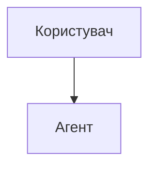
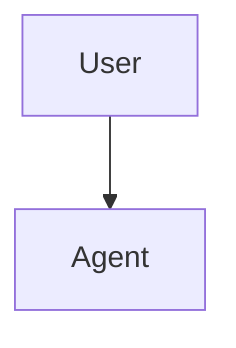

# Глосарій та Стайлгайд перекладу

# Translation Glossary & Style Guide

> **Важливо:** Цей документ визначає правила перекладу документації Claude Code українською мовою. Прочитайте перед початком роботи.

## Технічна термінологія

Таблиця термінів для єдності перекладу у всіх файлах:

| English | Українська | Примітка |
|---------|-----------|----------|
| slash command | слеш-команда | "Слеш" зберігаємо — це назва фічі |
| hook | хук | Усталений термін в UA IT-спільноті |
| skill | навичка | Назва фічі Claude Code, перекладаємо |
| subagent | субагент | Або "підагент" — обидва прийнятні |
| agent | агент | Перекладаємо |
| memory | пам'ять | Перекладаємо |
| checkpoint | контрольна точка | Перекладаємо для ясності |
| plugin | плагін | Усталений термін |
| pull request / PR | pull request / PR | Зберігаємо (GitHub-термін) |
| commit | коміт | Усталена транслітерація |
| branch | гілка | Перекладаємо |
| merge | мердж | Або "злиття" — залежить від контексту |
| MCP (Model Context Protocol) | MCP | Зберігаємо (назва протоколу) |
| CLAUDE.md | CLAUDE.md | Зберігаємо (ім'я файлу) |
| prompt | промпт | Усталена транслітерація |
| workflow | воркфлов | Або "робочий процес" |
| repository | репозиторій | Скорочено "репо" |
| issue | issue | Зберігаємо (GitHub-термін) |
| release | реліз | Усталена транслітерація |
| API | API | Зберігаємо |
| CLI | CLI | Зберігаємо (Command-Line Interface) |
| CI/CD | CI/CD | Зберігаємо |
| pre-commit hook | pre-commit хук | Зберігаємо "pre-commit" як назву інструмента |
| environment variable | змінна оточення | Перекладаємо |
| dependencies | залежності | Перекладаємо |
| template | шаблон | Перекладаємо |
| worktree | робоче дерево | Git-термін, перекладаємо |
| frontmatter | фронтматер | YAML-блок на початку файлу |
| token | токен | Усталена транслітерація |
| context window | контекстне вікно | Перекладаємо |
| fork | форк | Усталена транслітерація |
| clone | клонувати | Перекладаємо дієслово |
| sandbox | пісочниця | Перекладаємо |
| boilerplate | шаблонний код | Перекладаємо |
| debugging | налагодження | Перекладаємо |
| linting | лінтинг | Транслітерація |
| refactoring | рефакторинг | Усталена транслітерація |

## Правила перекладу

### 1. Код та команди

**ЗОЛОТЕ ПРАВИЛО:** Зберігаємо 100% виконуваного коду. Перекладаємо лише коментарі та пояснення.

**Правильно (✅):**

````markdown
Щоб запустити цю команду:

```bash
/optimize
```

Ця команда проаналізує ваш код.
````

**Неправильно (❌):**

````markdown
Щоб запустити цю команду:

```bash
/оптимізувати  # НІКОЛИ не перекладайте команди
```
````

### 2. Коментарі в коді

Перекладаємо коментарі українською:

```python
# ✅ ПРАВИЛЬНО — коментар перекладено
# Ця слеш-команда оптимізує ваш код
def optimize_code():
    pass

# ❌ НЕПРАВИЛЬНО — не перекладайте назви функцій
def оптимізувати_код():  # НЕ перекладаємо імена функцій
    pass
```

### 3. Назви функцій, змінних та класів

Зберігаємо англійською:

```python
# ✅ ПРАВИЛЬНО
def create_subagent(name: str, system_prompt: str):
    pass

# ❌ НЕПРАВИЛЬНО
def створити_субагент(імя: str, системний_промпт: str):
    pass
```

### 4. Діаграми Mermaid

**Зберігаємо 100% без змін.** Не перекладаємо жодного тексту в блоках mermaid.

````markdown
<!-- ❌ НЕПРАВИЛЬНО -->


<!-- ✅ ПРАВИЛЬНО -->

````

**Важливо:** Коментарі в Mermaid використовують `%%`, а не `#`. Символ `#` спричиняє помилку парсера.

````markdown
<!-- ✅ ПРАВИЛЬНО -->


<!-- ❌ НЕПРАВИЛЬНО -->
```text
graph TD
    # Це зламає парсер!
    A[User] --> B[Agent]
```
````

### 5. Шляхи до файлів та URL

Зберігаємо без змін:

```markdown
<!-- ✅ ПРАВИЛЬНО -->
Див. файл `.claude/settings.json` для конфігурації.

<!-- ❌ НЕПРАВИЛЬНО -->
Див. файл `.claude/налаштування.json` для конфігурації.
```

### 6. Таблиці

Зберігаємо структуру та кількість стовпців/рядків. Перекладаємо текстовий вміст, залишаємо технічні значення:

```markdown
| Команда | Опис | Приклад |
|---------|------|---------|
| `/help` | Показати довідку | `/help memory` |
| `/clear` | Очистити сесію | `/clear` |
```

### 7. Посилання між файлами

Використовуємо відносні шляхи всередині `uk/`:

```markdown
<!-- Між модулями -->
[Пам'ять](../02-memory/)

<!-- На англійський оригінал -->
[English version](../../README.md)

<!-- Код-файли — посилаємо на оригінал, НЕ копіюємо -->
[`format-code.sh`](../../06-hooks/format-code.sh)
```

### 8. Фронтматер для трекінгу версії

Кожен перекладений файл починається з HTML-коментарів для відстеження версії оригіналу:

```markdown
<!-- i18n-source: 01-slash-commands/README.md -->
<!-- i18n-source-sha: a1b2c3d4 -->
<!-- i18n-date: 2026-04-09 -->

# Заголовок перекладеного файлу
```

SHA — це коротка хеш-сума коміту англійського файлу, з якого робився переклад. Отримати: `git log --oneline -1 -- <шлях-до-англійського-файлу>`.

### 9. Стиль тексту

- Звертання до читача: **"ви"** (не "ти", не "Ви")
- Уникайте канцеляризмів: "запустіть" замість "здійсніть запуск"
- Технічні абревіатури при першому згадуванні: розшифровка + абревіатура в дужках, далі — лише абревіатура
- Числівники: до 10 — словами, від 11 — цифрами

## DO / DON'T

### ✅ DO: Перекладайте описовий текст

```markdown
Слеш-команди — це ярлики, які керують поведінкою Claude під час інтерактивної сесії.
```

### ✅ DO: Перекладайте коментарі в коді

```python
# ✅ ПРАВИЛЬНО
# Ця функція створює нового субагента
def create_subagent():
    pass
```

### ❌ DON'T: Не перекладайте назви функцій

```python
# ❌ НЕПРАВИЛЬНО
def створити_субагент():
    pass

# ✅ ПРАВИЛЬНО
def create_subagent():
    pass
```

### ❌ DON'T: Не перекладайте діаграми Mermaid

````markdown
<!-- ❌ НЕПРАВИЛЬНО -->


<!-- ✅ ПРАВИЛЬНО -->

````

### ❌ DON'T: Не довіряйте машинному перекладу без перевірки

Машинний переклад (Google Translate, DeepL) часто:

- Неправильно перекладає технічні терміни
- Не розуміє контекст коду
- Спотворює значення команд
- Ламає Markdown-форматування

**Завжди перевіряйте та редагуйте після машинного перекладу!**

## Чекліст перед комітом

- [ ] Технічна точність збережена
- [ ] Текст звучить природно українською
- [ ] Термінологія відповідає глосарію
- [ ] Код залишено без змін (100%)
- [ ] Діаграми Mermaid не змінені
- [ ] Внутрішні посилання працюють
- [ ] Зовнішні посилання збережені
- [ ] Markdown-форматування коректне
- [ ] Коментарі в коді перекладені
- [ ] Назви функцій/змінних/класів — англійською
- [ ] Шляхи до файлів та URL без змін
- [ ] Фронтматер `i18n-source-sha` додано
- [ ] Pre-commit перевірки пройдені

## Допомога

Якщо виникли питання під час перекладу:

1. Перевірте цей глосарій
2. Подивіться як перекладені аналогічні файли в інших модулях
3. Створіть GitHub issue для обговорення

---

**Останнє оновлення:** 2026-04-09
**Мова:** Українська (uk-UA)
