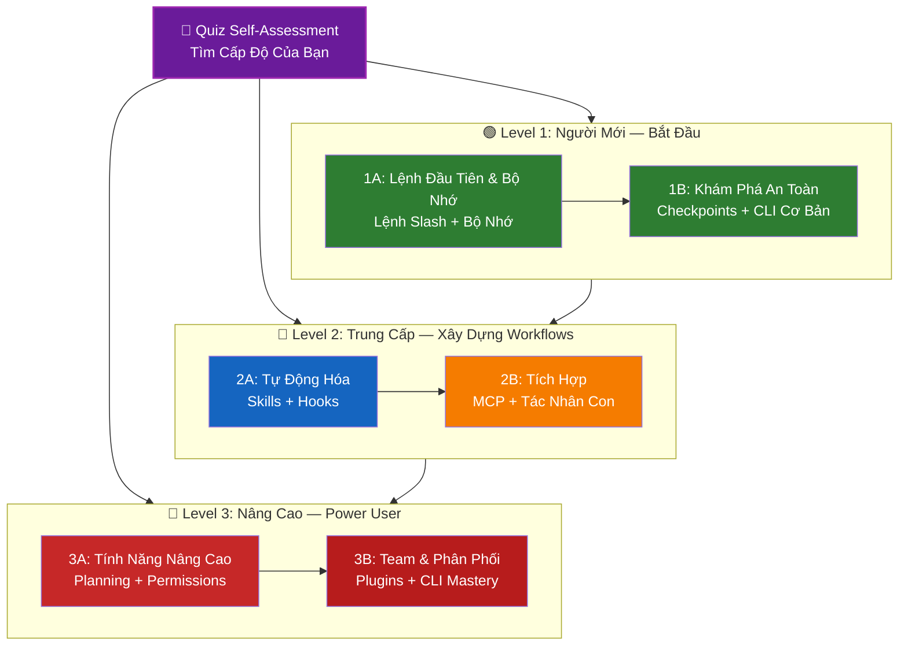

# 📚 Lộ Trình Học Tập Claude Code

**Mới sử dụng Claude Code?** Hướng dẫn này giúp bạn làm chủ các tính năng Claude Code theo tốc độ riêng của bạn. Dù bạn là người mới hoàn toàn hay nhà phát triển có kinh nghiệm, hãy bắt đầu với quiz self-assessment bên dưới để tìm đường đi phù hợp.

---

## 🧭 Tìm Cấp Độ Của Bạn

Không phải ai cũng bắt đầu từ cùng một điểm. Làm quiz self-assessment nhanh này để tìm điểm khởi đầu phù hợp.

**Trả lời những câu hỏi này một cách trung thực:**

- [ ] Tôi có thể bắt đầu Claude Code và có một conversation (`claude`)
- [ ] Tôi đã tạo hoặc chỉnh sửa một file CLAUDE.md
- [ ] Tôi đã sử dụng ít nhất 3 built-in slash commands (ví dụ: /help, /compact, /model)
- [ ] Tôi đã tạo một custom slash command hoặc skill (SKILL.md)
- [ ] Tôi đã cấu hình một MCP server (ví dụ: GitHub, database)
- [ ] Tôi đã thiết lập hooks trong ~/.claude/settings.json
- [ ] Tôi đã tạo hoặc sử dụng custom subagents (.claude/agents/)
- [ ] Tôi đã sử dụng print mode (`claude -p`) để scripting hoặc CI/CD

**Cấp Độ Của Bạn:**

| Checks | Cấp Độ | Bắt Đầu Từ | Thời Gian Hoàn Thành |
|--------|-------|-------------|------------------|
| 0-2 | **Level 1: Người Mới** — Bắt Đầu | [Milestone 1A](#milestone-1a-lệnh-đầu-tiên--bộ-nhớ) | ~3 giờ |
| 3-5 | **Level 2: Trung Cấp** — Xây Dựng Workflows | [Milestone 2A](#milestone-2a-tự-động-hóa-skills--hooks) | ~5 giờ |
| 6-8 | **Level 3: Nâng Cao** — Power User & Team Lead | [Milestone 3A](#milestone-3a-tính-năng-nâng-cao) | ~5 giờ |

> **Mẹo**: Nếu bạn không chắc, hãy bắt đầu một level thấp hơn. Tốt hơn là xem lại tài liệu quen thuộc nhanh hơn là bỏ lỡ các khái niệm nền tảng.

> **Phiên bản tương tác**: Chạy `/self-assessment` trong Claude Code để có quiz hướng dẫn, tương tác chấm điểm proficiency của bạn qua tất cả 10 lĩnh vực tính năng và tạo learning path được cá nhân hóa.

---

## 🎯 Triết Lý Học Tập

Các thư mục trong repository này được đánh số theo **thứ tự học được khuyến nghị** dựa trên ba nguyên tắc chính:

1. **Dependencies** - Các khái niệm nền tảng đến trước
2. **Complexity** - Tính năng dễ hơn trước tính năng nâng cao
3. **Frequency of Use** - Tính năng phổ biến nhất được dạy sớm

Cách tiếp cận này đảm bảo bạn xây dựng nền tảng vững chắc trong khi có lợi ích năng suất ngay lập tức.

---

## 🗺️ Lộ Trình Học Của Bạn



**Chú Thích Màu:**
- 💜 Tím: Quiz Self-Assessment
- 🟢 Xanh lá: Level 1 — Đường người mới
- 🔵 Xanh / 🟡 Vàng: Level 2 — Đường trung cấp
- 🔴 Đỏ: Level 3 — Đường nâng cao

---

## 📊 Bảng Lộ Trình Hoàn Chỉnh

| Bước | Tính Năng | Độ Phức Tạp | Thời Gian | Cấp Độ | Dependencies | Tại Sao Học Cái Này | Lợi Ích Chính |
|------|---------|-----------|----------|-------|--------------|------------------|--------------|
| **1** | [Lệnh Slash](../01-slash-commands/) | ⭐ Người mới | 30 phút | Level 1 | None | Gains năng suất nhanh (55+ built-in + 5 bundled skills) | Tự động hóa tức thì, tiêu chuẩn team |
| **2** | [Bộ Nhớ](../02-memory/) | ⭐⭐ Người mới+ | 45 phút | Level 1 | None | Thiết yếu cho tất cả tính năng | Ngữ cảnh lưu trữ, sở thích |
| **3** | [Checkpoints](../08-checkpoints/) | ⭐⭐ Trung cấp | 45 phút | Level 1 | Quản lý session | Khám phá an toàn | Thử nghiệm, phục hồi |
| **4** | [CLI Cơ Bản](../10-cli/) | ⭐⭐ Người mới+ | 30 phút | Level 1 | None | Sử dụng CLI cốt | Mode tương tác & print |
| **5** | [Skills](../03-skills/) | ⭐⭐ Trung cấp | 1 giờ | Level 2 | Lệnh Slash | Chuyên môn tự động | Khả năng tái sử dụng, nhất quán |
| **6** | [Hooks](../06-hooks/) | ⭐⭐ Trung cấp | 1 giờ | Level 2 | Tools, Commands | Tự động hóa workflow (25 sự kiện, 4 types) | Xác thực, cổng chất lượng |
| **7** | [MCP](../05-mcp/) | ⭐⭐⭐ Trung cấp+ | 1 giờ | Level 2 | Cấu hình | Truy cập dữ liệu trực tiếp | Tích hợp thời gian thực, APIs |
| **8** | [Tác Nhân Con](../04-subagents/) | ⭐⭐⭐ Trung cấp+ | 1.5 giờ | Level 2 | Bộ Nhớ, Commands | Xử lý task phức tạp (6 built-in bao gồm Bash) | Ủy quyền, chuyên môn hóa |
| **9** | [Tính Năng Nâng Cao](../09-advanced-features/) | ⭐⭐⭐⭐⭐ Nâng cao | 2-3 giờ | Level 3 | Tất cả trước | Công cụ power user | Planning, Auto Mode, Channels, Voice Dictation, permissions |
| **10** | [Plugins](../07-plugins/) | ⭐⭐⭐⭐ Nâng cao | 2 giờ | Level 3 | Tất cả trước | Giải pháp hoàn chỉnh | Onboarding team, phân phối |
| **11** | [CLI Mastery](../10-cli/) | ⭐⭐⭐ Nâng cao | 1 giờ | Level 3 | Khuyến nghị: Tất cả | Làm chủ usage command-line | Scripting, CI/CD, tự động hóa |

**Tổng Thời Gian Học**: ~11-13 giờ (hoặc nhảy đến cấp độ của bạn và tiết kiệm thời gian)

---

## 🟢 Level 1: Người Mới — Bắt Đầu

**Dành Cho**: Người dùng với 0-2 quiz checks
**Thời Gian**: ~3 giờ
**Tập Trung**: Năng suất tức thì, hiểu nền tảng
**Kết Quả**: Người dùng hàng ngày thoải mái, sẵn sàng cho Level 2

### Milestone 1A: Lệnh Đầu Tiên & Bộ Nhớ

**Chủ Đề**: Lệnh Slash + Bộ Nhớ
**Thời Gian**: 1-2 giờ
**Độ Phức Tạp**: ⭐ Người mới
**Mục Tiêu**: Tăng năng suất tức thì với các commands tùy chỉnh và ngữ cảnh lưu trữ

#### Bạn Sẽ Đạt Được
✅ Tạo custom slash commands cho các tasks lặp lại
✅ Thiết lập bộ nhớ dự án cho tiêu chuẩn team
✅ Cấu hình sở thích cá nhân
✅ Hiểu cách Claude tải ngữ cảnh tự động

#### Thực Hành

```bash
# Exercise 1: Cài đặt slash command đầu tiên của bạn
mkdir -p .claude/commands
cp ../01-slash-commands/optimize.md .claude/commands/

# Exercise 2: Tạo bộ nhớ dự án
cp ../02-memory/project-CLAUDE.md ./CLAUDE.md

# Exercise 3: Thử nghiệm
# Trong Claude Code, gõ: /optimize
```

#### Tiêu Chí Thành Công
- [ ] Gọi thành công command `/optimize`
- [ ] Claude nhớ tiêu chuẩn dự án của bạn từ CLAUDE.md
- [ ] Bạn hiểu khi nào dùng slash commands vs. bộ nhớ

#### Các Bước Tiếp Theo
Khi thoải mái, đọc:
- [../01-slash-commands/README.md](../01-slash-commands/README.md)
- [../02-memory/README.md](../02-memory/README.md)

> **Kiểm tra sự hiểu của bạn**: Chạy `/lesson-quiz slash-commands` hoặc `/lesson-quiz memory` trong Claude Code để kiểm tra những gì bạn đã học.

---

### Milestone 1B: Khám Phá An Toàn

**Chủ Đề**: Checkpoints + CLI Cơ Bản
**Thời Gian**: 1 giờ
**Độ Phức Tạp**: ⭐⭐ Người mới+
**Mục Tiêu**: Học thử nghiệm an toàn và sử dụng các commands CLI cốt

#### Bạn Sẽ Đạt Được
✅ Tạo và khôi phục checkpoints để thử nghiệm an toàn
✅ Hiểu mode tương tác vs. print mode
✅ Sử dụng flags và options CLI cơ bản
✅ Xử lý files qua piping

#### Thực Hành

```bash
# Exercise 1: Thử workflow checkpoint
# Trong Claude Code:
# Thực hiện một số thay đổi thử nghiệm, sau đó nhấn Esc+Esc hoặc dùng /rewind
# Chọn checkpoint trước thử nghiệm của bạn
# Chọn "Khôi phục code và conversation" để quay lại

# Exercise 2: Tương tác vs Print mode
claude "giải thích dự án này"           # Mode tương tác
claude -p "giải thích hàm này"       # Print mode (không-tương tác)

# Exercise 3: Xử lý nội dung file qua piping
cat error.log | claude -p "giải thích lỗi này"
```

#### Tiêu Chí Thành Công
- [ ] Đã tạo và hoàn nguyên về một checkpoint
- [ ] Đã sử dụng cả mode tương tác và print mode
- [ ] Đã pipe một file đến Claude để phân tích
- [ ] Hiểu khi nào dùng checkpoints để thử nghiệm an toàn

#### Các Bước Tiếp Theo
- Đọc: [../08-checkpoints/README.md](../08-checkpoints/README.md)
- Đọc: [../10-cli/README.md](../10-cli/README.md)
- **Sẵn Sàng Cho Level 2!** Tiếp tục [Milestone 2A](#milestone-2a-tự-động-hóa-skills--hooks)

> **Kiểm tra sự hiểu của bạn**: Chạy `/lesson-quiz checkpoints` hoặc `/lesson-quiz cli` để xác nhận bạn sẵn sàng cho Level 2.

---

## 🔵 Level 2: Trung Cấp — Xây Dựng Workflows

**Dành Cho**: Người dùng với 3-5 quiz checks
**Thời Gian**: ~5 giờ
**Tập Trung**: Tự động hóa, tích hợp, ủy quyền task
**Kết Quả**: Workflows tự động, tích hợp bên ngoài, sẵn sàng cho Level 3

### Kiểm Tra Điều Tiên Quyết

Trước khi bắt đầu Level 2, đảm bảo bạn thoải mái với các khái niệm Level 1 này:

- [ ] Có thể tạo và sử dụng slash commands ([../01-slash-commands/](../01-slash-commands/))
- [ ] Đã thiết lập bộ nhớ dự án qua CLAUDE.md ([../02-memory/](../02-memory/))
- [ ] Biết cách tạo và khôi phục checkpoints ([../08-checkpoints/](../08-checkpoints/))
- [ ] Có thể sử dụng `claude` và `claude -p` từ command line ([../10-cli/](../10-cli/))

> **Thiếu?** Xem lại các tutorials được liên kết ở trên trước khi tiếp tục.

---

### Milestone 2A: Tự Động Hóa (Skills + Hooks)

**Chủ Đề**: Skills + Hooks
**Thời Gian**: 2-3 giờ
**Độ Phức Tạp**: ⭐⭐ Trung cấp
**Mục Tiêu**: Tự động hóa workflows phổ biến và kiểm tra chất lượng

#### Bạn Sẽ Đạt Được
✅ Auto-invoke các khả năng chuyên biệt với YAML frontmatter (bao gồm các trường `effort` và `shell`)
✅ Thiết lập tự động hóa dựa trên sự kiện qua 25 hook events
✅ Sử dụng tất cả 4 hook types (command, http, prompt, agent)
✅ Thực thi tiêu chuẩn chất lượng code
✅ Tạo custom hooks cho workflow của bạn

#### Thực Hành

```bash
# Exercise 1: Cài đặt một skill
cp -r ../03-skills/code-review ~/.claude/skills/

# Exercise 2: Thiết lập hooks
mkdir -p ~/.claude/hooks
cp ../06-hooks/pre-tool-check.sh ~/.claude/hooks/
chmod +x ~/.claude/hooks/pre-tool-check.sh

# Exercise 3: Cấu hình hooks trong settings
# Thêm vào ~/.claude/settings.json:
{
  "hooks": {
    "PreToolUse": [
      {
        "matcher": "Bash",
        "hooks": [
          {
            "type": "command",
            "command": "~/.claude/hooks/pre-tool-check.sh"
          }
        ]
      }
    ]
  }
}
```

#### Tiêu Chí Thành Công
- [ ] Code review skill tự động được gọi khi liên quan
- [ ] PreToolUse hook chạy trước khi thực thi tool
- [ ] Bạn hiểu skill auto-invocation vs. hook event triggers

#### Các Bước Tiếp Theo
- Tạo skill tùy chỉnh của riêng bạn
- Thiết lập additional hooks cho workflow của bạn
- Đọc: [../03-skills/README.md](../03-skills/README.md)
- Đọc: [../06-hooks/README.md](../06-hooks/README.md)

> **Kiểm tra sự hiểu của bạn**: Chạy `/lesson-quiz skills` hoặc `/lesson-quiz hooks` để kiểm tra kiến thức trước khi chuyển tiếp.

---

### Milestone 2B: Tích Hợp (MCP + Tác Nhân Con)

**Chủ Đề**: MCP + Tác Nhân Con
**Thời Gian**: 2-3 giờ
**Độ Phức Tạp**: ⭐⭐⭐ Trung cấp+
**Mục Tiêu**: Tích hợp services bên ngoài và ủy quyền tasks phức tạp

#### Bạn Sẽ Đạt Được
✅ Truy cập dữ liệu trực tiếp từ GitHub, databases, v.v.
✅ Ủy quyền công việc cho các tác nhân AI chuyên biệt
✅ Hiểu khi nào dùng MCP vs. tác nhân con
✅ Xây dựng workflows tích hợp

#### Thực Hành

```bash
# Exercise 1: Thiết lập GitHub MCP
export GITHUB_TOKEN="your_github_token"
claude mcp add github -- npx -y @modelcontextprotocol/server-github

# Exercise 2: Test tích hợp MCP
# Trong Claude Code: /mcp__github__list_prs

# Exercise 3: Cài đặt subagents
mkdir -p .claude/agents
cp ../04-subagents/*.md .claude/agents/
```

#### Exercise Tích Hợp
Thử workflow hoàn chỉnh này:
1. Sử dụng MCP để fetch một GitHub PR
2. Để Claude ủy quyền review cho code-reviewer subagent
3. Sử dụng hooks để chạy tests tự động

#### Tiêu Chí Thành Công
- [ ] Truy vấn thành công dữ liệu GitHub qua MCP
- [ ] Claude ủy quyền tasks phức tạp cho subagents
- [ ] Bạn hiểu sự khác biệt giữa MCP và subagents
- [ ] Kết hợp MCP + subagents + hooks trong một workflow

#### Các Bước Tiếp Theo
- Thiết lập additional MCP servers (database, Slack, v.v.)
- Tạo custom subagents cho domain của bạn
- Đọc: [../05-mcp/README.md](../05-mcp/README.md)
- Đọc: [../04-subagents/README.md](../04-subagents/README.md)
- **Sẵn Sàng Cho Level 3!** Tiếp tục [Milestone 3A](#milestone-3a-tính-năng-nâng-cao)

> **Kiểm tra sự hiểu của bạn**: Chạy `/lesson-quiz mcp` hoặc `/lesson-quiz subagents` để xác nhận bạn sẵn sàng cho Level 3.

---

## 🔴 Level 3: Nâng Cao — Power User & Team Lead

**Dành Cho**: Người dùng với 6-8 quiz checks
**Thời Gian**: ~5 giờ
**Tập Trung**: Công cụ team, CI/CD, tính năng enterprise, phát triển plugin
**Kết Quả**: Power user, có thể thiết lập workflows team và CI/CD

### Kiểm Tra Điều Tiên Quyết

Trước khi bắt đầu Level 3, đảm bảo bạn thoải mái với các khái niệm Level 2 này:

- [ ] Có thể tạo và sử dụng skills với auto-invocation ([../03-skills/](../03-skills/))
- [ ] Đã thiết lập hooks cho tự động hóa dựa trên sự kiện ([../06-hooks/](../06-hooks/))
- [ ] Có thể cấu hình MCP servers cho dữ liệu bên ngoài ([../05-mcp/](../05-mcp/))
- [ ] Biết cách sử dụng subagents để ủy quyền task ([../04-subagents/](../04-subagents/))

> **Thiếu?** Xem lại các tutorials được liên kết ở trên trước khi tiếp tục.

---

### Milestone 3A: Tính Năng Nâng Cao

**Chủ Đề**: Tính Năng Nâng Cao (Planning, Permissions, Extended Thinking, Auto Mode, Channels, Voice Dictation, Remote/Desktop/Web)
**Thời Gian**: 2-3 giờ
**Độ Phức Tạp**: ⭐⭐⭐⭐⭐ Nâng cao
**Mục Tiêu**: Làm chủ workflows nâng cao và công cụ power user

#### Bạn Sẽ Đạt Được
✅ Planning mode cho các tính năng phức tạp
✅ Kiểm soát permission chi tiết với 6 modes (default, acceptEdits, plan, auto, dontAsk, bypassPermissions)
✅ Extended thinking qua Alt+T / Option+T toggle
✅ Quản lý background tasks
✅ Auto Memory cho các sở thích đã học
✅ Auto Mode với bộ phân loại an toàn nền
✅ Channels cho workflows đa session có cấu trúc
✅ Voice Dictation để tương tác không cần tay
✅ Remote control, desktop app, và web sessions
✅ Agent Teams cho cộng tác multi-agent

#### Thực Hành

```bash
# Exercise 1: Sử dụng planning mode
/plan Triển khai hệ thống xác thực người dùng

# Exercise 2: Thử permission modes (6 có sẵn: default, acceptEdits, plan, auto, dontAsk, bypassPermissions)
claude --permission-mode plan "phân tích codebase này"
claude --permission-mode acceptEdits "refactor module auth"
claude --permission-mode auto "triển khai tính năng"

# Exercise 3: Bật extended thinking
# Nhấn Alt+T (Option+T trên macOS) trong session để toggle

# Exercise 4: Workflow checkpoint nâng cao
# 1. Tạo checkpoint "Trạng thái sạch"
# 2. Sử dụng planning mode để thiết kế một tính năng
# 3. Triển khai với ủy quyền subagent
# 4. Chạy tests trong background
# 5. Nếu tests thất bại, rewind về checkpoint
# 6. Thử cách tiếp cận thay thế

# Exercise 5: Thử auto mode (background safety classifier)
claude --permission-mode auto "triển khai trang cài đặt người dùng"

# Exercise 6: Bật agent teams
export CLAUDE_AGENT_TEAMS=1
# Hỏi Claude: "Triển khai tính năng X sử dụng cách tiếp cận nhóm"

# Exercise 7: Tasks định kỳ
/loop 5m /check-status
# Hoặc sử dụng CronCreate cho scheduled tasks tồn tại

# Exercise 8: Channels cho workflows đa session
# Sử dụng channels để tổ chức công việc qua sessions

# Exercise 9: Voice Dictation
# Sử dụng input giọng nói để tương tác không cần tay với Claude Code
```

#### Tiêu Chí Thành Công
- [ ] Đã sử dụng planning mode cho một tính năng phức tạp
- [ ] Đã cấu hình permission modes (plan, acceptEdits, auto, dontAsk)
- [ ] Đã toggle extended thinking với Alt+T / Option+T
- [ ] Đã sử dụng auto mode với background safety classifier
- [ ] Đã sử dụng background tasks cho operations dài
- [ ] Đã khám phá Channels cho workflows đa session
- [ ] Đã thử Voice Dictation cho input không cần tay
- [ ] Hiểu Remote Control, Desktop App, và Web sessions
- [ ] Đã bật và sử dụng Agent Teams cho các tasks cộng tác
- [ ] Đã sử dụng `/loop` cho tasks định kỳ hoặc monitoring theo lịch

#### Các Bước Tiếp Theo
- Đọc: [../09-advanced-features/README.md](../09-advanced-features/README.md)

> **Kiểm tra sự hiểu của bạn**: Chạy `/lesson-quiz advanced` để kiểm tra sự thành thạo của bạn về các tính năng power user.

---

### Milestone 3B: Team & Phân Phối (Plugins + CLI Mastery)

**Chủ Đề**: Plugins + CLI Mastery + CI/CD
**Thời Gian**: 2-3 giờ
**Độ Phức Tạp**: ⭐⭐⭐⭐ Nâng cao
**Mục Tiêu**: Xây dựng công cụ team, tạo plugins, làm chủ tích hợp CI/CD

#### Bạn Sẽ Đạt Được
✅ Cài đặt và tạo plugins được đóng gói hoàn chỉnh
✅ Làm chủ CLI để scripting và tự động hóa
✅ Thiết lập tích hợp CI/CD với `claude -p`
✅ Output JSON cho pipelines tự động
✅ Quản lý session và xử lý hàng loạt

#### Thực Hành

```bash
# Exercise 1: Cài đặt một plugin hoàn chỉnh
# Trong Claude Code: /plugin install pr-review

# Exercise 2: Print mode cho CI/CD
claude -p "Chạy tất cả tests và tạo báo cáo"

# Exercise 3: Output JSON cho scripts
claude -p --output-format json "liệt kê tất cả functions"

# Exercise 4: Quản lý session và tiếp tục
claude -r "feature-auth" "tiếp tục triển khai"

# Exercise 5: Tích hợp CI/CD với constraints
claude -p --max-turns 3 --output-format json "review code"

# Exercise 6: Xử lý hàng loạt
for file in *.md; do
  claude -p --output-format json "tóm tắt cái này: $(cat $file)" > ${file%.md}.summary.json
done
```

#### Exercise Tích Hợp CI/CD
Tạo một script CI/CD đơn giản:
1. Sử dụng `claude -p` để review các files đã thay đổi
2. Output kết quả as JSON
3. Xử lý với `jq` cho các vấn đề cụ thể
4. Tích hợp vào GitHub Actions workflow

#### Tiêu Chí Thành Công
- [ ] Đã cài đặt và sử dụng một plugin
- [ ] Đã xây dựng hoặc sửa đổi một plugin cho team của bạn
- [ ] Đã sử dụng print mode (`claude -p`) trong CI/CD
- [ ] Đã tạo output JSON để scripting
- [ ] Đã tiếp tục một session trước đó thành công
- [ ] Đã tạo một script xử lý hàng loạt
- [ ] Đã tích hợp Claude vào một workflow CI/CD

#### Use Cases Thực Te Cho CLI
- **Tự Động Hóa Review Code**: Chạy code reviews trong pipelines CI/CD
- **Phân Tích Log**: Phân tích error logs và outputs hệ thống
- **Tạo Tài Liệu**: Tạo tài liệu hàng loạt
- **Thông Tin Testing**: Phân tích test failures
- **Phân Tích Hiệu Năng**: Review metrics hiệu năng
- **Xử Lý Dữ Liệu**: Chuyển đổi và phân tích files dữ liệu

#### Các Bước Tiếp Theo
- Đọc: [../07-plugins/README.md](../07-plugins/README.md)
- Đọc: [../10-cli/README.md](../10-cli/README.md)
- Tạo shortcuts CLI và plugins cho team
- Thiết lập scripts xử lý hàng loạt

> **Kiểm tra sự hiểu của bạn**: Chạy `/lesson-quiz plugins` hoặc `/lesson-quiz cli` để xác nhận sự thành thạo của bạn.

---

## 🧪 Kiểm Tra Kiến Thức Của Bạn

Repository này bao gồm hai skills tương tác bạn có thể sử dụng bất cứ lúc nào trong Claude Code để đánh giá sự hiểu của bạn:

| Skill | Command | Mục Đích |
|-------|---------|---------|
| **Self-Assessment** | `/self-assessment` | Đánh giá proficiency tổng thể của bạn qua tất cả 10 lĩnh vực tính năng. Chọn Quick (2 phút) hoặc Deep (5 phút) để nhận profile kỹ năng và learning path được cá nhân hóa. |
| **Lesson Quiz** | `/lesson-quiz [lesson]` | Kiểm tra sự hiểu của bạn về một bài học cụ thể với 10 câu hỏi. Sử dụng trước bài học (pre-test), trong khi (kiểm tra tiến độ), hoặc sau (xác nhận thành thạo). |

**Ví Dụ:**
```
/self-assessment                  # Tìm cấp độ tổng thể của bạn
/lesson-quiz hooks                # Quiz về Bài 06: Hooks
/lesson-quiz 03                   # Quiz về Bài 03: Skills
/lesson-quiz advanced-features    # Quiz về Bài 09
```

---

## ⚡ Đường Dẫn Nhanh

### Nếu Bạn Chỉ Có 15 Phút
**Mục Tiêu**: Có chiến thắng đầu tiên

1. Sao chép một slash command: `cp ../01-slash-commands/optimize.md .claude/commands/`
2. Thử trong Claude Code: `/optimize`
3. Đọc: [../01-slash-commands/README.md](../01-slash-commands/README.md)

**Kết Quả**: Bạn sẽ có một slash command đang hoạt động và hiểu những điều cơ bản

---

### Nếu Bạn Có 1 Giờ
**Mục Tiêu**: Thiết lập các công cụ năng suất thiết yếu

1. **Slash commands** (15 phút): Sao chép và test `/optimize` và `/pr`
2. **Bộ nhớ dự án** (15 phút): Tạo CLAUDE.md với tiêu chuẩn dự án của bạn
3. **Cài đặt một skill** (15 phút): Thiết lập code-review skill
4. **Thử chúng cùng nhau** (15 phút): Xem chúng hoạt động hòa hợp như thế nào

**Kết Quả**: Tăng năng suất cơ bản với commands, bộ nhớ, và auto-skills

---

### Nếu Bạn Có Một Cuối Tuần
**Mục Tiêu**: Trở thành thành thạo với hầu hết các tính năng

**Sáng Thứ Bảy** (3 giờ):
- Hoàn thành Milestone 1A: Lệnh Slash + Bộ Nhớ
- Hoàn thành Milestone 1B: Checkpoints + CLI Cơ Bản

**Chiều Thứ Bảy** (3 giờ):
- Hoàn thành Milestone 2A: Skills + Hooks
- Hoàn thành Milestone 2B: MCP + Tác Nhân Con

**Chủ Nhật** (4 giờ):
- Hoàn thành Milestone 3A: Tính Năng Nâng Cao
- Hoàn thành Milestone 3B: Plugins + CLI Mastery + CI/CD
- Xây dựng một plugin tùy chỉnh cho team của bạn

**Kết Quả**: Bạn sẽ là một Claude Code power user sẵn sàng để đào tạo người khác và tự động hóa workflows phức tạp

---

## 💡 Mẹo Học Tập

### ✅ Nên Làm

- **Làm quiz trước** để tìm điểm khởi đầu của bạn
- **Hoàn thành hands-on exercises** cho mỗi milestone
- **Bắt đầu đơn giản** và thêm độ phức tạp dần dần
- **Kiểm tra từng tính năng** trước khi chuyển sang cái tiếp theo
- **Ghi chú** những gì hoạt động cho workflow của bạn
- **Tham khảo lại** các khái niệm trước đó khi học các chủ đề nâng cao
- **Thử nghiệm an toàn** sử dụng checkpoints
- **Chia sẻ kiến thức** với team của bạn

### ❌ Không Nên

- **Bỏ qua kiểm tra điều kiện tiên quyết** khi nhảy đến level cao hơn
- **Cố học tất cả cùng lúc** - sẽ quá tải
- **Sao chép cấu hình mà không hiểu** - bạn sẽ không biết cách debug
- **Quên test** - luôn xác minh tính năng hoạt động
- **Vội vàng qua milestones** - dành thời gian để hiểu
- **Bỏ qua tài liệu** - mỗi README có chi tiết quý giá
- **Làm việc cô lập** - thảo luận với teammates

---

## 🎓 Phong Cách Học

### Người Học Qua Hình Ảnh
- Nghiên các mermaid diagrams trong mỗi README
- Theo dõi flow thực thi command
- Vẽ workflow diagrams của riêng bạn
- Sử dụng learning path hình ảnh ở trên

### Người Học Thực Hành
- Hoàn thành mọi hands-on exercise
- Thử nghiệm với các biến thể
- Phá vỡ và sửa chữa (sử dụng checkpoints!)
- Tạo ví dụ của riêng bạn

### Người Học Đọc
- Đọc mỗi README một cách kỹ lưỡng
- Nghiên các ví dụ code
- Review các bảng so sánh
- Đọc các blog posts được liên kết trong resources

### Người Học Xã Hội
- Thiết lập sessions pair programming
- Dạy khái niệm cho teammates
- Tham gia discussions cộng đồng Claude Code
- Chia sẻ cấu hình tùy chỉnh của bạn

---

## 📈 Theo Dõi Tiến Độ

Sử dụng các checklists này để theo dõi tiến độ của bạn theo level. Chạy `/self-assessment` bất cứ lúc nào để nhận profile kỹ năng cập nhật, hoặc `/lesson-quiz [lesson]` sau mỗi tutorial để xác nhận sự hiểu của bạn.

### 🟢 Level 1: Người Mới
- [ ] Hoàn thành [../01-slash-commands/](../01-slash-commands/)
- [ ] Hoàn thành [../02-memory/](../02-memory/)
- [ ] Đã tạo slash command tùy chỉnh đầu tiên
- [ ] Thiết lập bộ nhớ dự án
- [ ] **Milestone 1A đạt được**
- [ ] Hoàn thành [../08-checkpoints/](../08-checkpoints/)
- [ ] Hoàn thành [../10-cli/](../10-cli/) cơ bản
- [ ] Đã tạo và hoàn nguyên về một checkpoint
- [ ] Đã sử dụng mode tương tác và print mode
- [ ] **Milestone 1B đạt được**

### 🔵 Level 2: Trung Cấp
- [ ] Hoàn thành [../03-skills/](../03-skills/)
- [ ] Hoàn thành [../06-hooks/](../06-hooks/)
- [ ] Đã cài đặt skill đầu tiên
- [ ] Thiết lập PreToolUse hook
- [ ] **Milestone 2A đạt được**
- [ ] Hoàn thành [../05-mcp/](../05-mcp/)
- [ ] Hoàn thành [../04-subagents/](../04-subagents/)
- [ ] Kết nối GitHub MCP
- [ ] Đã tạo subagent tùy chỉnh
- [ ] Kết hợp các tích hợp trong một workflow
- [ ] **Milestone 2B đạt được**

### 🔴 Level 3: Nâng Cao
- [ ] Hoàn thành [../09-advanced-features/](../09-advanced-features/)
- [ ] Đã sử dụng planning mode thành công
- [ ] Đã cấu hình permission modes (6 modes bao gồm auto)
- [ ] Đã sử dụng auto mode với safety classifier
- [ ] Đã sử dụng extended thinking toggle
- [ ] Đã khám phá Channels và Voice Dictation
- [ ] **Milestone 3A đạt được**
- [ ] Hoàn thành [../07-plugins/](../07-plugins/)
- [ ] Hoàn thành [../10-cli/](../10-cli/) sử dụng nâng cao
- [ ] Thiết lập print mode (`claude -p`) CI/CD
- [ ] Đã tạo output JSON để tự động hóa
- [ ] Tích hợp Claude vào pipeline CI/CD
- [ ] Đã tạo plugin team
- [ ] **Milestone 3B đạt được**

---

## 🆘 Thách Thức Học Phổ Biến

### Thách Thức 1: "Quá nhiều khái niệm cùng lúc"
**Giải Pháp**: Tập trung vào một milestone tại một thời điểm. Hoàn thành tất cả exercises trước khi chuyển tiếp.

### Thách Thức 2: "Không biết dùng tính năng nào khi nào"
**Giải Pháp**: Tham khảo [Use Case Matrix](../README.md#use-case-matrix) trong README chính.

### Thách Thức 3: "Cấu hình không hoạt động"
**Giải Pháp**: Kiểm tra phần [Troubleshooting](../README.md#troubleshooting) và xác minh vị trí files.

### Thách Thức 4: "Các khái niệm có vẻ trùng lặp"
**Giải Pháp**: Review bảng [Feature Comparison](../README.md#feature-comparison) để hiểu sự khác biệt.

### Thách Thức 5: "Khó nhớ mọi thứ"
**Giải Pháp**: Tạo cheat sheet của riêng bạn. Sử dụng checkpoints để thử nghiệm an toàn.

### Thách Thức 6: "Tôi có kinh nghiệm nhưng không chắc bắt đầu từ đâu"
**Giải Pháp**: Làm [Self-Assessment Quiz](#-tìm-cấp-độ-của-bạn) ở trên. Nhảy đến cấp độ của bạn và sử dụng kiểm tra điều kiện tiên quyết để xác định bất kỳ khoảng trống.

---

## 🎯 Tiếp Theo Sau Khi Hoàn Thành?

Khi bạn đã hoàn thành tất cả milestones:

1. **Tạo tài liệu team** - Tài liệu hóa thiết lập Claude Code của team
2. **Xây dựng custom plugins** - Đóng gói workflows của team
3. **Khám Phá Remote Control** - Điều khiển sessions Claude Code theo chương trình từ các công cụ bên ngoài
4. **Thử Web Sessions** - Sử dụng Claude Code qua interfaces dựa trên trình duyệt để phát triển từ xa
5. **Sử dụng Desktop App** - Truy cập các tính năng Claude Code qua ứng dụng desktop native
6. **Sử Dụng Auto Mode** - Để Claude làm việc tự động với bộ phân loại an toàn nền
7. **Tận Dụng Auto Memory** - Để Claude học các sở thích của bạn tự động theo thời gian
8. **Thiết Lập Agent Teams** - Phối hợp nhiều agents trên các tasks phức tạp, đa diện
9. **Sử Dụng Channels** - Tổ chức công việc qua workflows đa session có cấu trúc
10. **Thử Voice Dictation** - Sử dụng input giọng nói không cần tay để tương tác với Claude Code
11. **Sử Dụng Scheduled Tasks** - Tự động hóa các kiểm tra định kỳ với `/loop` và cron tools
12. **Đóng góp ví dụ** - Chia sẻ với cộng đồng
13. **Đào tạo người khác** - Giúp teammates học
14. **Tối ưu hóa workflows** - Cải tiến liên tục dựa trên usage
15. **Cập nhật** - Theo dõi các bản phát hành Claude Code và tính năng mới

---

## 📚 Tài Nguyên Thêm

### Tài Liệu Chính Thức
- [Tài Liệu Claude Code](https://code.claude.com/docs/en/overview)
- [Tài Liệu Anthropic](https://docs.anthropic.com)
- [Đặc Tả Giao Thức MCP](https://modelcontextprotocol.io)

### Blog Posts
- [Khám Phá Lệnh Slash Claude Code](https://medium.com/@luongnv89/discovering-claude-code-slash-commands-cdc17f0dfb29)

### Cộng Đồng
- [Anthropic Cookbook](https://github.com/anthropics/anthropic-cookbook)
- [Kho Repositories MCP Servers](https://github.com/modelcontextprotocol/servers)

---

## 💬 Feedback & Hỗ Trợ

- **Tìm thấy vấn đề?** Tạo issue trong repository
- **Có đề xuất?** Gửi pull request
- **Cần trợ giúp?** Kiểm tra tài liệu hoặc hỏi cộng đồng

---

**Cập Nhật Lần**: Tháng 3 năm 2026
**Được Duy Trì Bởi**: Những người đóng góp Claude How-To
**Giấy Phép**: Mục đích giáo dục, miễn phí sử dụng và điều chỉnh

---

[← Quay Lại README Chính](../README.md)
