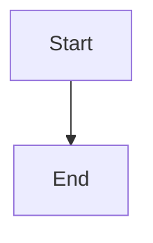

# Hướng Dạng Phong Cách / Style Guide

> Quy ước và quy tắc định dạng để đóng góp cho Claude How To. Theo dõi hướng dẫn này để giữ nội dung nhất quán, chuyên nghiệp, và dễ duy trì.

---

## Mục Lục / Table of Contents

- [Đặt Tên File và Thư Mục](#đặt-tên-file-và-thư-mục--file-and-folder-naming)
- [Cấu Trúc Tài Liệu](#cấu-trúc-tài-liệu--document-structure)
- [Tiêu Đề](#tiêu-đề--headings)
- [Định Dạng Văn Bản](#định-dạng-văn-bản--text-formatting)
- [Bảng](#bảng--tables)
- [Khối Code](#khối-code--code-blocks)
- [Liên Kết](#liên-kết--links)
- [Sơ Đồ](#sơ-đồ--diagrams)
- [Sử Dụng Emoji](#sử-dụng-emoji--emoji-usage)
- [Giọng Văn](#giọng-văn--tone-and-voice)
- [Thông Điệp Commit](#thông-điệp-commit--commit-messages)
- [Checklist Cho Tác Giả](#checklist-cho-tác-giả--checklist-for-authors)

---

## Đặt Tên File và Thư Mục / File and Folder Naming

### Các Thư Mục Bài Học / Lesson Folders

Các thư mục bài học sử dụng **tiền tố số có hai chữ số** theo sau là **mô tả kebab-case**:

```
01-slash-commands/
02-memory/
03-skills/
04-subagents/
05-mcp/
```

Số phản ánh thứ tự đường dẫn học tập từ người mới bắt đầu đến nâng cao.

### Tên File / File Names

| Loại | Quy Ước | Ví Dụ |
|------|-----------|----------|
| **README bài học** | `README.md` | `01-slash-commands/README.md` |
| **File tính năng** | Kebab-case `.md` | `code-reviewer.md`, `generate-api-docs.md` |
| **Shell script** | Kebab-case `.sh` | `format-code.sh`, `validate-input.sh` |
| **File cấu hình** | Tên chuẩn | `.mcp.json`, `settings.json` |
| **File memory** | Có tiền tố phạm vi | `project-CLAUDE.md`, `personal-CLAUDE.md` |
| **Tài liệu cấp cao nhất** | UPPER_CASE `.md` | `CATALOG.md`, `QUICK_REFERENCE.md`, `CONTRIBUTING.md` |
| **Tài nguyên hình ảnh** | Kebab-case | `pr-slash-command.png`, `claude-howto-logo.svg` |

### Quy Tắc / Rules

- Sử dụng **chữ thường** cho tất cả tên file và thư mục (trừ tài liệu cấp cao nhất như `README.md`, `CATALOG.md`)
- Sử dụng **dấu gạch ngang** (`-`) làm dấu phân cách từ, không bao giờ dấu gạch dưới hoặc khoảng trắng
- Giữ tên mô tả nhưng ngắn gọn

---

## Cấu Trúc Tài Liệu / Document Structure

### README Gốc / Root README

README gốc `README.md` theo thứ tự này:

1. Logo (`<picture>` element với biến thể tối/sáng)
2. Tiêu đề H1
3. Khối giới thiệu mở đầu (một dòng giá trị)
4. Phần "Tại Sao Hướng Dẫn Này?" với bảng so sánh
5. Đường kẻ ngang (`---`)
6. Mục lục
7. Danh mục tính năng
8. Điều hướng nhanh
9. Đường dẫn học
10. Các phần tính năng
11. Bắt đầu
12. Thực hành tốt nhất / Xử lý sự cố
13. Đóng góp / Giấy phép

### README Bài Học / Lesson README

Mỗi README.md bài học theo thứ tự này:

1. Tiêu đề H1 (ví dụ: `# Slash Commands`)
2. Đoạn tổng quan ngắn
3. Bảng tham khảo nhanh (tùy chọn)
4. Sơ đồ kiến trúc (Mermaid)
5. Các phần chi tiết (H2)
6. Ví dụ thực tế (được đánh số, 4-6 ví dụ)
7. Thực hành tốt nhất (bảng Do's và Don'ts)
8. Xử lý sự cố
9. Các hướng dẫn liên quan / Tài liệu chính thức

---

## Tiêu Đề / Headings

### Cấu Trúc Tiêu Đề

- H1 cho tiêu đề tài liệu chính (chỉ một mỗi file)
- H2 cho các phần chính
- H3 cho các tiểu phần
- H4 cho các chi tiết sâu hơn

### Quy Tắc Đặt Tên Tiêu Đề

- Sử dụng **kebab-case** (ví dụ: `# Creating a Custom Skill`)
- Chữ cái đầu tiên của mỗi từ viết hoa
- Trừ các từ được viết hoa đặc biệt (Claude Code, MCP, API)
- Giữ ngắn gọn và mô tả

### Ví Dụ / Examples

```markdown
# Slash Commands
## Configuration Options
### Creating a New Command
### File Structure for Commands
```

---

## Định Dạng Văn Bản / Text Formatting

### Nhấn Mạnh / Emphasis

- **In đậm**: `**text**`
- **In nghiêng**: `*text*`
- **Cả hai**: `***text***`

### Quy Tắc / Rules

- Sử dụng in đậm cho nhấn mạnh quan trọng
- Sử dụng in nghiêng cho các thuật ngữ kỹ thuật
- Không sử dụng cả hai trừ khi cực kỳ cần thiết
- Đừng lạm dụng — mất tác động khi quá nhiều

---

## Bảng / Tables

### Cấu Trúc Bảng

| Cột 1 | Cột 2 | Cột 3 |
|-------|-------|-------|
| Dữ liệu | Dữ liệu | Dữ liệu |

### Quy Tắc / Rules

- Header phải rõ ràng và mô tả
- Căn chỉnh cột để dễ đọc
- Sử dụng các ký tự đặc biệt một cách hạn chế
- Giữ hàng ngắn để có thể đọc được

---

## Khối Code / Code Blocks

### Ngôn Ngữ Được Đánh Dấu / Specified Language

```markdown
```python
def hello():
    print("Hello, world!")
```
```bash
echo "Hello, world!"
```
```

### Quy Tắc / Rules

- Luôn chỉ định rõ ngôn ngữ
- Sử dụng ngôn ngữ phù hợp nhất cho ví dụ
- Bao gồm context khi cần thiết
- Giữ các ví dụ ngắn và tập trung

---

## Liên Kết / Links

### Liên Kết Nội Bộ

```markdown
[Xem Tài Liệu Slash Commands](../01-slash-commands/README.md)
```

### Liên Kết Bên Ngoài

```markdown
[Claude Code Documentation](https://code.claude.com/docs/en/)
```

---

## Sơ Đồ / Diagrams

### Mermaid Diagrams



### Quy Tắc / Rules

- Sử dụng Mermaid cho tất cả các sơ đồ
- Giữ sơ đồ đơn giản và dễ hiểu
- Thêm mô tả text khi cần thiết
- Test tất cả các sơ đồ trước khi commit

---

## Sử Dụng Emoji / Emoji Usage

### Quy Tắc / Rules

- Sử dụng emoji một cách hạn chế và có mục đích
- Không sử dụng emoji trong tiêu đề
- Sử dụng trong bảng để đánh giá trực quan
- Thống nhất trong suốt tài liệu

---

## Giọng Văn / Tone and Voice

### Nguyên Tắc / Principles

- Chuyên nghiệp nhưng dễ tiếp cận
- Trực tiếp và súc tích
- Thân thiện và hỗ trợ
- Tránh ngôn ngữ quá trang trọng hoặc quá bình dân
- Sử dụng "bạn" cho "you"

---

## Thông Điệp Commit / Commit Messages

### Định Dạng / Format

```
type(scope): description

Extended description (optional)

Co-Authored-By: Claude Sonnet 4.6 <noreply@anthropic.com>
```

### Ví Dụ / Examples

```
docs(skills): Add example for code review skill

feat(mcp): Add WebSocket transport documentation
fix(readme): Correct table of contents link
```

---

## Checklist Cho Tác Giả / Checklist for Authors

Trước khi gửi PR:

- [ ] Code follows style guide
- [ ] Tất cả các kiểm tra đã pass
- [ ] Bài viết đã được spell-check
- [ ] Links hoạt động đúng
- [ ] Mermaid diagrams được test
- [ ] Ví dụ code đã được xác minh
- [ ] Tài liệu nhất quán với phần còn lại

---

**Cập Nhật Lần Cuối**: Tháng 4 năm 2026
