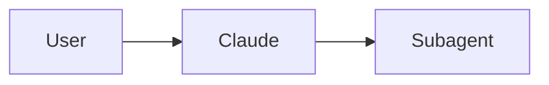
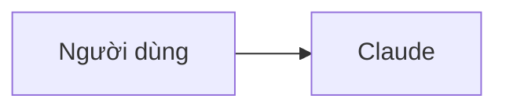
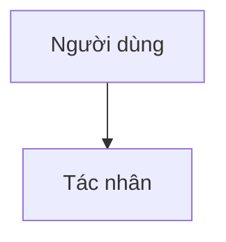
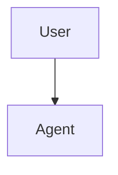

# Bản Dịch & Hướng Dẫn Phong Cách
# Translation Glossary & Style Guide

> **Lưu ý quan trọng:** Document này hướng dẫn cách dịch tài liệu Claude Code sang tiếng Việt. Vui lòng đọc kỹ trước khi bắt đầu dịch thuật.

## Thuật ngữ Kỹ thuật / Technical Terminology

Dưới đây là bảng thuật ngữ kỹ thuật quan trọng cần nhất quán trong toàn bộ tài liệu:

| Tiếng Anh | Tiếng Việt | Ghi chú / Context |
|-----------|------------|-------------------|
| slash command | lệnh slash | Giữ nguyên "slash" vì đây là tên đặc trưng |
| hook | hook | Giữ nguyên (term kỹ thuật) |
| skill | skill | Giữ nguyên (term kỹ thuật) |
| subagent | tác nhân con | Dịch vì dễ hiểu cho người Việt |
| agent | tác nhân | Dịch |
| memory | bộ nhớ | Dịch |
| checkpoint | checkpoint | Giữ nguyên (term đặc trưng của Claude Code) |
| plugin | plugin | Giữ nguyên (term kỹ thuật) |
| pull request / PR | pull request / PR | Giữ nguyên (GitHub term) |
| commit | commit | Giữ nguyên (Git term) |
| branch | branch | Giữ nguyên (Git term) |
| merge | merge | Giữ nguyên (Git term) |
| MCP (Model Context Protocol) | MCP | Giữ nguyên (tên giao thức) |
| CLAUDE.md | CLAUDE.md | Giữ nguyên (tên file config) |
| prompt | prompt | Giữ nguyên (term AI phổ biến) |
| workflow | workflow | Giữ nguyên hoặc "quy trình công việc" |
| repository | kho chứa | Dịch hoặc "repo" (viết tắt) |
| issue | issue | Giữ nguyên (GitHub term) |
| release | release | Giữ nguyên hoặc "bản phát hành" |
| API | API | Giữ nguyên |
| CLI | CLI | Giữ nguyên (viết tắt Command-Line Interface) |
| CI/CD | CI/CD | Giữ nguyên |
| pre-commit hook | pre-commit hook | Giữ nguyên (Git term) |
| environment variable | biến môi trường | Dịch |
| dependencies | dependencies | Giữ nguyên hoặc "thư viện phụ thuộc" |
| template | mẫu / template | Có thể dịch hoặc giữ nguyên |

## Quy tắc Dịch / Translation Rules

### 1. Code Snippets và Commands

**QUY TẮC VÀNG:** Giữ nguyên 100% code có thể execute được. Chỉ dịch comments và explanations.

**Ví dụ đúng (✅ CORRECT):**

````markdown
Để sử dụng lệnh này, chạy:

```bash
/optimize
```

Lệnh này sẽ phân tích code của bạn.
````

**Ví dụ sai (❌ INCORRECT):**

````markdown
Để sử dụng lệnh này, chạy:

```bash
/tối-ưu-hóa  # KHÔNG BAO GIỜ dịch command
```
````

### 2. Comments trong Code

Dịch comments sang tiếng Việt để người đọc dễ hiểu:

```python
# ✅ CORRECT - Dịch comment
# Lệnh slash này giúp tối ưu hóa code của bạn
def optimize_code():
    pass

# ❌ INCORRECT - Đừng dịch tên hàm
def toi_uu_ma():  # KHÔNG dịch function names
    pass
```

### 3. Tên Hàm, Biến, và Class

Giữ nguyên tên hàm, biến, và class bằng tiếng Anh:

```python
# ✅ CORRECT
def create_subagent(name: str, system_prompt: str):
    pass

# ❌ INCORRECT
def tao_tac_nhan_con(ten: str, he_thong_prompt: str):
    pass
```

### 4. Mermaid Diagrams

**Giữ nguyên 100% Mermaid diagrams.** Không dịch bất kỳ text nào trong diagram blocks.

````markdown
<!-- ✅ CORRECT -->


<!-- ❌ INCORRECT -->

````

### 5. Tên File và Paths

Giữ nguyên tên file và paths:

```markdown
<!-- ✅ CORRECT -->
Sao chép file `.claude/commands/optimize.md` vào dự án của bạn.

<!-- ❌ INCORRECT -->
Sao chép file `.claude/commands/tối-ưu-hóa.md` vào dự án của bạn.
```

### 6. Liên kết (Links)

**Internal Links (trong vi/):** Giữ nguyên relative paths:

```markdown
<!-- ✅ CORRECT -->
Xem [Lệnh Slash](01-slash-commands/README.md) để biết thêm chi tiết.
```

**Cross-language Links (từ vi/ đến en/):** Sử dụng relative path đúng:

```markdown
<!-- Trong file tiếng Việt -->
Xem [bản tiếng Anh](../../README.md) để biết thêm chi tiết.
```

**External Links:** Giữ nguyên URLs

### 7. Tên Module và Features

Giữ nguyên tên modules và features vì đây là terms đặc trưng:

```markdown
<!-- ✅ CORRECT -->
- 01-slash-commands/ - Lệnh Slash
- 03-skills/ - Skills
- 04-subagents/ - Tác nhân con

<!-- ❌ INCORRECT -->
- 01-lenh-slash/ - Lệnh Slash
- 03-ky-nang/ - Skills
```

## Phong cách / Style Guidelines

### 1. Xưng hô

- Sử dụng **"bạn"** cho "you"
- Sử dụng **"chúng tôi"** hoặc **"tôi"** cho "we"/"I" tùy ngữ cảnh

**Ví dụ:**

```markdown
<!-- ✅ CORRECT -->
Bạn có thể sử dụng lệnh này để tối ưu hóa code.

<!-- ❌ INFORMAL (tránh dùng) -->
Đây là cách mày dùng lệnh này.
```

### 2. Giọng văn

- **Chuyên nghiệp nhưng dễ hiểu:** Tránh văn nói quá bình dân
- **Kỹ thuật nhưng không khô khan:** Giải thích rõ ràng, có ví dụ
- **Tích cực:** Sử dụng ngôn ngữ khích lệ, không phán xét

**Ví dụ:**

```markdown
<!-- ✅ CORRECT -->
Chức năng này giúp bạn tăng năng suất làm việc.

<!-- ❌ TOO FORMAL -->
Nghiệp vụ này hỗ trợ Quý vị gia tăng hiệu suất lao động.

<!-- ❌ TOO INFORMAL -->
Cái này giúp làm việc nhanh hơn nha.
```

### 3. Cấu trúc câu

- **Ngắn gọn:** Tránh câu quá dài, khó đọc
- **Rõ ràng:** Đi thẳng vào vấn đề
- **Logic:** Sử dụng connectors phù hợp (vì, nhưng, vì vậy, tuy nhiên)

**Ví dụ:**

```markdown
<!-- ✅ CORRECT -->
Slash commands giúp bạn tiết kiệm thời gian bằng cách tự động hóa các tác vụ thường ngày. Tuy nhiên, bạn không nên lạm dụng chúng.

<!-- ❌ CONFUSING -->
Slash commands giúp bạn tiết kiệm thời gian bằng cách tự động hóa các tác vụ thường ngày tuy nhiên bạn không nên lạm dụng chúng.
```

### 4. Định dạng (Formatting)

- **Giữ nguyên format Markdown:** headings, lists, tables, code blocks
- **Sử dụng bold cho emphasis:** **quan trọng**, ⚠️ **cảnh báo**
- **Sử dụng code blocks cho examples:** File paths, commands, code snippets

## Quy trình Dịch / Translation Workflow

### Bước 1: Đọc và Hiểu

1. Đọc toàn bộ file tiếng Anh trước khi dịch
2. Hiểu context và mục đích của tài liệu
3. Xác định các terms quan trọng cần giữ nguyên

### Bước 2: Dịch Thuật

1. Dịch từng section một cách có hệ thống
2. Tuân thủ glossary và style guide
3. Giữ nguyên code, commands, Mermaid diagrams
4. Dịch comments trong code sang tiếng Việt

### Bước 3: Review

1. Đọc bản dịch từ đầu đến cuối
2. Kiểm tra technical accuracy
3. Đảm bảo flow tự nhiên trong tiếng Việt
4. Verify tất cả links hoạt động
5. Check code examples giữ nguyên

### Bước 4: Validation

1. Chạy pre-commit checks:
   ```bash
   pre-commit run --all-files
   ```

2. Test links:
   ```bash
   python scripts/check_cross_references.py --lang vi
   python scripts/check_links.py --lang vi
   ```

3. Build EPUB (nếu applicable):
   ```bash
   uv run scripts/build_epub.py --lang vi
   ```

## Mẹo Dịch Hiệu Quả / Translation Tips

### 1. Dịch Theo Learning Path Order

Dịch theo thứ tự module 01 → 10 vì:
- Các terms được giới thiệu trước sẽ reused sau
- Context builds up progressively
- Easier to maintain consistency

### 2. Dịch README Trước

Dịch README.md của mỗi module trước, rồi mới đến files con vì:
- README cung cấp context và terms cho toàn module
- Help maintain consistency across files

### 3. Sử dụng Claude AI Effectively

Khi dùng Claude để dịch, cung cấp đầy đủ context:

```
Bạn là chuyên gia dịch thuật kỹ thuật Anh-Việt. Dịch file markdown sau sang tiếng Việt.

## Yêu cầu:
1. Giữ nguyên code snippets, commands, Mermaid diagrams
2. Dịch comments trong code, không dịch tên hàm/biến
3. Sử dụng glossary từ TRANSLATION_NOTES.md
4. Giữ nguyên format markdown
5. Terms: hook, skill, checkpoint, plugin, pull request, commit giữ nguyên
6. Slash command → "lệnh slash"
7. Subagent → "tác nhân con"

## File:
[paste English content]
```

### 4. Dịch từng Phần Nhỏ

Đừng cố dịch cả file dài trong một lần:
- Chia nhỏ thành sections
- Dịch từng section độc lập
- Review sau mỗi section
- Easier to maintain quality

### 5. Build Context

Trước khi dịch file trong module, đọc README của module đó trước:
- Hiểu scope và purpose của module
- Learn key terms và definitions
- Maintain consistency with other files in module

## Common Pitfalls to Avoid

### ❌ DON'T: Translate Technical Terms

```markdown
<!-- ❌ WRONG -->
Lệnh "hook" giúp bạn tự động hóa quy trình.

<!-- ✅ RIGHT -->
Hook giúp bạn tự động hóa workflow.
```

### ❌ DON'T: Translate Commands

```markdown
<!-- ❌ WRONG -->
Chạy lệnh `/tối-ưu-hóa` để bắt đầu.

<!-- ✅ RIGHT -->
Chạy lệnh `/optimize` để bắt đầu.
```

### ❌ DON'T: Translate Function Names

```python
# ❌ WRONG
# Hàm này tạo một subagent mới
def tao_subagent_moi():
    pass

# ✅ RIGHT
# Tạo một subagent mới
def create_subagent():
    pass
```

### ❌ DON'T: Translate Mermaid Diagrams

````markdown
<!-- ❌ WRONG -->


<!-- ✅ RIGHT -->

````

### ❌ DON'T: Use Machine Translation Blindly

Machine translation (Google Translate, DeepL) thường:
- Dịch sai terms kỹ thuật
- Không hiểu context của code
- Dịch sai meanings của commands
- Break Markdown formatting

**Luôn review và chỉnh sửa sau khi dịch!**

## Checklist cho Mỗi File

Đánh dấu trước khi commit:

- [ ] Technical accuracy chính xác
- [ ] Vietnamese flow tự nhiên, dễ đọc
- [ ] Terminology nhất quán theo glossary
- [ ] Code examples được giữ nguyên 100%
- [ ] Mermaid diagrams không bị thay đổi
- [ ] Internal links hoạt động đúng
- [ ] External links giữ nguyên
- [ ] Markdown format đúng
- [ ] Comments trong code được dịch
- [ ] Tên hàm/biến/class giữ nguyên tiếng Anh
- [ ] File paths và URLs giữ nguyên
- [ ] Pre-commit checks passed
- [ ] EPUB builds successfully (nếu applicable)

## Getting Help

### Questions?

Nếu bạn gặp khó khăn khi dịch:

1. **Kiểm tra TRANSLATION_QUEUE.md** để xem files khác đã dịch
2. **Tham khảo similar files** trong module khác
3. **Hỏi Claude Code** với context cụ thể
4. **Create GitHub issue** để hỏi cộng đồng

### Reporting Issues

Nếu bạn发现 lỗi trong bản dịch hoặc có đề xuất cải thiện:

1. Fork repository
2. Create branch với tên: `fix/vi-translation-issue`
3. Make corrections
4. Submit pull request với clear description

---

**Last Updated:** 2026-04-02
**Language:** Vietnamese (vi-VN)
**Maintained by:** Claude Code Vietnamese Community
